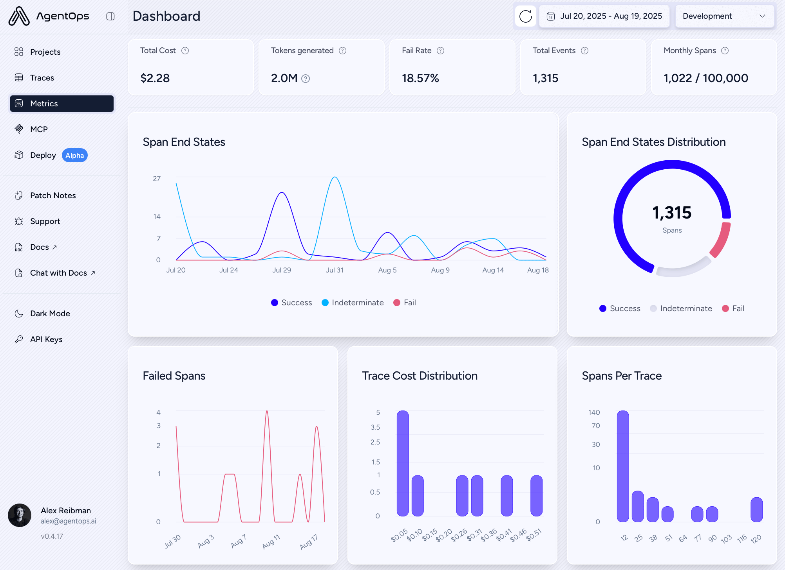
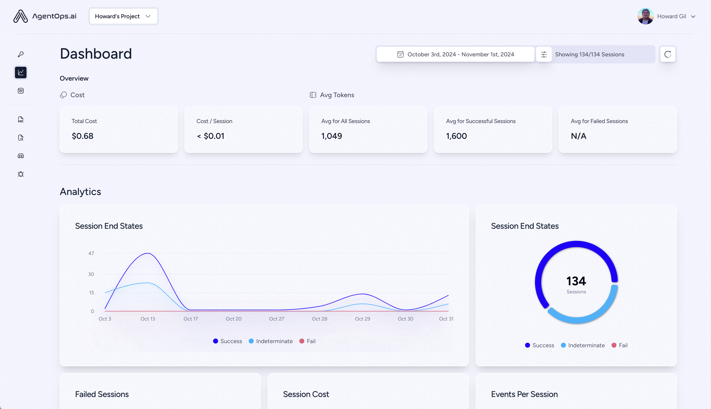
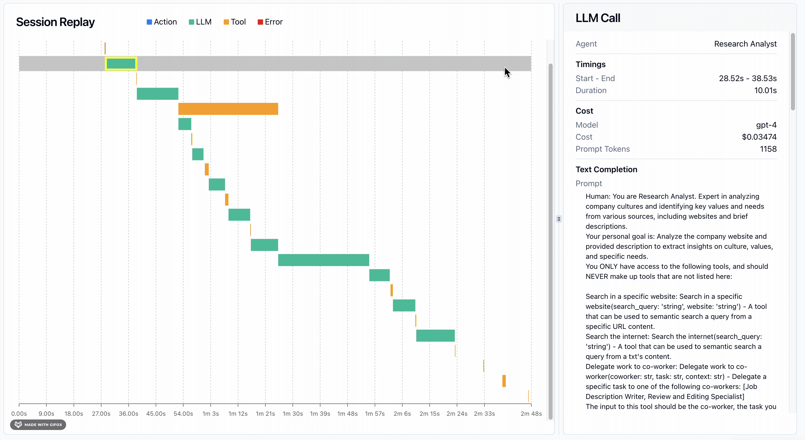
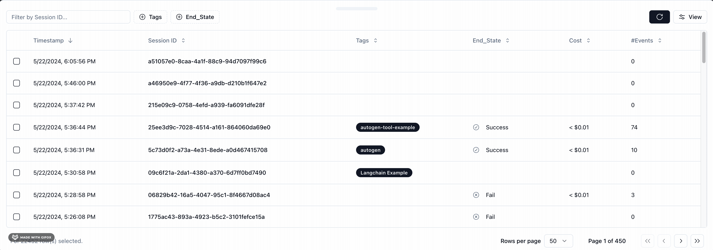
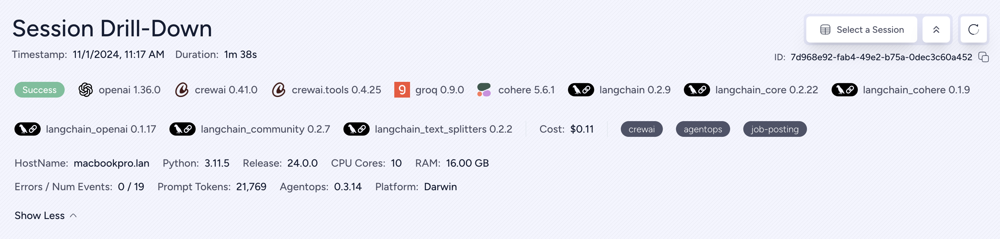
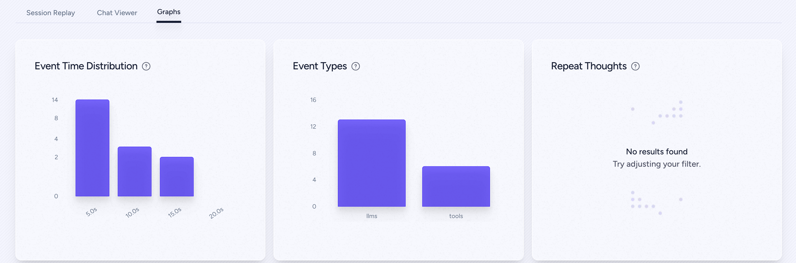
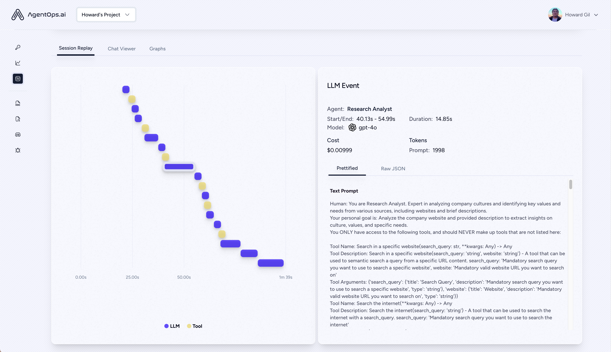

# AgentOps — Agent-First Observability Platform

> **One-liner:** The category's agent-native pure-play — session-first (not trace-first) UX,
> framework-specific replay visualizers for CrewAI/AutoGen/ADK/Agno, and a marketing-famous
> "Time Travel Debugging" feature that turns out, from the actual product source, to be a narrow
> local LLM-completion cache/replay tool that was **removed from the current dashboard** — the
> single most important finding in this doc for calibrating how much of the AgentOps pitch is real.

**Market position:** Small, funded startup, not a Datadog-scale incumbent. Built by **Agency AI**
(the entity behind agentops.ai), founded 2023 in San Francisco by **Alex Reibman, Adam Silverman,
and Braelyn Boynton**. Raised **$2.6M pre-seed** led by **645 Ventures and Afore Capital** (per
PRNewswire); Plug and Play Tech Center also appears as an investor in Tracxn's profile. **Not a
Y Combinator company** — no YC listing found in any funding database checked (Tracxn, PRNewswire,
645 Ventures' own portfolio page). Ecosystem position is its real leverage: AgentOps is CrewAI's
recommended/first-party observability integration, ships native instrumentation for AutoGen/AG2,
Agno, Camel AI, Google ADK, LangGraph, and the OpenAI Agents SDK (Python *and* TypeScript), and is
MIT-licensed and open source (`AgentOps-AI/agentops` on GitHub). It competes directly with
Langfuse/Braintrust/Arize Phoenix as a pure-play, not with Datadog/New Relic as an APM add-on.

**How core is agent tracing to the product?** Maximally core — there is no other product. Every
screen, term, and pricing unit ("events," now migrating to "spans") is agent-shaped. That buys them
three things Datadog structurally can't offer: (1) **session as the primary navigational unit**
instead of trace (their nav item is literally "Traces" now, but the SDK still treats
`session_id` as the OTel `trace_id` — a session **is** a trace, 1:1, by construction); (2)
**framework-native visualizers** — dedicated React components per framework
(`crew-ai-agent-span-visualizer`, `adk-workflow-span-visualizer`, `agno-agent-span-visualizer`,
`ag2-agent-span-visualizer`) that render CrewAI's Agent/Task/Crew objects or ADK's sub-agent tree
in a shape that framework's own docs would recognize, instead of a generic span tree; (3) full
ownership of the SDK's auto-instrumentation for those frameworks, so their coverage of
framework-specific state (CrewAI role, ADK sub_agents, Agno team) is a first-party contract, not a
best-effort OTel attribute guess.

---

## Trial & access

| | |
|---|---|
| **Free tier** | Yes — **Basic, $0/mo, 5,000 events/month** (an "event" ≈ one LLM call, tool call, or action; a single agent run can burn a dozen+). Includes full SDK, LLM cost tracking across 400+ LLMs, and "Replay Analytics." |
| **Free trial** | No separate time-boxed trial — the free tier is perpetual/self-serve; Pro is what you "trial" by upgrading. |
| **Credit card required?** | **No, for signup.** Confirmed from the actual signup form source (`app/dashboard/app/signup/_components/signup-form.tsx`): fields are Full Name, Email, Password only, plus Google/GitHub OAuth — no payment field anywhere in the flow. Card is only collected later, at Stripe checkout, if/when you upgrade to Pro. |
| **Registration URL** | https://app.agentops.ai (signup at `/signup`) |
| **Signup fields** | Full Name, Email, Password (min 12 chars, requires digit + lowercase + uppercase + symbol) with email verification, **or** "Continue with Google" / "Continue with GitHub" OAuth, **or** magic-link email. |
| **Paid entry point** | **Pro, ~$40/mo** (seat-priced via Stripe, dynamic), 100k events included, unlimited log retention, session/event export, role-based permissioning. **Enterprise**: custom — SSO, self-hosting (AWS/GCP/Azure), SOC-2/HIPAA/NIST AI RMF, custom data retention. |
| **Self-serve to the feature?** | Yes — `pip install agentops`, `agentops.init(<api_key>)`, two lines of code, dashboard auto-populates. No sales call for Basic or Pro. |
| **Gotcha** | The **free-plan waterfall view is span-count-limited** — the current dashboard code (`session-replay.tsx`) explicitly gates `spanWaterfallLimit` for `tierName === 'free'` and shows "Showing first N of M spans — Upgrade to see all spans" inline in the waterfall. Also fully open-source and self-hostable (`app/README.md` has a self-hosting guide for Dashboard + API), which is a real escape hatch competitors like Datadog don't offer. |

---

## Sources

| # | Source | Type | Why it's useful / what to extract |
|---|---|---|---|
| 1 | [AgentOps-AI/agentops on GitHub](https://github.com/AgentOps-AI/agentops) — **cloned and read directly, not just the rendered README** | Primary source, MIT-licensed | **The most valuable source in this doc.** The dashboard frontend (`app/dashboard/`) and backend (`app/api/`) are both in the public repo. This is how the Time Travel finding, the exact current tab structure, the OTel exporter endpoint, and the signup form fields were verified — none of that is stated plainly in marketing copy. |
| 2 | `app/dashboard/components/time-travel/TimeTravelDebugger.tsx` + `BranchModal.tsx` + `app/dashboard/app/(with-layout)/timetravel/page.tsx` | Primary source (code) | **Ground truth on Time Travel.** See the dedicated section below — this is a directly-quoted finding, not inference. |
| 3 | `app/dashboard/app/(with-layout)/traces/_components/trace-drilldown-drawer.tsx`, `session-replay.tsx`, `graph-view.tsx` | Primary source (code) | The **current, live** trace-detail UI: tab enum (`session-replay` / `tree-view` / `graph-view` / `agents` / `agents-overview` / `system` / `terminal-output` / `metrics` / `logs` / `tasks`), default tab, `SpansGanttChart` for the waterfall, `ReactFlow`-based `GraphView` with group nodes. Ground truth for "how does the graph relate to the waterfall." |
| 4 | `agentops/sdk/core.py`, `agentops/sdk/exporters.py`, `agentops/semconv/*.py` | Primary source (code) | Confirms **real OTLP**: `OTLPSpanExporter` (from `opentelemetry-exporter-otlp-proto-http`) posting to `https://otlp.agentops.ai/v1/traces` and `/v1/metrics`. Exact semconv attribute names (`AgentAttributes.AGENT_NAME`, `ToolAttributes.TOOL_STATUS`, `SpanAttributes.LLM_REQUEST_MODEL`, indexed `MessageAttributes.PROMPT_ROLE.format(i=0)`). |
| 5 | [Core Concepts](https://docs.agentops.ai/v2/concepts/core-concepts), [Traces](https://docs.agentops.ai/v2/concepts/traces), [Spans](https://docs.agentops.ai/v2/concepts/spans), [Dashboard](https://docs.agentops.ai/v2/usage/dashboard-info), [Public API](https://docs.agentops.ai/v2/usage/public-api) (docs.agentops.ai) | Docs | Current v2 data model: 7 span kinds (Session/Agent/Workflow/Operation-Task/LLM/Tool), only Session is root-eligible. **Notably, none of these current-gen docs pages mention "time travel," "checkpoint," "rewind," or "replay-as-re-execution" anywhere** — corroborates the code finding that it's gone from the product, not just under-documented. |
| 6 | [Public API docs](https://docs.agentops.ai/v2/usage/public-api) | Docs | Read-only REST surface: `GET /public/v1/traces/{trace_id}`, `/public/v1/traces/{trace_id}/metrics`, `/public/v1/spans/{span_id}`, `/public/v1/spans/{span_id}/metrics`. Spans carry `span_kind` values (`SPAN_KIND_INTERNAL`, `SPAN_KIND_CLIENT`) straight from OTel. No documented trace-export-to-Jaeger/other-backend path — read access only, not a re-export path. |
| 7 | `app/dashboard/app/(with-layout)/settings/organization/components/PricingCards.tsx` | Primary source (code) | Exact live pricing copy, unmediated by marketing: Basic $0/5,000 events, Pro (dynamic Stripe price, marketing says ~$40/mo)/100k events, Enterprise custom. |
| 8 | [AgentOps company profile — Tracxn](https://tracxn.com/d/companies/agentops) + [Agency AI $2.6M pre-seed — PRNewswire](https://www.prnewswire.com/news-releases/agency-ai-raises-2-6m-in-pre-seed-funding-to-revolutionize-ai-agent-development-302233294.html) | Funding data | Founding team, funding round, investors. Treat Tracxn's "521 employees" figure with skepticism — inconsistent with a $2.6M pre-seed startup and likely a data-quality artifact in their scrape; not repeated here as fact. |

---

## Screenshots

### 1. Current dashboard — Metrics overview (post-OTel-migration branding)


Pulled from the live docs site (dated in-app "Jul 20, 2025 – Aug 19, 2025"), this is the **current**
UI, not the legacy one below. Note what changed:

- **Left nav is now: Projects, Traces, Metrics, MCP, Deploy (Alpha)** — "Sessions" is gone as a nav
  label, replaced by "Traces." This is the clearest first-party evidence of the session→trace
  terminology shift that came with the OTel backend rewrite.
- Stat tiles: **Total Cost, Tokens generated, Fail Rate, Total Events, Monthly Spans** (`1,022 /
  100,000` — a literal quota meter against the plan limit, always visible).
- Charts: **Span End States** (Success/Indeterminate/Fail time series), a donut of the same broken
  out by count, **Failed Spans** over time, **Trace Cost Distribution** (histogram of $ buckets per
  trace), **Spans Per Trace** (histogram — distribution shape, not just an average).
- "Indeterminate" as a third end-state alongside Success/Fail is a useful category Maple doesn't
  currently have — an explicit bucket for "agent finished but we can't tell if it succeeded."

### 2. Legacy dashboard — Session overview (pre-migration, kept for contrast)


From the GitHub README, running **v0.4.17**. Everything is keyed by **Session**, not Trace/Span:
"134 Sessions," "Cost / Session," "Avg Tokens for Successful/Failed Sessions." This is the UI that
predates the OTel rewrite — useful to see what changed and what didn't (the Success/Indeterminate/
Fail three-state donut survived the rewrite unchanged).

### 3. Legacy session waterfall — "Session Replay" tab, Gantt view


- Waterfall bars colored by a **4-way type legend: Action (blue) / LLM (green) / Tool (orange) /
  Error (red)** — simpler than Datadog's 4-kind system but same idea (fixed color per span type,
  reused everywhere).
- A **gray "session" bar spans the full width above the other rows** — an explicit top-level
  container row rather than an implicit root node, so the session's total duration is always
  visible even when you scroll into deeply nested spans.
- Selecting a bar opens a right-side detail panel: **Agent, Start–End timestamps, Duration, Model
  ($ + provider icon), Cost, Prompt Tokens, then the full rendered prompt text** — the same
  info-dense header pattern Datadog uses, just LLM-call-scoped rather than trace-scoped.
- **This literal GIF is served from AgentOps' own current docs site** (`dashboard-info.md`) as of
  this research date — meaning their own documentation is still illustrating the **legacy**
  Session-Replay Gantt UI, not the current ReactFlow-based `graph-view` / `SpansGanttChart` waterfall
  found in the live app's source. Docs lag the shipped product here.

### 4. Legacy session list — filterable by Session ID, tags, end state


- Columns: **Timestamp, Session ID (raw UUID, not a friendly name), Tags (multi-chip), End_State
  (Success/Fail icon + label), Cost, #Events.**
- Filter bar is `Filter by Session ID…` plus `+ Tags` and `+ End_State` chip-builders — narrow,
  structured filtering rather than free-text search across span content.
- 450 pages at 50 rows/page in the captured screenshot (22,432 sessions) — this is a real customer
  account, not a demo seed, useful as a scale reference.

### 5. Agent Manifest-equivalent — "Session Drill-Down" metadata header


- **Auto-detected package/library versions** rendered as chips: `openai 1.36.0`, `crewai 0.41.0`,
  `crewai.tools 0.4.25`, `groq 0.9.0`, `cohere 5.6.1`, `langchain 0.2.9`, `langchain_core 0.2.22`,
  `langchain_cohere 0.1.9`, `langchain_openai 0.1.17`, `langchain_community 0.2.7`,
  `langchain_text_splitters 0.2.2` — this is dependency-manifest-as-telemetry, distinct from
  Datadog's Agent Manifest (which shows *declared config*, not *installed package versions*). Both
  are useful; this one is cheap to capture (just `pip freeze`-style introspection at session start)
  and answers "what exact version combo produced this bug" — valuable for reproduction.
  - **Host environment**: HostName, Python version, Release, CPU Cores, RAM.
  - **Errors / Num Events: 0 / 19**, **Prompt Tokens: 21,769**, own SDK version (`Agentops:
    0.3.14`), **Platform: Darwin**.
  - Session-level **Tags** (`crewai`, `agentops`, `job-posting`) as free chips, not a fixed taxonomy.

### 6. Chat Viewer — conversation-native rendering of the LLM transcript


- A dedicated tab that reconstructs the **whole session as a chat thread** (User/Assistant turns
  with avatars, collapsible per-turn, copy-to-clipboard per bubble), independent of the waterfall.
  This is the same instinct as Datadog's "Reader View" toggle but taken further — a fully separate
  transcript-first renderer, not just a density switch on the trace-list rows.

### 7. Legacy Graphs tab — session-level aggregate charts


- Three widgets scoped to **one session**, not the whole project: **Event Time Distribution**
  (histogram of event durations within this run), **Event Types** (llms vs. tools bar counts), and
  **Repeat Thoughts** (a loop/repetition detector — "No results found, try adjusting your filter"
  when none are detected). "Repeat Thoughts" is effectively a cheap loop-detection facet
  ("this agent said basically the same thing N times") worth studying even though it wasn't
  observable in a populated state here.

### 8. Legacy per-event detail — dot-timeline replay with LLM Event panel


- An older, pre-Gantt version of the timeline: LLM (purple dot) and Tool (yellow dot) events
  plotted along a single time axis rather than as bars — compresses more events into the same
  width at the cost of not showing duration visually (durations must be read from the side panel).
  Side panel: **Agent name, Start/End, Duration, Model + icon, Cost, Prompt token count**, tabbed
  **Prettified / Raw JSON**.

---

## Time Travel Debugging — what it actually is (highest priority per request)

This is marketed hard: *"rewind to any point, inspect the exact state at that step, and forward
through the consequences,"* *"restart your sessions from checkpoints."* Every SEO-aggregator site
that mentions AgentOps repeats some version of that language. **None of it appears anywhere in
AgentOps' own current documentation** (`docs.agentops.ai/v2/*` has no page, and no in-page mention,
for "time travel," "checkpoint," or "rewind" — verified by fetching Core Concepts, Traces, Spans,
and Dashboard docs directly). That absence sent us to the source code, which resolves the question
definitively.

**What it is, per the actual (React) implementation in `app/dashboard/components/time-travel/`:**

- The feature is a modal titled **"Rewrite History,"** described in-app as: *"Edit the completion
  of the selected LLM Event as you see fit. The completions up to this point will be stored in a
  cache that you fetch with our CLI command. When you rerun your agent locally, the completions
  will be returned from the cache as opposed to your LLM. Everything after this point will go to
  your LLM."*
- Concretely: you pick one LLM call in a past session, **hand-edit its completion text**. AgentOps
  stores a cache of {prior LLM calls → their (possibly edited) completions} keyed to that point.
  You then run `agentops timetravel <ttd_id>` locally against **your own agent script**. The SDK
  intercepts LLM calls up to the edited point and serves them from the cache instead of hitting the
  real model — so your code re-executes locally, deterministically, up to the edit, then falls
  through to live LLM calls for everything after.
- A **"Branch"** is just a named, saved snapshot of one such edited-completion-cache
  (`POST /timetravel {name, projectId, sessionId}`), listed in a table with a **"CLI Command"**
  copy button (`agentops timetravel <ttd_id>`) and Edit/Delete actions.
- The in-app copy explicitly flags it as **"in alpha. Free for now but not forever."**

**What this means, answering the "storage/schema problem or UI problem" question directly:**

1. **It is not a remote re-execution or full-state checkpoint system.** There is no evidence of
   agent *state* (memory, tool-call side effects, environment) being captured or restored — only
   the **LLM completion text** is cached and replayable. Tool calls, file writes, API calls made by
   the agent are not mentioned anywhere in the modal, the branch model, or the CLI description.
   "Time travel" here means "replay this one input/output pair from cache instead of calling the
   LLM again," nothing more.
2. **It requires the user's own local execution environment.** AgentOps' cloud does not "restart
   the session" on their infrastructure — you `git`-style rerun your own script locally with the
   CLI pointed at their cache. It's closer to VCR/cassette-style HTTP mocking for LLM calls than to
   a durable-execution/checkpoint-restore system (e.g., Temporal, LangGraph checkpointer).
3. **It appears to have been pulled from the live product.** The actual page component at
   `app/dashboard/app/(with-layout)/timetravel/page.tsx` in the current repo is:
   ```tsx
   export default async function TimeTravelPage() {
     return <div>Time Travel was removed, sowwy :c</div>;
   }
   ```
   with the entire real implementation commented out below it. The `BranchModal` import inside
   `TimeTravelDebugger.tsx` is also commented out (`{/* <BranchModal llmEvents={llmEvents} /> */}`).
   The components still exist as dead code in the repo, but there is **no live route exposing this
   UI** in the current dashboard as of this commit (`main`, `f8e907b`, dated 2026-06-25).
4. **Confidence:** High that the mechanism-as-described above is accurate (it's read directly from
   the modal's own copy and the API call it makes) and high that the feature is currently disabled
   in the shipped product (the literal removal message + commented-out entry point). Lower
   confidence on *when* it was removed or whether it's staged for a relaunch — no changelog entry
   or blog post announcing removal was found; "Patch Notes" exists as a nav item in the dashboard
   but wasn't checked in this pass.

**Bottom line for Maple:** the demand signal is real (this is the thing every AgentOps summary
leads with), but the actual mechanism is a narrow, alpha, LLM-completion-only local cache-replay —
not a general checkpoint/restart system, and it's not currently live. If Maple wants to own this
idea for real, the bar to clear is low: even a genuine **read-only "jump to state at span N,
re-render the UI as of that point"** (a pure UI/query feature, no re-execution) would out-deliver
what AgentOps ever technically shipped, while a true **re-execution-from-checkpoint** would need
new schema (capturing full input state per span, not just LLM completions) that AgentOps' own data
model doesn't currently support either.

---

## Sessions as the top-level unit — data model and current UI

**Data model (from `agentops/semconv` + `docs/v2/concepts/{traces,spans}` + the OTel exporter):**

- Root-eligible span kind: **`Session` only** (of `Session`, `Agent`, `Workflow`,
  `Operation`/`Task`, `LLM`, `Tool` — `Task` is an alias for `Operation`, used interchangeably).
- A **Session's `session_id` becomes the OTel `trace_id`** — sessions and traces are the same
  entity under the hood; the UI-level rename from "Sessions" to "Traces" nav (screenshot #1) is
  cosmetic/terminology, not a data-model change. This is a cleaner answer than most competitors
  give to "is a session a trace, and how": yes, 1:1, always, by construction.
- Every span carries: id, name, kind, start/end time, status (`SUCCESS`/`ERROR`/`UNSET`, mapped
  onto OTel `StatusCode.OK`/`ERROR`/`UNSET`), and a free attribute bag.
- LLM spans additionally carry model, provider, prompt/completion tokens, cost, and the full
  message list (`gen_ai.prompt`/`gen_ai.completion`, indexed via `MessageAttributes.PROMPT_ROLE`/
  `PROMPT_CONTENT.format(i=N)`).
- Session-level metadata (screenshot #5) also captures the **installed dependency versions**
  (openai/crewai/langchain/etc.) and host info (OS, Python version, CPU/RAM) — this is captured
  once per session/trace, not per span.

**Current trace-detail UI (from `trace-drilldown-drawer.tsx`, read directly — this is live code,
not a screenshot of a possibly-stale doc):**

Tabs, exact enum: `session-replay` (labeled "Waterfall View," and the **default tab**) |
`tree-view` | `graph-view` | `agents` | `agents-overview` | `system` | `terminal-output` |
`metrics` | `logs` | `tasks`. The chosen tab (session-replay/tree-view/graph-view) **persists to
`localStorage`** across sessions, so a user's preferred view sticks. `session-replay` renders a
`SpansGanttChart` (a real Gantt waterfall, span-limited on the free plan) side-by-side with a detail
panel offering `Prettify` / framework-specific view (`Task View`/`Agent View`/`Workflow View`/`Tool
View`, conditionally shown per detected framework) / `Raw JSON`.

---

## The session graph — how it relates to the waterfall

`graph-view.tsx` is a genuinely separate renderer, built on **ReactFlow** (`reactflow` npm
package — an off-the-shelf node-graph library, not a custom canvas), sharing the exact same `spans`
prop and `selectedSpan`/`setSelectedSpan` state as the waterfall (`session-replay.tsx`) — clicking a
node in the graph and clicking a bar in the waterfall both funnel into the same detail panel with
the same tab set (Prettify/framework view/Raw JSON). This is architecturally identical to Datadog's
"three tabs, one dataset" pattern (see `datadog-llm-observability.md` idea #1) — AgentOps
independently arrived at the same shape.

Distinctive mechanic: the graph supports **group nodes** — a dashed-border container node
(`isGroupNode`) that bundles multiple leaf spans (e.g., a burst of tool calls) into one collapsed
node showing a scrollable list of the grouped spans, each individually clickable and colored by
`spanTypeColors[visualType]` with an error-state override. This is a de-cluttering mechanism for
graphs with many same-type sibling spans (e.g., 20 tool calls in a loop) that neither Datadog's
Execution Flow graph nor a plain waterfall handles as gracefully — the waterfall just gets long, and
an ungrouped graph gets wide.

---

## OTel compatibility

**Confirmed genuinely OTel-based, not just OTel-flavored naming**, from `agentops/sdk/exporters.py`
and `agentops/sdk/core.py`:

- Uses the real `opentelemetry-exporter-otlp-proto-http`'s `OTLPSpanExporter` class (subclassed as
  `AuthenticatedOTLPExporter` only to inject a dynamic JWT bearer token — the wire protocol itself
  is untouched standard OTLP).
- Default trace endpoint: **`https://otlp.agentops.ai/v1/traces`**; default metrics endpoint:
  **`https://otlp.agentops.ai/v1/metrics`** — both are configurable constructor defaults
  (`exporter_endpoint`/`metrics_endpoint` params on the core SDK setup function), meaning a user
  could in principle repoint export at their own OTel Collector, though this isn't documented as a
  supported/blessed workflow anywhere we found.
- Attribute naming follows `gen_ai.*` GenAI semconv where applicable, layered with AgentOps-specific
  `agent.*`/`workflow.*`/`tool.*` conventions documented in `agentops/semconv/README.md` (see
  Sources #4 above for the exact attribute list).
- **Export/interop is one-directional and read-only for now**: the Public API
  (`api.agentops.ai/public/v1/traces/{trace_id}`) lets you *read* trace/span data back out over
  REST, but nothing found documents a supported path to re-export AgentOps-captured traces into a
  different OTel backend (e.g., no "send a copy to your own Collector" toggle was found in the
  dashboard settings explored). Ingestion is OTel-native; egress is a read-only REST API, not OTLP.

---

## Feature anatomy (spec-ready notes)

**Data model.** 6 span kinds (Session, Agent, Workflow, Operation/Task, LLM, Tool); Session is the
sole root kind and is 1:1 with an OTel trace_id. No separate "trace" entity above session — this is
the opposite design choice from Datadog (which has no first-class session) and matches what
Phoenix/Weave-style tools do.

**Ingestion.** `pip install agentops` / `npm install agentops`, `agentops.init(api_key)`,
decorator-based manual instrumentation (`@session`, `@agent`, `@operation`/`@task`, `@workflow`) or
framework auto-instrumentation (CrewAI, AG2, Agno, OpenAI Agents SDK, LangGraph, Camel AI,
LangChain, Google ADK, Haystack, smolagents) or plain OTLP.

**Views, in order of the funnel.**
1. Project-level Metrics dashboard — cost, tokens, fail rate, span-quota meter, span-count and
   trace-cost histograms.
2. Trace/session list — Session ID, Tags, End_State, Cost, #Events, filterable by ID/tag/end-state.
3. Trace detail — 3 interchangeable structural views (Waterfall/Tree/Graph) + 4 aggregate views
   (Agents, Agents Overview, System, Terminal Output) + Metrics/Logs/Tasks, all as tabs on one
   drawer, tab choice persisted per-user.
4. Span/event detail — Prettify (chat-style), framework-native visualizer when detected, Raw JSON.
5. Chat Viewer — whole-session transcript reconstruction, independent of the span tree.
6. Session-scoped Graphs — per-session event-time histogram, event-type counts, repeat-thought
   (loop) detector.

**Derived signals.** Fail-rate tracking, Success/Indeterminate/Fail 3-state classification (not
just binary), a named "Repeat Thoughts" loop detector at the session level.

---

## Ideas worth stealing for Maple

1. **Session = trace, always, by construction.** Don't build a separate "session" entity above
   trace — make the top-level unit's ID the trace ID directly, the way AgentOps does. Simpler
   schema, and it's the cleanest resolution to "is a session a trace" that any competitor in this
   research set has shipped.
2. **Group nodes in the DAG/graph view** — collapse N same-type sibling spans (a burst of tool
   calls) into one expandable container node in the graph, distinct from Datadog's per-agent
   containment boxes. Solves graph clutter for loop-heavy agents specifically.
3. **Persisted per-user view preference** (Waterfall/Tree/Graph choice saved to localStorage,
   restored on next trace open) — a one-line UX win, cheap to copy.
4. **Three-state Success/Indeterminate/Fail** instead of binary pass/fail — "we can't tell" is an
   honest and useful bucket for agent runs that don't cleanly resolve.
5. **Chat Viewer as a fully separate transcript-first renderer**, not just a density toggle —
   worth doing if Maple's agent traces are conversational; reconstructing the full turn-by-turn
   dialogue independent of the span tree is a distinct, valuable lens.
6. **Session-scoped "Repeat Thoughts" loop detector** and the **per-session Event Type / Event Time
   Distribution mini-dashboard** — cheap, scoped-to-one-run aggregate views that don't require the
   heavier cross-session Insights/Clusters machinery Datadog and Phoenix build for the same job.
7. **Dependency-version chips captured per session** (`openai 1.36.0`, `crewai 0.41.0`, etc.) —
   trivial to capture (`pip freeze`/`package.json` introspection at session start), high value for
   "what exact stack produced this" debugging and bug reports.
8. **The honest lesson, not a UI pattern**: a splashy "time travel" feature can be built cheaply as
   a **read-only "view state as of span N"** UI capability without needing real re-execution
   infrastructure — and given AgentOps' own version required real re-execution *and* still only
   shipped an alpha that got pulled, Maple should scope this feature narrowly and ship the
   read-only version first.

## What to skip / deprioritize

- **Don't build "Time Travel" as marketed.** The thing being marketed under that name was never a
  general checkpoint/restart system even at AgentOps, required local re-execution of the user's own
  code, only covered LLM completions (not tool calls or environment state), was alpha, and is
  currently not exposed in the live dashboard. Chasing feature parity with the *marketing copy*
  here would be chasing something that doesn't fully exist.
- **The dot-timeline replay view (screenshot #8)** — superseded by their own Gantt waterfall;
  duration isn't visually legible in a dot plot. Not worth copying even as a lightweight mode.
- **Framework-specific visualizer components** (one bespoke React component per framework: CrewAI,
  ADK, Agno, AG2) are high-maintenance-cost, narrow-payoff relative to a good generic span-tree
  renderer with framework-aware field extraction; only worth it once a specific framework's
  customers are a meaningfully large Maple segment.

---

## Screenshot sources

| File | Found on | Direct image URL |
|---|---|---|
| `docs-overview.png` | [Dashboard - AgentOps](https://docs.agentops.ai/v2/usage/dashboard-info) | `https://mintcdn.com/agentops/lKHoIAF-8UF9BP18/images/overview.png?fit=max&auto=format&n=lKHoIAF-8UF9BP18&q=85&s=7eaf05b550f66df6c3ea493035a827b3` |
| `docs-session-drawer.gif` | [Dashboard - AgentOps](https://docs.agentops.ai/v2/usage/dashboard-info) | `https://mintcdn.com/agentops/lKHoIAF-8UF9BP18/images/session-drawer.gif?s=6831798a3bb0401e0c416c4ade17822a` |
| `docs-session-waterfall.gif` | [Dashboard - AgentOps](https://docs.agentops.ai/v2/usage/dashboard-info) | `https://mintcdn.com/agentops/lKHoIAF-8UF9BP18/images/session-waterfall.gif?s=dc65c7b9a11e84ba14105811b1eaa1e5` |
| `readme-chat-viewer.png` | [AgentOps-AI/agentops (GitHub README)](https://github.com/AgentOps-AI/agentops) | `https://raw.githubusercontent.com/AgentOps-AI/agentops/main/docs/images/external/app_screenshots/chat-viewer.png` |
| `readme-overview.png` | [AgentOps-AI/agentops (GitHub README)](https://github.com/AgentOps-AI/agentops) | `https://raw.githubusercontent.com/AgentOps-AI/agentops/main/docs/images/external/app_screenshots/overview.png` |
| `readme-session-drilldown-graphs.png` | [AgentOps-AI/agentops (GitHub README)](https://github.com/AgentOps-AI/agentops) | `https://raw.githubusercontent.com/AgentOps-AI/agentops/main/docs/images/external/app_screenshots/session-drilldown-graphs.png` |
| `readme-session-drilldown-metadata.png` | [AgentOps-AI/agentops (GitHub README)](https://github.com/AgentOps-AI/agentops) | `https://raw.githubusercontent.com/AgentOps-AI/agentops/main/docs/images/external/app_screenshots/session-drilldown-metadata.png` |
| `readme-session-replay.png` | [AgentOps-AI/agentops (GitHub README)](https://github.com/AgentOps-AI/agentops) | `https://raw.githubusercontent.com/AgentOps-AI/agentops/main/docs/images/external/app_screenshots/session-replay.png` |

All eight files were confirmed by an exact MD5 checksum match against the freshly re-downloaded
source image (not just filename/position matching), so confidence here is at the maximum this
method allows: the `docs-*`-prefixed files come from the current `dashboard-info` docs page (the
"legacy" session UI is what that live doc page still shows, per the finding in Screenshot #3
above), and the `readme-*`-prefixed files come from the GitHub README's `app_screenshots/` folder.

---

*Researched 2026-08-05. Screenshots pulled from AgentOps' public docs and blog for internal
competitive research; do not redistribute.*
