# Arize Phoenix / Arize AX — AI Observability & Evaluation

> **One-liner:** The OSS reference implementation for attribute-driven agent tracing — Phoenix
> proves that a single required attribute (`openinference.span.kind`) can drive the entire trace
> UI, and its OpenInference spec is the closest thing the industry has to a settled schema for
> LLM/agent spans, which is exactly the renderer contract Maple needs to design against.

**Market position:** Arize is a Berkeley-based observability/eval vendor (~$131M raised, $70M
Series C Feb 2025 led by Adams Street Partners — notably with **Datadog** as a strategic investor,
alongside Microsoft's M12) that ships **two products off one open-source core**:

- **Phoenix** — the OSS project (Elastic License 2.0, ~8.5k GitHub stars). Runs fully self-hosted
  (`pip install arize-phoenix && phoenix serve`, Docker, Helm, Railway/Render/Cloud Run) with no
  feature gating and no phone-home telemetry. This is the artifact most worth studying: it's a
  complete tracing/eval/prompt/experiment UI that a single engineer can run locally.
- **Arize AX** — the commercial SaaS layer (managed hosting of the same product surface, plus
  enterprise eval/monitor/dashboard tooling, SSO, and — critically — an **Agent Graph tab that
  Phoenix OSS does not have**). AX is the productized, sold version of Phoenix; Phoenix is the
  distribution and adoption funnel.

Both products render off the same **OpenInference** semantic-convention spec, so a trace captured
locally in Phoenix looks structurally identical (same span-kind badges, same Trace Tree) whether
viewed in Phoenix OSS or upgraded into AX — AX just adds panels (Evaluations, Agent Graph,
Annotation Summary) on top.

**How core is agent tracing to the product?** As core as it gets — tracing *is* the product, not a
lens over something else. Unlike Datadog (APM company adding an agent view) or a metrics/logs
platform, Phoenix was built ground-up as an LLM/agent trace store: the span schema (OpenInference),
the ingestion path (OTLP), and the UI (Trace Tree, span-kind detail panels) all exist for no other
reason. This is the "pure-play" end of the competitive set, opposite Datadog.

---

## Trial & access

| | |
|---|---|
| **Free tier** | **Phoenix OSS: unlimited, forever, self-hosted** (no span caps, no feature gates — verified via `github.com/Arize-ai/phoenix` license docs). **Phoenix Cloud**: 2 free hosted spaces, no infra setup. **Arize AX Free**: $0/mo, 25K spans/mo, 1GB storage, 15-day retention. |
| **Free trial** | AX Pro is self-serve at $50/mo (not a time-boxed trial — it's a paid tier you can cancel); AX Free has no expiry. |
| **Credit card required?** | **No.** Verified live on both signup flows: `app.arize.com/auth/join` (Arize AX) asks only for **Data Region** (US/EU) and **Email**, or Google/GitHub OAuth — no company, no name, no card. `app.phoenix.arize.com` (Phoenix Cloud) is Google/GitHub/email sign-in only, with a "Register with email" link and no billing step anywhere in the flow. |
| **Registration URL** | AX: https://app.arize.com/auth/join · Phoenix Cloud: https://app.phoenix.arize.com/login/sign-up |
| **Signup fields** | Email + Data Region (AX), or just email/OAuth (Phoenix Cloud). No job title, no phone, no company name gate — the lightest-weight signup of any vendor in this competitive set. |
| **Paid entry price** | AX Pro $50/mo (50K spans, 10GB, 30-day retention); overages ~$10/M spans + $3/GB beyond plan. AX Enterprise is custom, quote-gated. |
| **Self-hosting story & license** | Phoenix core is **Elastic License 2.0 (ELv2)** — source-available, not OSI-approved. Self-hosting on your own infra is unrestricted and free with no caps; ELv2's only real bite is that you cannot **resell Phoenix itself as a hosted/managed service** to third parties. AX Enterprise additionally offers "SaaS or Self-Hosted" as a paid deployment option. |
| **Gotcha** | Phoenix OSS and Arize AX are **separate products with separate accounts** — self-hosted traces don't automatically show up in AX; there's a documented "Send Traces from Phoenix → Arize" migration path, implying they don't share a backend. Phoenix currently only recognizes **OpenInference** attributes for full UI fidelity; a pure OTel GenAI-semconv span (`gen_ai.*`) renders with empty dataset examples in Phoenix OSS as of a still-open GitHub issue (#10622) — AX has since added native `gen_ai.*` ingestion for some frameworks, but Phoenix OSS lags. |

---

## Sources

| # | Source | Type | Why it's useful / what to extract |
|---|---|---|---|
| 1 | [OpenInference Semantic Conventions spec](https://github.com/Arize-ai/openinference/blob/main/spec/semantic_conventions.md) | Spec (repo) | **The single most valuable source in this whole research file.** The authoritative, versioned attribute table: all 10 `openinference.span.kind` values with verbatim descriptions, the full flattened-attribute grammar (`llm.input_messages.<i>.message.role`, `retrieval.documents.<i>.document.score`, etc.), and the `graph.node.id` / `graph.node.parent_id` / `graph.node.name` triple that powers the Agent Graph view. Copy this table wholesale into Maple's own attribute-to-UI mapping doc. |
| 2 | [Phoenix Sessions docs](https://arize.com/docs/phoenix/tracing/llm-traces/sessions) | Docs | Confirms the data model: a session is just "tagging spans with a consistent `session.id`" — no separate session entity to create/register. UI is described as "chatbot-like, showing inputs and outputs of each turn," searchable, with token usage/latency rolled up per conversation. |
| 3 | [Phoenix self-hosting license docs](https://arize.com/docs/phoenix/self-hosting/license) | Docs | Elastic License 2.0 terms in plain language: free unlimited self-host, no feature gates, the only restriction is reselling Phoenix as a hosted service. Directly informs the "self-hosting story" row above. |
| 4 | [Phoenix OTLP Exporter docs](https://arize.com/docs/phoenix/tracing/concepts-tracing/otel-openinference/exporter) | Docs | Exact ingestion mechanics: gRPC on `localhost:4317` (bare `host:port`, no path), HTTP on `http://localhost:6006/v1/traces` (note: Phoenix's HTTP OTLP path rides on its own UI port 6006, not the OTel-standard 4318). Auth via `Authorization: Bearer <PHOENIX_API_KEY>` header on either transport. Confirms Phoenix is a first-class OTLP receiver, not a proprietary-SDK-only product. |
| 5 | [GitHub issue #10622 — OTel Gen AI Semantic Conventions Support](https://github.com/Arize-ai/phoenix/issues/10622) | Repo (issue) | **The OpenInference vs. OTel GenAI semconv fault line, in the vendor's own bug tracker.** Reporter shows that OTel-native spans (Vercel AI SDK, OpenLIT) use `gen_ai.input.messages`/`gen_ai.output.messages`/`gen_ai.tool.definitions`, which Phoenix OSS doesn't recognize — "Spans from OTel-compliant frameworks produce empty dataset examples." Confirms OpenInference is Arize's own convention, not yet a superset of OTel's, and the two are still converging. |
| 6 | [Project Rosetta Stone: instrumenting agents in any framework](https://arize.com/blog/project-rosetta-stone-instrumenting-agents-any-framework/) | Eng blog | Same LangGraph trace shown **twice** — once rendered in Phoenix OSS, once in Arize AX — letting you diff the two UIs directly (screenshots #4/#5 below). Also the source of the `phoenix-langchain-trace` / `ax-langchain-trace` screenshot pair. |
| 7 | [New in Arize AX: Agent Graph tab](https://arize.com/blog/new-in-arize-ax-experiment-comparisons-better-data-visualization-and-a-dedicated-agent-graph-tab/) + [Agent Graph & Path docs](https://arize.com/docs/ax/observe/tracing/agents) | Blog + docs | Explains the graph is an **opt-in overlay**, not automatic: you manually tag only the spans you want represented via `graph.node.id`/`graph.node.parent_id`/`graph.node.display_name`, producing a "logical flow map" that deliberately omits low-level spans. Direct quote: what "took four hours of manual JSON parsing" is reduced to "30 seconds of visual inspection." |
| 8 | [Arize AX pricing](https://arize.com/pricing/) | Marketing/pricing | Full tier table — AX Free ($0/25K spans/1GB/15-day), AX Pro ($50/mo/50K spans/10GB/30-day), AX Enterprise (custom, SaaS or self-hosted). Overage ≈ $10 per million spans + $3/GB. |
| 9 | [Arize-ai/phoenix GitHub repo](https://github.com/arize-ai/phoenix) | Repo | Self-hosting install paths (`pip`, `uvx`, Docker Hub `arizephoenix/phoenix`, Helm), license file pointer, ~8.5k stars — the adoption proof-point for the OSS-first GTM. |

---

## Screenshots

### 1. Trace Details — LLM span, full message/tool inspector
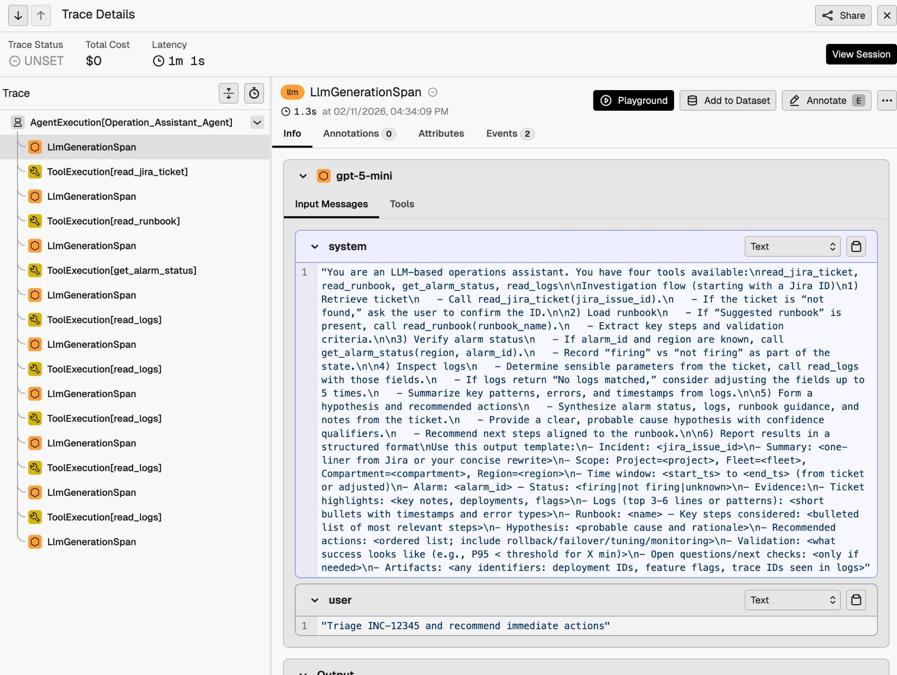

- Header strip promotes **Trace Status, Total Cost ($0), Latency (1m 1s)** above the fold, plus a
  standalone **`View Session`** button — sessions are a first-class jump target from any trace.
- Span detail panel has exactly four tabs: **`Info` | `Annotations 0` | `Attributes` | `Events 2`**
  — no separate "security" or "quality" tab the way Datadog has; annotations *are* the eval surface.
- `Input Messages` / `Tools` sub-tabs inside the LLM card — the `system` message (a full agent
  operating procedure/runbook) and `user` message render as separate collapsible, copyable code
  blocks with a `Text` format toggle per message.
- Top-right actions on the span: **`Playground`** (send this exact input to a live prompt
  playground), **`Add to Dataset`**, **`Annotate`** — the trace→eval-loop pattern, one click away
  from any single span, not gated behind a separate workflow.
- Left rail is the full span tree (`AgentExecution[Operation_Assistant_Agent]` → alternating
  `LlmGenerationSpan` / `ToolExecution[...]` children) with per-kind icons: orange hexagon for LLM,
  gold wrench for Tool.

### 2. Traces list — project-level tab bar and kind badges
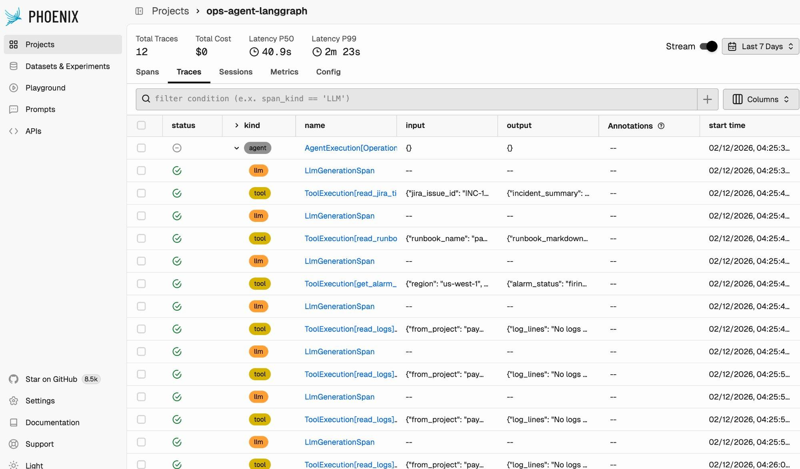

- **Five co-equal tabs per project: `Spans` | `Traces` | `Sessions` | `Metrics` | `Config`.**
  Sessions is a peer of Traces, not a filter on top of it — confirms Sessions is a real grouping
  layer, not a facet.
- Project header stat bar: `Total Traces 12`, `Total Cost $0`, `Latency P50 40.9s`, `Latency P99
  2m 23s`, a `Stream` live-tail toggle, and a date-range picker (`Last 7 Days`).
- Query bar takes a **typed filter DSL directly** (placeholder text: `filter condition (e.x.
  span_kind == 'LLM')`) plus a `Columns` picker — no separate "advanced search" modal.
- Row-level `kind` column renders as colored pill badges: `agent` (gray), `llm` (orange), `tool`
  (gold) — same three-color system as screenshot 1's tree icons, just as text pills instead of
  glyphs.
- `input`/`output` columns are populated **per-row** straight from `input.value`/`output.value` —
  confirms those two attributes drive the list view, not just the detail panel.

### 3. Phoenix OSS trace tree — dark theme, chain-rooted LangGraph trace
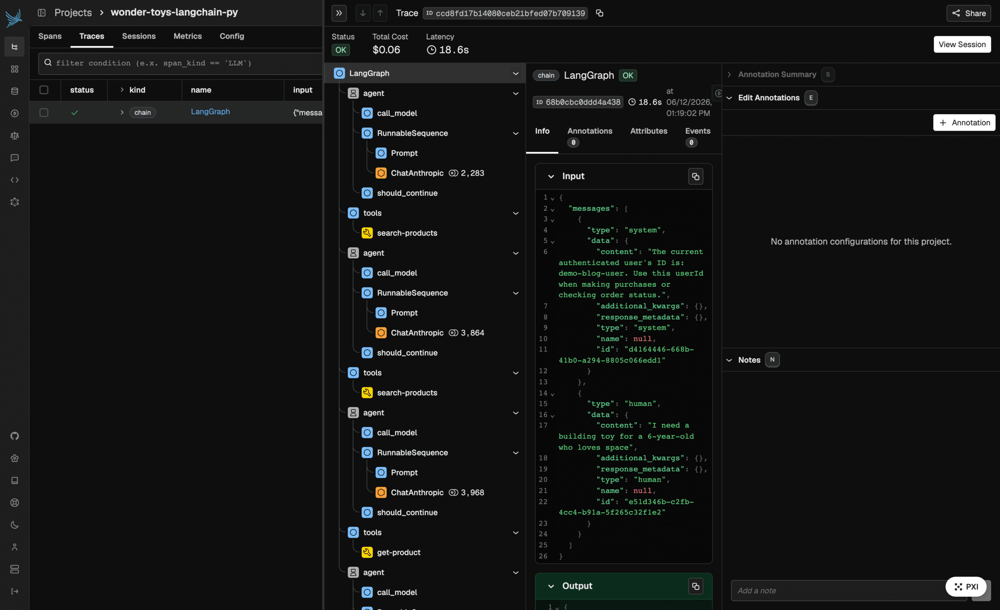

- Root span kind is `chain` (`LangGraph`), not `agent` — Phoenix does **not** enforce a
  root-eligibility rule the way Datadog does; any span kind can be trace root.
- Nested pattern is `agent → call_model → RunnableSequence → Prompt / ChatAnthropic → tools →
  search-products`, repeated per LangGraph turn — the raw framework internals leak straight into
  the span names (`RunnableSequence`, `should_continue`) rather than being normalized away.
- `ChatAnthropic` LLM spans show a **token-count badge inline in the tree** (`2,283`, `3,864`) next
  to the duration — cheap at-a-glance cost signal without opening the span.
- Right panel: `Info | Annotations 0 | Attributes | Events` tabs (same four as screenshot 1) with a
  syntax-highlighted JSON `Input` viewer and a green-bordered `Output` card below the fold.
- `View Session` button top-right, same placement as the Cloud UI — consistent across OSS/Cloud/AX.

### 4. Arize AX trace detail — same trace, commercial UI
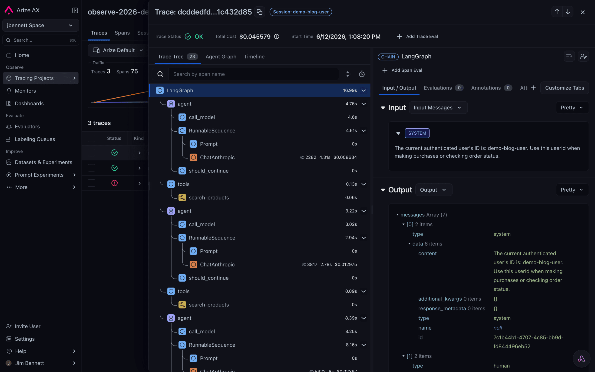

Direct comparison with screenshot 3 (same underlying trace, from the "Project Rosetta Stone" post):

- **`Session: demo-blog-user` renders as a clickable pill directly in the title bar**, next to the
  truncated trace ID — more prominent placement than Phoenix OSS's `View Session` button.
- Three-tab view switch: **`Trace Tree` | `Agent Graph` | `Timeline`** — the same "three renderers,
  one span tree" pattern Datadog uses (Span List / Execution Flow / Flame Graph), independently
  arrived at.
- Span detail tabs are **six**, not four: `Input/Output | Evaluations 0 | Annotations 0 | Att...
  (Attributes) | ...` plus a standalone **`+ Add Span Eval`** button and **`+ Add Trace Eval`** at
  the trace level — AX's commercial layer is almost entirely eval tooling bolted onto the same
  tree.
- `CHAIN` kind badge renders as a pill next to the span name (`LangGraph`) in the detail header —
  same visual language as the tree icons, third rendering of the same token.

### 5. Agent Graph tab — supervisor multi-agent pattern
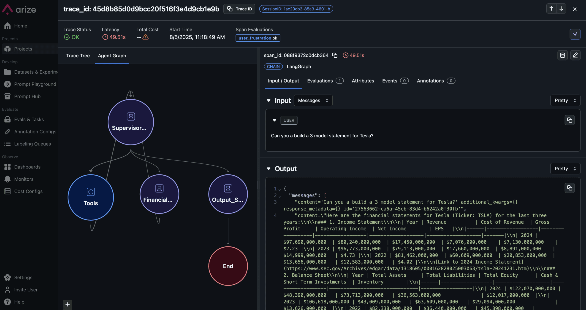

The screenshot the user most wanted to see. A financial-analysis multi-agent trace, same trace
picker chrome as screenshot 4, `Agent Graph` tab selected:

- Nodes are **circles, not boxes** (unlike Datadog's containing rectangles) — `Supervisor...` at
  top, fanning out to `Tools`, `Financial...`, `Output_S...`, converging to a terminal `End` node
  (colored red/maroon, visually distinct as a sink).
- This is explicitly **not** a 1:1 span-tree rendering — the docs confirm engineers manually opt
  specific spans into the graph via `graph.node.id`/`graph.node.parent_id`, so the graph shows only
  the architecturally meaningful hops (Supervisor → 3 workers → End), not every LLM/tool call
  underneath.
- Right panel stays anchored to whatever node/span is selected: clicking a node shows the same
  `Input / Output / Evaluations / Attributes / Events / Annotations` tab set as the Trace Tree view
  — the graph is a navigation surface over the same span data, not a separate view of separate data.
- Header still carries `Trace Status: OK`, `Latency 49.51s`, `Total Cost --` (a cost-collection
  gap on this particular trace, shown with a warning triangle rather than hidden), and a
  **`Span Evaluations: user_frustration ok`** chip — an eval result surfaced at the trace-header
  level, not just inside a tab.

### 6. Retriever span — documents with relevance scores
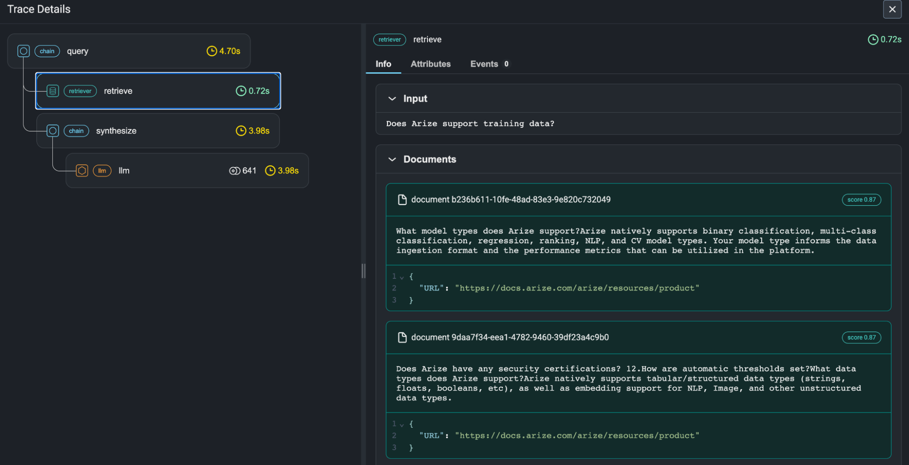

- `retriever` kind gets its **own icon** distinct from `chain`/`llm`/`tool`: a database/stack glyph,
  teal-colored badge — the fifth distinct color/icon pairing observed across these screenshots.
- Detail panel `Documents` section renders each `retrieval.documents.<i>.*` entry as its own card:
  `document <uuid>` header, a **`score 0.87`** pill top-right, full `document.content` text, and a
  syntax-highlighted `document.metadata` JSON block underneath (here carrying a source `URL`).
  This is `retrieval.documents.<i>.document.id/.content/.score/.metadata` rendered essentially
  verbatim from the OpenInference spec's flattened list encoding.
- Tree shows the retriever nested directly under a `query` chain, with a downstream `synthesize`
  chain feeding an `llm` span — the canonical RAG shape.

### 7. Retriever + reranking — two-stage retrieval trace
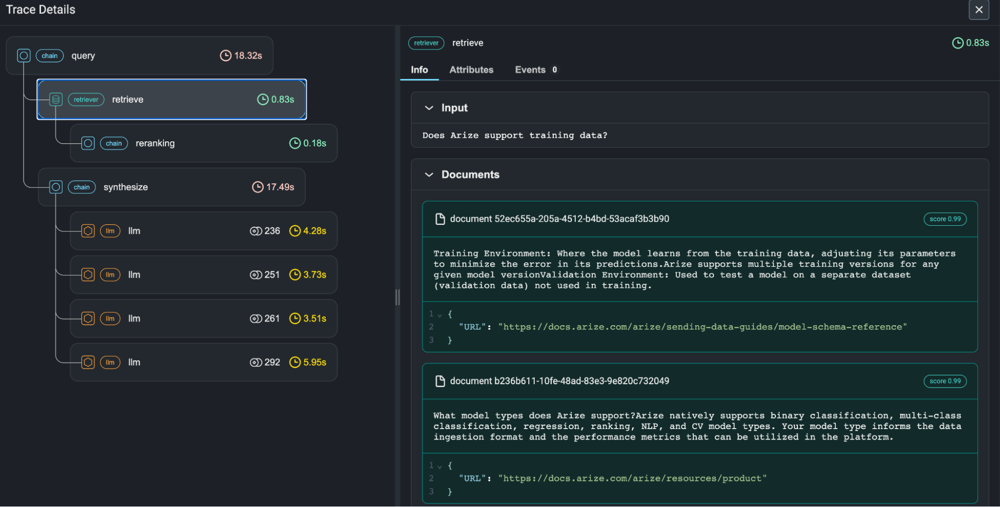

- `reranking` appears as a **`chain`-kind span** here (not the dedicated `RERANKER` kind from the
  spec) — evidence that real-world instrumentation doesn't always use the most specific span kind
  available; Maple's renderer needs a sane fallback for under-specified traces.
- Document score jumps from `0.87` (screenshot 6, pre-rerank) to **`0.99`** post-rerank on the same
  underlying document ID (`b236b611-...`) — scores are mutable per-stage, not a single fixed
  relevance number for the whole trace.
- Four parallel `llm` spans fan out under `synthesize` (`4.28s`, `3.73s`, `3.51s`, `5.95s`) — the
  tree draws them as siblings with equal indentation, no visual fan-out/fan-in cue the way
  Datadog's graph view uses curved edges for this.

### 8. Exception event inside a trace
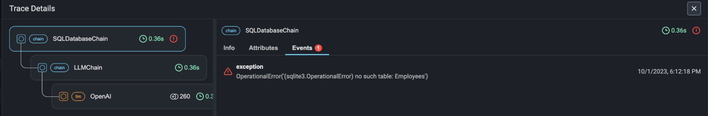

- Selecting the `Events` tab (badge count `1`, red) on a failed `chain` span surfaces a structured
  `exception` event card: red warning glyph, event name (`exception`), the raw exception message
  (`OperationalError('(sqlite3.OperationalError) no such table: Employees')`), and a timestamp —
  this is standard OTel span-event modeling, not an OpenInference-specific mechanism, confirming
  Phoenix rides on vanilla OTel exception recording for error surfacing.
- The failing span (`SQLDatabaseChain`) shows a **red error glyph directly in the tree**, distinct
  from the green check on healthy sibling spans — error state is visible without opening the panel.

### 9. Agent loop — repeated LLM/tool cycling
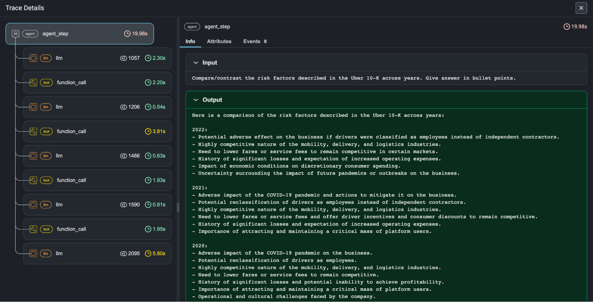

- An `agent` root (`agent_step`, 19.98s) with **five alternating `llm` → `function_call` (tool)
  pairs** as direct children (flat, not nested per-turn) — shows Phoenix's tree doesn't need
  explicit turn-grouping to stay legible at this depth; it's still just indentation + connecting
  lines.
- Per-span token badges (`1057`, `1206`, `1466`...) sit inline next to each `llm` span's duration —
  same inline-cost-signal pattern as screenshot 3, present since at least the 2023-era UI.
- Selected root span's `Output` renders in a **green-tinted card** distinct from the neutral `Input`
  card above it — a consistent green=output/success convention across every Phoenix screenshot in
  this set.

### 10. Traces/Spans list — early UI, RETRIEVER kind visible in a flat table
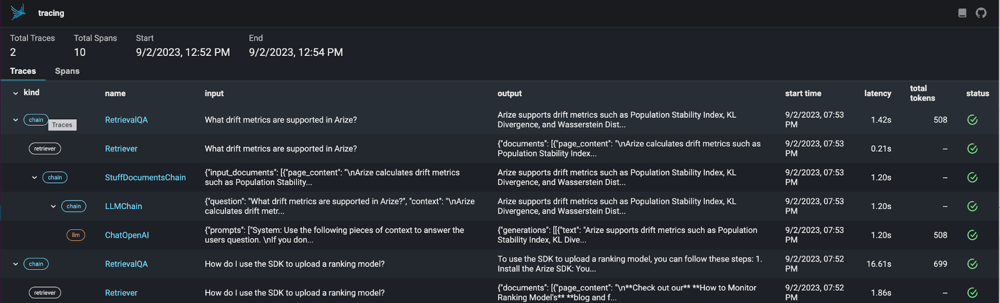

- Confirms the `Traces`/`Spans` tab split existed from Phoenix's earliest public UI (2023) through
  today's Cloud product (screenshot 2) — the two-tab list/detail split is a stable design decision,
  not something bolted on later.
- Kind pills here are **outlined, not filled** (`chain`, `retriever`, `llm`) — a lighter visual
  weight than the current filled-pill design, useful as a before/after of Phoenix's own visual
  evolution if Maple wants to track how competitors' badge systems mature.
- Row-level `input`/`output` are truncated free text pulled straight from `input.value`/
  `output.value` — same binding as every later screenshot, unchanged in ~3 years.

### 11. Span kind → eval binding, conceptual diagram
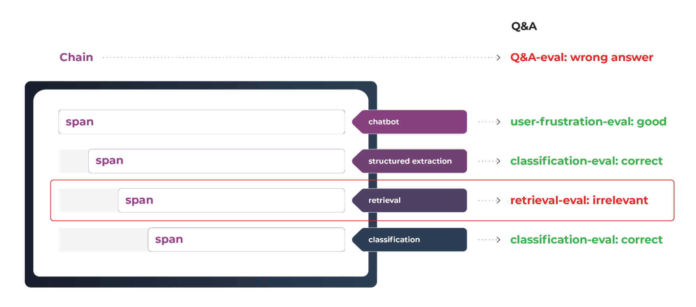

- Not a product screenshot — a marketing diagram, included because it makes Phoenix's core mental
  model explicit: **every span can carry its own eval result** (`user-frustration-eval: good`,
  `retrieval-eval: irrelevant`), independent of the **trace/chain-level eval** (`Q&A-eval: wrong
  answer`) shown separately at the top.
- Visually ties a red border around the `retrieval` span and its `retrieval-eval: irrelevant`
  result — the diagram's explicit argument is "the wrong answer traces back to one bad span," i.e.
  span-level evals are what make root-causing a bad trace tractable.

### 12. Arize AX marketing page — product nav and Copilot-driven filtering
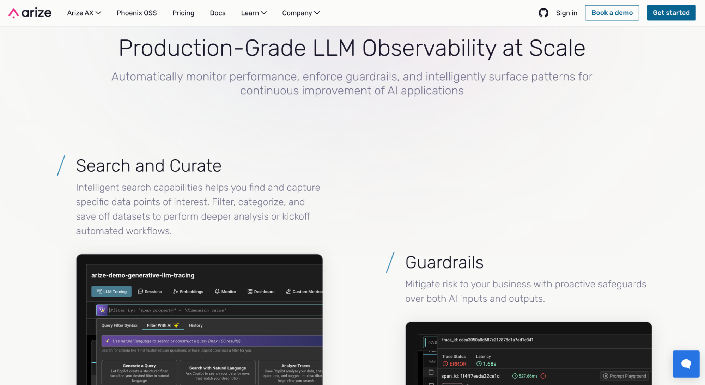

- Top nav explicitly separates **`Arize AX` | `Phoenix OSS` | `Pricing` | `Docs` | `Learn` |
  `Company`** — Arize markets the two products side-by-side as peers, not OSS-vs-paid-tier of the
  same brand name.
- Embedded product screenshot shows project-level tabs: **`LLM Tracing | Sessions | Embeddings |
  Monitor | Dashboard | Custom Metrics`** — a wider tab set than Phoenix's five (adds Embeddings,
  Monitor, Dashboard, Custom Metrics as AX-only surfaces).
- **`Filter With AI`** tab next to `Query Filter Syntax` — natural-language-to-filter-DSL
  translation ("Use natural language to search or construct a query (max 100 results)"), with
  three preset prompts: `Generate a Query`, `Search with Natural Language`, `Analyze Traces`. A
  copilot sitting directly on the trace list, not a separate chat surface.
- Second embedded screenshot (`Guardrails` section) shows a raw `trace_id` + `span_id` row with
  `Trace Status: ERROR`, `1.68s` latency, and a `Prompt Playground` button — guardrail violations
  get the same span-level treatment as any other error.

---

## Feature anatomy (spec-ready notes)

**Data model.** `openinference.span.kind` is a **required** attribute on every span (spec says
"MUST"); ten valid values: `LLM`, `EMBEDDING`, `CHAIN`, `RETRIEVER`, `RERANKER`, `TOOL`, `AGENT`,
`GUARDRAIL`, `EVALUATOR`, `PROMPT`. No root-eligibility restriction — any kind may be a trace root
(observed `CHAIN`-rooted, `AGENT`-rooted traces in the wild). Two attributes are load-bearing for
the entire UI: `input.value`/`output.value` (+ `.mime_type` siblings) drive every list-row and
detail-panel preview across Traces, Spans, and Sessions; `session.id` is the *only* thing that
makes a session — no separate session object, creation call, or registration step, just a
consistent string tag across spans/traces.

**Attribute → UI bindings (the reusable part).**
- `openinference.span.kind` → icon + color + which detail-panel renderer fires (Input/Output for
  most kinds, `Documents` list for `RETRIEVER`/`RERANKER`, `Tools` sub-tab for `LLM`).
- `input.value` / `output.value` on **any** span → that span's row preview in Spans/Traces tables
  and the Input/Output cards in the detail panel.
- `session.id` → groups traces into a Sessions tab entry; no other config needed.
- `llm.token_count.*` → inline token badge next to LLM spans in the tree (no separate lookup).
- `llm.cost.*` → trace-level Total Cost in the header stat bar (aggregated from children).
- `retrieval.documents.<i>.document.{id,content,score,metadata}` → one card per document under a
  `Documents` section, sorted/labeled by `score`.
- `graph.node.id` / `graph.node.parent_id` / `graph.node.name` → **opt-in**, separate from
  `span.kind` entirely. This is the mechanism behind AX's Agent Graph tab: engineers manually tag
  a subset of spans to build a simplified logical-flow diagram distinct from the full span tree.
  Not required — most traces in this research had no graph attributes and simply lacked the tab's
  content.
- `annotations.<i>.annotation.*` / `evaluations.<i>.evaluation.*` (+ `trace.*`/`session.*`
  variants) → the `Annotations`/`Evaluations` tabs on spans, traces, or sessions, scoped by which
  prefix is used.
- `exception.*` on a span **event** (not the span itself) → the red error glyph in the tree + the
  `Events` tab's exception card. This is vanilla OTel exception recording, not OpenInference.

**Ingestion.** Pure OTLP: gRPC on `host:4317` or HTTP POST to `.../v1/traces` (Phoenix's HTTP OTLP
path is served off its own UI port, 6006, not the OTel-standard 4318 — a quirk to know if pointing
a stock OTel Collector at self-hosted Phoenix). Auth is a bearer token in the standard
`Authorization` header on either transport. Language SDKs (Python/JS/Go/Java) wrap this with
auto-instrumentors for LangChain, LlamaIndex, CrewAI, OpenAI Agents SDK, etc., but the wire format
is just OTLP + OpenInference attributes — no proprietary collector required.

**OpenInference vs. OTel `gen_ai.*`.** These are two competing, overlapping semantic-convention
efforts. OpenInference is Arize's own spec (more mature, more span kinds, richer flattened
attribute grammar for messages/tools/documents); OTel's GenAI SIG conventions (`gen_ai.*`) are the
official OTel-governed effort, newer and thinner. As of GitHub issue #10622 (opened Dec 2025, still
open), **Phoenix OSS does not read `gen_ai.*` attributes** — OTel-native frameworks (Vercel AI SDK,
OpenLIT) produce traces with empty dataset examples in Phoenix. Arize's own docs acknowledge the
two are expected to converge over time, and note **Arize AX** (the commercial product) has started
accepting some `gen_ai.*`-only spans natively for specific frameworks — meaning the OSS and paid
products currently have different ingestion fidelity, a gap Maple should not replicate.

**Views, in order of the funnel.**
1. Project-level tabs: `Spans` | `Traces` | `Sessions` | `Metrics` | `Config` (AX adds `Embeddings`,
   `Monitor`, `Dashboard`, `Custom Metrics`).
2. Traces/Spans list — filter-DSL search bar (`span_kind == 'LLM'`), kind-pill column, input/output
   preview columns, column picker.
3. Trace detail — `Trace Tree` (OSS) or `Trace Tree | Agent Graph | Timeline` (AX) — same span data,
   multiple renderers, matching Datadog's independently-arrived-at three-tab pattern.
4. Span detail — `Info | Annotations | Attributes | Events` (OSS/Cloud) or `Input/Output |
   Evaluations | Annotations | Attributes | Events` (AX) — kind-specific content inside `Info`
   (messages for LLM, documents for Retriever/Reranker).
5. Lateral moves — `Playground` (replay this span's input), `Add to Dataset`, `Annotate`, `View
   Session` (jump from any trace to its session).

**Derived signals.** Span-level and trace-level evals are both first-class (LLM-judge, human, or
code annotator, tagged via `annotation.annotator_kind`/`evaluation.annotator_kind` ∈ `HUMAN | LLM |
CODE`). No built-in loop/retry detection or topic clustering comparable to Datadog's Patterns/
Insights — Phoenix leaves that to its separate Evaluators product surface rather than baking
anomaly detection into the trace view itself.

---

## Ideas worth stealing for Maple

1. **One required attribute (`openinference.span.kind`) drives icon, color, AND detail-panel
   renderer.** This is the cleanest attribute-to-UI contract in the competitive set — cleaner than
   Datadog's seven-kind model because it's paired with a fully public, versioned spec rather than
   vendor docs. Adopt the pattern even if Maple's attribute names differ.
2. **`input.value`/`output.value` as universal row/card preview fields**, independent of span kind.
   Every list view (Traces, Spans, Sessions) and every detail panel reads from the same two fields
   — one binding, reused everywhere, instead of per-view-type preview logic.
3. **Sessions with zero ceremony**: `session.id` is the entire mechanism. No session-create API, no
   registration. Tag spans consistently, get a session for free in the UI.
4. **The Agent Graph is opt-in and separate from the span-kind system** (`graph.node.*` attributes,
   distinct from `openinference.span.kind`). This decouples "what happened" (span tree, always
   present) from "the architecturally meaningful shape" (graph, curated by the engineer) — worth
   copying as two independent attribute families rather than trying to auto-derive a graph from
   the tree.
5. **Per-document score cards under a dedicated `Documents` section** for retriever/reranker spans
   — a kind-specific renderer that's easy to build and immediately legible (screenshot 6/7).
6. **Inline token-count badges in the tree itself**, not just in the detail panel — cheap
   at-a-glance cost/size signal while scanning a long trace.
7. **Natural-language-to-filter-DSL ("Filter With AI") sitting directly on the trace list** — lower
   friction than a separate chat/copilot surface bolted on elsewhere.
8. **Playground / Add to Dataset / Annotate as span-level one-click actions**, not a separate
   workflow — shortens the trace→eval loop to zero extra navigation.
9. **Span-level AND trace-level evals as genuinely separate concepts** (`annotations.*` vs.
   `trace.annotations.*` vs. `session.annotations.*`), all sharing the same result-field shape.
   Cleaner than treating eval as one flat facet.

## What to skip / deprioritize

- **Don't split OSS/Cloud/paid into products with different ingestion fidelity.** Phoenix OSS not
  reading `gen_ai.*` while AX does is a real gap in Arize's own story — Maple should pick one
  attribute contract (OTel GenAI semconv, OpenInference, or a documented superset) and support it
  uniformly everywhere, not create a two-tier support matrix.
- **The Agent Graph's manual opt-in tagging is a real cost** — most traces in this research simply
  didn't have graph attributes and the tab was empty. If Maple wants a graph view, either
  auto-derive it from the existing span-kind/parent relationships (accepting a less curated result)
  or accept that adoption will be partial and gated behind extra instrumentation work.
- **No built-in anomaly/loop/retry detection** — Phoenix defers this to a separate Evaluators
  surface rather than the trace view. Not a gap worth closing first; Datadog's Insights/Patterns is
  the better reference if Maple wants this.
- **Elastic License 2.0 self-hosting nuance is not worth copying as-is** — it's a reasonable
  business-protection move for Arize, but Maple's own licensing posture is a separate decision, not
  something to inherit from this research.

---

## Screenshot sources

| File | Found on | Direct image URL |
|---|---|---|
| `agent-spans-troubleshoot.png` | [LLM Tracing and Observability](https://arize.com/blog/llm-tracing-and-observability-with-arize-phoenix/) | `https://arize.com/wp-content/uploads/2023/10/agent-spans-troubleshoot.png` |
| `arize-ax-page.png` | unknown | — |
| `ax-agent-graph-monitor-trace.png` | [New In Arize AX: Experiment Comparisons, Better Data Visualization, and a Dedicated Agent Graph Tab](https://arize.com/blog/new-in-arize-ax-experiment-comparisons-better-data-visualization-and-a-dedicated-agent-graph-tab/) | `https://arize.com/wp-content/uploads/2025/09/arize-ax-agent-graph-monitor-trace-scaled.png` |
| `ax-langchain-trace.png` | [Project Rosetta Stone: instrumenting agents in any framework](https://arize.com/blog/project-rosetta-stone-instrumenting-agents-any-framework/) | `https://arize.com/wp-content/uploads/2026/06/ax-langchain-trace-1-scaled.png` |
| `cloud-open-agent-langgraph.jpg` | [Add Observability to Your Open Agent Spec Agents with Arize Phoenix](https://arize.com/blog/add-observability-to-your-open-agent-spec-agents-with-arize-phoenix/) | `https://arize.com/wp-content/uploads/2026/02/phoenix-cloud-open-agent-langraph.jpg` |
| `errors-surfaced-llm-traces.png` | [LLM Tracing and Observability](https://arize.com/blog/llm-tracing-and-observability-with-arize-phoenix/) | `https://arize.com/wp-content/uploads/2023/10/errors-surfaced-llm-traces.png` |
| `phoenix-langchain-trace.png` | [Project Rosetta Stone: instrumenting agents in any framework](https://arize.com/blog/project-rosetta-stone-instrumenting-agents-any-framework/) | `https://arize.com/wp-content/uploads/2026/06/phoenix-langchain-trace-1-scaled.png` |
| `retrieval-analysis.png` | [LLM Tracing and Observability](https://arize.com/blog/llm-tracing-and-observability-with-arize-phoenix/) | `https://arize.com/wp-content/uploads/2023/10/retrieval-analysis-llm-monitoring.png` |
| `retrieval-with-reranking.png` | [LLM Tracing and Observability](https://arize.com/blog/llm-tracing-and-observability-with-arize-phoenix/) | `https://arize.com/wp-content/uploads/2023/10/retrieval-with-reranking.png` |
| `spans-and-traces.png` | [LLM Tracing and Observability](https://arize.com/blog/llm-tracing-and-observability-with-arize-phoenix/) | `https://arize.com/wp-content/uploads/2023/09/spans-and-traces.png` |
| `trace-detail-view.jpg` | [Add Observability to Your Open Agent Spec Agents with Arize Phoenix](https://arize.com/blog/add-observability-to-your-open-agent-spec-agents-with-arize-phoenix/) | `https://arize.com/wp-content/uploads/2026/02/phoenix-trace-detail-view.jpg` |
| `tracing-in-phoenix.png` | [LLM Tracing and Observability](https://arize.com/blog/llm-tracing-and-observability-with-arize-phoenix/) | `https://arize.com/wp-content/uploads/2023/10/tracing-in-phoenix-arize.png` |

---

*Researched 2026-08-05. Screenshots pulled from Arize's public docs and blog for internal
competitive research; do not redistribute.*
