# Braintrust — Eval-First AI Observability

> **One-liner:** An evals company that grew a tracing product on top of its dataset/experiment
> primitives — Braintrust's whole pitch is closing the loop from a bad production trace to a
> versioned dataset row to a CI-gated regression test, not the trace viewer itself.

**Market position:** Well-funded AI-native startup, not a repurposed APM vendor. Raised an **$80M
Series B in February 2026** led by **ICONIQ** (with a16z, Greylock, Elad Gil, basecase capital
participating); press reported the round at roughly an **$800M valuation** (not confirmed in
Braintrust's own announcement). Founded by **Ankur Goyal** (ex-Figma, ex-Impira), who built the
same "internal eval harness" twice before turning it into a product — the founding story is itself
evidence of the eval-first DNA. Publicly named customers/logos: **Notion, Replit, Cloudflare, Ramp,
Dropbox, Vercel, Coursera, Retool, Graphite, Navan**. Buyer is the AI/ML platform team shipping an
LLM product to production, sold self-serve down to individual developers and up through an
Enterprise motion (on-prem/hosted deployment, custom retention). It won mindshare early as *the*
place teams ran offline evals for RAG/agent apps, then organically became a production observability
vendor because their own customers wired production logs into the same `Eval()` primitive.

**How core is agent tracing to the product?** Real, but structurally the second pillar of three, and
historically the youngest. Braintrust's object model was built eval-first: **Datasets**,
**Experiments**, **Scorers**, and **Playgrounds** are the original primitives, and "Logs" (i.e.
production tracing) is the same span/trace data structure retrofitted to a live application instead
of an eval task. The current homepage frames three co-equal pillars — **Observe** ("trace
everything"), **Evaluate** ("test what ships"), **Discover** ("find patterns") — and the nav bar
puts Playgrounds, Experiments, Datasets, Prompts and Scorers ahead of Logs and Monitor. Contrast this
with Maple or Datadog, where the trace store is the foundation and evals are a bolt-on: for
Braintrust it is the reverse — the trace viewer exists in service of getting better data into
`Eval()`. Their own span-type taxonomy (`llm`, `score`, `function`, `eval`, `task`, `tool`, `review`)
still has **`eval`, `task`, and `score` as first-class span kinds** — categories that only make sense
if you assume every trace might be an eval run, not a production request. There is also, notably,
**no dedicated `agent` span kind** — agents are just nested `function`/`task` spans, unlike Datadog's
explicit `agent` kind. Braintrust is honest about this framing in its own marketing: its Datadog
comparison article is literally titled *"Logging vs. evals."*

---

## Trial & access

| | |
|---|---|
| **Free tier** | Yes — permanent **Starter** plan, not a countdown trial: 1 GB processed data/mo, 10,000 scores/mo, 14-day retention, unlimited users/projects/datasets/playgrounds/experiments, $10/mo of included model credits (via the Braintrust AI proxy). |
| **Free trial** | No separate time-boxed trial — the free tier itself is the trial. |
| **Credit card required?** | **No**, verified on the live signup form (`braintrust.dev/signup`, Aug 2026): the form asks only for **email address**, **password**, and a **ToS/Privacy checkbox**, plus a **"Continue with Google"** SSO option. No card field. Pricing docs confirm the Starter tier is explicitly "no credit card required"; a card is only requested when you **upgrade to Pro**. |
| **Registration URL** | https://www.braintrust.dev/signup |
| **Signup fields** | Email, password, ToS/Privacy consent checkbox. Google OAuth alternative. Org/company name and usage details are collected in-product on first login, not at signup. |
| **Paid entry point** | **Pro: $249/mo flat** (no per-seat fee) — 5 GB processed data, 50,000 scores/mo, 30-day retention, $249/mo included model credits, custom charts, environments, RBAC, priority support. Overages: $3/GB data, $1.50/1K scores. Startups can get 6–12 months free. |
| **Self-serve to the feature?** | Yes — `pip install braintrust` / `npm i braintrust`, get an API key from the dashboard, start logging. No sales call needed for Starter or Pro. |
| **Gotcha** | Free tier retention is only **14 days** — production trace data ages out fast unless you upgrade or export. Enterprise (custom retention, on-prem/hosted, RBAC at scale) is sales-gated as usual. |

---

## Sources

| # | Source | Type | Why it's useful / what to extract |
|---|---|---|---|
| 1 | [Advanced tracing patterns](https://www.braintrust.dev/docs/instrument/advanced-tracing) | Docs | **The data model, verbatim.** `span_attributes.type` ∈ `llm, score, function, eval, task, tool, review` — no dedicated `agent` kind. LLM spans need `prompt_tokens`/`completion_tokens`/`tokens` metrics plus `prompt_cached_tokens`/`prompt_cache_creation_tokens` for cache accounting. Traces are described as a **DAG of spans** ("each span can have multiple parents, but most executions are a tree"). Also documents **custom span iframes**: a project-level "Field name" + mustache-templated URL (`{{input.id}}`, `{{metadata.foo.bar}}`) that renders arbitrary HTML/apps inline inside a span's detail panel, with a "post span data to iframe on load" toggle. |
| 2 | [OpenTelemetry (OTel) integration](https://www.braintrust.dev/docs/integrations/sdk-integrations/opentelemetry) | Docs | **The OTLP mapping table.** Native receiver at `https://api.braintrust.dev/otel` (EU: `api-eu.braintrust.dev/otel`); also ships `BraintrustSpanProcessor`/`BraintrustExporter` for JS/Python. Maps `gen_ai.input.messages`/`gen_ai.prompt`→`input`, `gen_ai.output.messages`/`gen_ai.completion`→`output`, `gen_ai.usage.*`→`metrics.*`, `gen_ai.request.model`→`metadata.model` (strips `openai/`/`anthropic/` prefixes). **Span-type inference**: `gen_ai.operation.name = "chat"` → `llm`; `"execute_tool"` or presence of `gen_ai.tool.name` → `tool`. No mapping rule for OTel's `invoke_agent` operation is documented — confirms the "no agent span kind" gap. Supports OpenLLMetry and the Vercel AI SDK as alternate ingestion paths, plus a custom `x-bt-parent` header / `context_from_span_export()` helpers for cross-service distributed tracing outside plain W3C traceparent. |
| 3 | [How to improve your golden datasets with human review](https://www.braintrust.dev/blog/human-review-golden-datasets) | Blog | **The loop-closing mechanics, in detail.** Defines three review queues: **Triage** (confirm/refine auto-generated Topic labels), **SME** (fill in ground-truth `expected`/`is_correct`), **Calibration** (multiple reviewers score the same items to check agreement). Configurable score types: Pass/fail, Categorical, Continuous slider, Freeform text — set per-project under Settings → Human review. Quote: *"The goal of adding human review to your eval process is to turn your production traces into golden datasets that are updated over time, and that can help tune your scorers as your data changes."* |
| 4 | [Eval feedback loops](https://www.braintrust.dev/blog/eval-feedback-loops) | Blog | **The trace→dataset→eval wiring, explained.** Datasets and production logs use the *same* underlying schema, so a logged trace can become a dataset row with no transformation. Quote: *"As you add new cases to your dataset, your `Eval` will automatically test them."* Pin an eval to a specific dataset **version** for a stable regression baseline while the live dataset keeps growing. Design rationale: *"connect your real-world log data to your evals, so that as you encounter new and interesting cases in the wild, you can eval them, improve, and avoid regressing in the future."* |
| 5 | [braintrustdata/eval-action](https://github.com/braintrustdata/eval-action) | GitHub / Marketplace | **The CI half of the loop.** Official GitHub Action: runs `Eval()` on every PR (`runtime: node\|python\|go`), posts/updates a **single PR comment** with a results table — score name, percentage, **delta in percentage points with 🟢/🔴 direction**, pass/fail tallies, duration (e.g. `Levenshtein score 83% (+3pp)`). Needs `contents: read` + `pull-requests: write`. This is the mechanism that turns a promoted dataset row into an enforced CI gate on the next PR. |
| 6 | [Turn production data into better AI with Loop](https://www.braintrust.dev/blog/loop) | Blog | **The AI-teammate layer over the whole loop.** Loop is a chat agent docked bottom-right on every page (Logs, Datasets, Experiments, Scorers, Prompts, Monitor, Playground), reachable via Cmd/Ctrl+K. It can: build **custom trace views** from a natural-language prompt (screenshot below), **generate scorers from an observed failure pattern**, and **synthesize new dataset rows from scratch** (not just promote existing traces) — "Generate 5 more dataset rows" against a model picker (GPT-5, Claude 4.1 Opus, etc). |
| 7 | [Enable Topics](https://www.braintrust.dev/docs/observe/topics/enable) | Docs | The discovery layer that feeds the review queue. Runs an LLM over a normalized text form of every trace; **once ≥100 trace summaries are collected, a daily batch job clusters them into Topics** with built-in classification dimensions (Task, Sentiment, Issues). This is what fills the Triage queue with candidates before a human ever opens the trace. |
| 8 | [Agent observability: the complete guide for 2026](https://www.braintrust.dev/articles/agent-observability-complete-guide-2026) | Articles (vendor content) | Braintrust's own prescriptive **agent span schema**, independent of any specific framework: tool-call spans (name, args, output, duration, retry count, errors → catches hallucinated args / silent retry loops), reasoning spans (plan/action/observation/next-plan → catches plan drift / wrong-branch selection), state-transition spans (before/after/context edits/handoff payload → catches context loss), memory-operation spans (query/entries/relevance/freshness/write → catches stale reads, memory leakage). Useful as a **checklist of failure modes per span type** independent of Braintrust's own product. |
| 9 | [Thread view span extraction and filtering](https://www.braintrust.dev/docs/kb/thread-view-span-extraction-and-filtering) | Docs (KB) | Confirms **sessions are not a first-class entity** — Thread view is a per-trace *rendering mode* that filters to spans where `span_attributes.type = 'llm'` or `'score'` and parses `gen_ai.prompt`/`gen_ai.completion` into a chat transcript. Multi-turn "sessions" are an application-level convention (nest turns under one shared root span), not a separate table. |
| 10 | [Braintrust's Series B](https://www.braintrust.dev/blog/announcing-series-b) | Blog | Funding, investors, named customers, founder background — the market-position facts above. |

---

## Screenshots

### 1. Trace detail — the core loop-closing screen
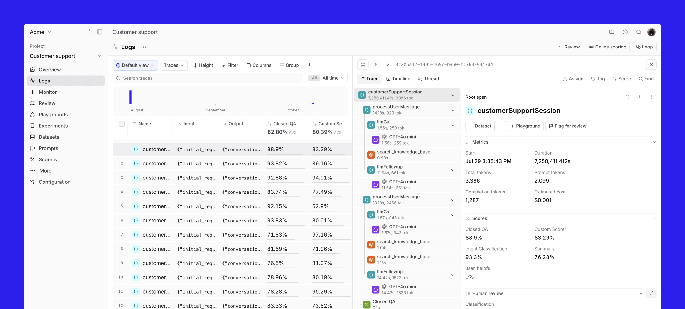

This is the single most important screenshot for the requested feature.

- Left nav (full product surface, in order): **Overview, Logs, Monitor, Review, Playgrounds,
  Experiments, Datasets, Prompts, Scorers, More, Configuration.** Evals-oriented surfaces
  (Playgrounds/Experiments/Datasets/Prompts/Scorers) outnumber observability surfaces (Logs/Monitor)
  5-to-2.
- Logs list columns: **Name, Input, Output, Closed QA%, Custom Scorer%** — scorer results are
  promoted to top-level list columns, not buried in a facet.
- Trace panel tabs: **Trace | Timeline | Thread | Custom** — four renderings of the same span data;
  "Custom" is a user- or Loop-authored view.
- Root span action row: **`+ Dataset` · `+ Playground` · `Flag for review`** — the promote-to-dataset
  action sits next to "open in playground," i.e. one click either sends this exact input/output into
  eval iteration or into a permanent regression case.
- **Human review** panel embedded directly in the span detail: `Classification` buttons (Technical
  Support / Communications / Billing/Account / General/Feedback) — a categorical review score
  configured per-project.
- Right side **Metrics** block: Start, Duration, Total/Prompt/Completion tokens, Estimated cost.
  **Scores** block: `Closed QA`, `Custom Scorer`, `Intent Classification`, `Summary`, `user_helpful` —
  scorer results rendered as first-class fields on the span, same visual weight as latency/cost.
- Span tree icons distinguish kinds at a glance: teal `()` function spans (`customerSupportSession`,
  `processUserMessage`), purple circular "AI" icon for `llmCall`/`llmFollowup` sub-spans, green `%`
  icon for score spans (`Closed QA`, `Custom Scorer`).
- `Loop` button, bottom-right, on every page.

### 2. Trace detail — cache-aware metrics and dataset action (alternate trace)
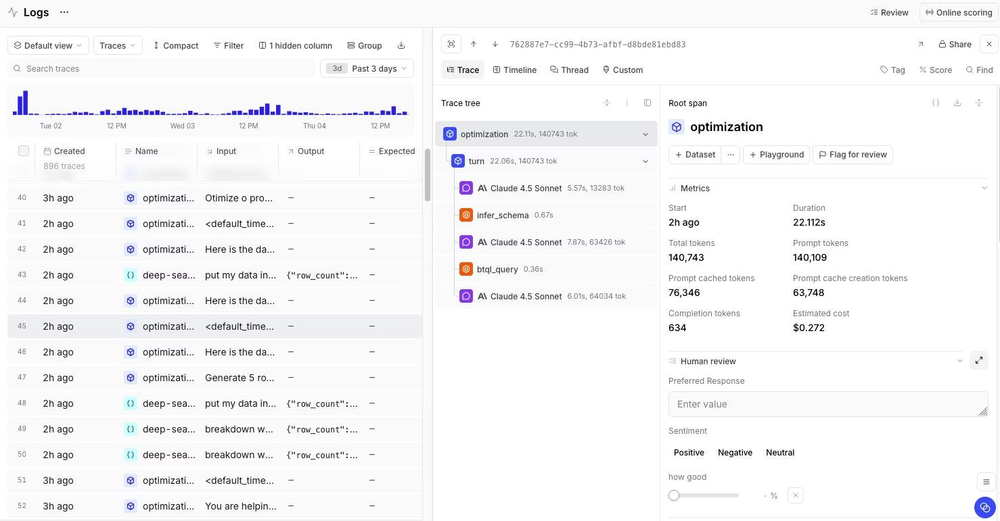

- Same `Trace | Timeline | Thread | Custom` tab pattern, this time on an agentic
  `optimization → turn → {Claude 4.5 Sonnet, infer_schema, btql_query, Claude 4.5 Sonnet}` trace.
- Orange square icons mark **tool spans** (`infer_schema`, `btql_query`) distinctly from purple
  circular **LLM spans** (`Claude 4.5 Sonnet`) in the same tree — the same two-color system as
  screenshot 1, just different icon shapes for tool vs. function containers.
- Metrics block explicitly separates **`Prompt cached tokens`** from **`Prompt cache creation
  tokens`** — prompt-cache accounting is a first-class metric pair, not folded into total tokens.
- **Human review** widget on this span is *continuous*, not categorical: a `Sentiment`
  Positive/Negative/Neutral button row plus a `how good` percentage slider with a clear (×) control —
  shows the same review panel is reconfigurable per project/span type.

### 3. The "Add to dataset" action, isolated, plus inline error tracing
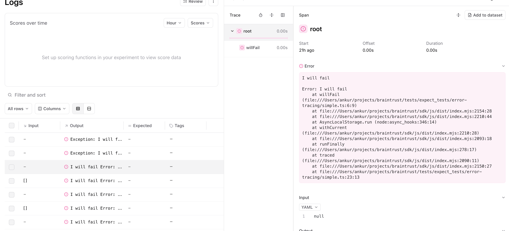

- Top-right of the span panel: **`Add to dataset`** as a standalone icon+label button — the exact
  wording used outside the "+Dataset" shorthand seen in screenshot 1.
- The **`Error`** section renders the full stack trace inline in the span detail (file:line for every
  frame, including inside the vendored SDK) — no separate "go to error tracking" product.
- Logs list shows failed rows pre-filtered (`Exception: I will f...`) with `Input`/`Output`/`Expected`/
  `Tags` as the default dataset-shaped columns — logs and datasets literally share a column schema.

### 4. Full loop-closing panel: dataset action + human review + rendered output + triage tags
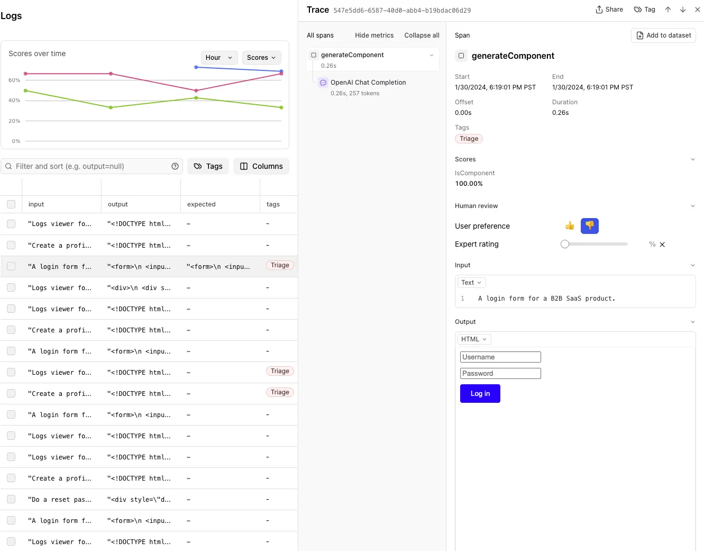

The clearest single view of the whole mechanic end to end.

- `Add to dataset` button, top-right of the span panel (same placement as screenshot 3).
- **Human review**: `User preference` as a **thumbs up/down** pair (down is selected, highlighted
  amber) plus `Expert rating` as a **0–100% slider** with an explicit clear (×) — two independent
  review primitives on one span.
- Logs list has a **`Triage`** tag applied to specific rows (orange pill) — visible proof that Topics
  clustering (source 7) writes tags back onto raw log rows for the review queue to filter on.
- The span's `Output` is rendered through a **custom span iframe** (source 1) as live HTML — an
  actual `<form>` with Username/Password inputs and a "Log in" button, not JSON. Confirms the
  iframe feature is used for literal product-preview rendering, not just tables.

### 5. Eval trace: span-kind taxonomy + custom rendered table
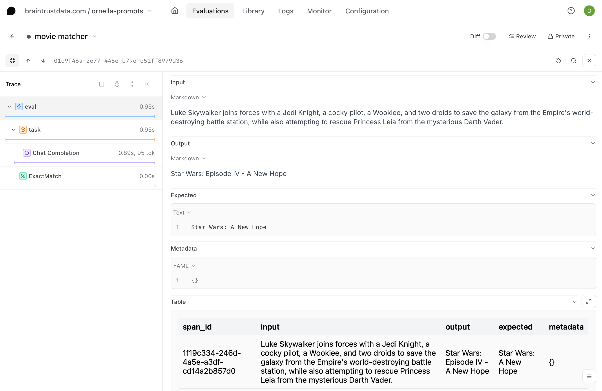

- Span tree shows four kinds stacked in one trace: blue-lightning **`eval`** (root) → orange
  **`task`** → purple **`Chat Completion`** (llm) → green **`ExactMatch`** (score) — the taxonomy
  from source 1, seen live.
- A **`Table`** custom span iframe renders the dataset row (`span_id`, `input`, `output`, `expected`,
  `metadata`) as an actual table inside the span detail — the same iframe mechanism, applied to
  structured data instead of a rendered UI.
- `Diff` toggle, top-right, next to `Review` and `Private` — compare this span/trace against another
  run inline.

### 6. Custom span iframe configuration
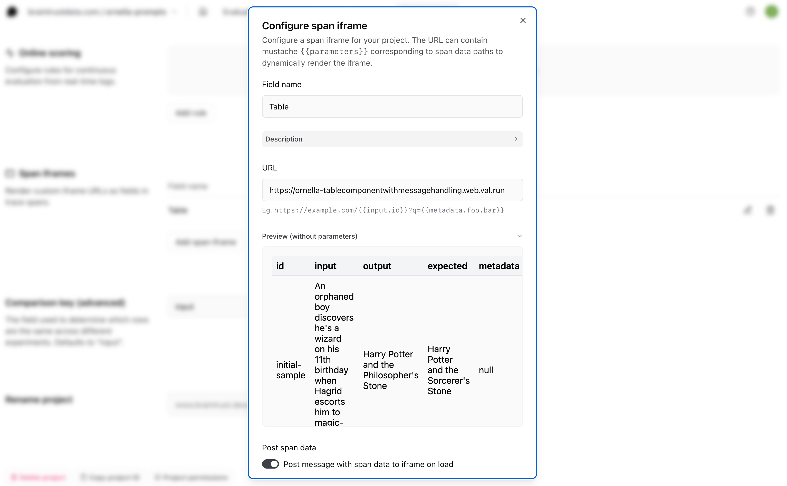

- Project-level modal: `Field name` (e.g. "Table"), `Description`, `URL` with **mustache templating**
  (`{{input.id}}`, `{{metadata.foo.bar}}`), live `Preview (without parameters)`, and a
  `Post message with span data to iframe on load` toggle — the full config surface behind
  screenshots 4 and 5. This is a genuinely novel idea: teams can point a span field at an arbitrary
  hosted app (the example URL is a `val.run` micro-app) and get a bespoke renderer per span shape.

### 7. Experiment comparison — score deltas
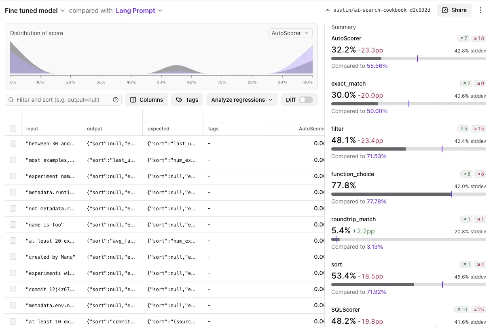

- Header: `Fine tuned model` compared with `Long Prompt`, plus git-style ref (`austin/ai-search-cookbook
  d2c932d`) — experiments are tied to a commit, not just a timestamp.
- Per-scorer rows (`AutoScorer`, `exact_match`, `filter`, `function_choice`, `roundtrip_match`, `sort`,
  `SQLScorer`) each show: current %, **Δ in percentage points**, **stddev**, an improved/regressed
  count pair (`↗7 ↘18`), and a mini bar showing where the comparison baseline sits. Distribution
  histogram at top (`AutoScorer`) shows the full score spread, not just the mean.
- `Analyze regressions` button and a `Diff` toggle sit directly above the row table — this is the
  UI a scorer regression funnels into before it ever reaches the `eval-action` PR comment (source 5).

### 8. Monitor — aggregate dashboard
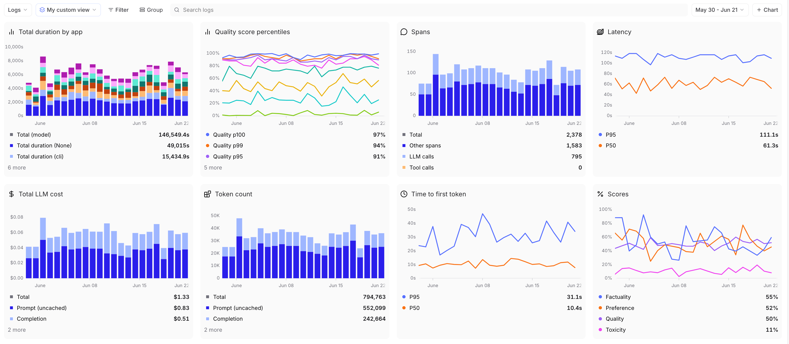

- Eight tiles in a fixed grid: Total duration by app, Quality score percentiles (p100/p99/p95 lines),
  **Spans** (Total / Other spans / **LLM calls** / **Tool calls** as stacked series), Latency
  (P95/P50), Total LLM cost (Prompt uncached / Completion split), Token count, Time to first token
  (P95/P50), Scores (Factuality/Preference/Quality/Toxicity as separate lines).
- Global `+ Chart` button and a `My custom view` selector — dashboards are themselves buildable and
  saveable per project, same pattern as the Loop-generated custom trace views.

### 9. Span-type breakdown, by name
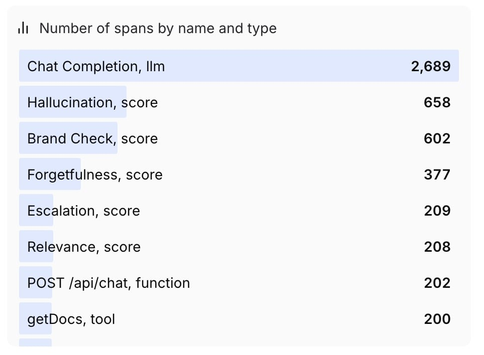

- A single "Number of spans by name and type" tile lists real span rows: `Chat Completion, llm` ·
  `Hallucination, score` · `Brand Check, score` · `Forgetfulness, score` · `Escalation, score` ·
  `Relevance, score` · `POST /api/chat, function` · `getDocs, tool` — concrete confirmation of the
  `type` taxonomy in production use, and that **scorers execute and log as spans themselves**, not as
  metadata attached after the fact.

### 10. Loop generating a custom trace view from a prompt
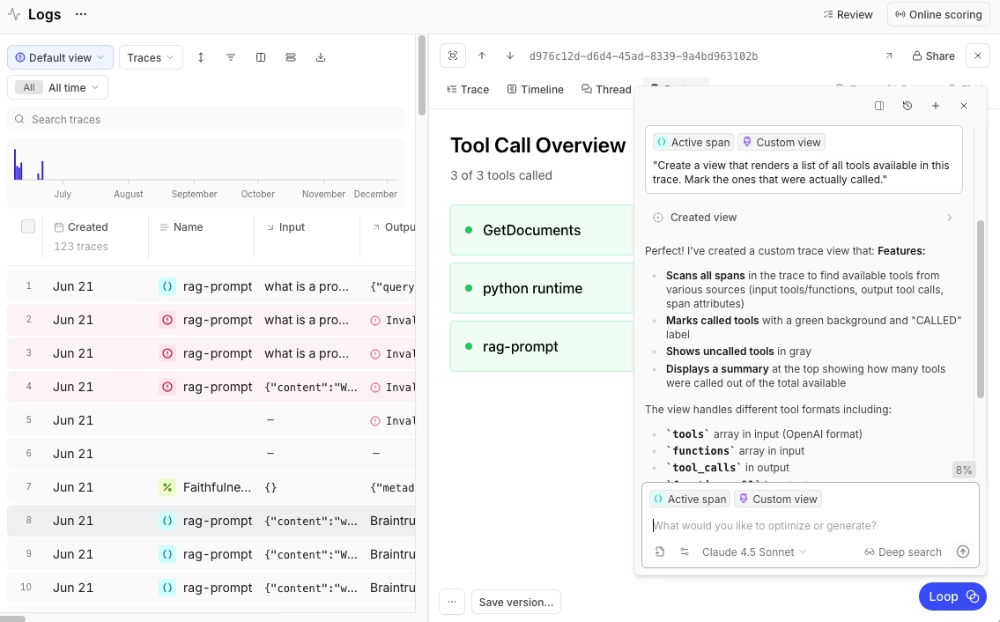

- Prompt: *"Create a view that renders a list of all tools available in this trace. Mark the ones
  that were actually called."* Loop's response explains its own plan (scans all spans for tool
  sources: `tools`/`functions` array in input, `tool_calls` in output, span attributes) before
  rendering the view.
- Resulting **`Tool Call Overview`** view: 3 of 3 tools called, each tool as a card, called tools
  marked with a green **"CALLED"** label, uncalled tools shown in gray — directly addresses the
  wrong-tool-selection debugging problem without a human writing any view code.

### 11. Loop surfacing a failure-pattern report
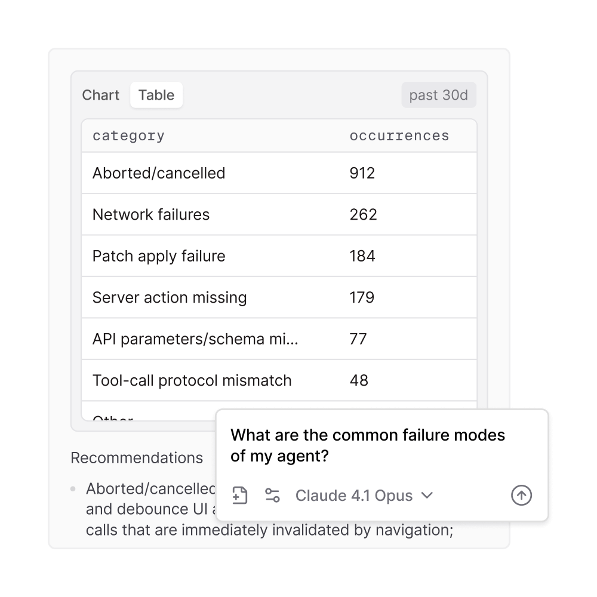

- Loop-generated `Chart`/`Table` toggle over a failure taxonomy: `Aborted/cancelled` 912,
  `Network failures` 262, `Patch apply failure` 184, `Server action missing` 179,
  `API parameters/schema mismatch` 77, `Tool-call protocol mismatch` 48 — plus a `Recommendations`
  section underneath, in response to *"What are the common failure modes of my agent?"*
- Model picker inline in the chat box (`Claude 4.1 Opus`) — Loop is model-selectable per query.

### 12. Loop synthesizing new dataset rows
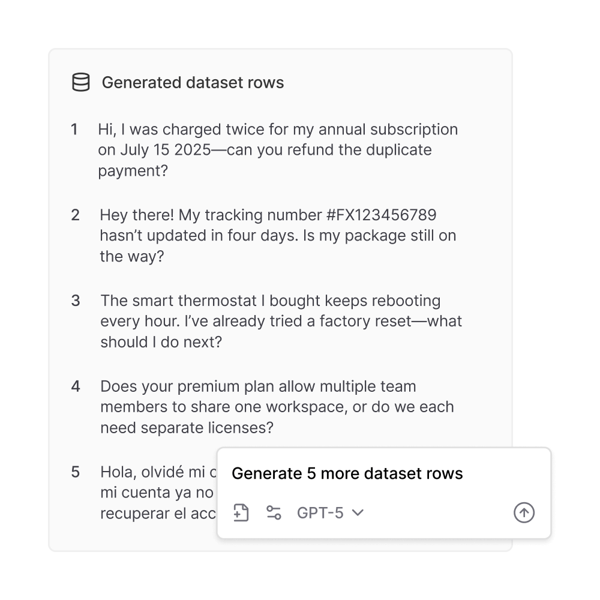

- `Generated dataset rows` list of five realistic support queries, produced from
  `"Generate 5 more dataset rows"` against `GPT-5`. This is the counterpart to the trace-promotion
  flow: Loop can **manufacture** synthetic dataset rows (multilingual example included — a Spanish
  query appears at row 5) when real production failures are too sparse to build a golden set from.

---

## Feature anatomy (spec-ready notes)

**Data model.** `span_attributes.type ∈ {llm, score, function, eval, task, tool, review}`, no
dedicated `agent` kind — agent behavior is represented as nested `function`/`task` spans containing
`llm` and `tool` children. Span payload: `input`, `output`, `metadata` (model params, tools array),
`metrics` (tokens incl. cache read/write split, estimated_cost), `tags`, `scores` (named % results
attached to the span, and separately logged as `score`-typed spans in the tree). Traces are
technically a DAG (multi-parent allowed) though the docs note "most executions are a tree." Logs,
Datasets, and Experiment rows share one schema (`input`/`expected`/`metadata`/`tags`) — this is *why*
the trace→dataset promotion is a single click with no transform step.

**Ingestion.** Native SDKs (Python/TS/Ruby/Go) with two lines of code to wrap an LLM call, plus a
**native OTLP receiver** (`api.braintrust.dev/otel`) that auto-normalizes any `gen_ai.*`
semantic-convention span. Framework coverage: OpenAI Agents SDK, LangGraph, Mastra, Pydantic AI via
native adapters; OpenTelemetry is the documented fallback for everything else. Also accepts
OpenLLMetry and Vercel AI SDK traces. Distributed tracing across services uses a custom
`x-bt-parent` header/baggage helper rather than relying solely on W3C traceparent.

**Views, in order of the funnel.**
1. Monitor — 8-tile aggregate dashboard (cost, tokens, latency percentiles, span-kind counts, scores)
2. Logs — table of traces, scorer results as columns, Scores-over-time chart above the grid
3. Topics (background) — LLM-clustered failure/task/sentiment categories once ≥100 summaries exist
4. Review — Triage / SME / Calibration queues fed by flagged spans + Topics
5. Trace detail — Trace / Timeline / Thread / Custom tabs, Human review panel, Metrics, Scores
6. `+ Dataset` — promote the trace (with optional live back-reference) into a versioned Dataset
7. Playground / Experiments — iterate prompts/scorers against the dataset, compare experiments
   (score deltas, distribution histograms, regression analysis)
8. `eval-action` in CI — every PR re-runs the eval suite against the pinned dataset version and posts
   a scored PR comment

**Derived signals.** Topics (unsupervised clustering into Task/Sentiment/Issues), online scoring
(scorers run continuously against live production traffic, not just offline), Loop-generated
custom views and synthetic dataset rows, experiment regression detection (`Analyze regressions`).

---

## Ideas worth stealing for Maple

1. **One-click trace→dataset promotion with a live back-reference to the source trace**, not a copy —
   this is the single highest-leverage idea here and maps directly onto Maple's existing "issues"
   model: an issue could carry a first-class "add to regression set" action.
2. **Human review as a per-project-configurable widget embedded in the span panel itself**
   (pass/fail, categorical, continuous slider, freeform) rather than a separate review app.
3. **Dataset versioning + eval pinning** so new rows don't retroactively change a historical
   experiment's score — "compare against a frozen baseline" is the right invariant for a CI gate.
4. **A real GitHub Action that posts a single, updating PR comment with per-scorer delta-in-pp and
   pass/fail tallies.** This is the concrete artifact Maple's own CI regression story is missing.
5. **Custom span iframes** — let a span field render an arbitrary hosted micro-app via mustache-
   templated URL. Turns "inspect this row" into "operate on this row" (the login-form-preview
   screenshot is the proof).
6. **Loop: an in-product agent that builds custom views, drafts scorers from an observed failure
   pattern, and can synthesize dataset rows when real failures are too sparse.** The most novel UI
   idea in this whole review — worth prototyping even a narrow version (e.g. "generate a custom
   trace view from a prompt").
7. **Topics** — background LLM clustering of production traces into named failure/task/sentiment
   buckets once volume crosses a threshold, feeding the triage queue automatically instead of relying
   on humans to notice patterns.
8. **Scorers logged as spans in the tree, not just metadata** — makes scorer latency/cost visible
   and puts scoring on equal visual footing with the LLM call it's judging.
9. **Free tier with genuinely no credit card and no countdown clock** — permanent Starter plan is
   a lower-friction self-serve funnel than a 14-day trial; worth considering for Maple's own trial.

## What to skip / deprioritize

- **The eval-first object model itself.** Maple's moat is the trace store already existing for every
  customer; don't restructure around Datasets/Experiments as the primary entities the way Braintrust
  did — that's solving a problem (no pre-existing eval harness) Maple's customers don't have.
- **No dedicated `agent` span kind** is a real gap in their model — don't copy it. Datadog's explicit
  `agent` kind (with root-eligibility rules) is the better reference for Maple's span taxonomy.
- **Sessions as a manual "nest turns under a shared root span" convention** rather than a first-class
  entity — this is a known weak point across the category (Datadog has the same gap); don't replicate
  it if Maple can make sessions first-class instead.
- **Topics clustering and Loop's LLM-driven features** require an LLM-as-judge / embeddings
  investment that's a distinct, large workstream — not a prerequisite for shipping the core
  trace→dataset→CI loop, which is pure plumbing and UI.

---

## Screenshot sources

| File | Found on | Direct image URL |
|---|---|---|
| `configure-span-iframe.png` | [Advanced tracing patterns](https://www.braintrust.dev/docs/instrument/advanced-tracing) | `https://mintcdn.com/braintrust/O7ncZPW0LRR5CQc0/images/instrument/configure-span-iframe.png` |
| `error-tracing.png` | [Advanced tracing patterns](https://www.braintrust.dev/docs/instrument/advanced-tracing) | `https://mintcdn.com/braintrust/O7ncZPW0LRR5CQc0/images/instrument/error-tracing.png` |
| `eval-feedback-loops-experiment.webp` | [Eval feedback loops](https://www.braintrust.dev/blog/eval-feedback-loops) | `https://www.braintrust.dev/blog/img/eval-feedback-loops/experiment-screenshot.webp` |
| `eval-feedback-loops-logs.webp` | [Eval feedback loops](https://www.braintrust.dev/blog/eval-feedback-loops) | `https://www.braintrust.dev/blog/img/eval-feedback-loops/logs-screenshot.webp` |
| `for-pms-improve.png` | [Evals for PMs: A practical guide to AI product quality](https://www.braintrust.dev/blog/evals-for-pms) | `https://www.braintrust.dev/img/for-pms-improve.png` |
| `loop-optimize.png` | [Turn production data into better AI with Loop](https://www.braintrust.dev/blog/loop) | `https://www.braintrust.dev/blog/meta/loop/loop-optimize.png` |
| `loop-screenshot.png` | unknown | — |
| `loop-surface.png` | [Turn production data into better AI with Loop](https://www.braintrust.dev/blog/loop) | `https://www.braintrust.dev/blog/meta/loop/loop-surface.png` |
| `monitor-overview.png` | [Monitor deployments](https://www.braintrust.dev/docs/deploy/monitor) | `https://mintcdn.com/braintrust/b11zJxKLgN0Qiq8B/images/guides/monitor/monitor-overview.png` |
| `monitor-top-list.jpg` | [Monitor with dashboards](https://www.braintrust.dev/docs/observe/dashboards) | `https://mintcdn.com/braintrust/b11zJxKLgN0Qiq8B/images/guides/monitor/monitor-custom-chart-top-list.jpg` |
| `rendered-table-iframe.png` | [Advanced tracing patterns](https://www.braintrust.dev/docs/instrument/advanced-tracing) | `https://mintcdn.com/braintrust/O7ncZPW0LRR5CQc0/images/instrument/rendered-table-iframe.png` |
| `tracing-dashboard.png` | unknown | — |

All 12 files were checked by downloading every candidate image from its page and comparing SHA-256
hashes against the local file — an exact hash match is the confirmation, not filename/alt-text
similarity alone. Four confirmed matches (`for-pms-improve.png`, `loop-optimize.png`,
`loop-surface.png`, `monitor-overview.png`/`monitor-top-list.jpg`) live on pages **not** in this
doc's Sources table — `evals-for-pms`, `loop`, `deploy/monitor`, and `observe/dashboards` — found by
searching Braintrust's blog/docs sitemap for topically obvious pages once the Sources-table pages
came up empty for them. `loop-screenshot.png` (the "Tool Call Overview... CALLED" custom view) and
`tracing-dashboard.png` (the cache-token-metrics trace showing `infer_schema`/`btql_query` tool
spans) could not be located after checking the `loop` blog post, its cookbook recipe, the Human
Review docs, the agent-observability-guide article, and the Braintrust homepage — none of those
pages' images hash-matched, so they're left as `unknown` rather than guessed.

---

*Researched 2026-08-05. Screenshots pulled from Braintrust's public docs and blog for internal
competitive research; do not redistribute.*
