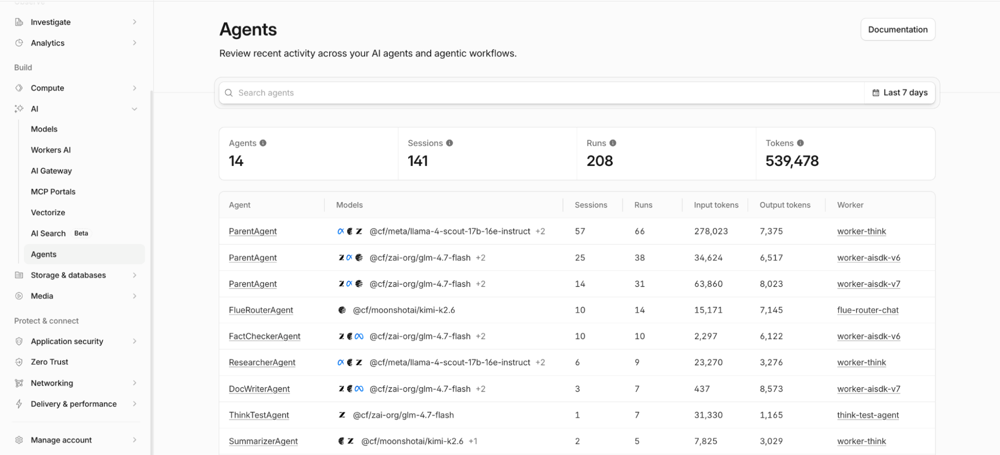
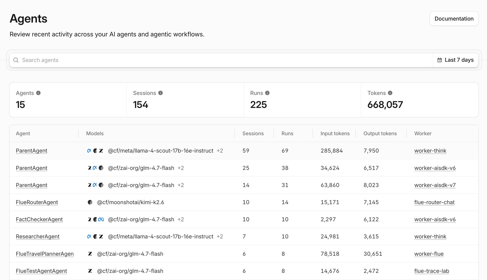
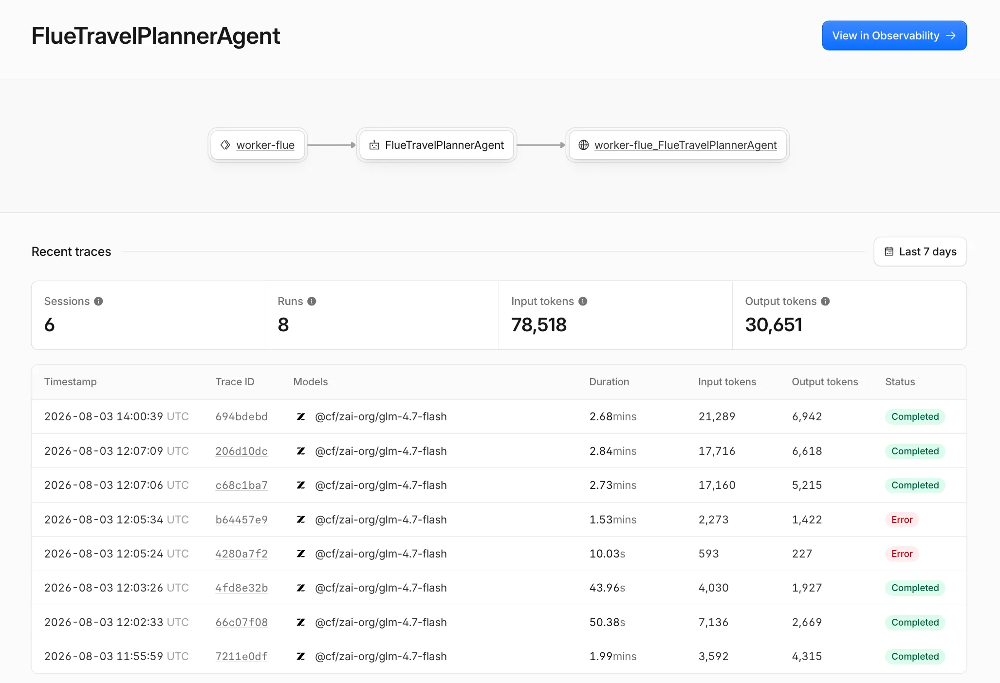
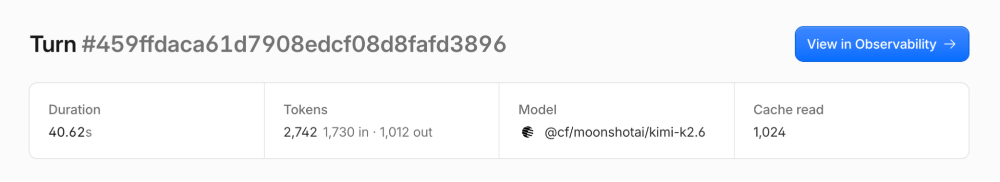
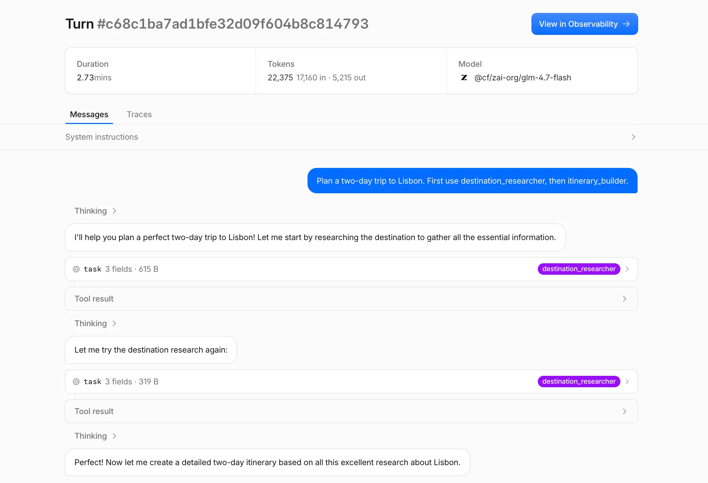
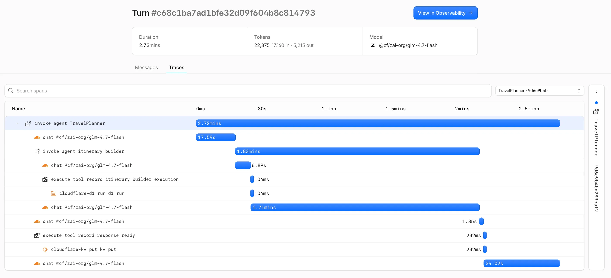

# Cloudflare — Agent Tracing (Agents SDK / Workers Observability)

> **One-liner:** A platform vendor bolting an "Agents" lens onto its existing Workers
> Observability trace pipeline — one day old at research time — whose single genuinely novel
> idea is modeling human-in-the-loop **approvals** as a first-class span type
> (`tool_approval`) inside the OTel-shaped trace tree, something no other competitor in this
> research set does.

**Market position:** Cloudflare is not an LLM-observability vendor; it is the runtime (Workers,
Durable Objects, D1, KV, Workflows) that its own Agents SDK (`agents`, `Think`, `Flue`) is built
on. Agent tracing shipped August 4, 2026 as part of "Agents Week 2026," bundled with a broader
push — `@cloudflare/ci`, local OTel tracing in `wrangler dev`, the "Agent Development Lifecycle"
(ADLC) framing — aimed at agents that write, ship, and operate software on Cloudflare's own stack,
not just chat agents. The buyer is a Workers developer already deployed on Cloudflare; agent
tracing is a retention/expansion feature for that base, not a new product line with its own sales
motion.

**How core is agent tracing to the product?** Additive, not central — and explicitly early.
It is spans layered onto **Workers tracing** (itself in open beta), read through a new **Agents**
tab in the existing Cloudflare dashboard (nested under Build → AI → Agents, alongside Workers AI,
AI Gateway, MCP Portals, Vectorize). There is no separate agent-observability SKU, pricing page,
or signup flow — it inherits Workers Observability's event quota and dashboard. The blog post
announcing it (`agents-on-cloudflare`) frames tracing as "the first piece" of a larger, still
mostly unbuilt "Cloudflare Agents" product (deploy/observe/improve loop) — evaluations, quality
scoring, and self-improvement loops are stated intentions, not shipped features.

---

## Trial & access

| | |
|---|---|
| **Free tier** | Yes. Tracing itself is **entirely free during the beta period**, on any plan. After beta, agent traces share the same metered "observability events" quota as Workers Logs: Workers Free gets 200,000 events/day, 3-day retention. |
| **Free trial** | N/A — Cloudflare has no time-boxed trial; it's a permanent freemium account (Workers Free plan), not a trial that expires. |
| **Credit card required?** | **No** for the free Cloudflare account / Workers Free plan. A card is only required to activate **Workers Paid** ($5/mo minimum), which raises the quota to 20 million events/month (+$0.60 per additional million) and 7-day retention. |
| **Registration URL** | https://dash.cloudflare.com/sign-up |
| **Signup fields** | Standard Cloudflare account signup — email + password (or SSO). No agent- or observability-specific fields; tracing is a config flag on an existing Worker, not a separate product to provision. |
| **Paid entry point** | $5/mo Workers Paid plan minimum. No incremental charge for agent tracing specifically until **October 1, 2026**, when it folds into existing Workers Observability pricing (see below) — same date and same pricing table across the tracing docs and the launch blog post. |
| **Self-serve to the feature?** | Yes — fully self-serve. Set `observability.traces.enabled: true` in `wrangler.jsonc`, redeploy, and traces appear in the dashboard's Agents tab. `Think` and `Flue` need zero additional code; direct AI SDK usage needs one `wrapAISDK()` call. No sales call, no waitlist. |
| **Gotcha** | **Cloudflare's own docs disagree on the Workers Paid quota number.** The agent-tracing page (`agents/.../tracing/`, updated Aug 4 2026) and the launch blog post both say **20 million events/month** included on Workers Paid. The general Workers-tracing page (`workers/observability/traces/`, also "updated" Aug 4 2026) says **10 million**. The Workers pricing page (`workers/platform/pricing/`) agrees with the 20M figure for Workers Logs, which tracing shares a quota with — so 20M is very likely correct and the 10M figure on the general traces page is a stale copy-paste. Worth re-checking before quoting externally. Also: every span — including ones not surfced in the Agents view — counts as one billable event, so a busy agent with many nested tool/infra spans can burn quota faster than the visible span count suggests. |

---

## Sources

| # | Source | Type | Why it's useful / what to extract |
|---|---|---|---|
| 1 | [Changelog: Agent traces for Think, Flue, and AI SDK](https://developers.cloudflare.com/changelog/post/2026-08-04-agent-tracing/) | Changelog | The Aug 4, 2026 launch entry. Confirms the exact `wrapAISDK()` code sample, the wrangler config flag, and the "Agents tab" dashboard entry point (`dash.cloudflare.com/?to=/:account/agents`). Good for exact dates and the literal enable-tracing snippet. |
| 2 | [Agent tracing docs](https://developers.cloudflare.com/agents/runtime/operations/observability/tracing/) | Docs (primary) | **The single most important source.** Defines session/turn precisely ("A session is a conversation made up of one or more turns. A turn is one request to an agent and its response"), the exact trace-span tree (`invoke_agent` → `chat` / `execute_tool` → `tool_approval`), the three agent-identity fields (name/ID/conversation ID), payload-privacy controls (`storeMessages`/`storeTools`), per-framework setup (Think, Flue, AI SDK v6/v7, custom harness), the `gen_ai.*` attribute mapping table, and the Oct 1, 2026 pricing cutover table. |
| 3 | [Introducing: Cloudflare Agents (blog)](https://blog.cloudflare.com/agents-on-cloudflare/) | Blog (primary) | The launch post (Nevi Shah, Matt Simpson, Fred Schott). Richer prose than the docs on *why* — the six questions agent telemetry should answer ("Did the turn pause for approval?", "Did the agent choose the right tool?"), and a worked example (TravelPlanner → itinerary_builder subagent → D1 → KV) that is the source of every screenshot below. Confirms 20M/month is the correct Workers Paid figure. |
| 4 | [Human-in-the-loop patterns](https://developers.cloudflare.com/agents/concepts/agentic-patterns/human-in-the-loop/) | Docs (primary, predates tracing by 3 weeks) | The underlying approval mechanism the `tool_approval` span traces. Three distinct patterns with different wait horizons: **MCP elicitation** (`configureElicitationHandlers()`, minutes), **Workflow approval** (`waitForApproval()`, months/years, backed by a durable Cloudflare Workflow), and **Code Mode approval** (`requiresApproval: true` on a connector tool, pauses model-generated code before a tool call, resumes via abort-and-replay). Critical nuance for Maple: this is pre-existing SDK functionality that tracing *observes*, not something tracing introduces. |
| 5 | [Diagnostics channels](https://developers.cloudflare.com/agents/runtime/operations/observability/diagnostics-channels/) | Docs | A parallel, lower-level observability surface: `node:diagnostics_channel`-based structured events (`agents:rpc`, `agents:workflow`, `agents:message` incl. `tool:approval`, etc.) with zero overhead when unsubscribed, auto-forwarded to Tail Workers in production. Shows Cloudflare has *two* observability layers (traces for humans in a dashboard; diagnostics channels for programmatic hooks) — worth knowing which one any given "approval" signal comes from. |
| 6 | [Custom spans](https://developers.cloudflare.com/workers/observability/traces/custom-spans/) | Docs | The underlying primitive (`tracing.enterSpan()` / `startActiveSpan()`) used to hand-instrument a custom agent harness into the same `invoke_agent`/`chat`/`execute_tool`/`tool_approval` shape. Confirms spans nest via JS async-context automatically, and platform operations (fetch, KV, D1) auto-nest under whatever custom span is active — this is *how* the D1/KV rows show up nested under `execute_tool` in the waterfall screenshot. |
| 7 | [Exporting OpenTelemetry Data](https://developers.cloudflare.com/workers/observability/exporting-opentelemetry-data/) | Docs | Confirms agent traces are real OTel: exportable via OTLP/HTTP (JSON only — **no binary protobuf support**) to Honeycomb, Grafana Cloud, Axiom, Datadog, New Relic, Sentry, Splunk, etc., configured as dashboard "destinations" wired into `wrangler.jsonc`. `persist: false` lets you use Cloudflare purely as a forwarder without paying for dashboard storage. |
| 8 | [Workers Traces overview](https://developers.cloudflare.com/workers/observability/traces/) | Docs | The general (non-agent) tracing product agent traces ride on. Confirms zero-code automatic instrumentation of fetch/binding/handler calls, head-based sampling (`head_sampling_rate`), and that OTel API support *inside* Workers (so arbitrary OTel-emitting libraries "just work") is roadmap, not shipped — Cloudflare's custom-span API is still the only way in today. |

---

## Screenshots

All six are stock examples from Cloudflare's own docs/blog (same underlying demo data: a
`TravelPlanner` agent delegating to an `itinerary_builder` subagent, and a 15-agent fleet
overview). No screenshot of an actual rendered `tool_approval` span was found anywhere in
Cloudflare's current public materials — see the callout after screenshot 6.

### 1. Where "Agents" lives in the dashboard IA


- Left nav: **Observe** (Investigate, Analytics) sits above **Build**, under which **AI** expands
  to `Models · Workers AI · AI Gateway · MCP Portals · Vectorize · AI Search (Beta) · Agents`.
  Agents is filed as an **AI product**, not under Observe — despite being an observability
  feature. Worth noting: Cloudflare chose to co-locate it with Workers AI/AI Gateway/Vectorize
  rather than with the general trace/log tooling it's technically built on.
- Page header: "Review recent activity across your AI agents and agentic workflows" — explicit
  "agentic workflows" language, not just chat agents.

### 2. Agents overview — the fleet list


- Top stat row: **Agents 15 · Sessions 154 · Runs 225 · Tokens 668,057** for the selected time
  window (`Last 7 days` picker, top right) — four numbers, no cost figure anywhere (Cloudflare
  doesn't compute $ cost the way Datadog/LangSmith do; only raw token counts).
  A search-agents box sits above the stat row.
- Table columns: **Agent · Models · Sessions · Runs · Input tokens · Output tokens · Worker**.
  - **Same agent class name appears multiple times as separate rows** (`ParentAgent` three times,
    each pointing at a different `Worker`: `worker-think`, `worker-aisdk-v6`, `worker-aisdk-v7`).
    The row identity is (agent name × Worker), not agent name alone — i.e. the same logical agent
    deployed via different harnesses/Workers shows up as distinct rows.
  - **Models column stacks provider icons** (Llama, GLM, Kimi icon glyphs) plus the primary model
    ID and a `+2` overflow badge when a session used more than one model.
  - **Worker column links out** to the underlying Worker (`worker-think`, `flue-router-chat`,
    etc.) — the agent view is explicitly a lens over Worker-scoped infrastructure, not an
    independent resource.

### 3. Single-agent detail — breadcrumb + recent traces


- **Breadcrumb graph at the top**: `worker-flue → FlueTravelPlannerAgent →
  worker-flue_FlueTravelPlannerAgent`, three connected pill nodes (Worker icon, agent-box icon,
  globe icon) showing Worker → agent class → the synthesized service identity used elsewhere in
  Workers Observability. This is the join key back into the general trace store.
- **View in Observability** button (top right, blue, prominent) — the explicit escape hatch from
  the curated Agents view into the raw underlying Worker trace, confirming the "lens over a
  general trace store" architecture the whole doc set describes.
- Recent-traces table columns: **Timestamp · Trace ID (short hash, linked) · Models · Duration ·
  Input tokens · Output tokens · Status**. Status is a colored pill: `Completed` (green) /
  `Error` (red) — binary, no partial/warning state visible.
- Durations shown as `2.68mins`, `10.03s`, `43.96s` — mixed units, not normalized to one scale.

### 4. Turn detail — stat bar with a "Cache read" metric


- A different example (Kimi model, `worker-think`) than the TravelPlanner one, useful because it
  surfaces a stat the other screenshots don't: **Cache read: 1,024** as a fourth stat tile next to
  Duration / Tokens / Model. Confirms prompt-cache token accounting is tracked per turn, at least
  for providers that report it — genuinely useful for cost debugging and not something every
  competitor in this set surfaces at the turn level.
- Title format: `Turn #<32-hex-char-id>` — turns get their own long opaque ID, distinct from the
  trace ID shown in the fleet list.

### 5. Session replay — the Messages tab


- Two tabs at turn-detail level: **Messages | Traces** — the "two ways to follow what an agent
  did" the docs describe (session replay vs. trace waterfall) are literally two tabs on the same
  page, not separate top-level views.
- Renders as a **chat transcript**, not a span list: user message in a blue bubble (right-aligned),
  then a chevron-collapsible **`Thinking`** disclosure, then the model's visible response in a
  plain bubble, then **tool calls rendered as their own rows** (`⚙ task · 3 fields · 615 B`) with
  the tool name as a purple pill badge on the right (`destination_researcher`), followed by a
  collapsed **`Tool result`** row.
- The example shows the agent **retrying the same tool call after an apparent failure**
  ("Let me try the destination research again:" → calls `destination_researcher` a second time)
  — visible directly in the transcript flow, no special retry annotation needed because the retry
  is just two consecutive tool-call rows with the model's own narration between them.
- Collapsible **System instructions** row at the very top, collapsed by default.

### 6. Trace waterfall — the Traces tab


- Standard indented waterfall, but the **row icon encodes span type**: a boxed-agent glyph for
  `invoke_agent`, a cloud glyph for `chat`, a tool-box glyph for `execute_tool`, a document glyph
  for `cloudflare-d1`, a bracket glyph for `cloudflare-kv`. Six distinct icons for six span kinds
  in one tree, all in the same blue duration-bar color (no color-coding by kind, unlike Datadog).
- **Subagent nesting is literal `invoke_agent` recursion**: `invoke_agent TravelPlanner` (2.72min)
  contains `invoke_agent itinerary_builder` (1.83min) as a direct child, which itself contains its
  own `chat` and `execute_tool` children. Same span *type* at every depth — there's no separate
  "subagent" span kind, just another `invoke_agent`.
  - Cloudflare's own infra spans (`cloudflare-d1 run d1_run`, `cloudflare-kv put kv_put`) nest
    **under** the `execute_tool` span that triggered them, not as siblings — proving the claim
    that platform instrumentation and agent instrumentation share one async-context tree
    automatically, with no manual span-linking code.
- A `Search spans` box sits above the tree, and a right-hand rail shows a breadcrumb
  (`TravelPlanner — 9d6e9b4ba2289caf2`) — the trace/session identifier, collapsible.
- **No `tool_approval` span appears in this particular example trace** (it's a happy-path run
  with no HITL gate). This is the gap flagged below.

### Gap: no visual of an approval span in the wild

Every primary source (changelog, tracing docs, launch blog) describes the `tool_approval` span
only via a **text-only ASCII tree**:

```
invoke_agent {agent class}
├── chat {model}
└── execute_tool {tool}
    └── tool_approval {tool}
```

No screenshot in the docs, blog, or dashboard-nav capture shows this span actually rendered in
the waterfall UI — how it's colored, whether it blocks the timeline visually, what it looks like
mid-wait vs. resolved, or how a *rejected* approval renders differently from an *approved* one.
This is the single biggest documentation gap for the one feature Maple cares most about, and it's
consistent with the feature being one day old — worth re-checking this page in a few weeks.

---

## Feature anatomy (spec-ready notes)

**Hierarchy, exact definitions (from the tracing docs, verbatim):**
- **Session** — "a conversation made up of one or more turns."
- **Turn** — "one request to an agent and its response." One turn = one trace.
- **Run** — a fleet-level rollup metric (shown per-agent in the overview: `Runs: 225`), not
  formally defined in prose anywhere in the docs. Behaviorally it appears to count tool/subagent
  *executions* rather than turns — the FlueTravelPlannerAgent example shows 6 sessions but 8 runs,
  consistent with "runs" counting something more granular than turns. **Not precisely specified
  in any primary source** — flag this as an open question if Maple wants to borrow the term.
- **Trace** — the OTel trace for one turn; root span is always `invoke_agent`.

**Span tree, exact shape:**
```
invoke_agent {agent class}      ← one per turn (or per subagent invocation, nested)
├── chat {model}                ← one per model call
└── execute_tool {tool}         ← one per tool execution
    └── tool_approval {tool}    ← present only when that tool call needed approval
```
Subagent calls are just another nested `invoke_agent` — no distinct span kind for "subagent."
Cloudflare's own infra spans (fetch, KV, D1, Durable Object, service-binding) nest automatically
under whichever `execute_tool` triggered them, via JS async-context — zero manual linking.

**Approvals — the mechanism vs. the trace.** Three separate HITL patterns exist in the SDK
(predating tracing by ~3 weeks), each traced the same way but with very different semantics:
1. **MCP elicitation** — `configureElicitationHandlers()`, agent-as-MCP-client, minutes-scale wait.
2. **Workflow approval** — `waitForApproval()`, backed by a durable Cloudflare Workflow, can wait
   months/years without keeping the agent running; supports timeout + scheduled escalation
   reminders + SQL-backed audit trail + multi-approver quorum, all shown as code patterns in docs.
3. **Code Mode approval** — `requiresApproval: true` on a connector tool method; pauses
   model-*generated* code before a tool call executes, resumes via "abort and replay" (previously
   completed calls replay from a durable log, only the newly-approved call actually executes).

Critically: **the `tool_approval` span does not measure human wait time.** Docs explicitly warn:
"Approval spans represent lifecycle events within a Worker invocation. They do not measure the
time a person waits before responding across invocations." Since Workflow-based approvals can
legitimately wait months, the span models the *pause/resume boundary within one invocation*, not
wall-clock wait — an important distinction if Maple ever traces cross-invocation human waits.

**Instrumentation, by framework:**
- **Think, Flue (v2+)** — fully automatic, zero setup, emit the standard span tree out of the box.
  Payload capture is off by default; opt in via `storeMessages`/`storeTools` (Think: override
  properties on the agent class; Flue: `content: false` to opt *out* since Flue defaults to on).
- **AI SDK v6/v7** — one-time `wrapAISDK(ai)` from `agents/observability/ai`. Instruments
  `generateText`, `streamText`, `generateObject`, `streamObject`. No implicit agent identity (no
  Agent instance to infer it from) — must be supplied per-call via `runtimeContext` (v7) or
  `experimental_telemetry.metadata` (v6), mapped to `gen_ai.agent.name` / `gen_ai.agent.id` /
  `gen_ai.conversation.id`. Extra scalar context lands in a `cloudflare.agents.*` attribute
  namespace, queryable but not part of the modeled dashboard identity.
- **Custom harness** — Workers custom-spans API (`tracing.enterSpan`/`startActiveSpan`), manually
  emitting the same four span names + `gen_ai.*` attributes, following the OTel GenAI semconv
  reference implementations. Explicitly stated: **Workers does not yet support the OpenTelemetry
  API directly** — you cannot just drop in an OTel-instrumented library and have it work; Cloudflare
  is "working to add support."

**Is it OTel underneath? Can you export it?** Yes, unambiguously. Span attributes follow the OTel
Generative AI semantic conventions. Any OTLP-consuming tool can read them. Export is configured as
a dashboard "destination" (OTLP/HTTP JSON only, no binary protobuf) wired into
`observability.traces.destinations` in `wrangler.jsonc`, with independent `head_sampling_rate` and
a `persist: false` flag to skip Cloudflare-side storage entirely and use a third party as the sole
store. Pre-built destination docs exist for Honeycomb, Grafana Cloud, Axiom, Datadog, New Relic,
Sentry, Splunk (both Observability Cloud and Enterprise), Firetiger, PostHog (logs only).

**Rides on general Workers Observability, not a separate backend.** Confirmed explicitly and
repeatedly: "Agent traces are built on Workers tracing, so pricing is straightforward." The Agents
view is described as showing a curated subset of "your agent's operations," with a **"View in
Observability"** button on every agent/turn page to jump to the full underlying Worker trace,
which includes SDK-internal and other Worker-level spans not surfaced in the curated view. Every
span — visible in the Agents view or not — counts as one billable observability event. This is
structurally the same bet as Maple's: one trace store, an agent-shaped view layered on top, with
an explicit door back to the raw data.

**Pricing mechanics.** Free during beta (any plan) until **October 1, 2026**, then folds into
existing Workers Observability tiers: Workers Free = 200,000 events/day, 3-day retention; Workers
Paid = 20 million events/month included + $0.60/million additional, 7-day retention. No agent- or
LLM-specific SKU, no per-span or per-token pricing distinct from ordinary trace/log events.

---

## Ideas worth stealing for Maple

1. **Model approvals as a first-class span type (`tool_approval`), nested under the tool-call
   span it gates.** The single most novel idea in this research set — no other competitor traces
   human-in-the-loop gates at all. Maple should decide now, before shipping, whether an approval
   is a span (start = request created, end = resolved) vs. an event/attribute on the tool span —
   Cloudflare's choice to make it a full child span, separate from `execute_tool`, is worth
   copying since it lets the waterfall show the wait distinctly from the tool's own execution time.
2. **Explicit "does not measure cross-invocation wait" caveat.** If Maple's approvals can span
   arbitrarily long human wait times (Slack approval, email, etc.), decide up front how the trace
   models a pause that outlives one request/invocation — don't let span duration silently conflate
   "agent was working" with "a human was asleep."
3. **The "View in Observability" escape hatch from curated agent view → raw trace store**, on
   every agent and turn page. Cheap to build, and it's the honest acknowledgment that the agent
   view is a lens, not the source of truth — directly reusable for Maple's "agentic journeys as a
   view over ordinary OTel spans" architecture.
4. **Session replay as a literal chat transcript (Messages tab), separate from the waterfall
   (Traces tab), as two tabs on the same page rather than two separate top-level views.** Cheaper
   to ship than Datadog's three-tab renderer and validates that "conversation view" and "execution
   view" are the two things users actually want, nothing more.
5. **Tool-call retries rendered inline in the transcript with no special UI** — just two
   consecutive tool-call rows with the model's own narration between them ("Let me try again").
   Zero extra engineering; worth confirming Maple's transcript renderer doesn't need bespoke
   "retry" chrome to make retries legible.
6. **Precise, quotable definitions for session/turn** ("a session is a conversation made up of one
   or more turns; a turn is one request to an agent and its response") — Maple should write
   equally crisp one-sentence definitions for its own hierarchy terms before shipping, since loose
   terminology here is exactly what makes cross-tool comparison (and internal alignment) hard.
7. **Cache-read tokens as a dedicated stat-bar tile**, not buried in a token breakdown. Small,
   cheap, and useful for cost debugging with prompt-caching providers.
8. **Explicit non-goal: no dollar-cost figure anywhere in the UI**, only token counts. Worth
   noting as a real design decision (not an oversight) if Maple is weighing whether cost
   normalization across providers/models is worth the complexity Datadog/Braintrust take on.

## What to skip / deprioritize

- **Don't copy the "runs" metric as-is** — it's shown prominently (fleet overview, per-agent
  stats) but never precisely defined in any primary source, and its relationship to turns/sessions
  has to be reverse-engineered from example numbers. Define your own term precisely instead of
  inheriting an ambiguous one.
- **Don't expect OTel-library plug-and-play yet.** Workers doesn't support the OpenTelemetry API
  directly — any framework not named Think/Flue/AI SDK needs hand-written custom spans today.
  This is a real limitation, not a stealable pattern; note it as "still thin" rather than a target.
- **AI Gateway is a separate, older Cloudflare product** (LLM request proxying/caching/analytics)
  and is **not** the vehicle for this feature — don't conflate the two when briefing others on
  what shipped. Agent tracing lives entirely in the Agents SDK + Workers Observability stack.
- **The "Agent Development Lifecycle" (ADLC) framing and `@cloudflare/ci`** are adjacent Agents
  Week announcements (agents that build/ship/operate *software*, i.e. coding agents), not part of
  the agent-tracing feature itself — interesting strategic context, not something to spec against.
- **Local dev tracing (`wrangler dev` / Vite plugin auto-capturing traces for a coding agent to
  query via a "Local Explorer API")** is a real, separate Aug 4 announcement (see
  [blog.cloudflare.com/local-tracing](https://blog.cloudflare.com/local-tracing/)) aimed at coding
  assistants debugging Workers locally, not at observing production AI agents — out of scope for
  this comparison, flagged here only so it isn't confused with agent tracing in a later pass.

---

## Screenshot sources

| File | Found on | Direct image URL |
|---|---|---|
| `agent-overview.webp` | [Tracing (Cloudflare Agents docs)](https://developers.cloudflare.com/agents/runtime/operations/observability/tracing/) | `https://developers.cloudflare.com/_astro/agent_overview.DekdbJSd_1RMXSK.webp` |
| `agent-session-replay.webp` | [Tracing (Cloudflare Agents docs)](https://developers.cloudflare.com/agents/runtime/operations/observability/tracing/) | `https://developers.cloudflare.com/_astro/agent_tracing_session_replay.uwseMu6e_Z1pWUbk.webp` |
| `agent-turn-view.webp` | [Tracing (Cloudflare Agents docs)](https://developers.cloudflare.com/agents/runtime/operations/observability/tracing/) | `https://developers.cloudflare.com/_astro/agent_tracing_turn_view.BtpgP9sq_Zg9b61.webp` |
| `agent-waterfall.webp` | [Tracing (Cloudflare Agents docs)](https://developers.cloudflare.com/agents/runtime/operations/observability/tracing/) | `https://developers.cloudflare.com/_astro/agent_tracing_waterfall.Bw-JYiiV_Z1vq2no.webp` |
| `agents-dashboard-nav.png` | [Introducing: Cloudflare Agents](https://blog.cloudflare.com/agents-on-cloudflare/) | `https://blog.cloudflare.com/_emdash/api/media/file/01KZ4WGY57CW84GJ75GZSS8RBE.png` |
| `turn-cache-read-stat.png` | [Introducing: Cloudflare Agents](https://blog.cloudflare.com/agents-on-cloudflare/) | `https://blog.cloudflare.com/_emdash/api/media/file/01KZ4WGXX79HX11A7GKFY8M06B.png` |

All 6 files verified by byte-exact `Content-Length` match against the candidate remote image. The
four `.webp` files came from the tracing docs page itself (their alt text matches the doc's own
screenshot captions verbatim); the two `.png` files came from inline screenshots in the launch blog
post that aren't part of its four labeled "story" images.

---

*Researched 2026-08-05. Screenshots pulled from Cloudflare's public docs and blog for internal
competitive research; do not redistribute.*
