# Comet Opik — Open Source LLM Evaluation & Observability

> **One-liner:** Comet's Apache-2.0, "no feature flags" open-source LLM platform — tracing, evals,
> prompt management, and agent optimization in one self-hostable codebase — whose most developed
> agent-specific surface isn't the graph, it's **Threads**: a first-class, materialized multi-turn
> conversation entity with its own status, aggregates, and feedback scores, sitting one layer above
> the trace.

**Market position:** Comet ML has sold ML-experiment tracking (metrics, model registry, artifacts)
to ML teams since 2017; Opik is their 2024 pivot into LLM/agent observability, built as a genuinely
separate open-source product (own repo, own docs, own pricing) rather than a bolt-on to the
experiment tracker. The positioning is explicitly more permissive than Langfuse's: self-hosting Opik
gets **the entire product** — tracing, agent graphs, online evaluation, prompt playground, agent
optimization studio — the only thing missing is multi-user org management (RBAC, SSO, SCIM, service
accounts), which is cloud/Enterprise-only regardless of deployment. Langfuse draws its OSS/EE line in
roughly the same place (compliance features gated, product features free), but Opik's marketing
leans harder into "same codebase, no flags" as a differentiator against Langfuse's separate
`LANGFUSE_EE_LICENSE_KEY`-gated build. Comet is privately held; Opik's GitHub repo has ~21k stars
(1,674 forks) as of this research, smaller than Langfuse's ~24k but growing fast off the same
LangChain/LangGraph/ADK ecosystem.

**How core is agent tracing to the product?** Core and clearly a current investment priority, but
architecturally opinionated in a way neither Datadog nor Langfuse are: **Opik's agent graph is
declared, not inferred.** For LangGraph it is literally LangGraph's own `graph.draw_mermaid()`
output; for Google ADK it's a Mermaid string Opik's own SDK builds by walking the ADK agent-object
tree; for anything else you hand-author a Mermaid string yourself and drop it into trace metadata.
There is no span-timing/nesting-based graph inference like Langfuse's Agent Graphs. This is a
deliberate trade-off: zero graph-layout engineering on Opik's side, in exchange for the graph only
existing for frameworks Opik has explicit adapters for (or that you instrument by hand). The other
pole of the product — Threads — is fully generic and framework-agnostic (any span tagged with a
`thread_id` groups into one), and it's clearly the more mature, more heavily invested-in surface.

---

## Trial & access

| | |
|---|---|
| **Free tier** | Yes, two forms: (1) **OSS self-host** — Apache-2.0, unlimited spans/traces, unlimited retention, forever free, full feature set except multi-user org management. (2) **Free Cloud** — $0/mo, up to 10 team members, 25,000 spans/month, 60-day data retention. |
| **Free trial** | Pro Cloud ($19/mo tier) is offered via a "Start Free Trial" CTA on the pricing page; exact trial length is not stated on the page itself — treat as unconfirmed, not zero. |
| **Credit card required?** | **No** for OSS or Free Cloud — the signup form has no payment field at all (see below). Not directly confirmed for the Pro trial specifically. |
| **Registration URL** | https://www.comet.com/signup (redirects to the account-creation form) |
| **Signup fields** | Email, Username, Password — or one-click OAuth via **Google**, **GitHub**, or **SSO (Enterprise)**. Optional "keep me in the loop" marketing checkbox. No company name, phone, or job title required. |
| **Paid entry point** | Pro Cloud, **$19/mo**: up to 50 team members, 100k spans/month, 60-day retention, +$5/100k additional spans, +$29/100k additional retention. |
| **Self-hosting story** | **Apache-2.0**, no separate enterprise-licensed build. `git clone` + `./opik.sh` (Docker Compose) for local/eval use, or a Helm/Kubernetes chart for production. Per Opik's own self-host docs: self-hosting gets "all Opik features including tracing, evaluation, etc" — the one explicit carve-out is **user management** (RBAC, SSO, SCIM, service accounts, view-only users), which the pricing page confirms is Enterprise-only regardless of where you deploy. |
| **Gotchas** | The Docker Compose local install is explicitly flagged "not production-ready" — Kubernetes is the prescribed prod path. **OpikAssist / "Ollie"** (Opik's built-in AI debugging copilot — reads traces, builds test suites, runs experiments from chat) is **cloud-only**, not available in OSS self-host at all (row shows `—` for OSS on the pricing comparison). |

---

## Sources

| # | Source | Type | Why it's useful / what to extract |
|---|---|---|---|
| 1 | [Log conversations](https://www.comet.com/docs/opik/tracing/advanced/log_chat_conversations) | Docs | **The Threads data model, verbatim.** `thread_id` is a user-defined string, unique per project, set as a span/trace attribute; all traces sharing it group into one thread. Documents the **15-minute cooldown period** before thread-level online eval runs (`OPIK_TRACE_THREAD_TIMEOUT_TO_MARK_AS_INACTIVE` self-hosted / workspace setting on cloud), and the exact behavior when a new trace lands in an already-scored thread (existing scores preserved, cooldown timer restarts, re-scored on expiry, same-named scores overwritten). |
| 2 | [Online Evaluation rules](https://www.comet.com/docs/opik/v1/production/rules) | Docs | **The rule-config UI and thread-eval mechanics, verbatim.** Rule fields: Name, Sampling rate, Model, Prompt (mustache `{{variable}}` syntax), Variable mapping, Score definition (via structured outputs). Built-in trace-level judges: Hallucination, Moderation, Answer Relevance. Built-in **thread-level** judges: Conversation Coherence, User Frustration — these receive only one variable, `{{context}}`, a full role/content message array. Documents the "run on historical data" flow: select rows in Traces/Threads tab → click the toolbar icon → pick a rule to backfill. |
| 3 | [Log Agent Graphs](https://www.comet.com/docs/opik/tracing/advanced/log_agent_graphs) | Docs | **Confirms the graph is declared, not inferred**, for all three paths: LangGraph (`OpikTracer(graph=app.get_graph(xray=True))`), Google ADK (automatic, no config), and manual (write a Mermaid string into `trace metadata["_opik_graph_definition"] = {"format": "mermaid", "data": "..."}`). |
| 4 | [OpenTelemetry Python SDK](https://www.comet.com/docs/opik/integrations/opentelemetry-python-sdk) | Docs | **The OTLP ingest contract.** Endpoint `https://www.comet.com/opik/api/v1/private/otel/v1/traces` (self-hosted: `http://<instance>/api/v1/private/otel/v1/traces`), auth via `Authorization` + `Comet-Workspace` + `projectName` OTLP headers. Shows raw `gen_ai.*` semconv attributes lighting up the LLM span UI directly, plus the `thread_id` span attribute for thread grouping and the `opik.trace_id`/`opik.parent_span_id`/`OpikSpanProcessor` mechanism for stitching an OTel subtree onto an existing Opik-SDK trace. |
| 5 | [`comet-ml/opik` — `apps/opik-backend/.../domain/mapping/otel/`](https://github.com/comet-ml/opik/tree/main/apps/opik-backend/src/main/java/com/comet/opik/domain/mapping/otel) | Repo (source) | **The actual OTel attribute-mapping rule tables**, one Java class per vendor: `GenAIMappingRules`, `OpenInferenceMappingRules`, `LangFuseMappingRules` (!), `LiteLLMMappingRules`, `LogfireMappingRules`, `PydanticMappingRules`, `SmolagentsMappingRules`, `LiveKitMappingRules`, `ClaudeCodeMappingRules`, `GeneralMappingRules`. `OpenTelemetryMappingRuleFactory` concatenates them into one priority-ordered list (Logfire → GenAI → OpenInference → LiveKit → Pydantic → LiteLLM → General → Smolagents → LangFuse) and takes the **first match**. Full exact-key list reproduced in Feature anatomy below. |
| 6 | [`comet-ml/opik` — `AgentGraphTab.tsx`](https://github.com/comet-ml/opik/blob/main/apps/opik-frontend/src/v2/pages-shared/traces/TraceDetailsPanel/TraceDataViewer/AgentGraphTab.tsx) + [`mermaid_graph_builder.py`](https://github.com/comet-ml/opik/blob/main/sdks/python/src/opik/integrations/adk/graph/mermaid_graph_builder.py) | Repo (source) | **Proof the graph tab is a literal Mermaid renderer**, not a graph-layout engine: `AgentGraphTab.tsx` is an 18-line component that hands `data.data` straight to a generic `MermaidDiagram` component. `mermaid_graph_builder.py` walks a Google ADK agent tree and emits `flowchart LR` Mermaid text with **hardcoded per-node-type `style` colors** (`LLM_AGENT` → light blue `#b3e0ff`, `TOOL` → orange `#ffcc99`, `SEQUENTIAL_AGENT` → green, `LOOP_AGENT` → purple, `PARALLEL_AGENT` → red) — exactly the palette visible in the ADK screenshot below. |
| 7 | [`comet-ml/opik` — `SpanType.java`](https://github.com/comet-ml/opik/blob/main/apps/opik-backend/src/main/java/com/comet/opik/domain/SpanType.java) + [`TraceThreadModel.java`](https://github.com/comet-ml/opik/blob/main/apps/opik-backend/src/main/java/com/comet/opik/domain/threads/TraceThreadModel.java) | Repo (source) | **The two data-model facts that don't show up in the docs.** `SpanType` is a 4-value enum — `general`, `tool`, `llm`, `guardrail` — there is **no `agent` span kind** at the data-model level; "agent" only exists inside the declared Mermaid graph, not as queryable span metadata. `TraceThreadModel` is a materialized record (its own table, not a virtual grouping) with `status` (ACTIVE/INACTIVE), `tags`, `sampling` (per-rule sampled-or-not map), `startTime`/`endTime`/`duration`, `feedbackScores`, `firstMessage`/`lastMessage`, `numberOfMessages` — i.e., every thread-list column and stat tile is a precomputed field on this record, not a live aggregation. |
| 8 | [Pricing](https://www.comet.com/site/pricing/) / [Self-host overview](https://www.comet.com/docs/opik/self-host/overview) | Marketing/Docs | Exact tier limits and the full OSS-vs-Free-vs-Pro-vs-Enterprise feature comparison grid — confirms Agent Execution Graphs, Sessions/Threads, and OpenTelemetry Integration are checked in **every** tier including OSS, while RBAC/SSO/SCIM/service-accounts/OpikAssist are Enterprise-or-cloud-only rows. |

---

## Screenshots

### 1. Threads tab — overview stat tiles + list
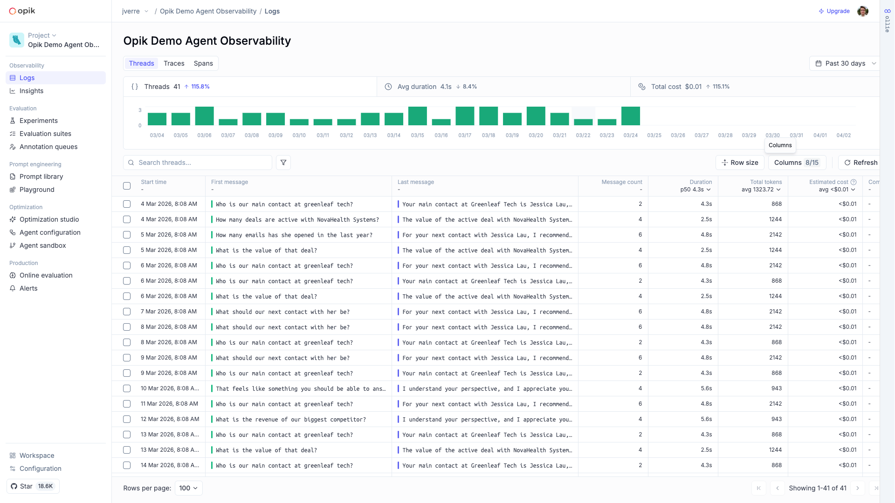

- Three delta-annotated **stat tiles** above the list: `Threads 41 ↑115.8%`, `Avg duration 4.1s ↓8.4%`,
  `Total cost $0.01 ↑115.1%` — each a click-through KPI, not just a label, with a **daily bar histogram**
  underneath (thread count per day, `03/04`–`04/02`, "Past 30 days" range selector top-right).
- List columns: `Start time`, `First message`, `Last message`, `Message count`, `Duration` (column
  header itself shows **p50 4.3s**, sortable), `Total tokens` (header shows **avg 1323.72**),
  `Estimated cost` (**avg <$0.01**), plus a `Com...` (comment count) column cut off on the right.
  Column headers carry live aggregates, not just labels.
- `Threads | Traces | Spans` are three peer tabs on the same project — threads are a first-class nav
  destination, not a filter on the trace list.
- `Row size` and `Columns 8/15` controls — column visibility is user-configurable per view.

### 2. Threads list — feedback-score columns
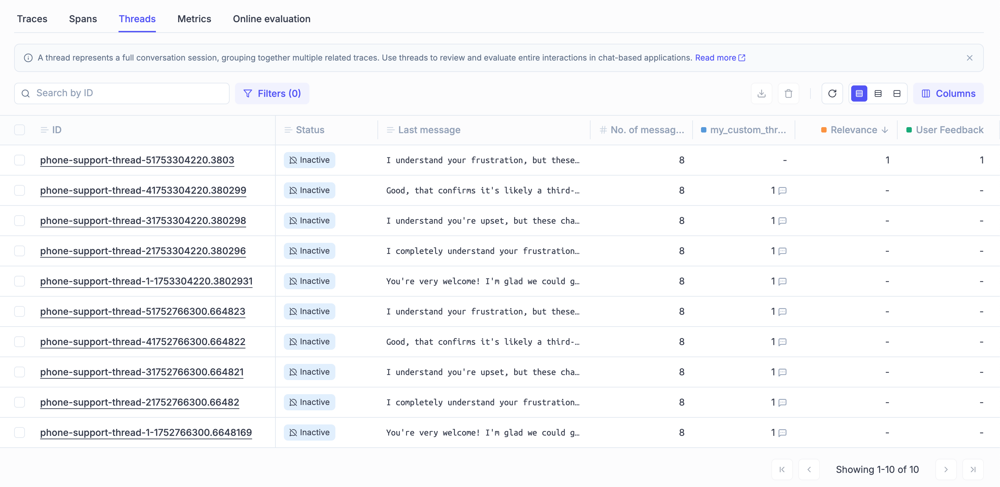

- Confirms feedback scores are **literal sortable/filterable columns** on the thread list: `Relevance`
  (orange dot, numeric, sorted descending via the `↓` arrow next to the header) and `User Feedback`
  (green dot) sit alongside a **custom user-defined column** `my_custom_thr...` — Opik lets you promote
  arbitrary metadata keys to columns, not just built-in fields.
- `Status` column shows `Inactive` pills on every row (post-cooldown state, see screenshot 1's source
  doc) with a crossed-bell icon.
- A dismissible info banner states the thread definition inline: *"A thread represents a full
  conversation session, grouping together multiple related traces."*
- Blank cells render as `-` (no score yet) — makes partially-scored threads visually obvious in the list.

### 3. Thread conversation view — chat replay
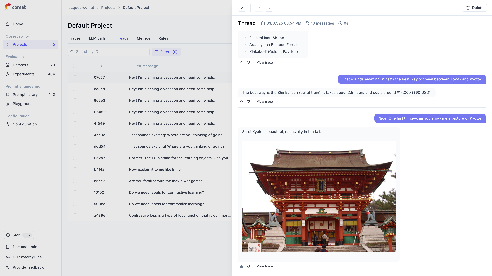

- The thread detail panel renders as a **literal chat transcript**: right-aligned purple bubbles for
  the user turn, left-aligned gray cards for the assistant response — not a span tree. Markdown and
  **inline images** render directly in the transcript (a Kyoto travel-planning example shows a photo
  returned by the assistant rendered full-width inside its response card).
  Header shows `10 messages`, thread start timestamp, and total duration `0s` (aggregated across
  child traces).
  Above the transcript, a **bulleted plan recap** (`Fushimi Inari Shrine`, `Arashiyama Bamboo Forest`,
  `Kinkaku-ji`) shows an earlier assistant turn rendered as a rich list, not raw text.
- Every turn has its own **thumbs up/down** pair plus a **`View trace`** deep-link — one-click drop
  from the conversation level into the exact trace that produced that turn.
- Top toolbar: `X` close, up/down arrows to step between threads, `Delete`.

### 4. Thread feedback scores panel — Human review widget
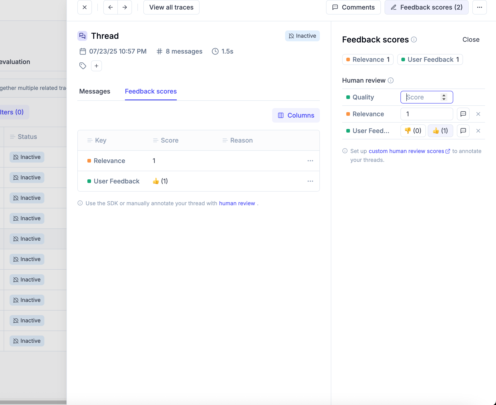

- `Messages | Feedback scores` tabs inside the thread panel; the **Feedback scores** tab shows a
  `Key | Score | Reason` table — here `Relevance: 1` (numeric, from an online-eval rule) and
  `User Feedback: 👍(1)` (categorical/count, from manual thumbs) as two structurally different score
  types living side by side.
- Right-hand **"Human review"** panel is the manual-annotation surface: one row per score dimension
  (`Quality` — empty numeric input, `Relevance` — numeric stepper pre-filled `1`, `User Feed...` — a
  👎/👍 toggle pair with live counts), each with its own comment-bubble icon and an `X` to remove that
  score dimension entirely. A footer link offers to **configure custom human-review score
  definitions** — the score *schema* itself is project-configurable, not fixed to a few hardcoded types.
- Top toolbar exposes `Comments` and `Feedback scores (2)` as **peer toggle buttons with live counts**,
  not buried in a submenu.

### 5. Thread tags + comments
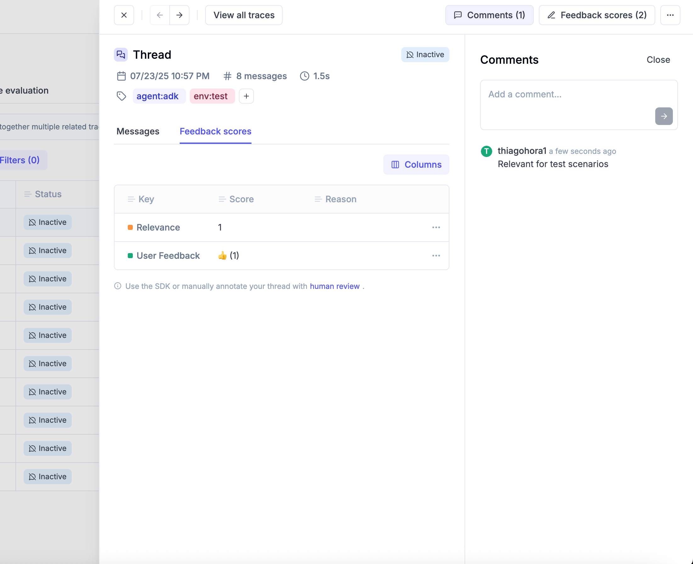

- Tags render as colored pill chips directly under the thread header (`agent:adk`, `env:test`) with a
  `+` affordance to add more — tags are a **first-class thread attribute**, independent of feedback
  scores or comments.
- The **Comments** side panel is a lightweight discussion thread: author avatar/handle
  (`thiagohora1`), relative timestamp (`a few seconds ago`), free-text body (`Relevant for test
  scenarios`) — a separate channel from numeric/categorical scoring, for qualitative note-taking
  during review.

### 6. Trace detail — inline Agent graph pane (custom multi-agent CRM demo)
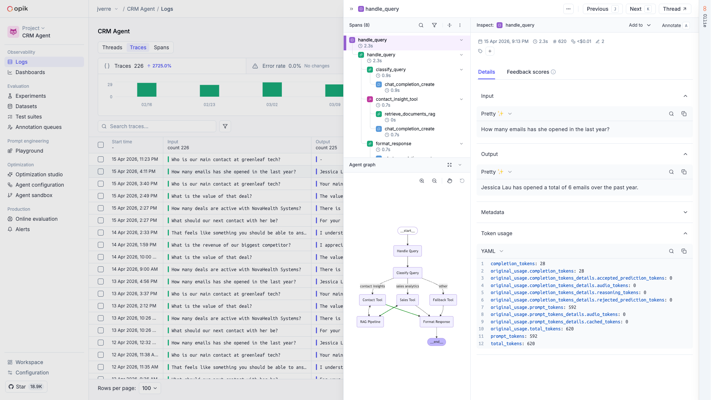

- Layout departs from the tab pattern seen elsewhere: the **Agent graph renders inline, stacked below
  the span tree** in the same left column (with its own zoom/pan/reset controls), not as a separate tab.
  The graph shows `Handle Query → Classify Query → {Contact Tool, Sales Tool, Fallback Tool} → {RAG
  Pipeline, Format Response} → __end__` — fan-out/fan-in with a `__end__` sentinel, confirming this is
  a genuine declared graph (LangGraph- or manually-authored), not a flattened span list.
  A `contact_insight_tool` span nests a `retrieve_documents_rag` child, showing tool spans can
  themselves have children.
- Right panel: `Details | Feedback scores` tabs; Details itself splits into collapsible `Input`,
  `Output`, `Metadata`, and **`Token usage`** sections, the last rendered as a **YAML block** listing
  every raw usage field the provider returned (`completion_tokens`, `original_usage.*` breakdown down
  to `accepted_prediction_tokens`/`rejected_prediction_tokens`/`cached_tokens`) with a `Formatted`/`JSON`-
  style toggle (here: `Pretty ✨` for Input/Output, `YAML` for Token usage) — raw provider payloads are
  preserved and inspectable, not just normalized into `input_tokens`/`output_tokens`.
- Trace header stat row: timestamp, duration `2.3s`, `#620` tokens, `<$0.01` cost, `2` (score count)
  as compact icon+number chips — same "stats above the fold" pattern as Datadog/Langfuse.

### 7. Agent Graph as a dedicated tab (LangGraph)
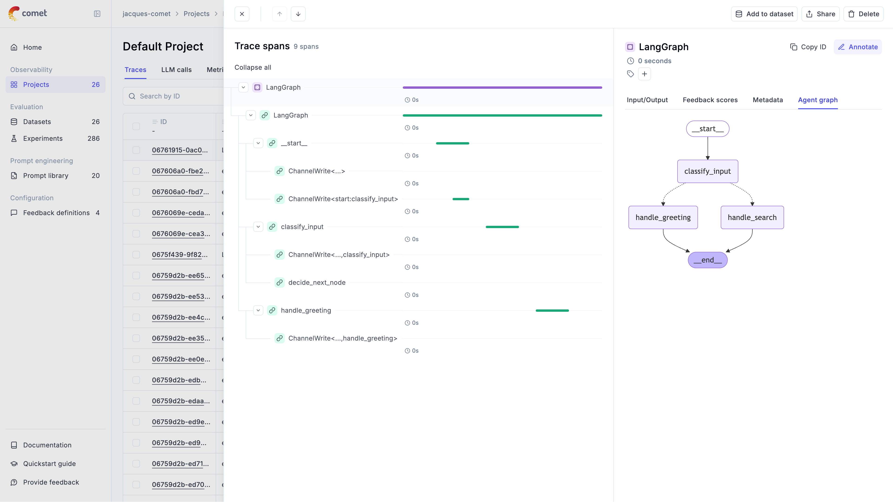

- Here the graph *is* a tab (`Input/Output | Feedback scores | Metadata | Agent graph`), contrasting
  with screenshot 6's inline placement — Opik's layout for this varies by trace/version rather than
  being one fixed pattern.
- Graph is unmistakably **LangGraph's own compiled-graph shape**: `__start__` → `classify_input` →
  fan-out to `handle_greeting` / `handle_search` (dashed bidirectional edges, LangGraph's conditional-
  edge convention) → `__end__`. Node names are the LangGraph node function names verbatim.
- Left span tree shows the **actual runtime spans** underneath the same trace — `LangGraph` (root) →
  `LangGraph` (inner) → `__start__` → `ChannelWrite<...>` (LangGraph's internal channel-write spans,
  visible and not filtered out) → `classify_input` → `decide_next_node` → `handle_greeting` → another
  `ChannelWrite<...,handle_greeting>`. This is the clearest evidence in the whole set that **tree and
  graph are two independent renderings of two independent data sources** — the tree is the literal
  execution spans (including LangGraph plumbing spans most products would hide), the graph is the
  framework's declared topology — and they are not derived from one another.
- Trace-level actions top-right: `Add to dataset`, `Share`, `Delete` — dataset promotion is a global
  trace action, not nested in a menu.

### 8. Agent Graph — Google ADK, auto-generated, colored by node type
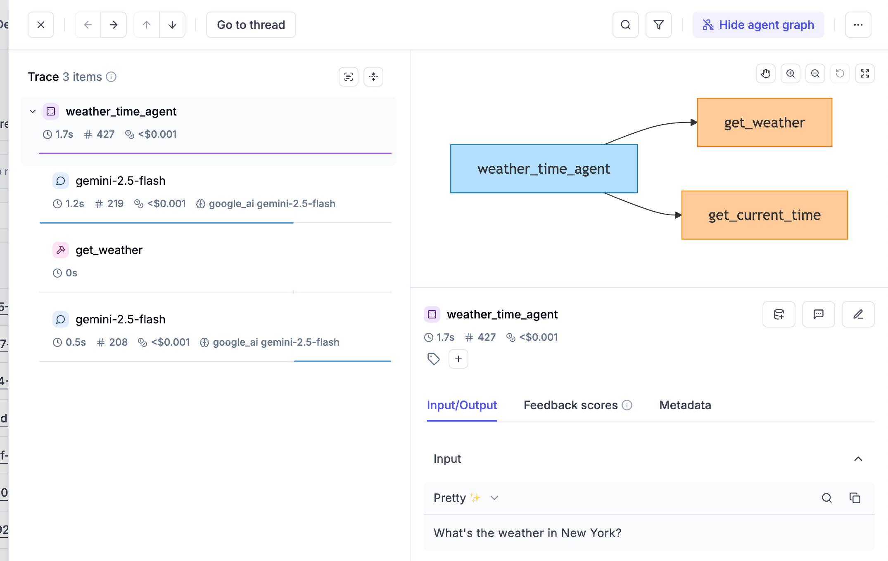

- **No configuration was needed to produce this graph** — Opik's ADK integration walks the ADK agent
  object tree automatically. Graph: `weather_time_agent` (blue box) branches to `get_weather` and
  `get_current_time` (both orange boxes) — matching the hardcoded Mermaid `style` rule
  `LLM_AGENT → #b3e0ff` (blue) / `TOOL → #ffcc99` (orange) found in Opik's own SDK source.
- Span tree on the left shows the matching execution: `weather_time_agent` (root, 1.7s, `#427` tokens,
  `<$0.001`) containing `gemini-2.5-flash` (LLM span, provider chip `google_ai gemini-2.5-flash`),
  `get_weather` (tool span, wrench icon), then a second `gemini-2.5-flash` call — i.e. the LLM calls
  the tool, then calls itself again to synthesize the tool result, visible as two sibling generation
  spans around one tool span.
- Toolbar has a **`Hide agent graph` toggle** (implying the split view is opt-in, collapsible per
  session) plus search/filter icons and a `Go to thread` deep-link — confirming every trace can be
  traced back up to its parent thread from the detail view, mirroring the trace-to-thread jump seen
  in screenshot 3.
- Selected-node detail panel below has `Input/Output | Feedback scores | Metadata` tabs — clicking a
  graph node re-targets the same detail panel used for span selection; graph and tree share one
  inspector.

### 9. Online evaluation — Create rule modal
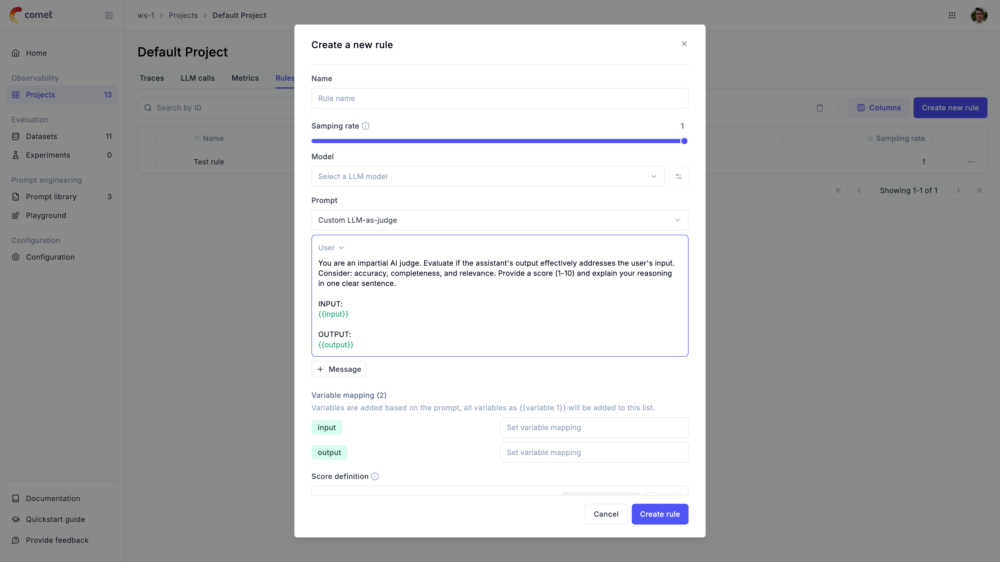

- Full rule-authoring form in one modal: `Name`, `Sampling rate` (slider, 0–1, shown at `1` = 100%),
  `Model` (LLM-as-judge model picker, plus a settings icon for provider config), `Prompt` — defaulting
  to a `Custom LLM-as-judge` template with a visible system-style prompt (*"You are an impartial AI
  judge... Provide a score (1-10)..."*) using `{{input}}`/`{{output}}` mustache placeholders rendered
  as **syntax-highlighted green tokens inline in the textarea**.
- `Variable mapping (2)` section lists every `{{variable}}` found in the prompt (`input`, `output`) as
  chips, each with its own "Set variable mapping" field to bind it to a trace/thread JSON path — the
  prompt author writes generic variable names, the mapping step binds them per-project.
- `+ Message` button implies multi-message (system/user/assistant) prompt construction, not a single
  flat string.
- Rules list behind the modal shows one existing `Test rule` with a `Sampling rate: 1` column —
  rules are scoped per-project and independently toggleable/sampleable.

### 10. Online evaluation — historical backfill trigger
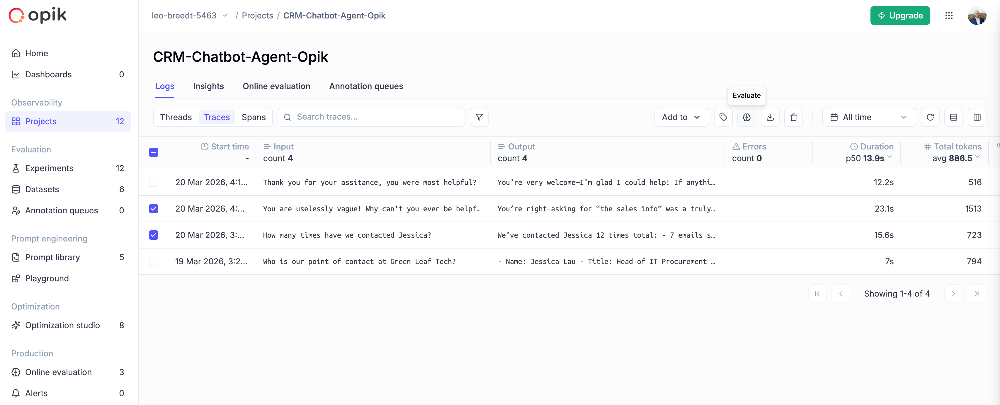

- Project-level tabs: `Logs` (containing `Threads | Traces | Spans` sub-tabs) · `Insights` ·
  `Online evaluation` · `Annotation queues` — online evaluation is a peer top-level project tab, not
  buried under settings.
- Two rows are checkbox-selected; hovering the globe/brain toolbar icon shows an **`Evaluate`**
  tooltip — this is the exact mechanism the docs describe for backfilling a newly created rule against
  already-logged traces: select rows → click the icon → pick which rule to apply.
- List columns double as **live aggregate headers** again: `Input count 4`, `Output count 4`,
  `Errors count 0`, `Duration p50 13.9s`, `Total tokens avg 886.5` — same pattern as the Threads tab.
- An `Upgrade` CTA sits permanently in the top nav on this (Free-tier) workspace, next to the user
  avatar — monetization surface is always one click away, not just on a dedicated billing page.

### 11. Eval scores as trace-list columns (animated)
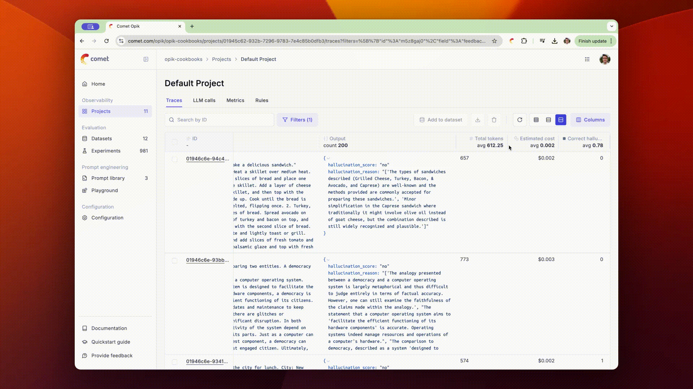

- Confirms eval output lands as **regular sortable/filterable table columns**, not a separate report:
  `Output` (JSON, showing `hallucination_score: "no"` and a free-text `hallucination_reason`
  explanation written by the judge model), `Total tokens` (**avg 612.25** in the header), `Estimated
  cost` (**avg $0.002**), and a custom boolean-ish column (**avg 0.78**) — the judge's structured
  output fields are flattened directly into filterable columns, including the judge's own explanation
  text, not just a numeric score.
- URL bar shows the view is filtered via a `filters=[{"id":...,"field":"feedbac..."}]` query
  parameter — filtering by feedback-score field is a first-class, linkable/shareable URL state.

---

## Feature anatomy (spec-ready notes)

**Data model.** `Project → Thread (optional) → Trace → Span`, plus independent `FeedbackScore`,
`Tag`, and `Comment` entities attachable at trace, span, *or* thread level. `SpanType` is a
deliberately thin 4-value enum — `general`, `tool`, `llm`, `guardrail` — with **no `agent` kind**;
"agent" exists only inside the declared Mermaid graph string, never as queryable span metadata. By
contrast, `Thread` is **fully materialized**: its own backend record (`TraceThreadModel`) with
`status` (`ACTIVE`/`INACTIVE`), `tags`, a per-rule `sampling` map, `startTime`/`endTime`/`duration`,
`feedbackScores`, `firstMessage`/`lastMessage`, and `numberOfMessages` all precomputed and stored —
every stat tile and list column in screenshots 1–2 is reading a stored field, not aggregating on read.

**Ingestion.** Two paths land in the same store: (1) native Python/TypeScript SDK with per-framework
auto-instrumentation (LangChain, LangGraph, ADK, OpenAI Agents SDK, 50+ integrations), or (2) plain
OTLP/HTTP to `POST /api/v1/private/otel/v1/traces` (self-hosted) / the Comet Cloud equivalent, auth
via `Authorization` + `Comet-Workspace` + `projectName` headers. OTLP attributes are resolved by a
**priority-ordered, first-match rule chain** (`OpenTelemetryMappingRuleFactory`, one Java class per
vendor): `Logfire → GenAI (OTel gen_ai.* semconv) → OpenInference → LiveKit → Pydantic → LiteLLM →
General → Smolagents → LangFuse`, with a name-prefix-based Claude Code override layered on top.
Notable exact keys: `gen_ai.usage.` / `gen_ai.input.` / `gen_ai.output.` / `gen_ai.tool.` /
`gen_ai.agent.` prefixes route by prefix; `gen_ai.tool.call.arguments`/`.result` are special-cased
*before* the generic `gen_ai.tool.` prefix so tool spans still get real Input/Output instead of
falling into metadata; both **`gen_ai.conversation.id`** (OTel semconv proper) and the generic
`thread_id` attribute map to the same `THREAD_ID` outcome — i.e. Opik recognizes the standard OTel
GenAI session attribute *and* its own convention. Notably, Opik ships a dedicated `LangFuseMappingRules`
class — it explicitly recognizes at least one Langfuse-native attribute
(`langfuse.observation.completion_start_time`), meaning traces instrumented for a competitor can
partially light up in Opik's UI too.

**Agent graph.** Declared, not inferred — the single biggest architectural difference from Langfuse.
Three sources, same rendering path: (1) LangGraph — `OpikTracer(graph=app.get_graph(xray=True))` calls
LangGraph's own `.draw_mermaid()`; (2) Google ADK — Opik's SDK walks the ADK `BaseAgent` object tree
(`mermaid_graph_builder.build_mermaid_graph_definition`) and emits `flowchart LR` Mermaid text with
hardcoded per-type `style` colors; (3) manual — write your own Mermaid string into
`trace.metadata["_opik_graph_definition"] = {"format": "mermaid", "data": "..."}`. All three land in
the same `AgentGraphData` shape and the frontend (`AgentGraphTab.tsx`) does nothing more than hand the
raw Mermaid string to a generic `MermaidDiagram` renderer inside a pan/zoom container. The graph tab
placement itself is inconsistent across the two trace screenshots captured here (inline pane below
the tree vs. a dedicated tab) — likely a version/UI-revision difference (`v1` vs `v2` frontend trees
both exist in the repo), not a deliberate per-framework choice.

**Views, funnel order.**
1. Threads tab — stat tiles (count/avg-duration/total-cost with deltas) + daily histogram + list with
   live-aggregate column headers, feedback-score columns, custom promoted-metadata columns
2. Thread detail — chat-transcript replay (Messages tab) with inline markdown/images and per-turn
   thumbs + trace deep-link, or Feedback scores tab (Key/Score/Reason table + "Human review" manual
   scoring widget), plus independent Tags and Comments surfaces
3. Trace list — Traces/Spans/Threads as peer tabs, same live-aggregate column pattern, eval outputs
   (including judge free-text reasoning) flattened into filterable/sortable columns
4. Trace detail — span tree (all runtime spans, including framework-internal ones like LangGraph's
   `ChannelWrite<...>`) + Input/Output/Metadata/Feedback-scores/Token-usage(YAML) + optional Agent
   graph (inline or tabbed) sharing one node/span inspector panel
5. Online evaluation — per-project Rules tab (sampling rate, judge model, mustache-templated prompt,
   variable mapping, structured score definition), separate trace-level vs. thread-level rule types
   (thread rules get only a `{{context}}` message-array variable and wait out a 15-min cooldown after
   last activity before scoring), plus a "select rows → Evaluate" backfill action for historical data

**Derived signals.** Feedback scores (numeric, categorical, or thumbs) attachable at span, trace, or
thread granularity, sourced either from online-eval LLM-as-judge rules (built-in: Hallucination,
Moderation, Answer Relevance for traces; Conversation Coherence, User Frustration for threads) or
manual "Human review" annotation. Scores double as first-class list columns and filter facets at
every list level (traces, spans, threads).

---

## Ideas worth stealing for Maple

1. **Thread as a materialized, first-class entity** (own status/tags/aggregates/scores, not a
   query-time GROUP BY over traces). This is the single most directly reusable idea for Maple's
   agentic-journeys work: precompute `firstMessage`/`lastMessage`/`messageCount`/`duration`/
   `feedbackScores` at write time so the thread list and stat tiles are cheap reads, and give threads
   their own `ACTIVE`/`INACTIVE` lifecycle state independent of the traces inside them.
2. **Cooldown period before thread-level scoring** (15 min after last activity, configurable per
   workspace or via env var) — directly solves "don't score a conversation that's still in progress."
   Worth copying almost verbatim, including making it configurable rather than hardcoded.
3. **Declared-graph-via-Mermaid pipeline.** Rendering is nearly free (hand a string to a Mermaid
   component) and the graph is guaranteed structurally correct because the framework (or Opik's own
   ADK tree-walker) computed it — no span-timing heuristics to get wrong. The trade-off (only works
   for frameworks with an adapter, or hand-authored) is honest and explicit rather than hidden; Maple
   should decide up front whether it wants this (cheap, framework-specific) or Langfuse's
   inference-from-nesting approach (framework-agnostic, more engineering), and it's reasonable to ship
   both — declared graph when available, inferred fallback otherwise.
4. **Human review scoring widget**: one row per score dimension, each independently addable/removable,
   mixing numeric steppers and thumbs-style toggles in the same list, each with its own inline comment
   affordance. More flexible than a single fixed "rate this trace 1-5" control.
5. **Tags and Comments as channels independent of feedback scores** — qualitative triage notes
   shouldn't have to be shoehorned into a numeric score just to get persisted and visible in the list view.
6. **"Select rows → Evaluate" historical backfill action.** Creating an online-eval rule shouldn't
   only apply going forward — letting users retroactively run it against already-ingested
   traces/threads turns rule authoring into a data-enrichment tool, not just a monitor.
7. **`gen_ai.conversation.id` as the standard OTel session/thread attribute**, recognized alongside a
   plain `thread_id` fallback — worth adopting the semconv-proper name in Maple's own mapping table
   rather than inventing a bespoke one.
8. **Per-vendor OTel mapping-rule classes with an explicit priority order and a "drop" outcome** for
   attributes that exist only to be consumed internally (`opik.trace_id` etc., dropped before they'd
   otherwise leak into metadata) — clean, extractable shape for Maple's own OTel ingest classifier.
9. **Judge free-text reasoning flattened into a real, filterable list column** (not just the numeric
   score) — `hallucination_reason` sits right next to `hallucination_score` in the trace list.

## What to skip / deprioritize

- **The graph-coloring/subgraph logic is hardcoded per framework** (ADK's `SEQUENTIAL_AGENT`/
  `LOOP_AGENT`/`PARALLEL_AGENT`/`LLM_AGENT`/`TOOL` palette, LangGraph's native node names) — this is
  adapter code, not a generalizable design pattern; don't try to reverse-engineer a "universal" version
  of it.
- **The thin `SpanType` enum (general/tool/llm/guardrail, no `agent`)** is a legitimate design choice
  for Opik but a worse fit for Maple if agent-vs-non-agent needs to be a queryable/filterable
  dimension at the span level — Datadog's 7-kind or Langfuse's 10-type taxonomy are better references
  for that specific need.
- **OpikAssist/Ollie** (AI debugging copilot, test-suite generation, "run your agent" sandbox) is a
  large, cloud-gated, separate product bet — interesting for a future "agent that debugs your agent
  traces" feature, but well outside the scope of shipping agent tracing itself.
- **Agent Optimization Studio** (prompt/tool optimization algorithms) and the **Prompt Playground/
  Library** are adjacent product wings with their own pricing rows — not required to ship the
  trace/thread/graph visualization work Maple is scoping now.
- **Annotation queues** (SME review workflows, `ThreadQueueItemsTab`) are a real feature but a later-
  phase one; the simpler per-thread "Human review" widget (idea #4 above) covers the core need first.

---

## Screenshot sources

| File | Found on | Direct image URL |
|---|---|---|
| `adk-agent-graph.png` | [Log Agent Graphs](https://www.comet.com/docs/opik/tracing/advanced/log_agent_graphs) | `https://fdr-prod-docs-files-public.s3.us-east-1.amazonaws.com/opik.docs.buildwithfern.com/b60f4a7e77a1d76194a3f93513c0b1f75a62e2bb110665a19a22c7e0582ee770/img/tracing/adk/adk_weather_time_graph_screenshot.png` |
| `langgraph-tree-and-graph-tab.png` | [LangGraph](https://www.comet.com/docs/opik/integrations/langgraph) | `https://fdr-prod-docs-files-public.s3.us-east-1.amazonaws.com/opik.docs.buildwithfern.com/58dfba81ba4e6ac60276ede33633712a3466ff97fb5c620dd32ddc3dc93cdcf2/img/cookbook/langgraph_cookbook.png` |
| `online-eval-historical-run.png` | [Online Evaluation rules](https://www.comet.com/docs/opik/v1/production/rules) | `https://fdr-prod-docs-files-public.s3.us-east-1.amazonaws.com/opik.docs.buildwithfern.com/047166290e55f0206563bd35692d328df3846f71b779749515dbc4541ecd8acc/img/production/online_evaluation_historical.png` |
| `online-eval-rule-modal.png` | [Online Evaluation rules](https://www.comet.com/docs/opik/v1/production/rules) | `https://fdr-prod-docs-files-public.s3.us-east-1.amazonaws.com/opik.docs.buildwithfern.com/4059c7615a0b228df6db32cb8eaffe3e1100c5e7eaec29b22bdc9303fc887ac0/img/production/online_evaluation_rule_modal.png` |
| `thread-conversation-view.png` | [Log conversations](https://www.comet.com/docs/opik/tracing/advanced/log_chat_conversations) | `https://fdr-prod-docs-files-public.s3.us-east-1.amazonaws.com/opik.docs.buildwithfern.com/e8fb41c6f4b98b6dc14981e793d9b1d2a4e7da2dc96d03deb18cc21ebf4a567f/img/tracing/chat_conversations_actions.png` |
| `thread-feedback-scores-panel.png` | [Log conversations](https://www.comet.com/docs/opik/tracing/advanced/log_chat_conversations) | `https://fdr-prod-docs-files-public.s3.us-east-1.amazonaws.com/opik.docs.buildwithfern.com/f888ac8e11aa5549a0d0c005ec15ee02b08047e0c4a95e0a14b16fea22fa958a/img/tracing/chat_conversations_score.png` |
| `thread-list-score-columns.png` | [Log conversations](https://www.comet.com/docs/opik/tracing/advanced/log_chat_conversations) | `https://fdr-prod-docs-files-public.s3.us-east-1.amazonaws.com/opik.docs.buildwithfern.com/37f5f3cd0a277951e2b18a6f732f41de9b43189b3db1087ac5d05fca277b225b/img/tracing/chat_conversations_score_list.png` |
| `thread-tags-comments.png` | [Log conversations](https://www.comet.com/docs/opik/tracing/advanced/log_chat_conversations) | `https://fdr-prod-docs-files-public.s3.us-east-1.amazonaws.com/opik.docs.buildwithfern.com/174a133be6060b0c75b78f45b50a581613c5a1ba98a12c6ae771a750e24febb1/img/tracing/chat_conversation_tags_comments.png` |
| `threads-stat-tiles.png` | [Log conversations](https://www.comet.com/docs/opik/tracing/advanced/log_chat_conversations) | `https://fdr-prod-docs-files-public.s3.us-east-1.amazonaws.com/opik.docs.buildwithfern.com/32f258642be47e6b0718234014a8c52cee55eebe92a074f7b901f268c4f0bc90/img/tracing/chat_conversations.png` |
| `trace-detail-agent-graph.png` | [Log Agent Graphs](https://www.comet.com/docs/opik/tracing/advanced/log_agent_graphs) | `https://fdr-prod-docs-files-public.s3.us-east-1.amazonaws.com/opik.docs.buildwithfern.com/fe85b7f2855f7e02aa74fdccae736d557b71806abc45560e8b9dcffcf9c478b7/img/tracing/agent_definition.png` |
| `trace-list-eval-columns.gif` | unknown | — |

Notes on the two lower-confidence rows: `trace-detail-agent-graph.png` is matched to the one generic,
unlabeled product screenshot at the top of "Log Agent Graphs" (before the LangGraph/ADK-specific
sections) — it visually fits (span tree + graph panel) but the docs don't caption which underlying
demo it is, so treat this as a good-not-certain match. `trace-list-eval-columns.gif` could not be
located after checking the Online Evaluation rules, dashboards, log-traces, and hallucination-cookbook
pages; left `unknown` rather than guessing.

---

*Researched 2026-08-05. Screenshots pulled from Comet's public docs and blog for internal competitive
research; do not redistribute.*
