# Datadog — LLM Observability / Agent Observability

> **One-liner:** The incumbent full-stack observability platform bolting agent tracing onto its
> existing APM/trace pipeline — the single closest competitor to what Maple is building, because it
> solves "agent view as a lens over generic OTel spans" rather than building a separate LLM product.

**Market position:** Category-defining enterprise APM vendor (~$3B ARR, public). Not an AI-native
startup — it won this category by already owning the trace store and the customer relationship.
Their pitch is explicitly *"your agent traces live next to your APM traces, host metrics, and
logs"*, which is the same structural advantage Maple has.

**How core is agent tracing to the product?** Strategically core, structurally peripheral. It is a
named product line ("Agent Observability", GA), gets keynote billing at DASH, and has its own
pricing SKU — but it is built as a **view layer over the existing APM span pipeline**, not a
separate backend. Agent spans are APM spans with `ml_app`/span-kind tags. That is exactly the
architecture decision Maple faces, and Datadog is the proof it works.

---

## Trial & access

| | |
|---|---|
| **Free tier** | Yes — up to **40,000 LLM spans/month** free, permanently. Only *LLM-kind* spans are metered; agent, tool, workflow, embedding and retrieval spans are **not billed**. |
| **Free trial** | 14 days, unlimited monitoring across all products |
| **Credit card required?** | **No** — signup page states "No credit card required" explicitly |
| **Registration URL** | https://www.datadoghq.com/free-datadog-trial/ |
| **Signup fields** | Business email (blocks free-mail domains), region (US1/US3/US5/EU/AP1), password, first name, last name, job title, company. Phone optional. |
| **Paid entry point** | Pro from $160/mo incl. 100K LLM spans; on-demand ~$8 per 10K LLM spans |
| **Self-serve to the feature?** | Yes — SDK install + `ml_app` name, or point an existing OTLP exporter at their intake. No sales call needed. |
| **Gotcha** | Not available on US-FED / gov sites. Trial org data is deleted after the trial unless converted. |

---

## Sources

| # | Source | Type | Why it's useful / what to extract |
|---|---|---|---|
| 1 | [Monitor, troubleshoot, and improve AI agents with Datadog](https://www.datadoghq.com/blog/monitor-ai-agents/) | Product blog | **The primary reference.** Introduces the Execution Flow graph. Key argument: *flame graphs and span lists fail for agents* because they can't express branching, parallel execution and handoffs. States they map LangGraph DAGs, CrewAI role/task chains and OpenAI planning abstractions **onto one unified data model** — the normalization layer is the product. Also: they capture agent *memory* (CrewAI short/long-term, LangGraph state) as first-class telemetry. |
| 2 | [Terms and concepts (span kinds)](https://docs.datadoghq.com/llm_observability/terms/) | Docs | **The data model, verbatim.** Seven span kinds: `llm`, `workflow`, `agent`, `tool`, `task`, `embedding`, `retrieval`. Critically, they define **which kinds may be a root span** (only llm/workflow/agent) — a cheap validity rule Maple can enforce and use to pick the trace's display kind. Spans carry inputs/outputs, metadata (temperature, max_tokens), metrics (input_tokens/output_tokens), tags. |
| 3 | [Datadog natively supports OTel GenAI Semantic Conventions](https://www.datadoghq.com/blog/llm-otel-semantic-convention/) | Eng blog | **The mapping table you need.** Supports semconv v1.37+. Maps `gen_ai.request.model`, `gen_ai.provider.name`, `gen_ai.usage.{input,output,total}_tokens`, `gen_ai.operation.name` (values incl. `tool_call`, `agent_run`) → their native schema. Latency derived from span duration; cost derived from provider metadata + model. Three ingest paths: direct OTLP intake, DD Agent w/ OTLP, OTel Collector. Confirms: **you do not need a proprietary SDK to light up the agent UI.** |
| 4 | [Monitoring LangGraph agents with Datadog](https://www.datadoghq.com/blog/langgraph-agent-monitoring/) | Practical guide | Best end-to-end walkthrough of the actual UX. Shows the flame-graph + side panel, the aggregate overview (slowest spans, cost by model/provider, most expensive calls table), the evaluations page, and — most interesting — **APM span map correlating the agent trace with `api.tavily.com`, Bedrock and SNS**, plus host CPU/memory alongside agent spans. This cross-domain correlation is the thing pure-play LLM tools structurally cannot do. |
| 5 | [Agent Observability product page](https://www.datadoghq.com/products/ai/agent-observability/) | Marketing | How they *sell* it — the language and the four pillars (execution visibility, quality, security, cost). Useful for positioning copy. |
| 6 | [LLM Observability docs index](https://docs.datadoghq.com/llm_observability/) | Docs | Feature surface map: Traces, Clusters (auto topic clustering of inputs), Insights (anomaly detection over spans/workflows/topics), managed evaluations, PII scanning + redaction, prompt-injection detection. |
| 7 | [AI Agents Console docs](https://docs.datadoghq.com/ai_agents_console/) | Docs | A *different* product worth knowing about: fleet-level monitoring of **coding agents** (Claude Code, Cursor, Copilot) — spend/user/session rollups, DORA-style impact metrics, and a "Detected Problems" **Sankey diagram mapping sessions → failure patterns** (skipped checks, retry loops). Directly relevant if Maple's agentic journeys include coding agents. |
| 8 | [Datadog free trial](https://www.datadoghq.com/free-datadog-trial/) | Signup | Trial terms, no-CC confirmation, registration fields. |

---

## Screenshots

### 1. Execution Flow — the headline view
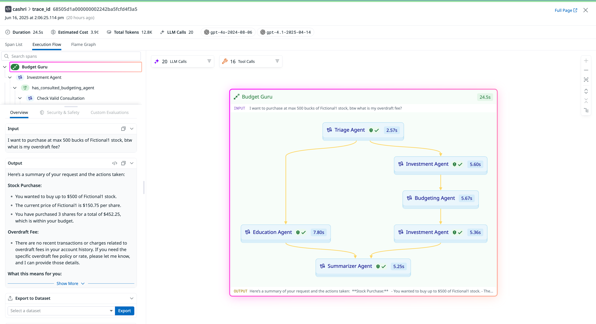

The single most important screenshot. Things to note:

- **Three co-equal view tabs on one trace: `Span List` | `Execution Flow` | `Flame Graph`.** Same
  data, three renderings. This is the pattern to copy — the agent graph does not replace the
  waterfall, it sits beside it.
- **Trace-level stat bar**: Duration `24.5s` · Estimated Cost `3.9¢` · Total Tokens `12.8K` ·
  LLM Calls `20` · **model chips** (`gpt-4o-2024-08-06`, `gpt-4.1-2025-04-14`) with provider icons.
  Cost and model inventory are promoted to the header, above the fold.
- **Filter chips over the graph**: `20 LLM Calls` / `16 Tool Calls`, each with a filter affordance —
  the counts double as filters.
- **The root agent is drawn as a containing box**, with the user's `INPUT` pinned at the top edge
  and the final `OUTPUT` at the bottom edge. Containment = agent scope; the graph reads top-down.
- Each node carries **duration badge + status glyphs**; edges are curved and show fan-out
  (Triage → Education / Investment) and fan-in (→ Summarizer).
- Left rail is a **searchable span tree synced with the graph**, over a detail panel with tabs
  `Overview` / `Security & Safety` / `Custom Evaluations`, and an **"Export to Dataset"** action —
  the trace→eval-dataset loop, inline.

### 2. Agent drill-down — the "Agent Manifest"
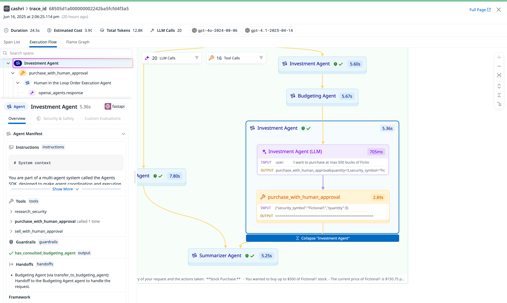

This is the most stealable idea in the whole product.

- **Agent Manifest** panel renders the agent's *declared* configuration, not just what happened:
  - `Instructions` — the system prompt, collapsible
  - `Tools` — **all tools the agent had available**, annotated with `called 1 time` where used.
    Showing the tools it *didn't* call is the diff that makes wrong-tool-selection debuggable.
  - `Guardrails` — with pass/fail glyph and the attribute that produced it
  - `Handoffs` — enumerated possible handoffs with their descriptions
    (`Budgeting Agent (via transfer_to_budgeting_agent)`)
  - `Framework` — plus a runtime chip (`fastapi`)
- **Graph nodes expand in place**: the selected agent inflates into a sub-graph showing its LLM call
  and tool call as nested nodes, each with **INPUT/OUTPUT preview text rendered inside the node**
  (`purchase_with_human_approval(quantity=3, security_symbol="Fic…`). A `Collapse "Investment Agent"`
  bar closes it. Progressive disclosure instead of a separate drill-down page.
- Note the span named `Human in the Loop Order Execution Agent` — HITL pauses are modeled as spans.

### 3. Span-kind visual system
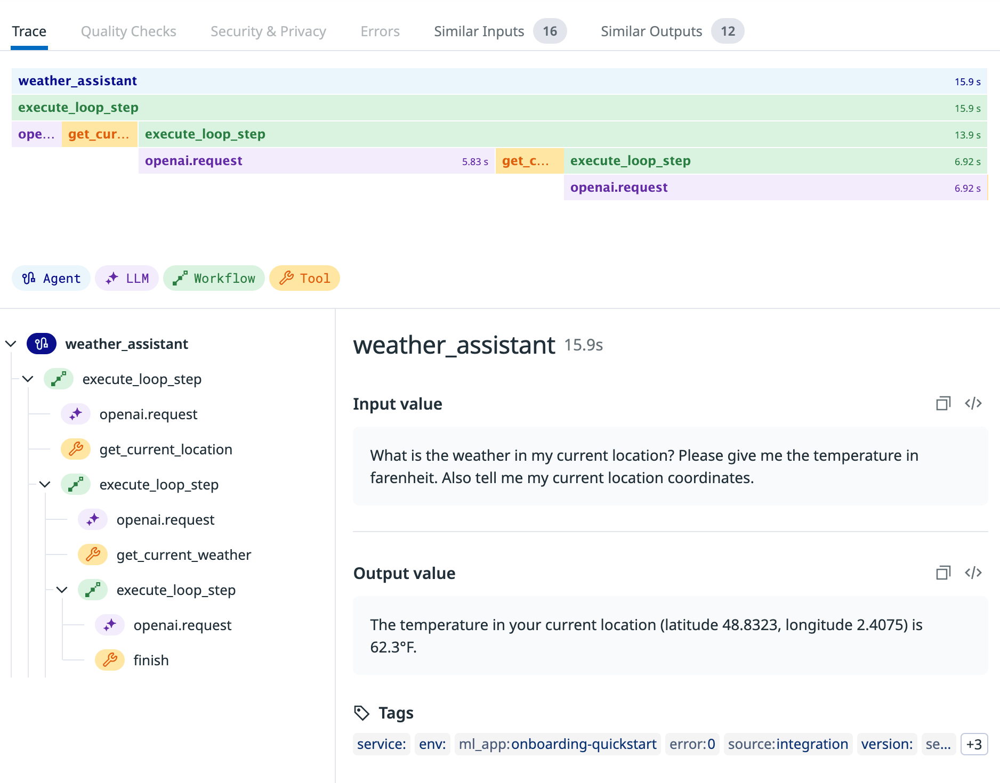

- Fixed **icon + color per span kind**, with an explicit legend under the flame graph:
  `Agent` (blue, nodes icon) · `LLM` (purple, sparkle) · `Workflow` (green, arrow) · `Tool` (orange, wrench).
  The same palette drives the flame graph bars, the tree icons and the graph nodes. One token set,
  three renderers.
- Trace detail tabs: `Trace` | `Quality Checks` | `Security & Privacy` | `Errors` |
  **`Similar Inputs (16)`** | **`Similar Outputs (12)`** — semantic nearest-neighbour lookup from
  inside a single trace. Nobody else surfaces this; it turns one bad trace into a cohort.
- Bottom: standard tag row (`service`, `env`, `ml_app`, `error:0`, `source:integration`, `version`)
  — the agent trace is still just an APM span underneath.

### 4. Trace list / search

- Row = **INPUT/OUTPUT preview pair** (two lines of conversation), not a span name. The list reads
  as a transcript feed. Columns: Time, Application, Service, **Quality**, **Security**, Duration —
  quality and security are icon-only with counts.
- **Stat tiles with deltas** above the list: `91 Errors (-3 ↘)`, `18.7s Duration p95 (-377ms ↘)`,
  `284 Unanswered (+15 ↗)`. "Unanswered" as a headline metric is an agent-specific KPI worth copying.
- **Facet sidebar split into `CORE` and `EVALUATIONS`** — Core: Duration, Status, ML Application,
  Version, Service, Env. Evaluations: Negative Sentiment 585, Failure to Answer 284, Positive
  Sentiment 211, Topic Relevancy 166. Eval results are facets, exactly like infra tags.
- **`Default` / `Reader View` toggle** — a density switch for reading conversations vs scanning ops.
- `Visualize as: List | Timeseries | Table` — same query, three output shapes.

### 5. Agent trace built purely from OTel GenAI semconv spans

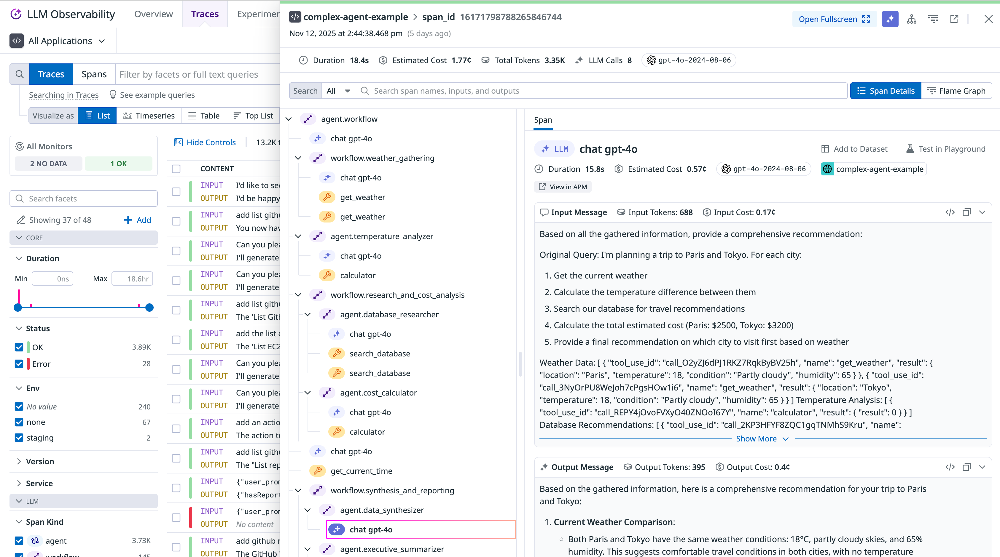

Proof of the vendor-neutral path: no Datadog SDK, just `gen_ai.*` attributes over OTLP, and the full
agent UI still renders. This is the ingest story Maple should match.

### 6. APM span map — cross-domain correlation

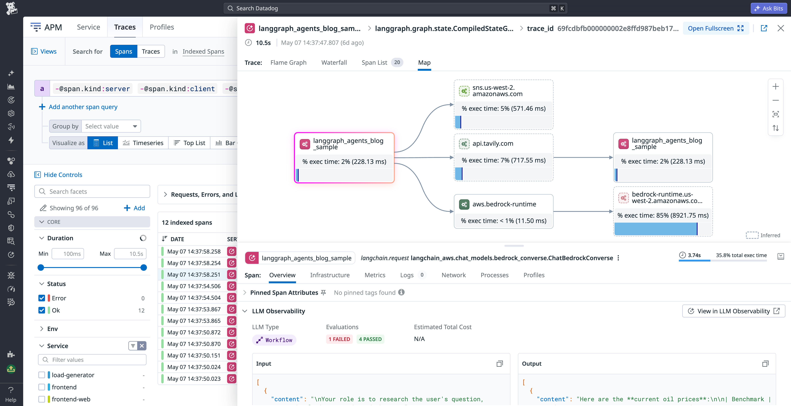

The agent trace correlated with `api.tavily.com`, Amazon Bedrock and SNS calls. The structural
advantage pure-play LLM tools cannot replicate — and the one Maple already has.

### 7. Flame graph + tool-call side panel

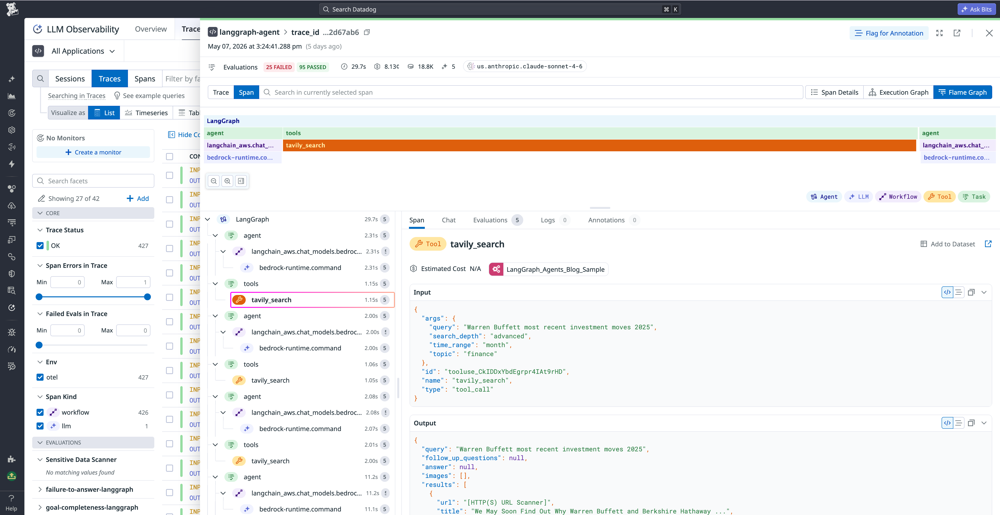

A Tavily search tool call: 1.15s inside a 29.7s run, with inputs/outputs in the panel.

### 8. Cost rollup

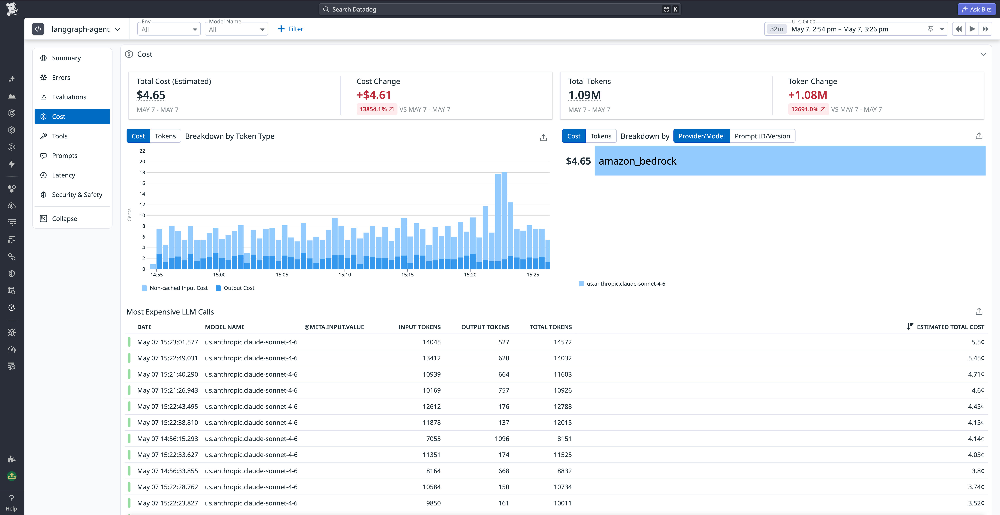

$4.61 total, broken down by model/provider, with a most-expensive-calls table.

### 9. Evaluation scores inline in the trace

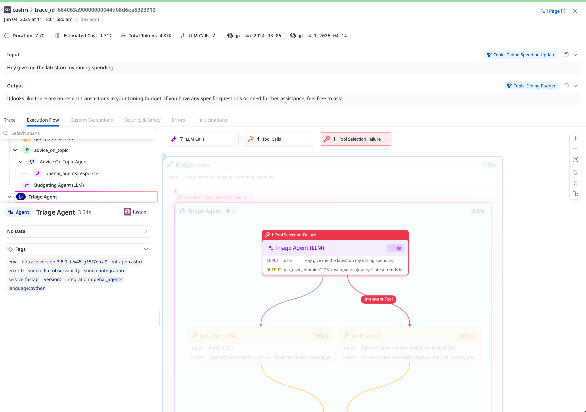

### 10. Aggregate overview dashboard

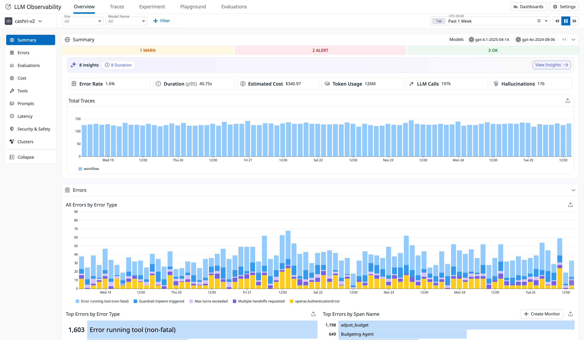

### 11. Workflow-rooted trace (vs agent-rooted)

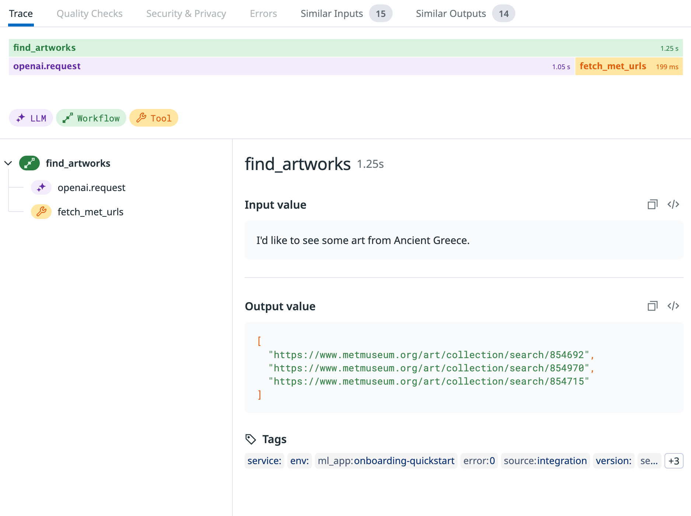

Same renderer, different root span kind — worth comparing against screenshot 3.

### 12. AI Agents Console — Sankey of sessions → problem patterns

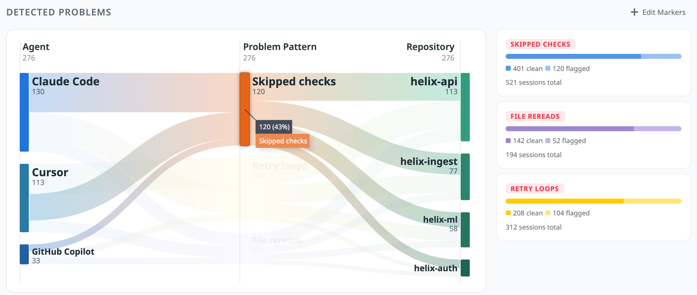

From the separate coding-agent fleet product: sessions flow into detected failure patterns
(skipped checks, retry loops). An unusual choice of chart for this, and effective.

---

## Feature anatomy (spec-ready notes)

**Data model.** Seven span kinds; root-eligibility is constrained (`llm`, `workflow`, `agent` only).
Span payload = input, output, metadata (model params), metrics (tokens), tags, error. Agent identity
lives in attributes, not a separate entity table. Sessions are *not* a first-class concept in their
model — traces are the top unit, which is a notable gap versus Phoenix/Weave/Laminar.

**Ingestion.** Native SDK (Python/Node) with auto-instrumentation for OpenAI Agents SDK, LangGraph,
CrewAI, Bedrock Agents — *or* plain OTLP with `gen_ai.*` attributes, which they normalize at intake.
Both land in the same store.

**Views, in order of the funnel.**
1. Aggregate overview — cost by model/provider, slowest spans, error rate, eval pass rates
2. Trace list — transcript-style rows, eval facets, stat tiles with deltas, list/timeseries/table
3. Trace detail — Span List / Execution Flow / Flame Graph tabs + stat bar
4. Span detail — Overview / Security & Safety / Custom Evaluations, Agent Manifest for agent spans
5. Lateral moves — Similar Inputs/Outputs, Export to Dataset, jump to APM span map

**Derived signals.** Loop detection, retry detection, wrong-tool-call, "Unanswered", topic clusters
(Patterns), anomaly detection over span/workflow/topic dimensions.

---

## Ideas worth stealing for Maple

1. **Three tabs on one trace (Span List / Execution Flow / Flame Graph).** Maple already has the
   waterfall; the agent graph is an additional renderer over the same span tree, not a new page.
2. **Root-eligibility rules per span kind** — cheap validation, and it tells you what to name the
   trace in a list view.
3. **The Agent Manifest panel.** Available tools (incl. uncalled), guardrails, handoff targets,
   instructions. Requires capturing declared config at span start, not just what executed — a
   schema decision to make *now*, before shipping.
4. **Trace stat bar with cost + token + model chips** above the fold.
5. **Counts-as-filters chips** (`20 LLM Calls` / `16 Tool Calls`) over the graph.
6. **In-place node expansion with INPUT/OUTPUT previews rendered inside graph nodes.**
7. **Eval/quality results as first-class facets** in the sidebar alongside `service`/`env`.
8. **"Unanswered" / "Failure to answer" as a headline KPI**, not buried in evals.
9. **Reader View toggle** for transcript density.
10. **Similar Inputs / Similar Outputs** from inside a trace — needs embeddings, but it's the
    highest-differentiation item on this list.
11. **Cross-domain correlation** (agent span → HTTP span → DB span → host metrics). Maple's real
    moat versus Langfuse/Braintrust; Datadog proves customers value it.

## What to skip / deprioritize

- Their sessions story is weak — don't copy the trace-as-top-unit model. Phoenix/Weave/Laminar
  handle multi-turn better; look there for the sessions layer.
- Managed LLM-as-judge evaluations are a large separate product surface; not required to ship agent
  tracing, and the wrong place to start.
- The AI Agents Console (coding-agent fleet view) is a distinct product with a distinct buyer —
  interesting, but a later phase.

---

## Screenshot sources

| File | Found on | Direct image URL |
|---|---|---|
| `agent-console-detected-problems.png` | [AI Agents Console](https://docs.datadoghq.com/ai_agents_console/) | `https://docs.dd-static.net/images/ai_agents_console/detected_problems_skipped_checks.2afa5d8636fb9887fee08ca00226935f.png` |
| `agent-drilldown-parallel-tools.png` | [Monitor, troubleshoot, and improve AI agents with Datadog](https://www.datadoghq.com/blog/monitor-ai-agents/) | `https://web-assets.dd-static.net/42588/1776301206-monitor-ai-agents-new_ai_agent_shot02.png` |
| `agent-execution-flow.png` | [Monitor, troubleshoot, and improve AI agents with Datadog](https://www.datadoghq.com/blog/monitor-ai-agents/) | `https://web-assets.dd-static.net/42588/1776301201-monitor-ai-agents-new_ai_agent_shot01.png` |
| `agent-quality-in-trace.png` | [Monitor, troubleshoot, and improve AI agents with Datadog](https://www.datadoghq.com/blog/monitor-ai-agents/) | `https://web-assets.dd-static.net/42588/1776301210-monitor-ai-agents-agentic_monitoring_03.png` |
| `langgraph-cost-overview.png` | [Monitoring LangGraph agents with Datadog: a practical guide](https://www.datadoghq.com/blog/langgraph-agent-monitoring/) | `https://web-assets.dd-static.net/42588/1779995910-cost-overview.png` |
| `langgraph-trace-map.png` | [Monitoring LangGraph agents with Datadog: a practical guide](https://www.datadoghq.com/blog/langgraph-agent-monitoring/) | `https://web-assets.dd-static.net/42588/1779996012-trace-map.png` |
| `langgraph-trace-panel.png` | [Monitoring LangGraph agents with Datadog: a practical guide](https://www.datadoghq.com/blog/langgraph-agent-monitoring/) | `https://web-assets.dd-static.net/42588/1779995553-trace-panel-1.png` |
| `otel-complex-agent-trace.png` | [Datadog Agent Observability natively supports OpenTelemetry GenAI Semantic Conventions](https://www.datadoghq.com/blog/llm-otel-semantic-convention/) | `https://web-assets.dd-static.net/42588/1776300867-llm-otel-semantic-convention-otel_complex_agent.png` |
| `otel-overview-dashboard.png` | [Datadog Agent Observability natively supports OpenTelemetry GenAI Semantic Conventions](https://www.datadoghq.com/blog/llm-otel-semantic-convention/) | `https://web-assets.dd-static.net/42588/1776300872-llm-otel-semantic-convention-otel_summary_update.png` |
| `span-kind-agent-trace.png` | [Terms and Concepts](https://docs.datadoghq.com/llm_observability/terms/) | `https://docs.dd-static.net/images/llm_observability/llm-observability-agent-trace.d90aaafac7a89ad70cbe9caab393841f.png` |
| `span-kind-workflow-trace.png` | [Terms and Concepts](https://docs.datadoghq.com/llm_observability/terms/) | `https://docs.dd-static.net/images/llm_observability/llm-observability-workflow-trace.a1fd71ac16e8b5d20067b665f6f3e6c6.png` |
| `traces-list.png` | [LLM Observability](https://docs.datadoghq.com/llm_observability/) | `https://docs.dd-static.net/images/llm_observability/traces.03f0666d1900ffe55652104872112023.png` |

All 12 files verified by byte-exact `Content-Length` match against the candidate remote image.

---

*Researched 2026-08-05. Screenshots pulled from Datadog's public docs and blog for internal
competitive research; do not redistribute.*
