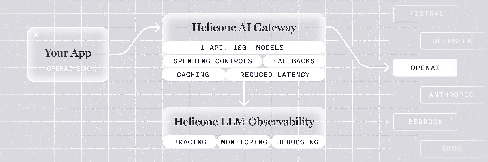
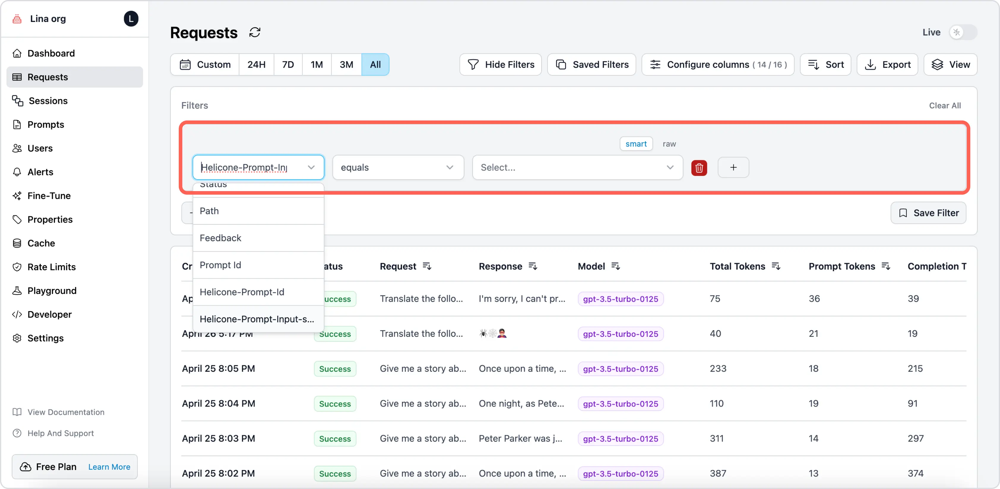
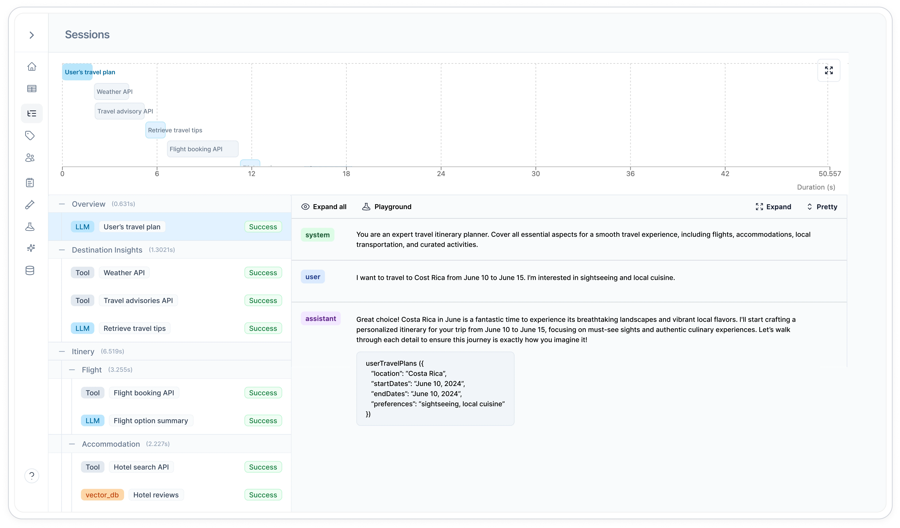
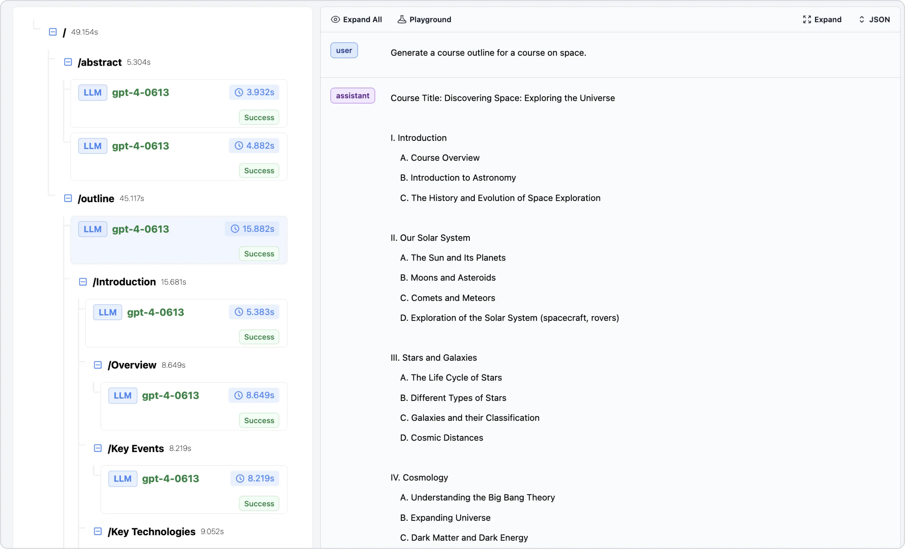
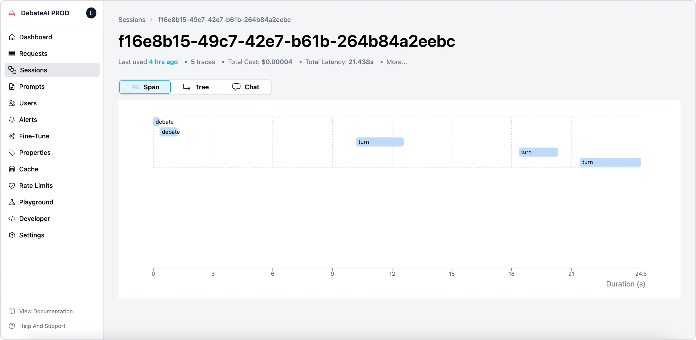
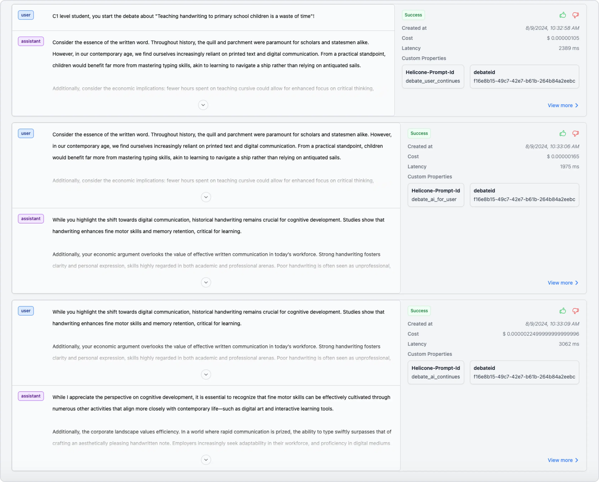
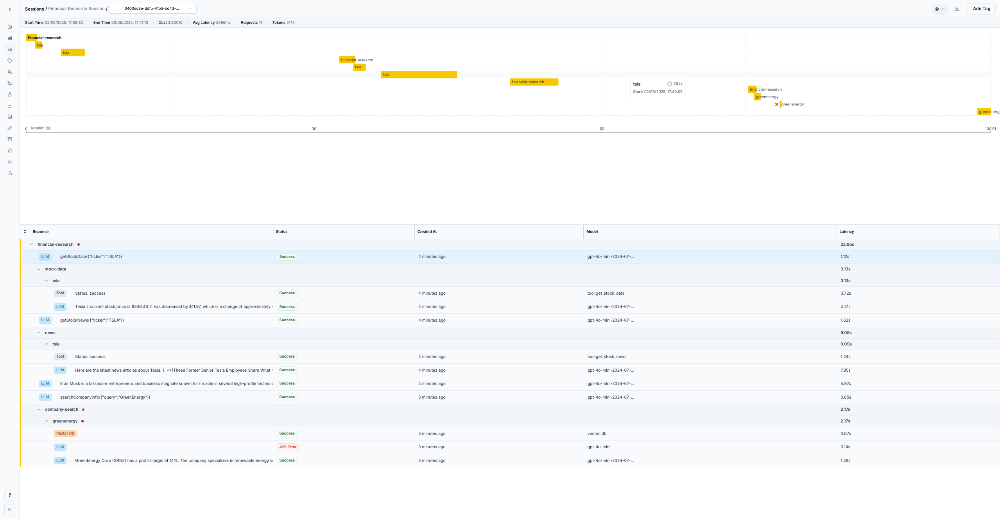
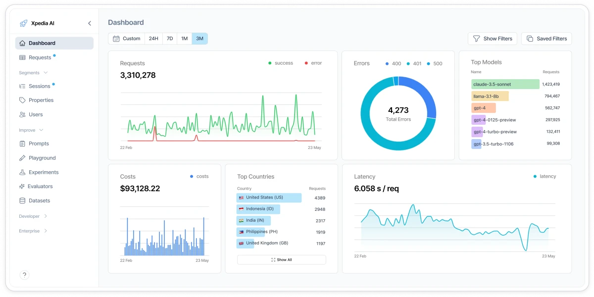

# Helicone — LLM Proxy & Observability

> **One-liner:** A proxy-first LLM gateway that bolted observability on top — multi-step agent runs
> aren't a span tree, they're request logs stitched together after the fact by matching a
> user-supplied path string across three custom headers. The cleanest available negative example of
> what you lose without a real parent/child span model.

**Market position:** YC W23 (founded 2023, San Francisco, by Justin Torre and Cole Gottdank).
Grew to 16,000+ organizations and 14.2 trillion tokens logged over three years. **Acquired by
Mintlify on March 3, 2026** — the founders joined Mintlify, and Helicone is now explicitly in
**maintenance mode**: security patches, bug fixes, and new model support only, no active feature
development. That status matters for reading everything below — nothing here is a moving target.
The architecture bet, from day one, was **proxy-first, not SDK-first**: you route LLM traffic
*through* Helicone (`https://oai.helicone.ai/v1` instead of `api.openai.com`) and get caching, rate
limiting, provider fallback, and cost tracking for free, with observability as a side effect of
being in the request path. Apache 2.0, open source (`Helicone/helicone` ~6k★, spun-out
`Helicone/ai-gateway` ~618★), with a documented but heavyweight self-host path.

**How core is agent tracing to the product?** A mid-tier feature, not the north star. The two
pillars are the **AI Gateway** (100+ models behind one API, routing/caching/fallback/spend
controls) and **LLM Observability** (request logs, cost, latency, prompt versioning). **Sessions**
— their agent/multi-step-run view — is a UI layer rendered from three opt-in custom headers on top
of that request log. There is no dedicated "agent" entity, no span-kind taxonomy (contrast
Datadog's `llm`/`agent`/`tool`/`workflow`), and no auto-instrumentation for LangGraph/CrewAI/OpenAI
Agents SDK that populates it automatically — every request in a multi-step run has to be manually
tagged by the developer with matching headers, every time.

---

## The architectural contrast (read this first)

Helicone has **no span concept**. The unit of data is a proxied LLM request/response pair — headers
in, headers + body out, logged by the Cloudflare Worker proxy (or shipped async via the
`HeliconeAsyncLogger` SDK). There is no `parent_span_id`, no trace context propagation, no
OTel-style span tree. A "session" is reconstructed **entirely from a string convention** on three
request headers, matched at query time:

| Header | Example value | Purpose |
|---|---|---|
| `Helicone-Session-Id` | `"550e8400-e29b-41d4-a716-446655440000"` (UUID) | Groups requests into one session |
| `Helicone-Session-Path` | `"/financial-research/stock-data/tsla"` | Forward-slash-delimited path; **string prefix-matching against sibling paths is what builds the tree**, not a real parent/child reference |
| `Helicone-Session-Name` | `"Financial Research Session"` | Human label shown in the session list |

The path is arbitrary developer-chosen text, not a span ID. A real example from Helicone's own
tutorial: a request from the top-level agent is tagged `/financial-research`, its stock-lookup
subtask `/financial-research/stock-data/tsla`, and a parallel company-search subtask
`/financial-research/company-search/greenenergy` — the UI groups these into a tree purely by
splitting on `/` and matching common prefixes. Docs are explicit that this is **conceptual, not
chronological**: *"Requests with the same path represent the same 'type' of work, even if they
happen at different times."*

**What this buys you:** zero SDK lock-in for the grouping mechanism (any HTTP client that can set
headers works), trivial to retrofit onto an existing proxy call, and no schema to design — a string
convention is infinitely flexible.

**What it costs you, concretely:**
- **No referential integrity.** A typo'd path (`/finacial-research/...`) silently creates an orphan
  branch instead of erroring — there's no span ID to fail a lookup against.
- **No causality, only naming.** Two requests with the same path are treated as "the same kind of
  work," not as caused by one another. You cannot express "span B was caused by span A's output"
  except by nesting it deeper in the path string.
- **No cross-cutting correlation.** A session can't be joined to a database query, an HTTP call to a
  third-party API, or a host metric the way an OTel trace ID can — the session is only ever a
  cluster of LLM proxy requests, because the proxy only sees LLM traffic.
- **Manual instrumentation, every call, forever.** No framework auto-instrumentation populates these
  headers; the developer thread them through every nested LLM call by hand.
- **The tree is a rendering trick, not a stored structure.** It's computed at read time by parsing
  path strings, which is why nesting depth, ordering, and even whether something is a "child" at all
  are all just string-matching outcomes.

**What the proxy approach genuinely buys them beyond the session limitation** — and this is the
fair part of the comparison, worth being honest about: because Helicone sits *in* the request path,
it can do things a passive observability platform structurally cannot: response **caching**
(`Helicone-Cache-Enabled: true`, TTL via standard `Cache-Control: max-age=604800`, up to 20
alternate cached responses per key via `Helicone-Cache-Bucket-Max-Size`, namespaced with
`Helicone-Cache-Seed`), **rate limiting** (per-user/team/global, on request count, token usage, or
dollar spend), **provider fallback and load balancing** (latency-based P2C+PeakEWMA routing across
providers, weighted distribution, cost-optimized routing), and **spend controls** that block a
request *before* it costs money. Maple, as a passive OTel sink, cannot intervene in the request —
it can only observe after the fact. That's a real category boundary, not a shortcoming to fix.

**OTel status — be precise:** Helicone is **not an OTLP ingestion target for arbitrary app traces**.
Two things carry the "OpenTelemetry" label and neither is what Maple does:
1. The `ai-gateway` repo advertises "OpenTelemetry support for logs, metrics, and traces" — this
   describes the **gateway exporting its own operational telemetry** (the gateway's performance as a
   service), not accepting your app's OTLP spans as input.
2. The "OpenLLMetry Async Integration" (`@helicone/async` / `helicone-async`) is a **vendor-specific
   SDK**, not a generic OTel collector endpoint — it wraps known LLM provider clients (OpenAI,
   Anthropic, Azure OpenAI, Cohere, Bedrock, Google AI Platform) and logs those calls asynchronously
   so Helicone isn't in the critical path. It does not accept arbitrary spans from other
   instrumentation.

Net: ingestion is strictly **proxy** (`oai.helicone.ai` style routing) or **provider-specific async
SDK**. There is no path where a customer's existing OTel Collector pipeline lights up the Helicone
UI the way it does for Datadog.

---

## Trial & access

| | |
|---|---|
| **Free tier** | Hobby plan, free forever: 10,000 requests/month, 1 GB storage, 1 seat, 1 org, **7-day** data retention |
| **Free trial** | Pro and Team plans both carry a 7-day free trial |
| **Credit card required?** | **No** for the Hobby tier — sign up and use the full platform (including Sessions) without a card |
| **Registration URL** | https://www.helicone.ai/signup |
| **Signup fields** | Google or Apple OAuth, or email/password account creation — no company/phone gate observed |
| **Paid entry price** | Pro at **$79/month** (1-month retention, unlimited seats, alerts, reports, HQL); Team at $799/month (SOC 2/HIPAA-relevant, multi-org, 3-month retention) |
| **Self-hosting story** | Apache 2.0, fully open source. Manual path runs 6 services (Postgres, ClickHouse, Minio, the `Jawn` proxy/backend on :8585, the Next.js web UI on :3000, Mailhog for local email) — docs explicitly steer you to **Docker Compose** instead ("works easily with just one line") because the manual path is real orchestration work. |
| **Gotcha** | **Acquired by Mintlify, March 2026 — maintenance mode.** No new features are shipping; treat every "roadmap" claim in older blog posts as frozen. Also: Sessions requires manually threading three headers through every nested LLM call — nothing auto-populates them. |

---

## Sources

| # | Source | Type | Why it's useful / what to extract |
|---|---|---|---|
| 1 | [Sessions — feature docs](https://docs.helicone.ai/features/sessions) | Docs | **The header contract, verbatim.** All three header names, the UUID recommendation for `Session-Id`, the forward-slash path convention, and the explicit "conceptual, not chronological" grouping rule. |
| 2 | [Debugging RAG Chatbots and AI Agents with Sessions](https://www.helicone.ai/blog/debugging-chatbots-and-ai-agents-with-sessions) | Blog | Source of `sessions-ui.webp`. Real worked example (RAG chatbot) showing session headers wired through tool calls, and the case for sessions as "trace nested agent workflows, quickly identify issues." |
| 3 | [Building and Monitoring AI Agents, Part 2](https://www.helicone.ai/blog/ai-agent-monitoring-tutorial-2) | Blog | Source of the `financial-research` session example (`session-before-fix.webp`). Exact nested-path code: `Helicone-Session-Path: /financial-research/stock-data/${ticker}` — shows how a path gets built dynamically per tool call, and how a downstream `429` on one branch (`greenenergy`) surfaces as a red-dot error indicator that bubbles up through the ancestor path segments in the flat table. |
| 4 | [4 Essential Helicone Features to Optimize Your AI App's Performance](https://www.helicone.ai/blog/essential-helicone-features) | Blog | Source of `helicone-tree-view.webp`, `helicone-span-view.webp`, `helicone-convo-view.webp`, `helicone-request-page.webp`. **Names and shows all three session view modes explicitly** (Span / Tree / Chat tabs) plus the custom-properties-as-filter pattern. |
| 5 | [Helicone AI Gateway — GitHub](https://github.com/Helicone/ai-gateway) | Repo README | The proxy feature list in one place: caching (Redis/S3), rate limiting (count/tokens/dollars), load balancing strategies (P2C+PeakEWMA, weighted, cost-optimized), provider failover, Apache license, deployment options (npx/Docker/Kubernetes), and perf numbers (sub-5ms P95, ~3,000 req/s). |
| 6 | [Caching — advanced usage docs](https://docs.helicone.ai/features/advanced-usage/caching) | Docs | **Exact header syntax** for the caching feature: `Helicone-Cache-Enabled`, `Cache-Control: max-age=<seconds>`, `Helicone-Cache-Bucket-Max-Size`, `Helicone-Cache-Seed`, `Helicone-Cache-Ignore-Keys`, and the response-side `Helicone-Cache: HIT/MISS` header. This is the concrete proof of "proxy buys you things Maple can't do." |
| 7 | [Helicone/helicone — GitHub](https://github.com/Helicone/helicone) | Repo README | Core repo architecture: 5 services (NextJS web, Cloudflare Worker proxy, Jawn/Express log collector, Supabase, ClickHouse, Minio), Apache 2.0, "One line of code to monitor" positioning, confirms the two integration modes (AI Gateway proxy vs. async logging). |
| 8 | [Helicone is joining Mintlify](https://www.helicone.ai/blog/joining-mintlify) | Company blog | The acquisition announcement — confirms maintenance-mode status, three-year usage stats (16k orgs, 14.2T tokens), and why the product is now a frozen reference point rather than a moving competitor. |

---

## Screenshots

### 1. Proxy architecture — the whole bet in one diagram

- **Your App → Helicone AI Gateway → OpenAI/Anthropic/Bedrock/etc.** The gateway sits *in* the
  request path, not beside it. `{ OPENAI SDK }` on the left means integration is usually just an
  endpoint swap — no new client library.
- The gateway box itself enumerates its job: `1 API. 100+ MODELS`, `SPENDING CONTROLS`,
  `FALLBACKS`, `CACHING`, `REDUCED LATENCY` — all things a passive observability sink cannot do.
- **Observability is drawn as a separate box fed *by* the gateway** (`TRACING`, `MONITORING`,
  `DEBUGGING`), not the other way around — logging is a side effect of proxying, not the primary
  system being described.

### 2. Requests list — the flat unit underneath everything

- Every "session" is built out of rows from this exact table — there's no separate storage tier for
  agent runs.
- Columns: Created, Status, Request (prompt preview), Response (preview), Model, Total/Prompt/
  Completion Tokens — a plain request log, not a trace list.
- The filter-field dropdown enumerates what's queryable: `Status`, **`Path`** (this is
  `Helicone-Session-Path`, confirming it's indexed as a top-level filter), `Feedback`, `Prompt Id`,
  `Helicone-Prompt-Id`, `Helicone-Prompt-Input-*` — session path sits alongside prompt-versioning
  metadata as just another attribute to filter on, not a structural concept.
- `Configure columns (14/16)`, `Sort`, `Export`, and a `smart`/`raw` filter-builder toggle.

### 3. Sessions detail — hybrid timeline + tree + chat

- Top: a **Gantt-style timeline** (`Duration (s)` axis, 0–50.5s) with bars labeled by path segment
  (`User's travel plan`, `Weather API`, `Travel advisory API`, `Retrieve travel tips`,
  `Flight booking API`) — bar position/width is literal start/end time, independent of the
  conceptual tree below it.
- Left rail: a **collapsible outline** grouped by path prefix (`Overview`, `Destination Insights`,
  `Itinery` → `Flight` → `Accommodation`), each group showing an aggregate duration
  (`Itinery (6.519s)`) and each leaf tagged `LLM`, `Tool`, or `vector_db` with a `Success`/error pill.
- Right panel: a **chat transcript** for the selected leaf — `system`/`user`/`assistant` turns, a
  rendered JSON tool-call block (`userTravelPlans({...})`), `Expand all` and `Playground` actions.
  The Playground link jumps straight from a logged request into a replay environment.

### 4. Tree tab — path string rendered as literal folder tree

- This is the cleanest illustration of the mechanism: `/` (root, 49.154s) → `/abstract` (5.304s) →
  two `LLM gpt-4-0613` leaves; sibling `/outline` (45.117s) → `/Introduction` (15.681s) →
  `/Overview` (8.649s) → `/Key Events` (8.219s) → `/Key Technologies` (9.052s).
- **Every folder is a path segment, not a span** — the indentation you see is `String.split("/")`,
  rendered. Each duration badge next to a folder is the sum/span of its children's logged
  timestamps, computed after the fact.
- Leaf nodes show model (`gpt-4-0613`), a clock-icon duration, and a `Success` pill — same shape as
  a request-list row, just nested by path depth.
- Selecting a leaf drives the right-hand panel (`Expand All`, `Playground`, `Expand`, `JSON`), same
  pattern as screenshot 3.

### 5. Span / Tree / Chat — the three view modes, explicitly tabbed

- Header stat bar: `Last used 4 hrs ago` · `5 traces` · `Total Cost: $0.00004` · `Total Latency:
  21.438s` · `More...` — same "roll the session up to a stat bar" instinct as competitors, but
  notice **"5 traces,"** not "5 spans" — their vocabulary confirms requests, not spans, are the atom.
- **Three co-equal tabs: `Span` | `Tree` | `Chat`.** This is Helicone's version of Datadog's
  Span-List/Execution-Flow/Flame-Graph triple — same idea (one dataset, three renderers), worth
  copying as a pattern regardless of the underlying data model.
- The `Span` tab here is actually the **Gantt/timeline** view (bars: `debate` → `debate` → three
  `turn` bars spread across a 24.5s axis) — naming is inconsistent with "span" in the OTel sense;
  it just means "time-ordered."

### 6. Chat tab — per-turn metadata, not a unified transcript

- Reads like a transcript (`user` / `assistant` bubbles, collapsible with a chevron, `View more`),
  but **each turn is its own request card** with its own `Success` pill, `Created at`, `Cost`,
  `Latency`, and a `Custom Properties` box.
- Custom properties shown per turn: `Helicone-Prompt-Id` (`debate_user_continues`,
  `debate_ai_for_user`, `debate_ai_continues` — a semantic role label per turn) and a `debateid`
  property carrying the session UUID — **the session linkage is visible twice**, once via the
  dedicated session headers and once as an ad hoc custom property, because nothing enforces a single
  source of truth for "what ties these together."
- Thumbs up/down feedback icons per turn — inline human feedback capture at the request level.

### 7. Real agent trace with an in-flight error

- A `financial-research` session: root path fans into `stock-data/tsla`, `news/tsla`, and
  `company-search/greenenergy` branches — timeline bars for `tsla` and `financial-research` overlap
  and stack, showing genuinely concurrent tool calls.
- The flat table below mirrors the tree via **indentation depth alone** (no connecting lines): a row
  named `financial-research` at depth 0, `stock-data` at depth 1, `tsla` at depth 2, then leaf
  `Tool`/`LLM` rows at depth 3 — Model and Latency columns per row (`tool:get_stock_data`, `0.72s`).
- **Error propagation is visible**: `greenenergy` branch has a red dot and a `429 Error` status pill
  on one leaf; the red dot is inherited by every ancestor row (`company-search`, `greenenergy`) up
  to — but visibly not all the way to — the session root, since Helicone has no formal
  parent-status-rollup rule, just a per-branch dot.

### 8. Dashboard + full nav — where Sessions sits in the product

- Left nav, top to bottom: `Dashboard`, `Requests`, then a `Segments` group containing **`Sessions`**
  alongside `Properties` and `Users` — sessions is filed as a *segmentation* of requests, not a
  peer-level product surface next to Requests.
- Further down: `Improve` group (`Prompts`, `Playground`, `Experiments`, `Evaluators`, `Datasets`),
  then `Developer` and `Enterprise` — the information architecture makes clear Sessions is one lens
  among many over the same request log, not a dedicated agent product.
- Dashboard widgets themselves are proxy-operational, not agent-specific: `Requests` (line chart,
  success/error split), `Errors` (donut by status class 400/401/500), `Top Models`, `Costs` (bar
  chart), `Top Countries`, `Latency` (s/req line chart) — cost/latency/model/geo, the vocabulary of
  someone monitoring API traffic, not agent behavior.

---

## Feature anatomy (spec-ready notes)

**Data model.** One entity: the logged proxy request/response. No span, no trace, no agent, no tool
call as first-class types — those are inferred client-side from the `Tool`/`LLM`/`vector_db` label a
developer puts on the request and from custom properties. Sessions are a **derived view**, computed
by grouping on `Helicone-Session-Id` and parsing `Helicone-Session-Path` at query/render time — not
stored as a tree.

**Ingestion.** Two paths, both LLM-provider-specific: (1) **proxy** — point your OpenAI-compatible
client at `oai.helicone.ai` (or the equivalent per-provider host) and it logs every call inline;
(2) **async SDK** (`HeliconeAsyncLogger` / OpenLLMetry) — wraps known provider clients and logs
without being in the critical path. No generic OTLP ingestion for either path.

**Views, in order of the funnel.**
1. Dashboard — proxy-operational rollups (requests, errors by status class, top models, cost,
   top countries, latency)
2. Requests list — flat, filterable (`Path` is one filter among many)
3. Sessions list → Session detail — **Span** (Gantt/timeline) / **Tree** (path-as-folders) /
   **Chat** (turn-by-turn transcript) tabs, same underlying request set
4. Request detail — headers, custom properties, cost, latency, feedback thumbs, Playground replay

**Derived signals.** None beyond what a human reads off the tree/timeline — no anomaly detection, no
loop/retry detection, no automatic "wrong tool called" diagnosis. Custom Properties (arbitrary
key/value headers like `Helicone-Prompt-Id`) are the only structured signal, and they're
free-text, not a controlled vocabulary.

---

## Ideas worth stealing for Maple

1. **Three tabs over one dataset (Span / Tree / Chat).** Independently arrived at the same pattern
   Datadog uses (Span List / Execution Flow / Flame Graph) — strong signal this is the right shape
   regardless of what's underneath. Maple already has the waterfall; a Tree tab and a Chat tab over
   the *same* span data is cheap to add and directly comparable.
2. **Chat tab as a first-class view, not a debug afterthought.** Rendering the conversation as
   `system`/`user`/`assistant` bubbles with collapsible JSON tool-call blocks, independent of the
   timing view, is the highest-leverage screen for a human actually reading what an agent did.
3. **Per-turn custom properties + thumbs-up/down feedback inline in the transcript** (screenshot 6)
   — cheap to build, valuable for eval/feedback loops, and something Datadog doesn't show inline.
4. **Session-level stat bar** (`traces`, `Total Cost`, `Total Latency`, `Last used`) — Maple should
   do this natively and correctly, with real span-tree cost rollup instead of a flat sum over
   loosely-grouped requests.
5. **`Playground` deep-link from a logged request/span** — jump from "this happened" straight into
   "let me replay this with different inputs." Worth having on span detail.

## What to skip / deprioritize

- **The header-and-path convention itself.** This is the thing to actively avoid, not adopt — it's
  the reason to document Helicone at all. Maple's OTel span tree with real `parent_span_id`s already
  solves the referential-integrity and causality problems this pattern has.
- **Custom Properties as the only structured metadata.** Free-text key/value headers with no schema
  is a scaling problem at 16k orgs; Maple's attribute model is already more disciplined.
- **Proxy-specific features (caching, rate limiting, fallback, spend controls).** Genuinely valuable,
  genuinely out of scope — these require being in the request path, which is a different product
  than an observability platform. Worth knowing the boundary exists, not worth chasing.
- **Copying their vocabulary.** "Session" language and "traces" meaning "requests" will read as
  imprecise next to a real OTel data model — keep Maple's terminology (trace/span) exact.

## Screenshot sources

Verified by downloading each candidate remote image and byte-comparing it against the local file;
every row below except `github-readme-banner.png` is an exact size match, not a guess.

| File | Found on | Direct image URL |
|---|---|---|
| `dashboard-mobile.webp` | [Helicone — AI Gateway & LLM Observability (homepage)](https://www.helicone.ai/) | `https://www.helicone.ai/static/home/mobile/dashboard_with_sidebar.webp` |
| `github-readme-banner.png` | unknown | — |
| `helicone-convo-view.webp` | [4 Essential Helicone Features to Optimize Your AI App's Performance](https://www.helicone.ai/blog/essential-helicone-features) | `https://www.helicone.ai/static/blog/4-essential-features/convo-view.webp` |
| `helicone-request-page.webp` | [4 Essential Helicone Features to Optimize Your AI App's Performance](https://www.helicone.ai/blog/essential-helicone-features) | `https://www.helicone.ai/static/blog/4-essential-features/request-page.webp` |
| `helicone-span-view.webp` | [4 Essential Helicone Features to Optimize Your AI App's Performance](https://www.helicone.ai/blog/essential-helicone-features) | `https://www.helicone.ai/static/blog/4-essential-features/span-view.webp` |
| `helicone-tree-view.webp` | [4 Essential Helicone Features to Optimize Your AI App's Performance](https://www.helicone.ai/blog/essential-helicone-features) | `https://www.helicone.ai/static/blog/4-essential-features/tree-view.webp` |
| `session-before-fix.webp` | [Building and Monitoring AI Agents (Part 2): A Step-by-Step Guide](https://www.helicone.ai/blog/ai-agent-monitoring-tutorial-2) | `https://www.helicone.ai/static/blog/ai-agent-monitoring-tutorial-2/helicone-session-before-fix.webp` |
| `sessions-ui.webp` | [Sessions — feature docs](https://docs.helicone.ai/features/sessions) | `https://mintcdn.com/helicone/WIDUeIzURs2yWBd-/images/sessions/helicone-session-ui.webp` (signed Mintlify CDN link; may expire/rotate) |

Note: `github-readme-banner.png` is the "Your App → Helicone AI Gateway → Helicone LLM
Observability" architecture diagram. Despite the local filename, it is **not** in either
`Helicone/helicone` or `Helicone/ai-gateway`'s README (both fetched and grepped for image tags —
neither contains this graphic; the `helicone/helicone` README's only screenshot is a plain
dashboard image, confirmed by byte comparison to rule it out). It was not found on the Helicone
homepage, the AI Gateway docs pages, or any blog post checked. Marked `unknown` rather than
guessed.

---

*Researched 2026-08-05. Screenshots pulled from Helicone's public docs and blog for internal
competitive research; do not redistribute.*
