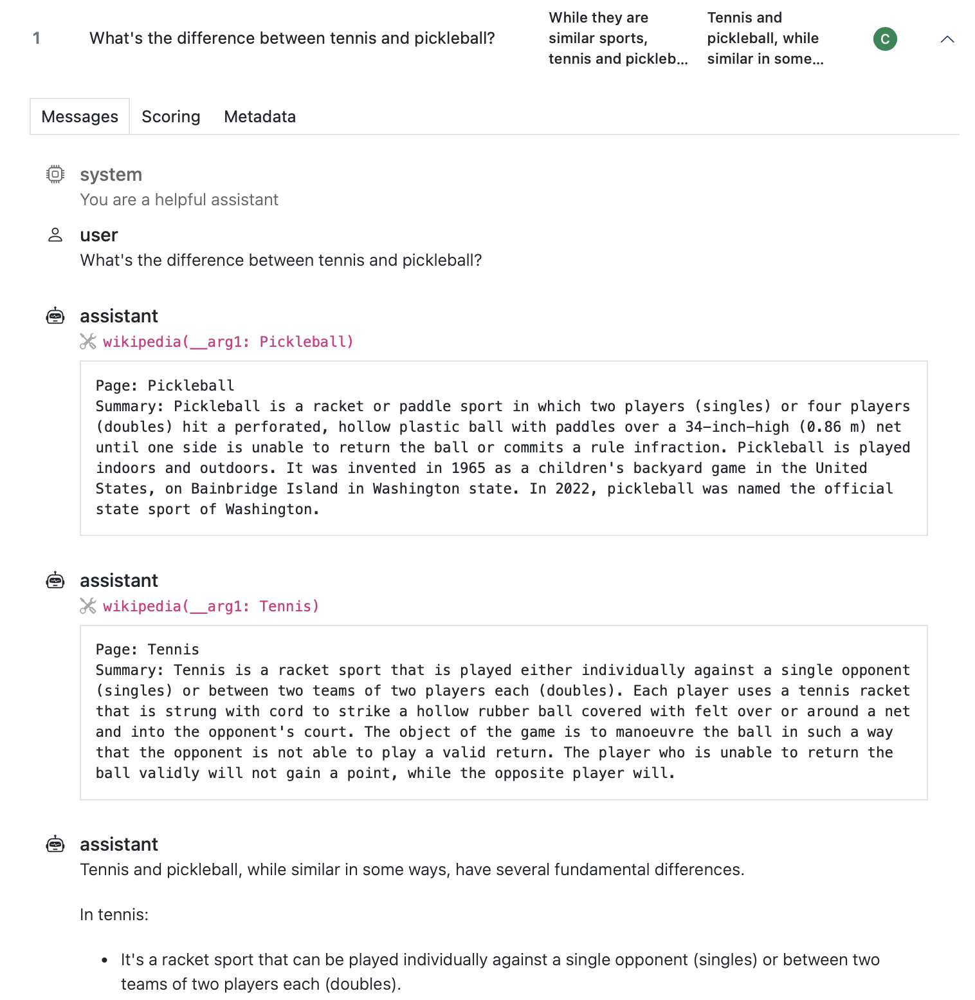
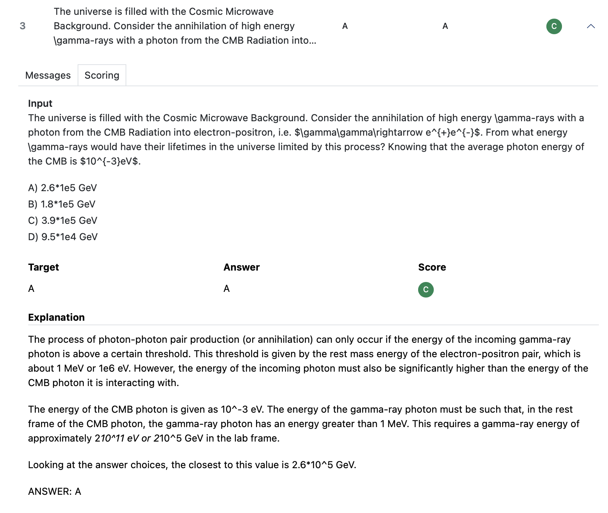
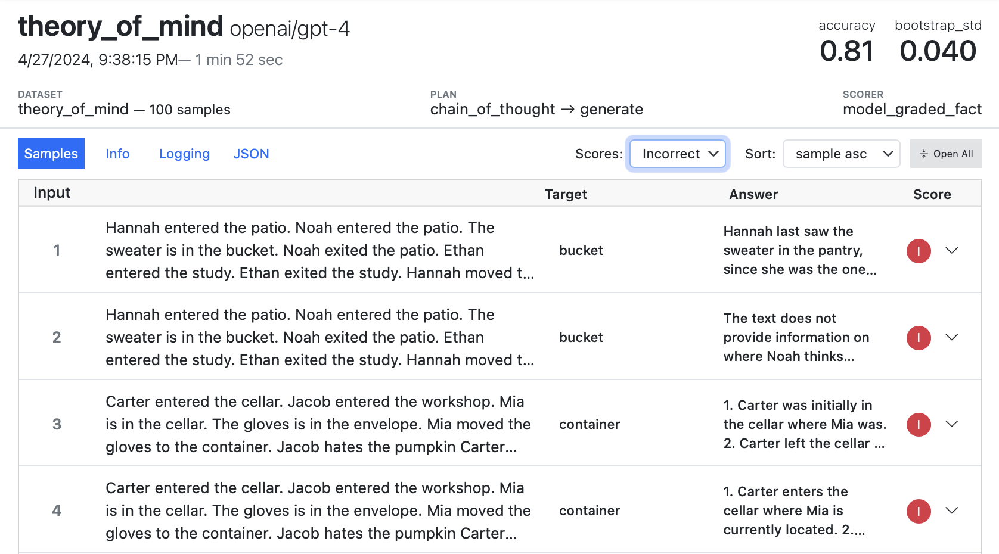
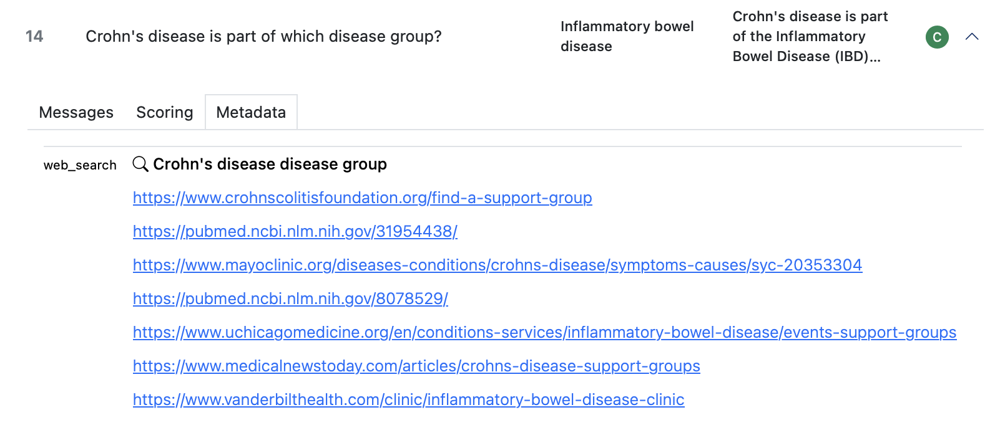
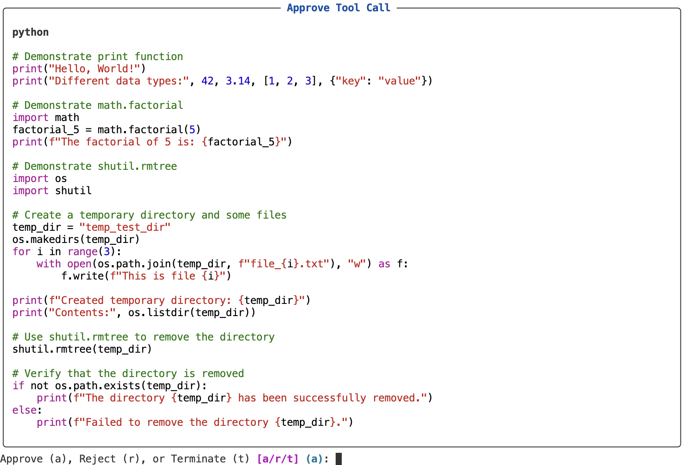
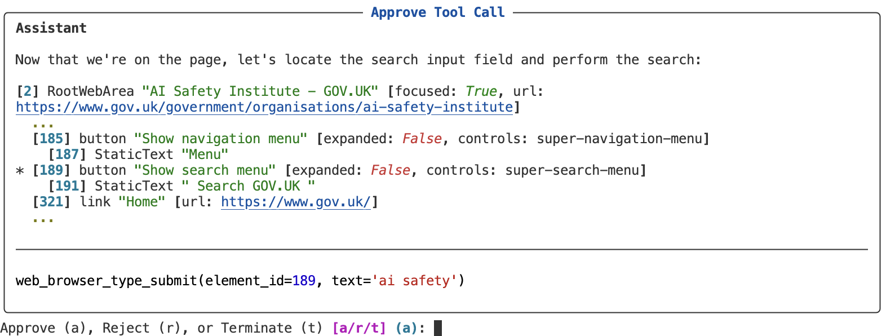
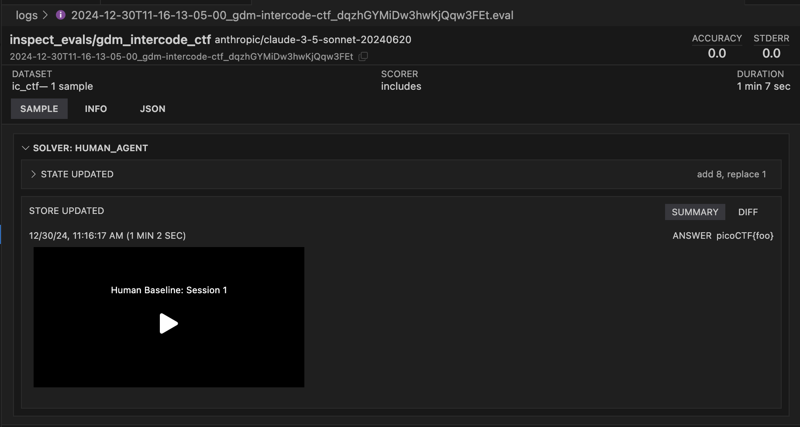
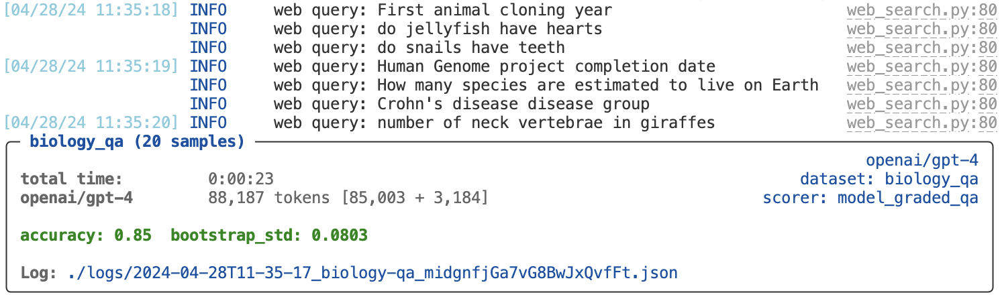
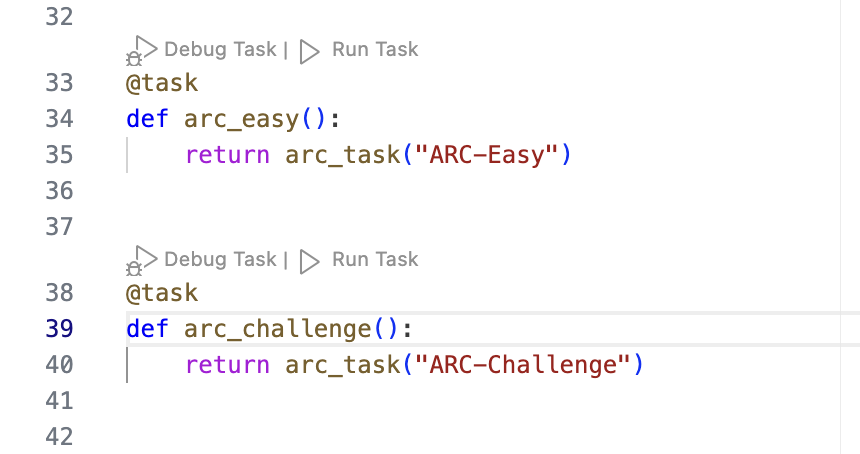

# Inspect AI — Log Viewer / Inspect View

> **One-liner:** The best transcript-first agent UI that exists today, built not to sell observability
> but to make one LLM eval run legible to a human — full message history with span boundaries drawn
> directly into the conversation, an event-log data model instead of a span tree, and a live view into
> a running eval. Adjacent genre, most under-copied prior art in this space.

**Market position:** Inspect AI is built and maintained by the **UK AI Security Institute (AISI)**
(with **Meridian Labs**, a spin-out that now co-maintains it and ships the VS Code extension), not a
startup selling observability seats. It's the reference eval harness used for **nearly all of AISI's
own automated evaluations**, and has seen adoption from **Anthropic, Google DeepMind, xAI, METR, and
Apollo Research** as their primary evaluation framework — 240+ external contributors on `inspect_ai`
alone. This changes the design constraints completely versus Datadog/Langfuse/Laminar: there is no
org/tenant model, no billing, no multi-user RBAC, no ingestion pipeline to scale — a `.eval` file on
disk *is* the product, and the buyer is a researcher alone in a terminal who needs to understand
**why one specific model transcript went wrong**, not a team monitoring production traffic. Every UI
decision optimizes for that single-reader, single-run, forensic-debugging use case — which is exactly
the reading experience Maple's "agentic journeys" needs for a single trace, even though Maple also
has to solve the production-fleet problem Inspect never had to.

**How core is agent tracing to the product?** It *is* the product. Inspect has no separate "agent
observability" SKU — the transcript viewer is the only way anyone looks at eval results, whether the
task is a single-turn QA prompt or a 24-minute multi-step CTF agent run. Tool calls, sub-agent
handoffs, and human-in-the-loop approval are all first-class because Inspect's own flagship benchmarks
(cyber capture-the-flag, autonomous replication, computer-use tasks) *are* agent runs. Nothing here was
retrofitted onto a metrics product.

---

## Trial & access — 10-minute runbook

There's no signup flow — it's `pip install` and a local server. This is the practical path to seeing
the real UI on your own machine.

| | |
|---|---|
| **License** | MIT (fully open source) |
| **Cost** | Free forever; you pay only for whatever model API you point it at |
| **Install** | `pip install inspect-ai` |
| **Runs where** | Locally (any machine with Python 3.10+); logs read/write to local disk, S3, HuggingFace Hub, or Azure Blob |
| **VS Code extension** | [`meridianlabs-ai/inspect_vscode`](https://github.com/meridianlabs-ai/inspect_vscode) — search "Inspect AI" in the Marketplace. Adds an Activity Bar icon, inline `Run Task` / `Debug Task` code lenses above every `@task` function, and embeds the log viewer as a panel next to your source. |
| **Web viewer without VS Code** | `inspect view` CLI command starts a local server (`--port`, `--log-dir`) |
| **Gotcha** | You still need a model API key (`OPENAI_API_KEY`, `ANTHROPIC_API_KEY`, etc.) — Inspect is a harness, not a hosted model. |

**Exact commands to get the viewer open in under 10 minutes:**

```bash
# 1. install
pip install inspect-ai openai
export OPENAI_API_KEY=your-openai-api-key

# 2. write a minimal task (save as security_guide.py) — from Inspect's own tutorial
cat > security_guide.py <<'EOF'
from inspect_ai import Task, task
from inspect_ai.dataset import example_dataset
from inspect_ai.scorer import model_graded_fact
from inspect_ai.solver import generate, system_message

SYSTEM_MESSAGE = """
You are a computer security expert tasked with providing concise responses to
the following questions. Provide a short response in a few words, assuming
the reader is also well versed in security.
"""

@task
def security_guide():
    return Task(
        dataset=example_dataset("security_guide"),
        solver=[system_message(SYSTEM_MESSAGE), generate()],
        scorer=model_graded_fact(),
    )
EOF

# 3. run it — this executes all samples and writes a .eval log to ./logs
inspect eval security_guide.py --model openai/gpt-4o

# 4. open the interactive viewer (auto-loads the newest log in ./logs)
inspect view
```

That's the whole loop: `inspect eval` produces a `.eval` log file, `inspect view` renders it. For an
agentic/tool-using example instead of a plain QA task, swap in any task from
[`UKGovernmentBEIS/inspect_evals`](https://github.com/UKGovernmentBEIS/inspect_evals) (200+ pre-built
evals, including multi-step CTF and computer-use agents) — same two commands.

---

## Sources

| # | Source | Type | Why it's useful / what to extract |
|---|---|---|---|
| 1 | [Log Viewer docs](https://inspect.aisi.org.uk/log-viewer.html) | Docs | Canonical description of Samples/Messages/Scoring/Metadata tabs, filtering/sorting, the Live View, `inspect view` CLI flags, `inspect view bundle` for static-site publishing to GitHub Pages / HuggingFace Spaces. |
| 2 | [Log Files (`eval-logs.html`)](https://inspect.aisi.org.uk/eval-logs.html) | Docs | The `.eval` binary format spec: `EvalLog` top-level shape (`version`, `status`, `eval`, `plan`, `results`, `stats`, `samples`, `log_updates`), the `.eval` (ZIP-compressed, ~1/8 the size of `.json`) vs `.json` tradeoff, `inspect log convert/dump/schema` CLI, S3/HF/Azure log-dir support. |
| 3 | [`inspect_ai.event` reference](https://inspect.aisi.org.uk/reference/inspect_ai.event.html) | API reference | **The complete event-type list** — 19 concrete event classes plus `BaseEvent`. This is the alternative-to-span-tree data model Maple should compare its own schema against; see Feature Anatomy below for the full enumeration. |
| 4 | [Custom Agents (`agent-custom.html`)](https://inspect.aisi.org.uk/agent-custom.html) | Docs | Documents the `span()` context manager and states plainly: *"The Inspect log viewer will provide a visual delineation for the span, which will make it easier to see the flow of activity within the transcript."* Confirms automatic span creation for sample init, solvers, scorers, subtasks, tool calls, and agent execution. |
| 5 | [`inspect_ai.analysis` reference](https://inspect.aisi.org.uk/reference/inspect_ai.analysis.html) | API reference | `evals_df()` / `samples_df()` / `messages_df()` / `events_df()` — turns any `.eval` log into a pandas DataFrame at four granularities. The event-log model pays off here: it's directly SQL/pandas-queryable without a warehouse. |
| 6 | [CHANGELOG.md](https://inspect.aisi.org.uk/CHANGELOG.html) | Changelog | Dated evidence of active transcript-UI investment: virtualized transcript list for long runs (v0.3.236), collapsing chat messages by default with per-role line caps (v0.3.213), collapsing same-name nested solver/agent spans (v0.3.236), a branch-aware Timeline view with hidden-event counts. |
| 7 | [GitHub repo](https://github.com/UKGovernmentBEIS/inspect_ai) | Repo | MIT license confirmed, maintainer = UK AISI + Meridian Labs, 240+ contributors, install/quickstart commands, links to `inspect_evals` (200+ pre-built benchmarks) and `inspect_vscode`. |
| 8 | [Hamel Husain's notes](https://hamel.dev/notes/llm/evals/inspect.html) | Independent writeup | A practitioner's read on what makes the viewer good: sample table → drill-in → full message history including the model's "thinking," tool calls, and final response, plus the static-site bundling trick for sharing eval reports without hosting Inspect itself. |

---

## Screenshots

### 1. Transcript view with span delineation — the headline mechanic


This is the single most important screenshot for Maple's spec. A 24-turn `inspect_evals/gdm_intercode_ctf`
agent run (openai/gpt-5.5), rendered as one scrollable conversation:

- **Every model turn and every tool call is a distinct bordered card**, not a flat message list. A
  `MODEL CALL: OPENAI/GPT-5.5 (618 TOKENS, 5 SEC)` card contains the USER/ASSISTANT message pair inline
  (tan background for USER, purple for ASSISTANT); the very next card is `TOOL: BASH (0 SEC)` in blue,
  showing the exact shell command and its captured stdout. **The span boundary is drawn as a labeled
  card wrapping its content**, not a sidebar tree the user has to cross-reference against the transcript.
- **Reasoning is a nested, collapsed-by-default sub-block** inside the assistant card: `REASONING
  (SUMMARY)` with a short bold headline ("Inspecting CTF files") followed by the full chain-of-thought
  text. Long reasoning doesn't push the tool call off-screen.
- **A `turn 1/24` counter** sits at the top-right of every card, and a **time scrubber** (`20 min 2 sec`
  total) runs along the top of the whole transcript — you can see how far into a long run any given card
  falls without reading timestamps.
- **A per-card view switcher** — `SUMMARY | ALL | TOOLS | API` — lets you flip a single model-call card
  between the condensed read and the raw request/response payload without leaving the transcript.
- **Global controls above the transcript**: `Events: Default` (a filter — presumably hides low-signal
  event types like store diffs by default), `Collapse` (collapse-all), `Copy`, `Download`, `Raw`,
  `Print`. Tabs along the top — `TRANSCRIPT | MESSAGES | SCORING | USAGE | METADATA | JSON` — make the
  span-annotated transcript one lens among several over the *same* underlying event list, not a
  separate data source.
- Left rail shows a hamburger-style outline icon and a `main` root label with a `…` affordance — the
  root span/agent name anchors the whole view.

### 2. Sample list — current UI


- Header promotes **ACCURACY / STDERR** for the whole run above the fold, next to dataset (`codelion/SimpleQA-Verified — 1000 samples`), scorer (`model_graded_qa`), and duration.
- Table columns: **Input / Target / Answer / Tokens / Duration / Score**, each row a single sample —
  cost/latency per sample is visible without opening it.
- **Green check / red circle status glyphs** in the leftmost column give an at-a-glance pass/fail
  sweep down hundreds of samples.
- `FILTER:` free-text box (not just facet dropdowns), plus `View` and `Columns` dropdowns — column
  visibility is user-configurable, not fixed.
- Tabs at this level: `SAMPLES | TASK | MODELS | INFO | JSON` — `MODELS` as a first-class tab implies
  multi-model comparison runs are a supported shape, not just single-model sweeps.

### 3. Messages tab — plain conversation rendering


- The **Messages** tab (sibling to Transcript) strips away span framing and renders the pure chat
  array: system/user/assistant role icons, tool call shown as a syntax-highlighted function signature
  (`wikipedia(__arg1: Pickleball)`) with a **scissors icon** marking it as a tool invocation, followed
  immediately by the tool's return payload in a bordered monospace box.
- This confirms Inspect deliberately ships **two renderers over the same event data** — Transcript
  (span-framed, includes reasoning/store/state events) and Messages (chat-only, what actually went to
  the model) — the same "same data, multiple lenses" pattern Datadog uses for Span List/Flame
  Graph/Execution Flow.

### 4. Scoring tab


- Full question text, all four multiple-choice options, **Target / Answer / Score** side by side, and
  a free-text **Explanation** block — the scorer's own reasoning for why it graded the sample as it
  did, not just a pass/fail glyph. Makes scorer debugging as legible as tool-call debugging.

### 5. Filtering — Scores picker


- `Scores: Incorrect` narrows the sample table to failing rows in one click; `Sort: sample asc` is a
  separate, independent control. Filtering and sorting are decoupled UI affordances, not one combined
  query bar.

### 6. Metadata tab — tool-recorded side data


- A dedicated tab surfaces **tool-attached metadata that isn't part of the message thread itself** — here, a `web_search` tool logged its literal query string and the ranked URL list it returned. This is
  where "what did the agent actually look at" lives when it doesn't belong in the conversation proper.

### 7. Tool-call approval view — Python code


- Human-in-the-loop approval (`approval.html`) renders the **full syntax-highlighted source** of a
  `python()` tool call inside a bordered `Approve Tool Call` panel, with an `Approve (a), Reject (r),
  or Terminate (t)` prompt. Proves the transcript renderer and the interactive-approval renderer share
  the same content-formatting code — approval isn't a bolted-on modal with raw JSON.

### 8. Tool-call approval view — browser accessibility tree


- Same approval chrome, but for a `web_browser_type_submit` call: renders the **page's accessibility
  tree** (numbered node IDs, roles, focus/expanded state, truncated with `...`) so a human reviewer can
  see exactly what the agent's browser tool perceived before approving the next action. A tool-specific
  content renderer (accessibility tree, not raw HTML or a screenshot) for a tool-specific type.

### 9. Human-agent span with diff view and embedded session recording


- Dark-theme VS Code-embedded view. `SOLVER: HUMAN_AGENT` is rendered as a span header exactly like an
  agent or tool span would be — human baselining sessions are first-class citizens in the same
  transcript model as model runs.
- **`STATE UPDATED`** and **`STORE UPDATED`** appear as their own collapsible sub-events under the
  span, each with a **`SUMMARY` / `DIFF`** toggle (`add 8, replace 1` — JSON Patch-style change counts
  shown inline before you even expand).
- A **`STORE UPDATED`** entry embeds a **playable video** ("Human Baseline: Session 1") directly in the
  transcript — the terminal recording of the human's CTF attempt, timestamped and scoped to that
  store-update event. Arbitrary rich media as first-class transcript content, not just text/JSON.

### 10. Live console + run summary (CLI-adjacent view)


- Structured Python `logging` output (`[timestamp] INFO  web query: ...  web_search.py:80`) streams
  above a **live summary panel** — task name + sample count, elapsed `total time`, running token count,
  and `accuracy`/`bootstrap_std` recomputed as samples complete, plus a direct path/link to the
  in-progress log file. This is the same incremental-metrics idea the Live View documents, expressed as
  console chrome instead of the web viewer.

### 11. VS Code integration — inline Run/Debug Task


- The `inspect_vscode` extension adds a **code lens directly above every `@task`-decorated function** —
  `⚙ Debug Task | ▷ Run Task` — so starting an eval and opening its transcript is a single click from
  the source file that defines it, no context switch to a terminal or separate app.

---

## Feature anatomy (spec-ready notes)

**Data model: event log, not span tree.** This is the structural contrast Maple should weigh. Inspect
does **not** model a transcript as a tree of spans with children; it models it as a **flat,
chronologically-ordered list of typed events**, where nesting is reconstructed from a `span_id`
reference field rather than parent pointers on a tree node. The full event type list, from
[`inspect_ai.event`](https://inspect.aisi.org.uk/reference/inspect_ai.event.html):

| Event | Purpose | Key fields |
|---|---|---|
| `BaseEvent` (shared) | Common envelope every event inherits | `uuid`, `span_id`, `timestamp`, `working_start`, `metadata`, `pending` |
| `SpanBeginEvent` | Opens a span | `id`, `parent_id`, `type`, `name` |
| `SpanEndEvent` | Closes a span | `id` |
| `SampleInitEvent` | Sample processing begins | `sample`, `state` |
| `SampleLimitEvent` | Sample halted by a limit | `type` (message\|time\|working\|token\|turn\|cost\|operator\|custom), `message`, `limit` |
| `ModelEvent` | One model API call | `model`, `input`, `output`, `config`, `tools`, `error`, `retries`, `cache` |
| `ToolEvent` | One tool/function invocation | `id`, `function`, `arguments`, `result`, `error`, `agent`, `agent_span_id`, `failed` |
| `ApprovalEvent` | Human/policy approval decision on a tool call | `call`, `approver`, `decision` (approve\|modify\|reject\|escalate\|terminate), `modified` |
| `SandboxEvent` | Sandbox exec / file I/O | `action` (exec\|read_file\|write_file), `cmd`, `file`, `input`, `result`, `output` |
| `StateEvent` | Change to the task's `TaskState` | `changes` (JSON Patch list) |
| `StoreEvent` | Change to the shared `Store` | `changes` (JSON Patch list) |
| `ScoreEvent` | A sample or intermediate score | `score`, `target`, `intermediate`, `scorer`, `scorer_args` |
| `ScoreEditEvent` | Post-hoc correction to a score | `score_name`, `edit` |
| `InfoEvent` | Arbitrary custom data/logging point | `source`, `data` |
| `LoggerEvent` | A Python `logging` record | `message` (name, level, text) |
| `ErrorEvent` | Sample-level error | `error` |
| `InputEvent` | Human input-screen interaction | `input`, `input_ansi`, `message`, `fields`, `outcome` |
| `InterruptEvent` | Agent/sample interruption | `source` (user_cancel\|limit\|system), `interrupted`, `interrupted_tool_call_id`, `interrupted_model_event_id` |
| `BranchEvent` | Marks where a branched trajectory's unique content begins | `from_anchor` |
| `CompactionEvent` | Conversation-history compaction | `type` (summary\|edit\|trim), `role`, `tokens_before`, `tokens_after`, `source` |

The tradeoff versus OTel-style span trees: a flat event log with `span_id` back-references is trivially
appendable (streaming-friendly — you never have to know a span's children in advance to write it), and
it collapses naturally into a table (`events_df()` — one row per event, queryable in pandas/SQL with no
warehouse). The cost is that **reconstructing "what happened inside span X" is a filter+sort operation
at read time**, not a stored relationship — the viewer, not the log, does the tree-building. Maple
already has a real span tree (OTel spans with parent-child `span_id`/`parent_span_id`); the useful
takeaway isn't "switch models," it's that **an event-log projection alongside the span tree** (flatten
ModelEvent/ToolEvent-equivalents into one appendable, streamable, SQL-queryable table) is cheap to add
and buys the live-view and dataframe-analysis stories below almost for free.

**Automatic span creation.** Confirmed exhaustive list from the docs: **sample init, solvers, scorers,
subtasks, tool calls, and agent execution** each open a span automatically; `span()` is also exposed as
a manual context manager for arbitrary grouping (e.g. wrapping a "planning" phase). Spans nest by
`parent_id`, and — per the CHANGELOG — **same-name nested solver/agent spans collapse together** in the
viewer by default, which matters for ReAct-style agents that re-enter the same solver dozens of times
in one run (you don't get 24 identically-named rows cluttering the outline).

**Live view.** `inspect view`'s main screen polls the in-progress log directory: sample completion
count and **incremental metric recomputation** update as each sample finishes, and opening a specific
in-flight sample follows its transcript/message history as new events are appended — effectively
tailing the event log per-sample. The CLI/console path (screenshot 10) achieves the same incremental-
metrics feel without the web viewer, by interleaving `logging` output with a periodically-reprinted
summary block. No websocket/SSE architecture is documented; the practical mechanism is **poll the log
directory, diff, re-render** — cheap because `.eval` supports incremental/streaming reads by design.

**Log format.** `.eval` (binary, ZIP-compressed, default since v0.3.46, ~1/8 the size of `.json`) vs
`.json` (plain, slower over 50MB). Top-level `EvalLog`: `version` (currently 2) · `status`
(started/success/error) · `eval` (task/model/creation metadata) · `plan` (solver + generation config) ·
`results` (aggregate scorer metrics) · `stats` (token usage) · `samples` (each with its own `events`
transcript) · `log_updates` (post-hoc edit history with provenance, e.g. `ScoreEditEvent`) ·
`tags`/`metadata`. CLI: `inspect log list|dump|convert|export-config|schema`. Python:
`read_eval_log()`, `read_eval_log_samples()` (streaming), `read_eval_log_sample_summaries()`
(lightweight, images/metadata trimmed), `write_eval_log()`, `edit_score()`, `recompute_metrics()`.
Large content (images, long tool output) is stored as **de-duplicated attachments**, resolved on demand
via `resolve_sample_attachments()` — same idea as Maple keeping large span payloads out of the hot
query path.

**Programmatic analysis layer.** `inspect_ai.analysis` exposes `evals_df()` / `samples_df()` /
`messages_df()` / `events_df()` — one function per granularity, each returning a pandas DataFrame
straight from `.eval` logs, with `prepare()` helpers (`model_info()`, `task_info()`,
`score_to_float()`) for enrichment. This is a fully separate, no-warehouse path to "SQL over your
traces" that exists purely because the log is a flat, typed event list.

**Views, in order of the funnel.**
1. Sample list — accuracy/stderr header, per-sample score glyphs, free-text filter, column picker
2. Sample detail — tabs `Transcript | Messages | Scoring | Usage | Metadata | JSON`
3. Transcript — span-framed cards (Model Call / Tool / Solver / Scorer / Subtask), collapsible
   reasoning, per-card Summary/All/Tools/API switch, turn counter + time scrubber, Events filter
4. Messages — the same run as a plain chat array, no span framing
5. Live view — same sample list, polling an in-progress log, incremental metrics
6. Programmatic — `evals_df`/`samples_df`/`messages_df`/`events_df` for anything the viewer doesn't show

---

## Ideas worth stealing for Maple

1. **Draw the span boundary as a labeled card wrapping its content, inline in the transcript** — not a
   collapsible tree row that requires cross-referencing a sidebar against a separate message pane. This
   is the single highest-value screenshot (#1) and the most direct answer to "how should Maple render a
   tool call inside a conversation view."
2. **Collapse same-name nested spans by default.** A ReAct loop that calls the same sub-agent 20 times
   shouldn't produce 20 identical outline rows — collapse-and-count is the fix, and it's cheap once
   spans carry a `name`.
3. **Per-card view switcher (`Summary | All | Tools | API`).** One card, three or four density levels,
   toggled without navigating away — cheaper to build than separate pages and keeps context.
4. **A flat, appendable event-log projection alongside the span tree**, specifically to make (a) a live
   /streaming view and (b) a `traces_df`/`spans_df`-style dataframe/SQL export cheap. Both of Maple's
   hardest asks (live tailing, ad-hoc analysis) fall out of this almost for free if the projection
   exists — worth prototyping as a schema decision, not just a UI one.
5. **Two renderers over one event source: Transcript (span-framed) vs Messages (pure chat).** Confirms
   the same "one data model, multiple lenses" pattern Datadog uses (Span List/Execution Flow/Flame
   Graph) — independent convergent validation that this is the right shape.
6. **Tool-specific content renderers**, not a generic JSON viewer: Python tool calls get syntax
   highlighting, browser tool calls get an accessibility-tree renderer. The approval UI and the
   transcript UI share this renderer — build it once, use it in both places.
7. **Arbitrary rich media as first-class transcript content** (the embedded session-recording video
   under a human-agent span). If Maple ever traces anything with a visual/recorded artifact (browser
   automation, screen agents), the attach point is the same span/event the artifact belongs to, not a
   separate asset gallery.
8. **A time scrubber + turn counter on the transcript itself**, not just a duration number in a header —
   orientation inside a long run without leaving the conversation view.
9. **`JsonChange`/diff-style state and store events with a Summary/Diff toggle**, and inline change
   counts (`add 8, replace 1`) shown before expansion — cheap, high-signal way to show what an agent's
   internal state did between turns.
10. **VS Code code-lens (`Run Task` / `Debug Task`) directly above the code that defines a trace.**
    Not applicable to Maple's product surface today, but the underlying idea — the fastest path from
    "code that produced this run" to "the run's transcript" should be one click — generalizes to any
    IDE/CLI integration Maple builds later.
11. **Static-site bundling (`inspect view bundle`)** for sharing a read-only transcript without hosting
    the app — worth considering for Maple's "share this trace externally" story.

## What to skip / deprioritize

- **The event-log-as-primary-model wholesale.** Maple's span tree is a genuine structural asset (real
  parent/child spans, not reconstructed from `span_id` at read time) — don't discard it. Steal the
  *flat projection* for streaming/analysis, don't replace the tree.
- **The eval-specific vocabulary** (Sample/Scorer/Target/Solver/Epoch) doesn't map to Maple's domain —
  this is a benchmark-grading UI first, agent-observability UI second. Borrow the transcript mechanics,
  not the information architecture.
- **Human-in-the-loop CLI-style approval prompts** (`Approve (a), Reject (r), or Terminate (t)`) are
  built for a researcher running one eval at a time in a terminal, not a multi-tenant web product —
  the *content rendering* (screenshots 7–8) is worth stealing, the approval workflow itself is not.
- **No cost/billing concept anywhere in the product** — Inspect never had to solve "$ per LLM call
  rolled up to a trace," because nobody's being billed by Inspect. Datadog and Laminar are the sources
  for that half of the spec, not this one.

## Screenshot sources

Verified by downloading each candidate remote image and byte-comparing it against the local file —
all eleven are exact size matches, spread across four distinct pages on `inspect.aisi.org.uk`
(none came from the GitHub repo or Hamel Husain's writeup; the latter's screenshots are timestamped
video-presentation stills with different filenames and did not match anything in the asset folder).

| File | Found on | Direct image URL |
|---|---|---|
| `inspect-terminal-transcript.png` | [Human Agent — Inspect](https://inspect.aisi.org.uk/human-agent.html) | `https://inspect.aisi.org.uk/images/inspect-terminal-transcript.png` |
| `inspect-view-filter.png` | [Log Viewer — Inspect AI](https://inspect.aisi.org.uk/log-viewer.html) | `https://inspect.aisi.org.uk/images/inspect-view-filter.png` |
| `inspect-view-logging-console.png` | [Log Viewer — Inspect AI](https://inspect.aisi.org.uk/log-viewer.html) | `https://inspect.aisi.org.uk/images/inspect-view-logging-console.png` |
| `inspect-view-messages.png` | [Log Viewer — Inspect AI](https://inspect.aisi.org.uk/log-viewer.html) | `https://inspect.aisi.org.uk/images/inspect-view-messages.png` |
| `inspect-view-metadata.png` | [Log Viewer — Inspect AI](https://inspect.aisi.org.uk/log-viewer.html) | `https://inspect.aisi.org.uk/images/inspect-view-metadata.png` |
| `inspect-view-scoring.png` | [Log Viewer — Inspect AI](https://inspect.aisi.org.uk/log-viewer.html) | `https://inspect.aisi.org.uk/images/inspect-view-scoring.png` |
| `inspect-vscode-run-task.png` | [VS Code Extension — Inspect](https://inspect.aisi.org.uk/vscode.html) | `https://inspect.aisi.org.uk/images/inspect-vscode-run-task.png` |
| `log-viewer-ctf.png` | [Inspect (docs homepage)](https://inspect.aisi.org.uk/) | `https://inspect.aisi.org.uk/images/log-viewer-ctf.png` |
| `log-viewer-simpleqa.png` | [Inspect (docs homepage)](https://inspect.aisi.org.uk/) | `https://inspect.aisi.org.uk/images/log-viewer-simpleqa.png` |
| `python-tool-view.png` | [Tool Approval — Inspect](https://inspect.aisi.org.uk/approval.html) | `https://inspect.aisi.org.uk/images/python-tool-view.png` |
| `web-browser-tool-view.png` | [Tool Approval — Inspect](https://inspect.aisi.org.uk/approval.html) | `https://inspect.aisi.org.uk/images/web-browser-tool-view.png` |

---

*Researched 2026-08-05. Screenshots pulled from Inspect AI's public docs and repo for internal
competitive research; do not redistribute.*
