# Laminar — Open-Source Observability for AI Agents

> **One-liner:** A YC-backed, Rust/ClickHouse-built, OTel-native observability platform built
> *from scratch for agents* (not retrofitted from LLM logging) — and the only tool in this
> competitive set that records a browser agent's session and plays it back scrubbed in lockstep
> with the trace timeline.

**Market position:** YC S24. Raised a **$3M seed** (announced 2026-03-16) led by **Atlantic.vc**,
with **Y Combinator** and **AAL.vc** participating, plus angels **Ben Sigelman** (co-creator of
OpenTelemetry) and **Ant Wilson** (CTO of Supabase) — notable because Sigelman's presence is a
credibility signal specifically on the OTel-native claim. Founders **Robert Kim** (CEO, ex-Palantir/
Bloomberg) and **Dinmukhamed Mailibay** (CTO, ex-AWS payments). Fully open source, **Apache-2.0**,
**3,145 GitHub stars / 219 forks** on `lmnr-ai/lmnr` (repo created Aug 2024). Named customers:
Browser Use, OpenHands, Rye.com, Alai, LegionIntel — all agent/browser-agent shops, consistent with
their positioning. They publish an unusually large amount of competitor-comparison content —
"Laminar vs Langfuse vs LangSmith", "Best Langfuse alternative", "Langfuse Alternatives 2026: 7 Top
Picks", "Top 6 Agent Observability Platforms" — which functions as an SEO play but is also a
genuinely useful distillation of what the market considers table stakes (see Sources #6–7).

**How core is agent tracing to the product?** Maximally core — there is no other product. Unlike
Datadog (APM vendor bolting on an agent view) or Braintrust/Langfuse (eval-first platforms that grew
into tracing), Laminar's own marketing explicitly frames competitors as "retrofitted from an LLM
logging tool" and itself as "built from the start for AI agents." Tracing, transcript rendering,
Signals (pattern detection), the Debugger, and browser session replay are not add-ons to a generic
APM pipeline — the entire backend (Rust ingestion, ClickHouse storage) is designed around
long-running, high-span-count agent traces.

---

## Trial & access

| | |
|---|---|
| **Free tier** | Yes, permanent — **1 GB data**, **$5 in Signals** credit, 7-day retention, 1 project, 1 seat, community support. "No overage" on the free allotments (they simply stop, no surprise bill). |
| **Free trial** | No separate time-boxed trial — the free tier itself is the trial; paid plans are add-on capacity, not a different product tier. |
| **Credit card required?** | **Not stated anywhere in copy** (unlike Datadog, which says "no credit card required" explicitly). Sign-up is OAuth-only — **Continue with Google / GitHub / Microsoft**, no billing form appears before workspace creation — so in practice no CC is collected at signup, but Laminar doesn't make the claim outright. |
| **Registration URL** | https://laminar.sh/sign-in (redirects from `www.lmnr.ai/sign-in`) |
| **Signup fields** | None beyond the OAuth provider consent screen — no name/company/job-title form. Fastest signup of any tool in this competitor set. |
| **Paid entry point** | **Starter $30/mo** (3 GB incl., then $2/GB; $15 Signals credit, 30-day retention, unlimited projects/seats). **Pro $150/mo** (10 GB incl., then $1.50/GB; $50 Signals credit, 6-month retention). **Enterprise**: custom, adds on-premise deployment. |
| **Self-serve to the feature?** | Yes — `pip install lmnr` / `npm i @lmnr-ai/lmnr`, one line of `Laminar.initialize()`, or point raw OTLP at their collector. No sales call for cloud. |
| **Self-hosting story** | Fully **Apache-2.0** OSS. `git clone` + `docker compose up -d` gives a stack of frontend, app server, PostgreSQL, ClickHouse, and Quickwit (full-text search). Production path is a **Helm chart** adding RabbitMQ + Redis + a dedicated processing consumer. Core product surface (tracing, search, dashboards, evaluations, the Debugger, "Chat with trace") is identical across self-host and cloud. |
| **Gotcha** | **Signals, signal-event clustering, and email/Slack alerts require an enterprise license key (`LMNR_LICENSE_KEY`) even when self-hosting** — the flagship pattern-detection feature is the one thing gated behind a paid key in the "open source" product. Self-hosted deployments also must bring their own LLM provider key for AI features (Chat-with-trace, Signals); cloud includes it. |

---

## Sources

| # | Source | Type | Why it's useful / what to extract |
|---|---|---|---|
| 1 | [How Laminar is using ClickHouse to reimagine observability for AI browser agents](https://clickhouse.com/blog/how-laminar-reimagined-observability-for-ai-browser-agents) | Vendor eng blog (ClickHouse) | **The technical deep-dive on session replay + storage.** Confirms: rrweb-style DOM-diff capture (not video — "too slow and unbearable for the user experience"), Playwright patched to inject event listeners, SDK streams events to a Rust backend. Scale: 500K+ browser events/day, 1B+ total events, 50B+ read ops, P90 insert 150ms / P90 select 60ms, 30+ minute sessions load "almost instantly." Confirms **"20x trace compression"** via message hashing/deduplication on ClickHouse's columnar store. |
| 2 | [Browser Session Replay](https://laminar.sh/docs/tracing/browser-agent-observability) | Docs | The product-facing spec for the #1 priority feature. Supported frameworks: **Browser Use, Stagehand, Puppeteer, Playwright, Skyvern**. Sync described as bidirectional: "scrubbing the recording keeps the trace timeline in sync." Input masking config (`sessionRecordingOptions` / `maskInputOptions: {text, textarea, email, tel, number}`) for PII. Embeds a demo video (downloaded and frame-extracted for this doc, see screenshots). |
| 3 | [Sessions](https://laminar.sh/docs/tracing/structure/sessions) + [Viewing Traces](https://laminar.sh/docs/platform/viewing-traces) | Docs | **The #2 priority feature, confirmed against real UI screenshots.** Sessions tab on the Traces page = a table (duration, cost, tokens, trace count, user ID) per `session_id`. Opening a session renders every trace in it as a numbered card (`1/5`, `2/5`, …) with auto-extracted Input + last-LLM-span Output inline — confirmed pixel-for-pixel against `session-detail-trace-cards.png` below. Also documents **Transcript / Tree / Timeline / Custom** as four interchangeable render modes over one trace. |
| 4 | [OpenTelemetry integration](https://laminar.sh/docs/tracing/otel) | Docs | The portability story. Laminar ingests **raw OTLP (gRPC, HTTP/protobuf, HTTP/JSON)** with no proprietary SDK required, and is "fully compatible with the `gen_ai` semantic conventions." Reads `gen_ai.system`, `gen_ai.usage.{input,output}_tokens`, `gen_ai.usage.{request,response}_model`, `gen_ai.prompt.{i}.{content,role}` — plus two Laminar-specific attributes layered on top: `lmnr.span.type` (LLM vs DEFAULT) and `lmnr.span.path` (hierarchical path string). Confirms traces are portable — fan out a second OTLP exporter to any other backend without touching instrumentation. |
| 5 | [Laminar vs Langfuse vs LangSmith](https://laminar.sh/blog/2026-01-29-laminar-vs-langfuse-vs-langsmith-llm-observability-compared) and [Best Langfuse alternative](https://laminar.sh/blog/2026-02-13-laminar-vs-langfuse-why-we-prefer-laminar) | Comparison blogs | **Table-stakes vs. differentiated, from a vendor with incentive to be precise.** Claims Langfuse's data model (nested "observations": generations/spans/events) is "not optimized for the read-the-agent's-transcript workflow that defines multi-agent debugging" — i.e., a generation-centric schema fights you once traces get agentic. Positions data-volume pricing against LangSmith's seat-based ($39/user) model. Notably: **neither article mentions session replay or OTel** — those only show up in the "Top 6" ranking piece (#6), suggesting Laminar treats replay as a differentiator worth a dedicated pitch, not a comparison-table checkbox. |
| 6 | [Top 6 Agent Observability Platforms (2026)](https://laminar.sh/article/top-6-agent-observability-platforms) | Comparison article | **The clearest table-stakes/differentiator split in their content.** Table stakes: handling thousands of spans per trace, non-deterministic tool-call ordering, nested failure causality, session continuity across process invocations. Differentiators: trace compression, transcript-style rendering, natural-language pattern extraction (Signals), coding-agent-driven replay debugging, SQL access, and — explicitly — "browser-agent session replay syncing DOM state to spans, so you can see what the agent saw when it made a decision." States Laminar and Arize Phoenix are the only two with native OTel support "from day one" (vs. Langfuse/LangSmith offering OTLP endpoints as a bolt-on). |
| 7 | [lmnr-ai/lmnr on GitHub](https://github.com/lmnr-ai/lmnr) | OSS repo | License (Apache-2.0), star count (3,145), self-hosting entry point, and the frameworks their SDK auto-instruments: Vercel AI SDK, Browser Use, Stagehand, LangChain, OpenAI, Anthropic, Gemini. |
| 8 | [Self-hosting overview](https://laminar.sh/docs/self-hosting/overview) | Docs | Deployment topology: Docker Compose (frontend + app server + Postgres + ClickHouse + Quickwit) for single-node; Helm chart (+RabbitMQ, +Redis, +dedicated consumer) for production. Confirms the Signals/Slack enterprise-license gate even in self-hosted mode. |

---

## Screenshots

### 1. Browser session replay synced with the trace timeline — the headline feature
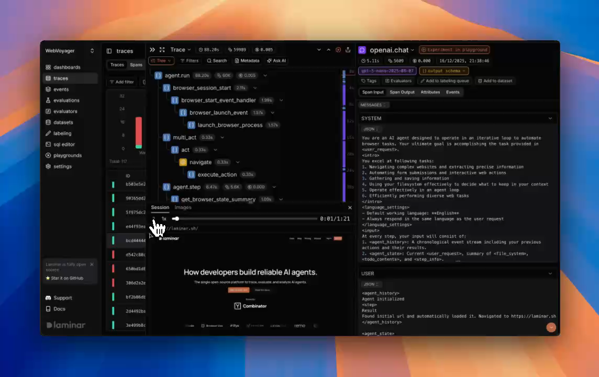
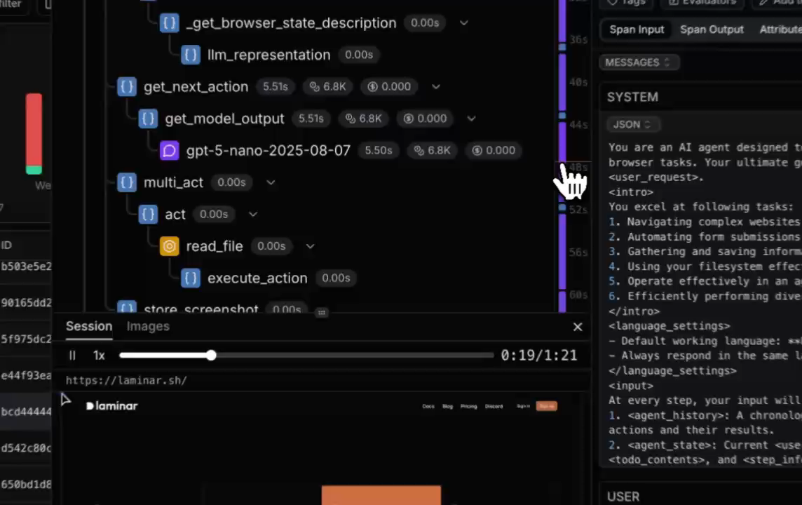

Frame-extracted from Laminar's own product demo video (`images/browser.mp4`, embedded on their
browser-agent-observability docs page). Two moments in the same 1:21 recording:

- **Layout is a three-pane workbench, not a modal**: left = trace list, center = span tree
  (`agent.run` → `browser_session_start` → `multi_act` → `act` → `navigate`/`execute_action`), right
  = selected span's `Span Input`/`Span Output`/`Attributes`/`Events` with the raw LLM messages
  (`SYSTEM`/`USER` JSON, agent prompt with `<intro>`/`<language_settings>`/`<input>` XML tags).
- **The replay lives in its own docked panel below the span tree**, behind a `Session | Images`
  tab pair — Session is the rrweb-style DOM replay, Images is presumably raw screenshot frames
  captured alongside it.
- **Transport controls are a real video scrubber**: play/pause, `1x` speed control, a draggable
  progress bar, and elapsed/total time (`0:19/1:21`). It renders the actual page
  (`https://laminar.sh/`) with real layout, not a static screenshot — confirms DOM-diff replay, not
  a slideshow.
- **A synced position indicator rides the right edge of the span-tree panel**: in frame 2, a
  vertical strip with time ticks (`36s`, `40s`, `44s`, `48s`, `52s`, `56s`, `60s`) and a highlighted
  purple/blue segment — this is the scroll-position minimap for the span list, keyed to the same
  clock as the video scrubber, so the visible span window and the visible video frame move together.
- Trace-level stat bar at top: name (`Trace`), duration (`88.2s`), token count (`59899`), cost
  (`$0.005`) — same "cost + tokens above the fold" pattern as Datadog.
- Model/duration/token/cost badges are inline on every span row (`agent.run 88.20s · 60K · $0.005`,
  `gpt-5-nano-2025-08-07`), not hidden behind a click.

### 2. Sessions table — the session list
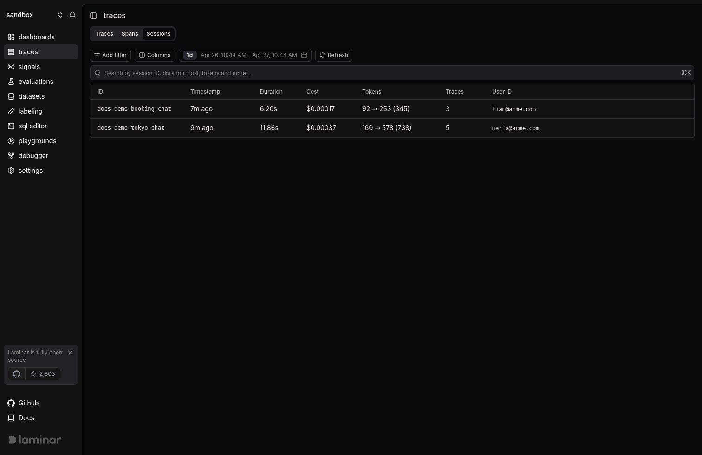

- `Traces` page has three tabs — **`Traces` | `Spans` | `Sessions`** — sessions is a first-class
  peer of the trace list, not buried in a filter.
- Columns: **ID** (the `session_id` string, e.g. `docs-demo-tokyo-chat`), **Timestamp**,
  **Duration**, **Cost**, **Tokens** (shown as `input → output (total)`, e.g. `160 → 578 (738)`),
  **Traces** (count), **User ID**.
  Reading a whole conversation's cost/token footprint from one row, before opening anything, is the
  win here.

### 3. Session detail — numbered trace cards with Input/Output preview
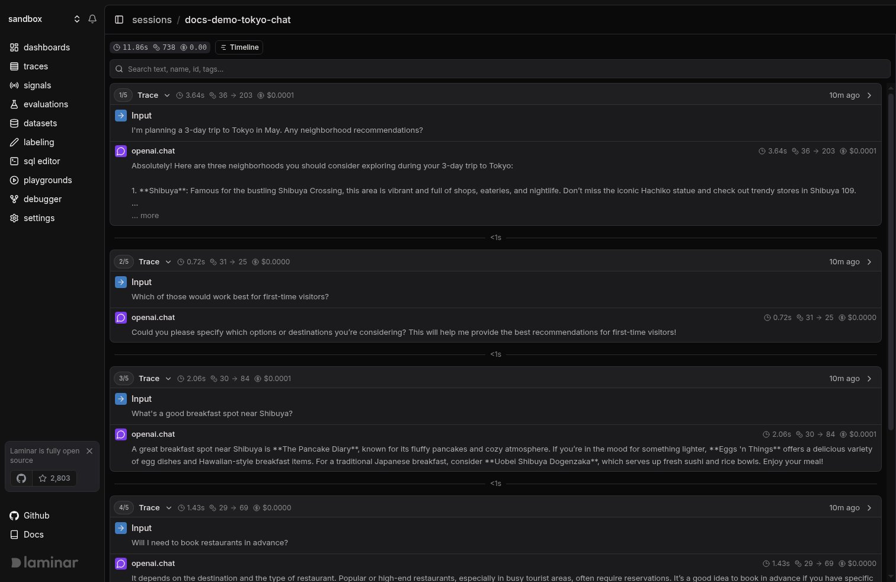

The feature the user flagged as priority #2, confirmed directly against the product:

- Each trace in the session renders as a card headed **`1/5 Trace ⌄`**, **`2/5 Trace ⌄`**, etc. —
  literal position-of-total numbering, not just a timestamp-ordered list.
- Card header carries the same stat badges as everywhere else: duration (`3.64s`), tokens
  (`36 → 203`), cost (`$0.0001`), relative time (`10m ago`), and a chevron to collapse/expand.
- Card body is exactly two rows: an **Input** block (blue arrow icon, the user turn) and the
  **last LLM span's output** (`openai.chat`, with its own duration/token/cost badges and a
  `... more` truncation link for long completions). No tool calls, no intermediate spans — just
  enough to read the conversation like a transcript.
- **Gap timers between cards** (`<1s`) show the real-world latency between turns, distinguishing
  "the model was fast" from "the user took a while to respond."
- A `Timeline` toggle button top-right switches the same session to a duration/latency view (see
  screenshot 6), and a search bar filters by "text, name, id, tags" across the whole session.
- A small breadcrumb (`sessions / docs-demo-tokyo-chat`) confirms this is a drill-down from
  screenshot 2's table row, not a separate page.

### 4. Transcript view — single agent
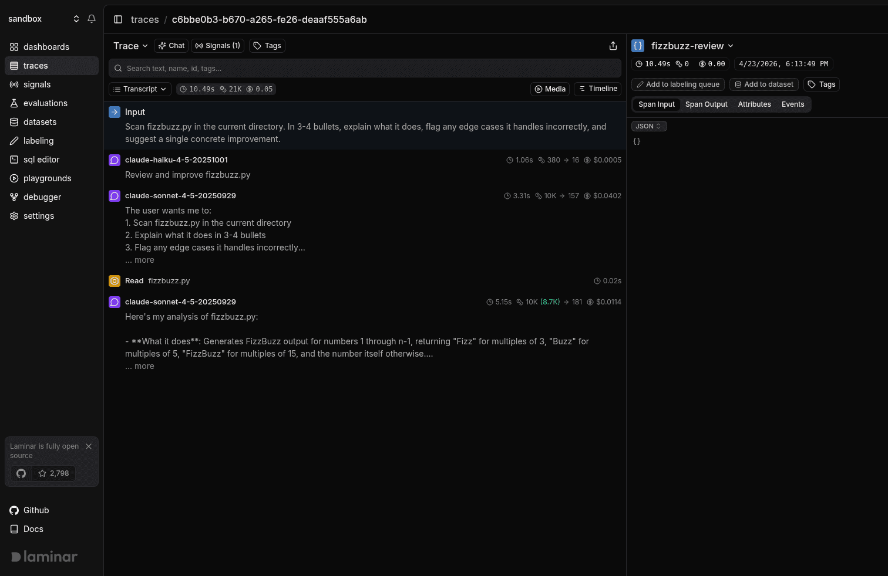

- Default trace-detail view mode (selector reads **`Transcript ⌄`**, with `Tree`/`Timeline`/`Media`
  as alternates — a fourth tab beyond Datadog's three).
  Trace header carries **`Chat` | `Signals (1)` | `Tags`** actions plus the same
  duration/token/cost stat bar (`10.49s · 21K · $0.05`).
- Rows read like a conversation: `Input` → `claude-haiku-4-5` turn → `claude-sonnet-4-5` turn
  (truncated with `... more`) → a **`Read` tool call rendered as its own labeled row** (icon +
  filename `fizzbuzz.py`, not folded into the LLM turn) → final answer.
  This is the "elide wrapper spans, keep the ones that carry information" philosophy in practice.

### 5. Transcript view — multi-agent with subagent cards
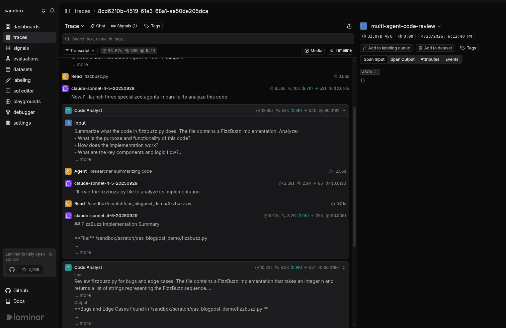
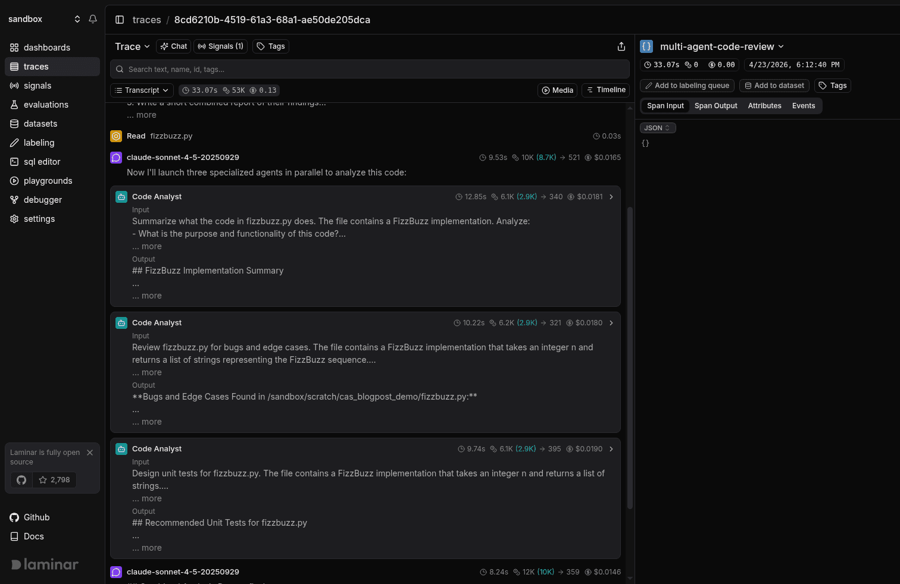

- When the root agent spawns subagents (`Now I'll launch three specialized agents in parallel...`),
  each subagent invocation collapses into a **named card** — `Code Analyst`, with its own
  duration/token/cost badges — showing just **Input** and **Output** text, truncated.
  Three sibling `Code Analyst` cards (one per parallel task: summarize, find bugs, design tests)
  stack directly under the parent turn, so fan-out is visible without a graph renderer.
- The second screenshot shows the **same card expanded in place** (chevron flips), revealing the
  subagent's actual LLM turns and a `Read` tool call nested inside — progressive disclosure, same
  pattern Datadog uses for its Agent Manifest node expansion, but here it's the default browsing
  mode for the whole trace rather than a special panel.

### 6. Tree view and Timeline view — alternate renderers, same trace
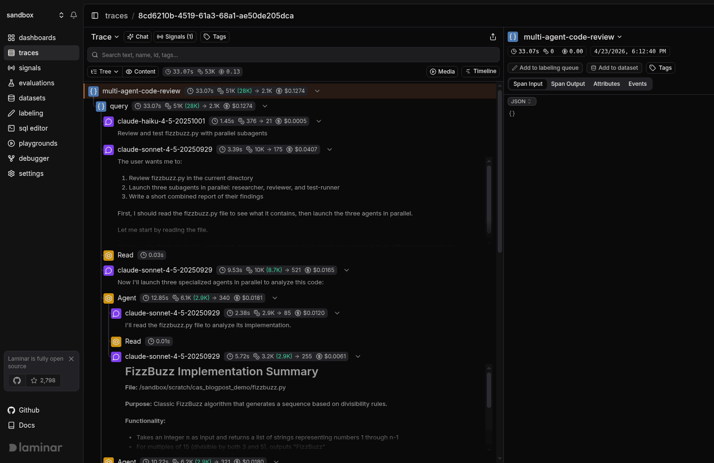
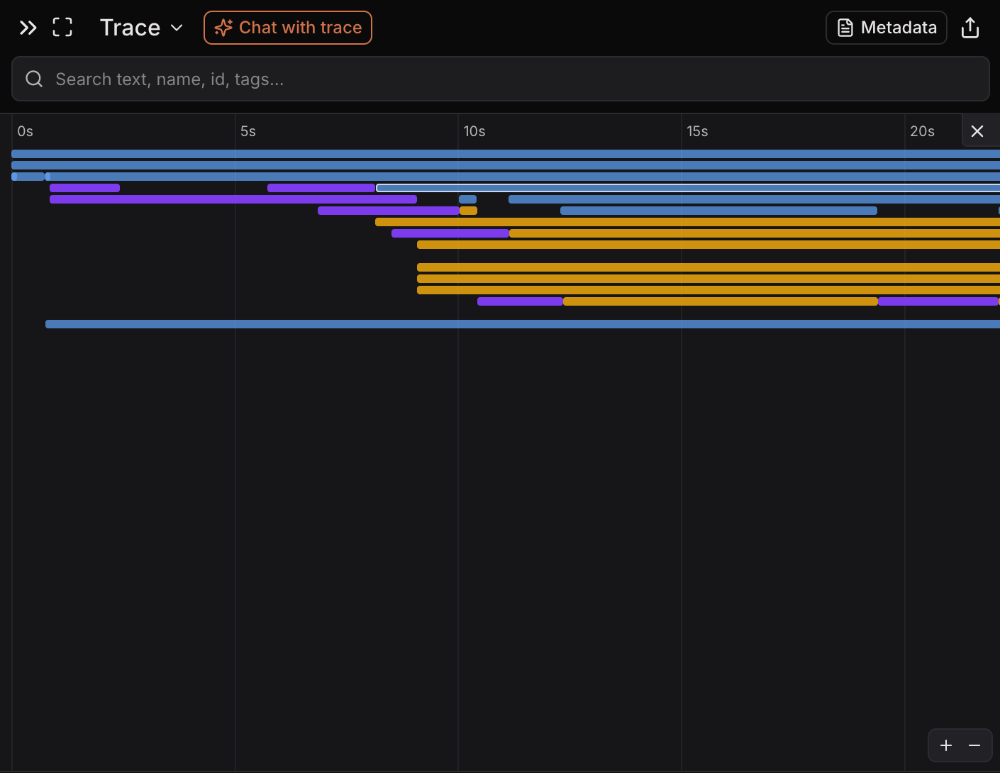

- Tree view keeps the card-per-subagent grouping but nests it under explicit parent rows
  (`claude-sonnet-4-5` → three `Code Analyst` children indented beneath), for when hierarchy matters
  more than reading order.
- Timeline view is a flame graph: colored bars per span (blue/purple/orange by span type) on a time
  axis (`0s`–`20s` visible), with a persistent **`✨ Chat with trace`** button in the header next to
  the view switcher and a `Metadata` button — chat is treated as a peer action to changing view mode,
  not a separate page.

### 7. Metadata panel with multi-span selection
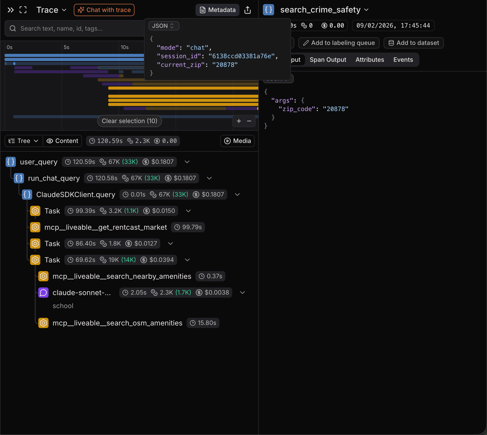

- Metadata panel renders trace-level context as syntax-highlighted JSON: `mode: "chat"`,
  `session_id: "6138ccd03381a76e"`, `current_zip: "20878"` — free-form key-value context set by the
  caller, surfaced without digging into span attributes.
- Timeline view supports **drag-select across multiple spans** (`Clear selection (10)` chip) — a
  bulk-selection affordance not present in the transcript or tree views.
- Below the fold: a real production trace tree with **MCP tool spans** named directly after the
  tool (`mcp__liveable__get_rentcast_market`, `mcp__liveable__search_nearby_amenities`,
  `mcp__liveable__search_osm_amenities`) — confirms their span-naming convention just uses the raw
  tool/function name, no abstraction layer renames it.

### 8. GitHub README — traces list, Signals failure detector, and cost heatmap
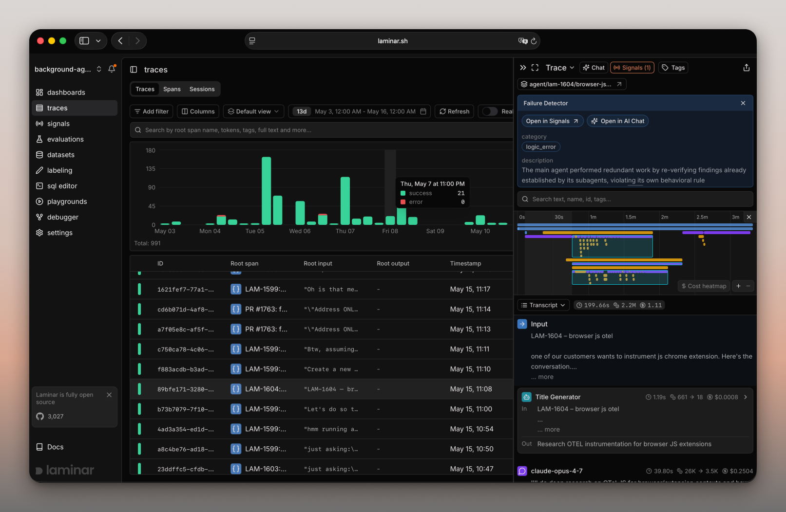

The primary screenshot in the OSS README — the most information-dense single image found:

- **Traces list has a stacked time-bucketed bar chart** (green=success, red=error) above the table,
  with a hover tooltip (`Thu, May 7 at 11:00 PM · success 21 · error 0`) — volume-over-time is the
  first thing you see, before any row.
  Table columns: ID, Root span, **Root input**, **Root output**, Timestamp — root input/output as
  dedicated columns (not just a combined preview blob) is a small but real difference from
  Datadog's single-preview-pair row.
- **Signals in action**: a `Failure Detector` card floats over the timeline with
  `category: logic_error` and a generated natural-language `description`: *"The main agent
  performed redundant work by re-verifying findings already established by its subagents, violating
  its own behavioral rule."* Two actions: `Open in Signals`, `Open in AI Chat`. This is the
  plain-English-rule-to-Slack-ping pipeline made concrete — a Signal fired, attached itself to the
  exact trace, and explained itself in one sentence.
- **`$ Cost heatmap` toggle** sits next to the zoom `+`/`–` controls on the timeline — an alternate
  coloring mode for the same flame graph, presumably shading bars by $ instead of by span type.
- Left rail confirms the full nav: `dashboards, traces, signals, evaluations, datasets, labeling,
  sql editor, playgrounds, debugger, settings` — **`sql editor`** and **`debugger`** as first-class
  nav items, not admin-only tooling.

---

## Feature anatomy (spec-ready notes)

**Data model.** Trace → Span (typed `LLM` / `DEFAULT` / tool-call spans render with distinct icons).
Attributes: `lmnr.span.type`, `lmnr.span.path` (hierarchical path string) layered on top of standard
OTel + `gen_ai.*` semconv attributes. Trace-level free-form `metadata` (JSON), `session_id`,
`user_id`, `tags` — sessions and users are first-class grouping keys, not an afterthought (contrast
with Datadog, which has no session concept).

**Ingestion.** SDK (`lmnr` on PyPI, `@lmnr-ai/lmnr` on npm) auto-instruments Vercel AI SDK, Browser
Use, Stagehand, LangChain, OpenAI, Anthropic, Gemini. Backend also accepts raw OTLP (gRPC, HTTP/
protobuf, HTTP/JSON) with no SDK at all, reading `gen_ai.*` conventions directly — same
"proprietary-SDK-optional" story as Datadog.

**Views over one trace, all switchable from one selector:** `Transcript` (default, conversation
reading order, subagents collapse into named preview cards) → `Tree` (hierarchy-first) →
`Timeline` (flame graph, drag-multi-select, cost-heatmap coloring) → `Custom` (project-defined JSX
render templates driven by SQL filters, for repetitive patterns like eval diffs). Persistent
`Chat with trace` / `Metadata` buttons sit beside the view switcher regardless of which view is
active.

**Sessions.** `Traces` page has a `Sessions` tab: table of `session_id` → duration/cost/tokens/trace
count/user ID. Opening one shows every trace as a numbered card (`i/N`) with Input + final-LLM-output
preview, a gap timer between cards, and a `Timeline` toggle for the same session. Set via
`Laminar.set_trace_session_id(id)` (Python, must be called inside a span) or `sessionId` passed to
`observe()` (TS).

**Browser session replay (the standout).**
- Capture: rrweb-style DOM-diff recording, not video — described by the CEO as avoiding video
  because it's "too slow and unbearable for the user experience." Playwright is patched to inject
  event listeners; the SDK streams events to the backend.
- Supported automation frameworks: Browser Use, Stagehand, Puppeteer, Playwright, Skyvern.
- Storage/scale (per the ClickHouse partnership blog): 500K+ events/day, 1B+ events total, P90
  insert 150ms, P90 select 60ms, 30+ minute sessions load "almost instantly," attributed to
  ClickHouse's columnar compression on what Kim calls "div, div, div" DOM-diff payloads.
- Sync: a docked replay panel (`Session | Images` tabs) sits below the span tree with standard video
  transport (play/pause, speed, scrub bar, elapsed/total). Scrubbing moves a synced position
  indicator on the span-tree panel's right edge (time-ticked minimap); the relationship is
  bidirectional per the docs ("scrubbing the recording keeps the trace timeline in sync").
- PII: `sessionRecordingOptions.maskInputOptions` (`text`, `textarea`, `email`, `tel`, `number`)
  masks form fields at capture time.

**Signals.** A Signal = plain-language prompt + JSON output schema + trigger condition. Runs against
every matching trace, emits a `signal_event` row (linked back to the source trace) whenever it
matches. Example categories: loop/no-progress detection, user-intent classification, repeated-user-
friction detection, cost/waste patterns ("long context, short answer"). Fires can post to Slack.
**Enterprise-gated even self-hosted** via `LMNR_LICENSE_KEY`.

**Debugger.** Re-runs an agent from a specific span, with prior span outputs cached so re-execution
doesn't repay every upstream LLM call — explicitly framed as something a coding agent (Claude Code,
Cursor) can drive directly against a failing trace.

**SQL editor.** Direct query access to the underlying ClickHouse tables from inside the product nav
— no separate BI tool needed for ad hoc analysis across traces/spans/evaluations.

---

## Ideas worth stealing for Maple

1. **Browser session replay synced to the trace timeline** — the single most distinctive feature in
   this entire competitive set and directly relevant if Maple's agentic journeys ever touch
   browser-using agents. Key implementation insight to copy: **record DOM diffs (rrweb), not video**
   — cheaper to store, faster to load, and it's what makes 30-minute sessions load "almost
   instantly." The sync mechanism (scrub video → highlight/scroll span tree, and vice versa) only
   needs a shared clock (video-relative-ms ↔ span start-offset-ms), which is a modest addition once
   spans already carry precise timestamps.
2. **Numbered trace cards in a session view (`1/5`, `2/5`, …) with Input + last-LLM-output preview.**
   Cheap to build (it's just the session's traces, each summarized by its own root input and its
   last LLM-kind span's output) and it turns a multi-turn agent conversation into something
   scannable without opening each trace — this is exactly the sessions-as-top-unit gap Datadog is
   missing and Maple could close.
3. **Transcript view as the default trace renderer**, with subagents collapsing into named preview
   cards that expand in place. Simpler to implement than Datadog's graph renderer and arguably more
   readable for the common "one agent, some tool calls, maybe subagents" case — worth having as the
   *default* view with a graph/flame-graph as the power-user alternative, not the other way around.
4. **Signals — plain-English pattern detection over every trace, with a generated one-sentence
   explanation attached to the specific trace that matched.** The UX of a floating "Failure
   Detector" card with `category` + generated `description` + `Open in AI Chat` action is more
   actionable than a static eval score.
5. **`Chat with trace` as a persistent header action, not a separate page** — same idea Datadog has
   ("Ask AI"), confirmed here as consistently docked next to the view switcher regardless of which
   trace view is open.
6. **Root Input / Root Output as dedicated table columns** on the trace list, not folded into one
   truncated preview string — slightly more scannable than Datadog's single two-line preview.
7. **SQL editor and Debugger as first-class left-nav items.** Signals a target user (developers who
   want raw query access and want to re-run failing agents from a checkpoint) — worth considering
   once Maple's agent trace data model stabilizes.
8. **Cost heatmap as an alternate flame-graph coloring mode**, toggled next to zoom controls — cheap
   variant of an existing view rather than a new page.

## What to skip / deprioritize

- **Gating the flagship pattern-detection feature (Signals) behind an enterprise license even in the
  open-source self-hosted build** is a licensing decision, not a product one — irrelevant to Maple's
  architecture choices, but worth noting as a thing *not* to imitate if Maple wants "open source"
  to mean something to self-hosters.
- **The Quickwit + RabbitMQ + Redis production topology** for self-hosted Laminar is real
  infrastructure complexity for a v1 — Maple already has ClickHouse/Tinybird; don't import Laminar's
  stack shape, just the sync mechanism and UI ideas.
- **OAuth-only signup with zero form fields** is a nice trial-friction reducer but is an auth/infra
  decision unrelated to the agent-tracing feature itself.
- Their competitor-comparison content strategy (SEO-driven "X alternatives" articles) is useful to
  *mine*, as done above, but not something to emulate as a deliverable.

---

## Screenshot sources

| File | Found on | Direct image URL |
|---|---|---|
| `browser-session-replay-frame.png` | [Session replay for browser agents - Laminar documentation](https://laminar.sh/docs/tracing/browser-agent-observability) | `— (frame extracted from embedded video)` |
| `browser-session-replay-frame2.png` | [Session replay for browser agents - Laminar documentation](https://laminar.sh/docs/tracing/browser-agent-observability) | `— (frame extracted from embedded video)` |
| `github-readme-trace.png` | [lmnr-ai/lmnr (GitHub README)](https://github.com/lmnr-ai/lmnr) | `https://raw.githubusercontent.com/lmnr-ai/lmnr/main/images/trace-screenshot.png` |
| `metadata-view.png` | [Viewing Traces - Laminar documentation](https://laminar.sh/docs/platform/viewing-traces) | `https://mintcdn.com/laminarai/VCesC-sVGbi0XUXP/images/metadata-view.png?fit=max&auto=format&n=VCesC-sVGbi0XUXP&q=85&s=b51618c65515b661c544ad464b02e4f6` |
| `session-detail-trace-cards.png` | [Sessions - Laminar documentation](https://laminar.sh/docs/tracing/structure/sessions) | `https://mintcdn.com/laminarai/-q9WJgn2x9iWK3Su/images/trace-session.png?fit=max&auto=format&n=-q9WJgn2x9iWK3Su&q=85&s=9a06b71f3db6ffbcf274c478f3e359a4` |
| `sessions-table.png` | [Sessions - Laminar documentation](https://laminar.sh/docs/tracing/structure/sessions) | `https://mintcdn.com/laminarai/-q9WJgn2x9iWK3Su/images/sessions.png?fit=max&auto=format&n=-q9WJgn2x9iWK3Su&q=85&s=e5bdfe4776a782b3ea06246223c84748` |
| `timeline-view.png` | [Viewing Traces - Laminar documentation](https://laminar.sh/docs/platform/viewing-traces) | `https://mintcdn.com/laminarai/bjc-L04_tqSczLDy/images/timeline-view.png?fit=max&auto=format&n=bjc-L04_tqSczLDy&q=85&s=b72bc8ef24376b46e7b744eba93dad64` |
| `transcript-multi-agent-tree.png` | [Viewing Traces - Laminar documentation](https://laminar.sh/docs/platform/viewing-traces) | `https://mintcdn.com/laminarai/6XrcpP0N-JHhzaOH/images/transcript-view/multi-agent-tree.png?fit=max&auto=format&n=6XrcpP0N-JHhzaOH&q=85&s=93851145884d9cb303ba0080c7aec718` |
| `transcript-multi-agent.png` | [Viewing Traces - Laminar documentation](https://laminar.sh/docs/platform/viewing-traces) | `https://mintcdn.com/laminarai/6XrcpP0N-JHhzaOH/images/transcript-view/multi-agent.png?fit=max&auto=format&n=6XrcpP0N-JHhzaOH&q=85&s=8fa75c1338df30f7cfdcda228eaa6249` |
| `transcript-single-agent.png` | [Viewing Traces - Laminar documentation](https://laminar.sh/docs/platform/viewing-traces) | `https://mintcdn.com/laminarai/6XrcpP0N-JHhzaOH/images/transcript-view/single-agent.png?fit=max&auto=format&n=6XrcpP0N-JHhzaOH&q=85&s=1ace5ceea34be3b4781cebf24cb38475` |
| `transcript-subagent-expanded.png` | [Viewing Traces - Laminar documentation](https://laminar.sh/docs/platform/viewing-traces) | `https://mintcdn.com/laminarai/6XrcpP0N-JHhzaOH/images/transcript-view/subagent-expanded.png?fit=max&auto=format&n=6XrcpP0N-JHhzaOH&q=85&s=121a8000742f61373389b017f39c98ee` |

Nine of the eleven files were confirmed by an exact MD5 checksum match against the freshly
re-downloaded source image. The two `browser-session-replay-frame*.png` files are the ffmpeg
frame-extraction special case noted in the task brief — they were pulled from the `images/browser.mp4`
demo video embedded on the browser-agent-observability docs page, not downloaded as standalone
images, so there is no direct image URL to recover.

---

*Researched 2026-08-05. Screenshots pulled from Laminar's public docs and blog for internal
competitive research; do not redistribute.*
