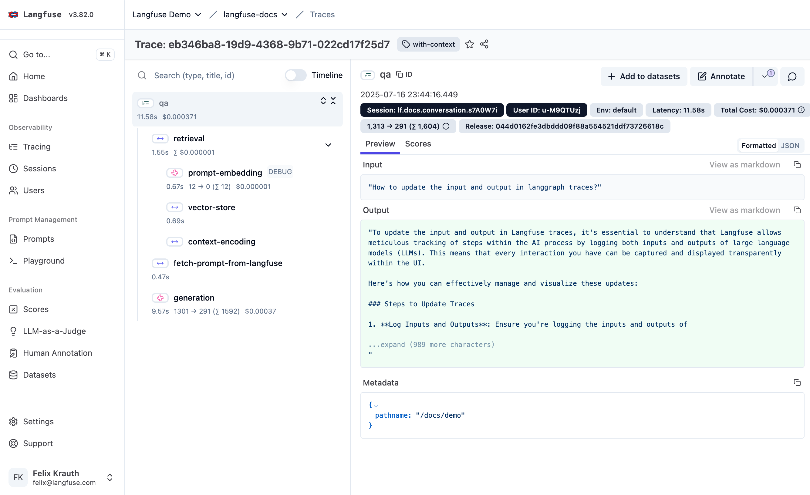
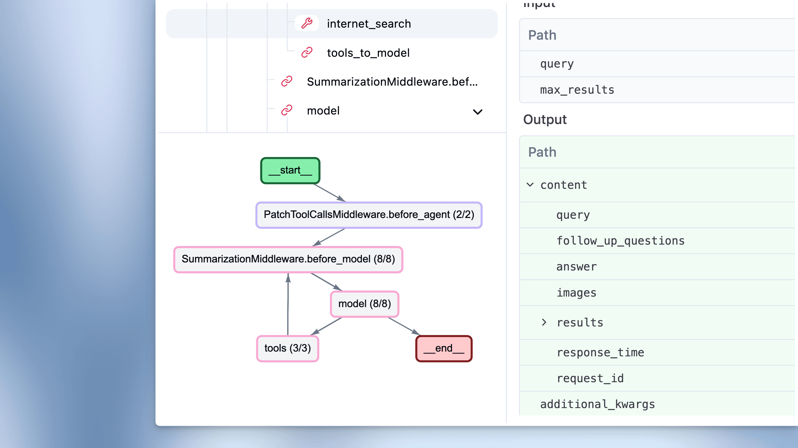
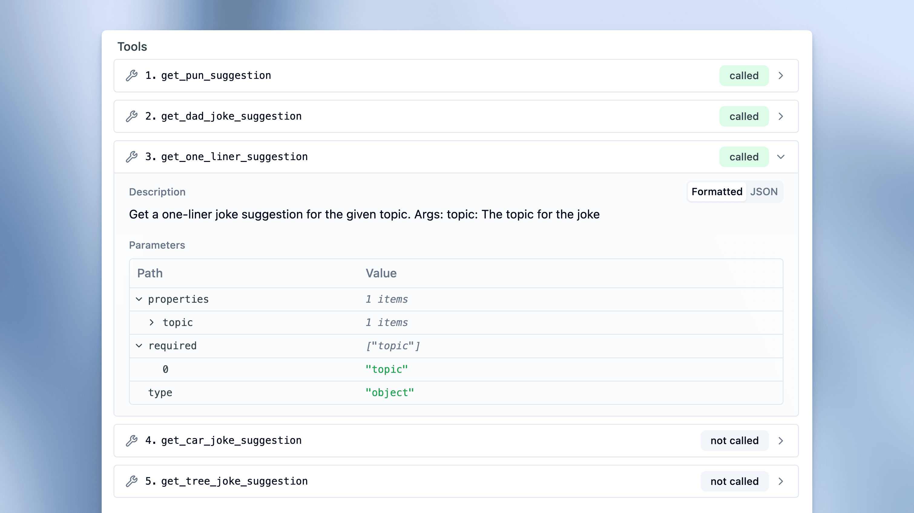
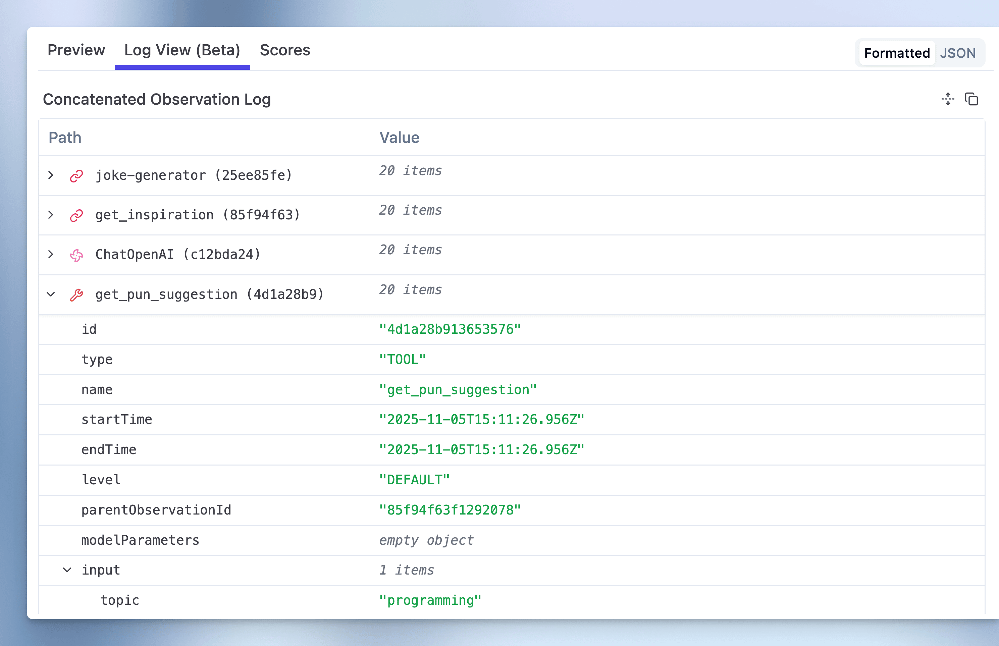
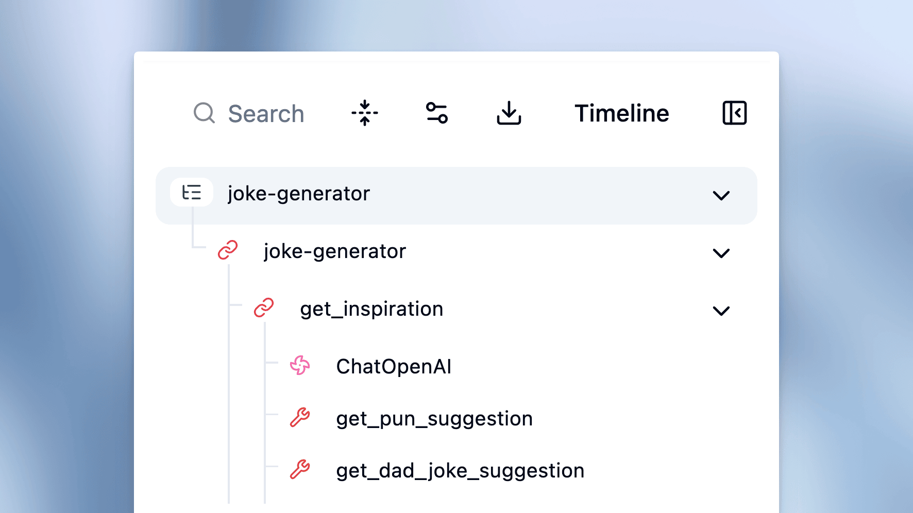
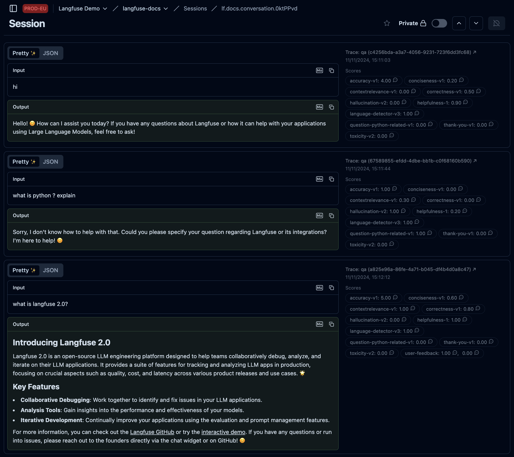
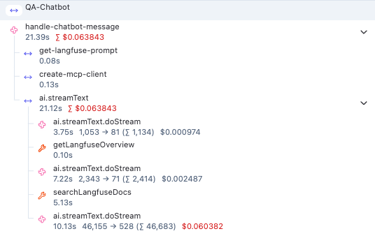
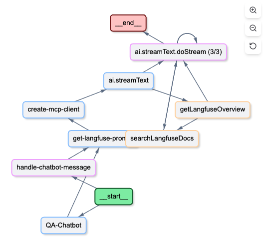
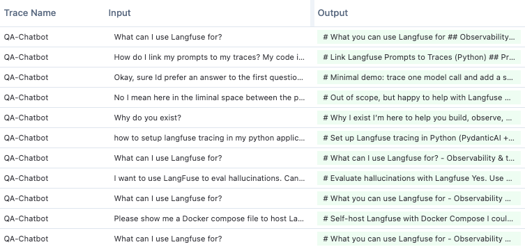
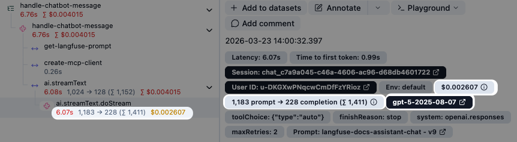

# Langfuse — Open Source LLM Engineering Platform

> **One-liner:** The open-source LLM-observability default — MIT-licensed tracing, evals, prompt
> management and datasets in one repo — that treats **agent execution as an inferred graph layered
> on top of an OTel-native span tree**, rather than a separate product surface.

**Market position:** Independent, VC-backed (YC S23) open-source company, ~24k GitHub stars, the
most-cited "LLM observability" tool in the LangChain/LlamaIndex/LangGraph ecosystem. Self-hosting is
not a grudging afterthought — it is the primary distribution channel, and in June 2025 Langfuse
moved **every product feature** (tracing, evals, prompt management, playground, annotation queues,
datasets/experiments) to MIT, leaving only thin enterprise-compliance features gated. They win
developer mindshare the way Postgres or Grafana do: free, self-hostable, integrates with everything
via SDKs or plain OTLP, and the cloud product is the same codebase with a hosted ClickHouse behind
it. Buyers range from solo builders self-hosting on a $5 VPS to enterprises paying $2,499+/mo for
compliance features layered on the identical OSS core.

**How core is agent tracing to the product?** Core, but structurally the same move Datadog made:
**agent view is a renderer over the generic trace/observation tree, not a separate backend.**
Langfuse's data model has no "agent" entity — a trace becomes "agentic" the moment it contains an
observation typed as something other than plain `span`/`event`/`generation` (i.e. `agent`, `tool`,
`chain`, `retriever`, `embedding`, `guardrail`, `evaluator`), at which point the UI auto-offers a
graph view inferred from observation timing and nesting. Their November 2025 "Langfuse for Agents"
launch-week push (Agent Manifest–style tool panels, a trace Log View, Agent Graphs GA) shows agent
UX is now a first-class investment area, not a bolt-on — but the underlying data model is still five
composable primitives, which is the architecture decision Maple is making too.

---

## Trial & access

| | |
|---|---|
| **Free tier** | Yes — Hobby plan: **50,000 units/month**, 30-day data retention, 2 users, self-serve, forever free. A "unit" = 1 trace **or** 1 observation **or** 1 score ingested (a single RAG turn with retrieval+rerank+generation+safety-check+1 eval score ≈ 6 units). |
| **Free trial** | No time-boxed trial needed — Hobby is perpetual free; paid tiers (Core $29/mo, Pro $199/mo) are pay-as-you-go with no trial period found. |
| **Credit card required?** | **No** for the free Hobby tier — confirmed across multiple independent pricing writeups and Langfuse's own "self-host all core features for free, no CC" messaging. (We could not force-render the live signup form in this environment to double-check field-by-field; treat as high-confidence, not directly screenshotted.) |
| **Registration URL** | https://cloud.langfuse.com/auth/sign-up (region picker at https://langfuse.com/cloud routes to EU/US/JP/HIPAA instances) |
| **Signup fields** | Email + password, or OAuth via Google / GitHub / Microsoft. Post-signup: create an Organization, then a Project, then copy the `pk-lf-...` / `sk-lf-...` API key pair from project settings. |
| **Paid entry point** | Core $29/mo (100k units, 90-day retention) → Pro $199/mo (100k units, 3-yr retention, compliance certs) → Enterprise from $2,499/mo (dedicated support, custom volume). Overage graduates from $8/100k units down to $6/100k at 50M+. |
| **Self-hosting story** | **This is the differentiator.** All product features are MIT-licensed — self-host with Docker Compose / Helm / Terraform (AWS, Azure, GCP) with **zero feature gating and zero usage caps**. The catch is infra, not license: you own a ClickHouse cluster (trace store), Postgres (app state), Redis/Valkey (queues), and S3-compatible blob storage — real DevOps weight. A commercial **Enterprise license key** (`LANGFUSE_EE_LICENSE_KEY` env var) unlocks only compliance/ops features: project-level RBAC, protected prompt labels, data retention policies, audit logs, server-side data masking, UI customization, org-creator controls, SCIM + org-management API, instance-management API. Everything an engineer would call "the product" (tracing, evals, prompt mgmt, playground, datasets) is free forever, self-hosted or not. |
| **Gotchas** | Self-hosting is "free" only in license terms — ClickHouse-cluster ops cost is the real bill (community estimates put a mid-scale self-host around $3-4k/mo in infra+ops, vs. $199-300/mo for equivalent Cloud Pro usage). Startup/student/nonprofit/OSS-project discount programs exist on Cloud (up to 100% off). |

---

## Sources

| # | Source | Type | Why it's useful / what to extract |
|---|---|---|---|
| 1 | [Concepts / Data model](https://langfuse.com/docs/observability/data-model) | Docs | **The core data model.** Sessions (optional) → Traces → Observations (nested). Trace-level attributes (`user_id`, `session_id`, `tags`, `metadata`) auto-propagate to every child observation; storage is a single observations table where each row carries observation data **plus a copy of trace-level attributes** — a denormalization worth stealing for query simplicity. |
| 2 | [Observation Types](https://langfuse.com/docs/observability/features/observation-types) | Docs | **All ten observation types, verbatim definitions.** `event` (no duration) · `span` (durationed unit of work) · `generation` (LLM call: prompts + token usage + cost) · `agent` ("decides on the application flow, can use tools with LLM guidance") · `tool` (single action/function/API call) · `chain` (link between steps, e.g. retriever→LLM) · `retriever` (read-only lookup: vector store/DB) · `evaluator` (assesses relevance/correctness/helpfulness) · `embedding` (like generation, for embedding calls) · `guardrail` (protects against malicious content/jailbreaks). Any non-`span`/`event`/`generation` type is what flags a trace as "agentic" and triggers the graph view. |
| 3 | [Agent Graphs](https://langfuse.com/docs/observability/features/agent-graphs) | Docs | **The graph-view mechanics.** Two toggleable modes: **Aggregated** (same-name steps merge into one node with an execution counter, e.g. `retrieve_docs (3/3)`; loops draw as a self-edge, not unrolled) vs **Expanded** (every call is its own node, loops fully unroll into a DAG in execution order — for step-by-step debugging). Graph is **inferred from observation timing + nesting**, works with *any* framework or custom instrumentation, not just LangGraph. |
| 4 | [OpenTelemetry (OTEL) native integration](https://langfuse.com/integrations/native/opentelemetry) | Docs | **The exact OTLP attribute-mapping table** — see full reproduction in "Feature anatomy" below. Endpoint `/api/public/otel/v1/traces` (region-specific hosts), Basic Auth (`pk-lf-...:sk-lf-...` base64), HTTP/JSON + HTTP/protobuf only (no gRPC). Observation `type` auto-detects as `generation` when a `model` attribute is present. Maps both `gen_ai.*` (OTel GenAI semconv) **and** OpenInference (`input.value`/`output.value`) **and** MLflow (`mlflow.spanInputs/Outputs`) attribute families into the same fields — proof they normalize three competing conventions into one schema, exactly the problem Maple will face. |
| 5 | [`langfuse/langfuse` — `packages/shared/src/server/otel/`](https://github.com/langfuse/langfuse/tree/main/packages/shared/src/server/otel) | Repo (source) | **The actual OTLP ingestion code.** `OtelIngestionProcessor.ts` does the span→trace/observation conversion (root-span detection, level-alias table mapping OTel severity/python-logging/loguru/console vocab onto Langfuse's `ObservationLevel` enum, S3 replay-key tracking for failed conversions). `ObservationTypeMapper.ts` is a **priority-ordered rule chain** (`SimpleAttributeMapper` + `CustomAttributeMapper`) that inspects attributes/resource/scope/span-name to decide `agent` vs `tool` vs `chain` vs plain `span` — a clean, extractable pattern for Maple's own OTel→agent-kind classifier. `attributes.ts` is the full `LangfuseOtelSpanAttributes` enum (their `langfuse.*` namespace) including a **documented back-compat shim** (`langfuse.user.id` → `TRACE_COMPAT_USER_ID`) for attributes whose meaning changed after being publicly documented — a real lesson in namespace stability. |
| 6 | [`langfuse/langfuse` — `packages/shared/src/utils/chatml/adapters/`](https://github.com/langfuse/langfuse/tree/main/packages/shared/src/utils/chatml/adapters) | Repo (source) | **Per-framework payload normalizers**: `langgraph.ts`, `gemini.ts`, `pydantic-ai.ts`, `semantic-kernel.ts`, `microsoft-agent.ts`, `openai.ts`, `aisdk.ts`, `generic.ts` — each adapts a framework's native trace shape into Langfuse's internal ChatML-like message format. `packages/shared/scripts/seeder/utils/framework-traces/*.json` has **real captured traces** from Koog, Google ADK, Microsoft Agent Framework, PydanticAI, Agno, BeeAI, LlamaIndex, OpenAI Agents SDK — a ready-made fixture set for testing any OTel-agent-graph inference logic against real-world span shapes. |
| 7 | [Sessions](https://langfuse.com/docs/observability/features/sessions) | Docs | **Sessions are explicitly first-class**, sitting above traces: propagate a `sessionId` (any US-ASCII string <200 chars) via `propagate_attributes(session_id=...)` (Python) / `propagateAttributes()` (JS) or the `session.id` OTel attribute; every observation sharing that id — across however many traces — groups into one session with **session replay**. Supports public link sharing, bookmarking, and both UI and SDK/API scoring. Direct answer to "is sessions a first-class multi-turn layer" — yes, and it's the *grouping* layer, not the top unit (trace still is). |
| 8 | [What does a good trace look like?](https://langfuse.com/docs/observability/best-practices) | Docs (best practices) | Prescriptive naming rules worth copying: use **active-verb names** (`classify-intent`, `retrieve-context`), never bake dynamic values into names (`process-order` not `process-order-8945`) because it breaks evaluators/dashboards keyed on name. Explicitly tells users to **strip noisy spans** (raw HTTP/DB calls) from the tree — trace hygiene as a documented discipline, not just a UI feature. |
| 9 | [Pricing](https://langfuse.com/pricing) / [Self-hosted pricing](https://langfuse.com/pricing-self-host) / [Enterprise license key](https://langfuse.com/self-hosting/license-key) | Marketing/Docs | Exact tier pricing and the precise list of EE-gated features (RBAC, retention policies, audit logs, data masking, SCIM, UI customization) vs. the MIT-free core — the license-boundary reference for anyone scoping "what would we actually have to pay-gate." |

---

## Screenshots

### 1. Trace detail — the canonical three-pane layout

- Breadcrumb `Langfuse Demo / langfuse-docs / Traces`, trace ID as the page title with a `with-context` tag chip, star + share icons.
- Left pane: searchable, collapsible **observation tree** (`qa` → `retrieval` → `prompt-embedding` (tagged `DEBUG`) / `vector-store` / `context-encoding` → `fetch-prompt-from-langfuse` → `generation`), each row showing duration + Σ (aggregated) cost, a **Timeline/tree toggle** switch top-right of the pane.
- Center/right header strip: **stat chips** — `Session: lf.docs.conversation.s7A0W7i` · `User ID: u-M9QTUzj` · `Env: default` · `Latency: 11.58s` · `Total Cost: $0.000371` · token chip `1,313 → 291 (Σ 1,604)` · `Release: 044d0162...`. Cost/tokens/session/user all promoted above the fold on every trace.
- Detail panel tabs: `Preview` | `Scores`, plus a `Formatted`/`JSON` toggle and per-field **"View as markdown"** link on Input/Output blocks.
- Top-right actions: `+ Add to datasets`, `Annotate`, a scores-count badge, comment icon — the trace→dataset and trace→annotation loops are one click away, not a separate page.

### 2. Agent Graph — expanded view with node counters

- Split pane: observation tree on top-left (`internet_search` tool node, `tools_to_model` chain node, `SummarizationMiddleware.bef...`, `model` — icons differ per type: wrench = tool, link = chain), graph canvas below it, Input/Output detail on the right.
- Graph nodes are framework-native step names (`PatchToolCallsMiddleware.before_agent (2/2)`, `SummarizationMiddleware.before_model (8/8)`, `model (8/8)`, `tools (3/3)`) — the **`(n/n)` suffix is the Aggregated-view execution counter** described in the docs.
- Fixed start/end sentinel nodes: green `__start__`, dark-red `__end__`.
- Edges are directed arrows showing the actual control flow, including a **tools ⇄ model back-edge** (the loop).
- Right panel shows the selected node's Input/Output as a **nested, collapsible path/value table** (`content › query, follow_up_questions, answer, images, results, response_time, request_id, additional_kwargs`) — structured JSON, not raw text dump.

### 3. Agent Tools panel — called vs. not-called

- A `Tools` card lists **every tool available to the agent at that generation step**, each with a numbered index (`1. get_pun_suggestion` … `5. get_tree_joke_suggestion`) and a status pill: green **`called`** vs. gray **`not called`**.
- Expanding a called tool reveals `Description` (plain text) and a `Parameters` table (`Path` / `Value`) rendering the JSON-schema (`properties`, `required`, `type: "object"`) with a `Formatted`/`JSON` toggle.
- This is Langfuse's version of Datadog's "Agent Manifest" — showing the tools the model *didn't* pick is the same wrong-tool-selection debugging idea.

### 4. Trace Log View — concatenated, searchable observation dump

- New tab alongside `Preview` and `Scores`: **`Log View (Beta)`**.
- Renders "Concatenated Observation Log" — every observation in the trace flattened into one scrollable `Path`/`Value` table (`joke-generator (25ee85fe)` → `get_inspiration (85f94f63)` → `ChatOpenAI (c12bda24)` → `get_pun_suggestion (4d1a28b9)`, each showing item counts before expansion).
- Expanded row shows raw observation fields verbatim: `id`, `type: "TOOL"`, `name`, `startTime`/`endTime` (ISO 8601), `level: "DEFAULT"`, `parentObservationId`, `modelParameters`, `input.topic: "programming"`.
- Purpose stated in the changelog: CMD/Ctrl+F-searchable single-page view for long looping agent runs where the tree view requires excessive clicking.

### 5. Observation tree — icon system per type

- Toolbar above the tree: `Search` (type/title/id) · a "collapse all" icon · a filter/settings icon · a download icon · `Timeline` toggle · a sidebar-collapse icon.
- Tree nodes use **one glyph per observation type**: pink chain-link icon = `chain`/`agent`-style container (`joke-generator`), pink flower/pinwheel icon = `generation` (`ChatOpenAI`), red wrench icon = `tool` (`get_pun_suggestion`, `get_dad_joke_suggestion`). Each row is independently expandable/collapsible with a chevron.
- Indentation + connecting guide-lines communicate nesting depth directly in the list, without needing the graph view open.

### 6. Sessions — replay view with per-turn eval scores

- URL breadcrumb: `Langfuse Demo / langfuse-docs / Sessions / lf.docs.conversation.0ktPPvd`; header shows `Private` lock toggle, star, prev/next arrows to move between sessions, and a "hide" icon.
- Session body is a **vertical chat transcript**: each turn is a card with `Pretty ✨ / JSON` toggle, `Input` box and green-tinted `Output` box — literally a conversation replay, not a span tree.
- Each turn card has a companion right-hand panel: `Trace: qa (<uuid>) ↗` deep-link + timestamp, and a **wall of per-turn eval score chips** — `accuracy-v1: 4.00`, `conciseness-v1: 0.20`, `contextrelevance-v1: 0.00`, `correctness-v1: 0.50`, `hallucination-v2: 0.00`, `helpfulness-1: 0.90`, `language-detector-v3: 1.00`, `question-python-related-v1`, `thank-you-v1`, `toxicity-v2`, and (turn 3) `user-feedback: 1.00 / 0.00` — scores visibly evolve turn-to-turn (e.g. `hallucination-v2` goes 0.00 → 1.00 → 0.00 across three turns), making a session view double as a **quality-drift-over-time** tool for free.

### 7. "Good trace" reference — minimal tree

- Compact reference tree used in the best-practices doc: root `handle-chatbot-message` (21.39s, Σ $0.063843, red cost text signaling it's the expensive path) containing `get-langfuse-prompt`, `create-mcp-client`, then `ai.streamText` (21.12s) nesting `ai.streamText.doStream` generations interleaved with `getLangfuseOverview` / `searchLangfuseDocs` tool calls, each generation showing a **token-flow notation** `1,053 → 81 (Σ 1,134)` (input → output, Σ = cumulative).
- Demonstrates the naming convention preached elsewhere: verb-first, stable names, no dynamic IDs baked in.

### 8. "Good trace" reference — matching agent graph

- The graph rendering of the exact same trace as screenshot 7: `__start__` → `QA-Chatbot` → `handle-chatbot-message` → `get-langfuse-prompt` / `create-mcp-client` → `ai.streamText` → fan-out to `getLangfuseOverview` and `searchLangfuseDocs` → both feed `ai.streamText.doStream (3/3)`, which has a **self-loop arrow** (drawn as a curved edge back onto itself) representing the 3 repeated doStream calls, then → `__end__`.
- Confirms the aggregation rule visually: 3 executions of the same node collapse to one box with a loop-back edge, not three boxes.

### 9. Trace-list "tracing table" — transcript-style rows

- Columns: `Trace Name` | `Input` | `Output` — every row is `QA-Chatbot` with the literal user question truncated in Input and the literal (markdown-rendered, truncated) answer in Output.
- Confirms the same "list reads as a transcript" pattern Datadog uses — the row-level unit of the product is the conversation turn, not a span name or trace ID.

### 10. Generation-level scores in list context

- Two generation cards (`handle-chatbot-message · generation · <timestamp>`) each with Input/Output and a **scores strip**: `answer-fit`, `has_code_ex...`, `is_question`, `politeness`, `question_diff...` (bucketed `easy`/`hard`), `relevance` — multiple named eval dimensions attached directly to a single generation, each individually clickable (chat-bubble icon = "add comment/detail").
- Each card also has `Add to datasets` / `Annotate` / `Add comment` actions inline — the eval and dataset workflows are reachable from the observation level, not just the trace level.

---

## Feature anatomy (spec-ready notes)

**Data model.** Five composable primitives: **Session** (optional, groups Traces via shared
`sessionId`) → **Trace** (one request/operation) → **Observation** (nested; base fields: input,
output, metadata, level, statusMessage, timestamps). Observation **type** specializes the row:
`span` (generic durationed work) · `event` (instantaneous marker) · `generation`/`embedding` (adds
model, modelParameters, usage tokens, cost, prompt name/version, completionStartTime) · `agent` ·
`tool` · `chain` · `retriever` · `evaluator` · `guardrail`. Storage is **one observations table**;
each row also carries a **copy of its trace's attributes** (denormalized for fast querying — no join
needed to filter observations by trace-level `user_id`/`session_id`/`tags`).

**Ingestion paths.** (1) Native SDKs (Python/JS) with framework auto-instrumentation (LangChain,
LlamaIndex, LangGraph, CrewAI, OpenAI Agents SDK, etc.) via OpenTelemetry under the hood — Langfuse's
own SDKs are themselves OTel exporters. (2) Direct OTLP/HTTP (JSON or protobuf; **no gRPC**) to
`/api/public/otel/v1/traces`, Basic Auth with the same `pk-lf-.../sk-lf-...` keys used everywhere
else. The OTLP path recognizes three competing attribute vocabularies simultaneously and folds them
into the same schema:

- **Native `langfuse.*` namespace** — highest priority, e.g. `langfuse.trace.name`,
  `langfuse.observation.type`, `langfuse.observation.usage_details` (JSON), `langfuse.session.id`
  (legacy compat, superseded by bare `session.id`).
- **OTel GenAI semconv** — `gen_ai.request.model`, `gen_ai.response.model`, `gen_ai.prompt` /
  `gen_ai.completion`, `gen_ai.usage.*`, `gen_ai.usage.cost`, `gen_ai.request.*` model params.
- **OpenInference** — `input.value`/`output.value`, `llm.model_name`, `llm.token_count.*`,
  `llm.invocation_parameters.*`.
- **MLflow** — `mlflow.spanInputs`/`mlflow.spanOutputs`.

  `type` auto-infers to `generation` whenever any `model` attribute is present, otherwise defaults to
  `span`; explicit `agent`/`tool`/`chain`/etc. typing comes from a **priority-ordered rule chain**
  (`SimpleAttributeMapper` for direct value lookups, `CustomAttributeMapper` for conditional logic
  across attributes/resource/scope/span-name) in `ObservationTypeMapper.ts`. Unmapped resource
  attributes land in `metadata.resourceAttributes` rather than being dropped.

**Views, funnel order.**
1. Sessions list → session replay (chat-transcript cards + per-turn eval-score strip + trace deep-links)
2. Trace list — transcript-style Input/Output columns, filterable by tags/user/model/metadata/score
3. Trace detail — observation tree (Timeline/tree toggle) + Preview/Scores/Log-View tabs + stat chips
4. Agent Graph (auto-offered when a trace has non-plain observation types) — Aggregated ⇄ Expanded toggle, in-place node Input/Output on click
5. Observation/generation detail — Tools panel (called vs. not-called), Formatted/JSON toggle, inline Add-to-dataset / Annotate / Add-comment
6. Lateral: dashboards (Latency/Cost/Usage pre-built + custom query-engine-backed widgets), Datasets/Experiments, Prompt Management, Playground

**Derived signals.** Per-generation and per-turn LLM-as-judge + custom eval scores (arbitrary named
dimensions, e.g. `hallucination-v2`, `toxicity-v2`, `question-python-related-v1`) attached at the
observation level and surfaced in both trace and session views; scores are themselves billable units
alongside traces/observations, which incentivizes treating eval as first-class telemetry rather than
an offline batch job.

---

## Ideas worth stealing for Maple

1. **"Agentic" is a derived property of the observation-type set, not a separate trace kind.** A
   trace becomes agent-shaped the moment it contains a non-`span`/`event`/`generation` observation —
   cheap to compute, and it means the graph view can be offered opportunistically instead of
   requiring an upfront schema commitment.
2. **Aggregated ⇄ Expanded graph toggle**, with the aggregated view collapsing repeated steps into
   `name (n/n)` nodes and drawing loops as self-edges instead of unrolling them. Directly reusable:
   cheap to implement (dedupe by span name within a subtree) and solves the "100-iteration retry
   loop makes the graph unreadable" problem Datadog's execution-flow view doesn't obviously solve.
3. **Priority-ordered, pluggable observation-type classifier** (`ObservationTypeMapper.ts` pattern:
   ranked rules, each a `canMap`/`mapToObservationType` pair inspecting attrs/resource/scope/span
   name) — a clean shape for Maple's own OTel→agent-kind inference, and it's extractable as a small
   standalone module Maple could literally port.
4. **Tools panel with called/not-called status**, same insight as Datadog's Agent Manifest but
   lighter-weight: numbered list, pass/fail-style pill, expandable JSON-schema — worth copying
   verbatim as the MVP version of "what tools did the agent have."
5. **Sessions as a genuine second-class-above-traces grouping**, rendered as a **chat-transcript
   replay** (not a span list) with **per-turn eval scores visibly evolving across turns** — this is
   the multi-turn UI pattern Maple's agentic-journeys work is missing relative to trace-only tools.
6. **Denormalized observations table** (trace attributes copied onto every observation row) — a
   storage-layer trick worth evaluating for `packages/query-engine`: avoids a join for the common
   "filter observations by session/user/tags" query.
7. **Concatenated Log View** for long/looping traces — CMD-F search across every observation's I/O
   on one page, positioned explicitly as the answer to "the tree view needs too many clicks for a
   50-step loop."
8. **Triple-vocabulary OTLP mapping** (native `langfuse.*` + `gen_ai.*` + OpenInference +
   `mlflow.*`, with explicit priority ordering) — Maple should decide *now* which of these
   conventions it recognizes and in what priority, since real customer instrumentation will emit a
   mix.
9. **Documented namespace back-compat shim** (`langfuse.user.id` kept working after the "real"
   attribute moved to `user.id`) — a concrete example of how to evolve an attribute contract without
   breaking existing SDKs; worth designing into Maple's `maple.*` namespace from day one.

## What to skip / deprioritize

- Their dashboard/metrics layer is a generic self-service query builder (line/bar/pie over
  filtered aggregations) — competent but not differentiated; Maple's ClickHouse DSL already does
  more, no need to copy this specifically.
- Full eval/LLM-as-judge infrastructure (scores as billable units, annotation queues,
  experiments/datasets) is a large adjacent product area — useful signal that "score" should be a
  first-class attachable entity, but not required to ship agent tracing itself.
- Session-level annotation queues and public trace/session link-sharing are nice-to-haves, not core
  to the graph/tree visualization problem Maple is solving first.
- Prompt Management + Playground are a separate product wing entirely (prompt versioning/caching,
  in-UI prompt testing) — out of scope for the agentic-journeys feature.

---

## Screenshot sources

| File | Found on | Direct image URL |
|---|---|---|
| `agent-graphs.png` | [Langfuse for Agents](https://langfuse.com/changelog/2025-11-05-langfuse-for-agents) | `https://langfuse.com/images/changelog/2025-11-05-langfuse-for-agents/lw4-d3-graphs.png` |
| `agent-tools-panel.png` | [Langfuse for Agents](https://langfuse.com/changelog/2025-11-05-langfuse-for-agents) | `https://langfuse.com/images/changelog/2025-11-05-langfuse-for-agents/lw4-d3-tools.png` |
| `good-trace-agent-graph.png` | [What does a good trace look like?](https://langfuse.com/docs/observability/best-practices) | `https://langfuse.com/images/docs/faq/good-trace-agent-graph.png` |
| `good-trace-generation-attributes.png` | [What does a good trace look like?](https://langfuse.com/docs/observability/best-practices) | `https://langfuse.com/images/docs/faq/good-trace-generation-attributes.png` |
| `good-trace-tracing-table-io.png` | [What does a good trace look like?](https://langfuse.com/docs/observability/best-practices) | `https://langfuse.com/images/docs/faq/good-trace-tracing-table-io.png` |
| `good-trace-tree.png` | [What does a good trace look like?](https://langfuse.com/docs/observability/best-practices) | `https://langfuse.com/images/docs/faq/good-trace-tree.png` |
| `observation-types.png` | [Langfuse for Agents](https://langfuse.com/changelog/2025-11-05-langfuse-for-agents) | `https://langfuse.com/images/changelog/2025-11-05-langfuse-for-agents/lw4-d3-observation-types.png` |
| `session-view.png` | [Concepts / Data model](https://langfuse.com/docs/observability/data-model) | `https://langfuse.com/images/docs/session.png` |
| `trace-log-view.png` | [Langfuse for Agents](https://langfuse.com/changelog/2025-11-05-langfuse-for-agents) | `https://langfuse.com/images/changelog/2025-11-05-langfuse-for-agents/lw4-d3-log.png` |
| `tracing-overview.png` | [LLM Observability & Application Tracing (Open Source)](https://langfuse.com/docs/observability/overview) | `https://langfuse.com/images/docs/tracing-overview.png` |

All 10 files were confirmed by downloading each candidate and matching its SHA-256 hash exactly
against the local file — not just filename/alt-text similarity. Four (`agent-graphs.png`,
`agent-tools-panel.png`, `observation-types.png`, `trace-log-view.png`) turned out not to live on
the Sources-table pages at all — the `agent-graphs` and `observation-types` docs pages only embed a
demo video/people avatars today — but on the November 2025 "Langfuse for Agents" launch-week
changelog post referenced in this doc's own market-position paragraph. `tracing-overview.png`
similarly wasn't on any Sources page; it turned up on the docs site's observability overview page.

---

*Researched 2026-08-05. Screenshots pulled from Langfuse's public docs and changelog for internal
competitive research; do not redistribute.*
