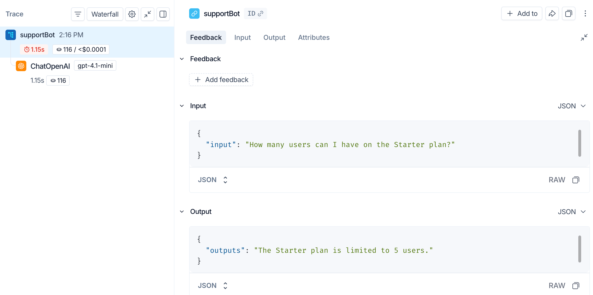
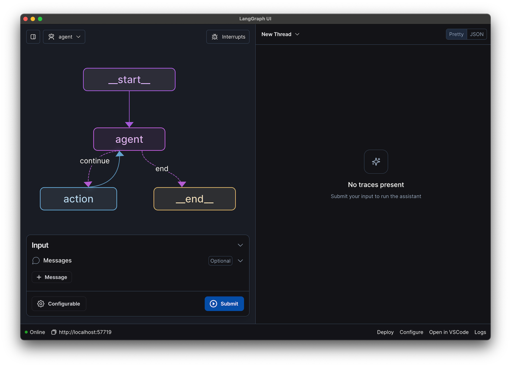
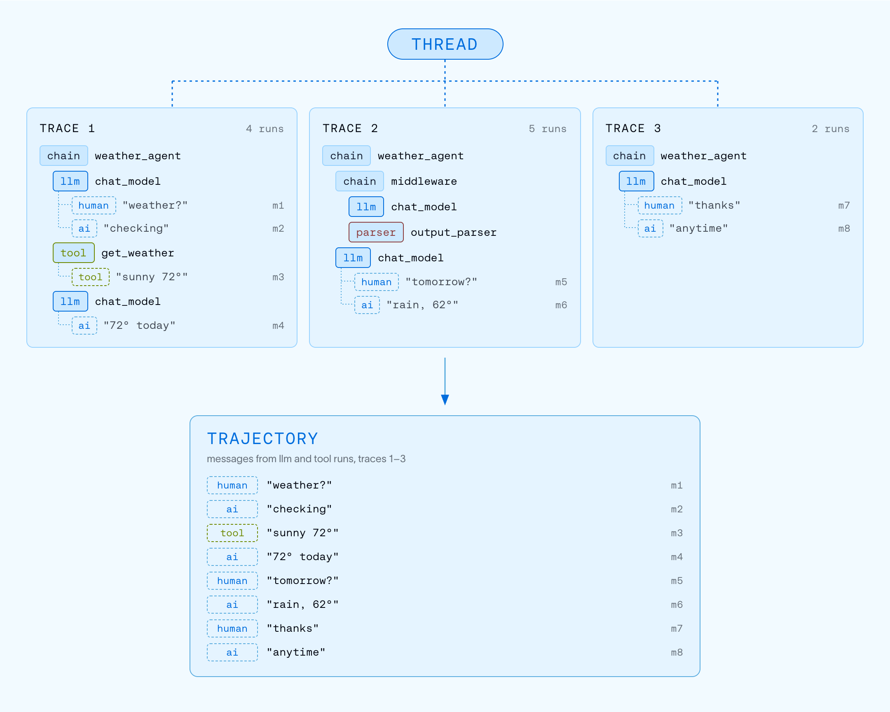
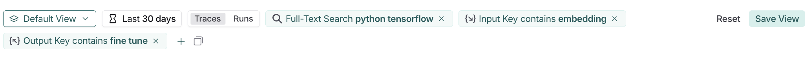
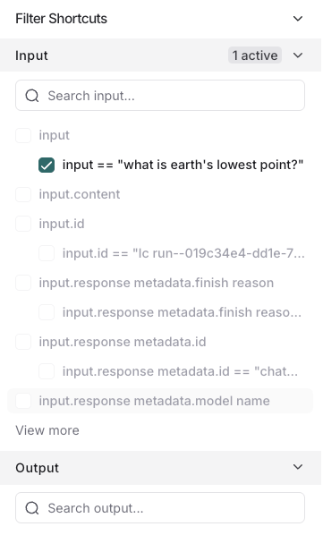
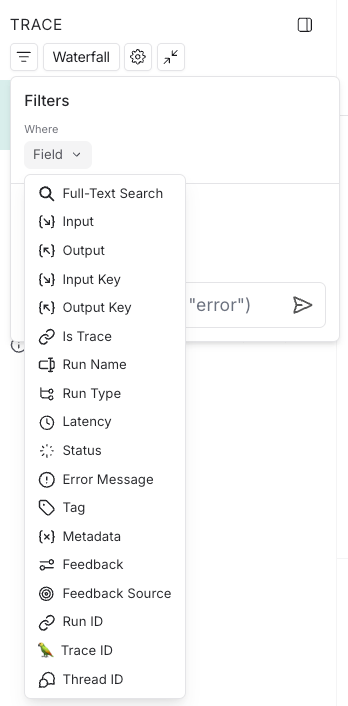
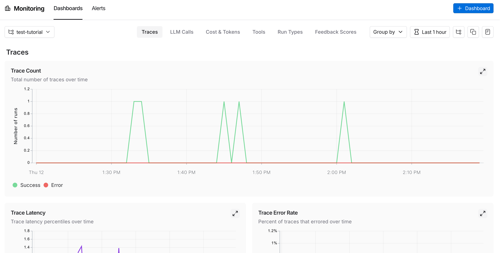
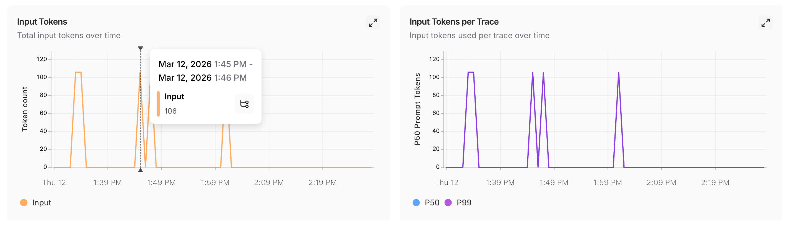
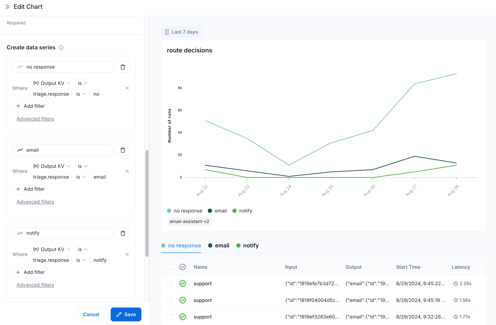

# LangSmith (LangChain) — Agent & LLM Observability

> **One-liner:** The LLM-native tracing tool built by the framework vendor itself — "run" is their
> span, "thread" is their session, and the whole product is organized around debugging *your*
> LangChain/LangGraph agent, not around ingesting arbitrary OTel from anywhere.

**Market position:** LangChain (the company) is privately held, VC-backed (a16z, Sequoia among
others; reported ~$1.25B valuation as of its last raise), and LangSmith is its commercial product —
LangChain/LangGraph the frameworks are open source and free, LangSmith is the paid observability +
eval layer that sits on top and is framework-agnostic in principle. It won by being the default:
anyone who `pip install langchain`s or `pip install langgraph`s gets a one-line `LANGSMITH_TRACING=true`
env var away from full tracing, so adoption rode the framework's own popularity rather than a
separate sales motion. Logo wall includes Klarna, Rippling, Harvey, Vanta, Cloudflare, Moody's.
Positioning line on their own homepage: *"The platform for agent engineering."*

**How core is agent tracing to the product?** This **is** the product — tracing/observability is
one of three pillars (Tracing, Monitoring, Insights) alongside Evaluation and Deployment
(LangGraph Platform), and LangSmith's entire identity is "the tool LangChain/LangGraph developers
reach for to see what their agent actually did." Unlike Datadog (APM vendor bolting on an agent
view) or Maple's own starting point (generic OTel platform adding an agent lens), LangSmith started
from the agent/LLM run and only later grew a generic-OTel-ingestion side door. Notably: **sessions
("threads") are first-class citizens** in their data model — the one structural difference from
Datadog that Maple should study closely, since Maple needs a multi-turn layer too.

---

## Trial & access

| | |
|---|---|
| **Free tier** | Yes, permanent — **Developer plan**: 1 seat, 5,000 base traces/month, 14-day base retention. Ingest is rate-limited to 50K trace events/hour and 500MB/hour without a card on file. |
| **Free trial** | No separate time-boxed trial — the Developer plan itself *is* the free tier, indefinitely. Adding a card raises the rate limits (250K events/hour, 2.5GB/hour) without changing plan tier. |
| **Credit card required?** | **No.** Verified directly on the live signup page (`smith.langchain.com`): fields are only email + password, or Google/GitHub/Discord SSO, plus a one-time **data-region picker (US / EU / APAC, GCP-hosted)** that "can't be changed later." No payment field anywhere in the flow. |
| **Registration URL** | https://smith.langchain.com/ |
| **Signup fields** | Email, password (or SSO), data region. That's it — no name, company, or job title collected at signup. |
| **Paid entry point** | **Plus: $39/seat/month**, unlimited seats, 10,000 base traces/month included, usage billed beyond that (**0.05¢/base trace, 0.50¢/extended-retention trace**, i.e. 400-day retention costs 10x). Compute/storage overage metered in LCU ($1.50) / LSU ($1.00) units. **Enterprise**: custom, annual invoice, SSO/RBAC, self-hosted/hybrid deployment. |
| **Self-serve to the feature?** | Yes, fully — sign up, get an API key, set `LANGSMITH_TRACING=true` + `LANGSMITH_API_KEY`, and tracing appears with zero sales contact. Studio, dashboards, and threads are all reachable on the free tier. |
| **Gotcha** | The data-region choice is **permanent** — picking US vs EU vs APAC at signup locks your org's data residency forever. Also: Insights Agent (topic clustering) is gated to **Plus/Enterprise only**, not free. |

---

## Sources

| # | Source | Type | Why it's useful / what to extract |
|---|---|---|---|
| 1 | [Introducing OpenTelemetry support for LangSmith](https://www.langchain.com/blog/opentelemetry-langsmith) | Eng blog | **The ingest story.** OTLP endpoint is `https://api.smith.langchain.com/otel`. Today they parse the **OpenLLMetry (Traceloop) convention**, not the OTel GenAI semconv, though they say GenAI semconv support is planned "as it evolves" — this is a material gap vs. Datadog. Concrete attribute list they read: `langsmith.span.kind`, `langsmith.metadata.*`, `gen_ai.system`, `gen_ai.request.model`, `gen_ai.prompt.{i}.content` / `.role`, `gen_ai.response.model`, `gen_ai.completion.{i}.content`, `gen_ai.usage.*`. Three worked integration paths shown: raw OTel Python SDK, Traceloop SDK, Vercel `AISDKExporter`. |
| 2 | [Observability concepts](https://docs.langchain.com/langsmith/observability-concepts) | Docs | **The data model, verbatim.** `Run` = "a single unit of work... analogous to a span in OpenTelemetry." `Trace` = all runs sharing a trace ID, **capped at 25,000 runs**. `Thread` = a `thread_id`-grouped sequence of traces, one trace per conversational turn. `Trajectory` = a thread flattened into one ordered, de-duplicated message list — a derived view, not stored separately. This four-level ladder (run → trace → thread → trajectory) is the exact hierarchy Maple is missing above trace. |
| 3 | [Run (span) data format](https://docs.langchain.com/langsmith/run-data-format) | Docs | **Field-level schema.** `run_type` enum is exactly 7 values: `chain`, `llm`, `embedding`, `prompt`, `tool`, `retriever`, `parser` — no dedicated `agent` kind (agents are just `chain` runs with sub-runs). Full field list incl. `dotted_order` (sortable hierarchy key: `<timestamp>Z<uuid>.<child>...`), `parent_run_ids` (full ancestor chain, not just immediate parent), `manifest_s3_id`/`inputs_s3_urls` (large payloads offloaded to S3), `feedback_stats`, `first_token_time`. |
| 4 | [LangGraph Studio: the first agent IDE](https://www.langchain.com/blog/langgraph-studio-the-first-agent-ide) | Launch blog | **The graph view, explained.** Quoted rationale: *"Building LLM applications differs from traditional software development, requiring different tooling outside of the traditional code editor."* Studio auto-derives the graph from your `StateGraph` definition (not from observed traces) and layers live execution on top: step-by-step pause/resume, **in-place state editing mid-run**, and **code hot-reload** where editing a node's prompt takes effect on the next run without restarting. This is fundamentally different from Datadog's execution-flow graph — Studio's graph is the *source of truth topology*, traces are just runs played over it. |
| 5 | [Configure / Use threads](https://docs.langchain.com/langsmith/use-threads) + [threads config](https://docs.langchain.com/langsmith/threads) | Docs | **Thread UI mechanics.** Three view modes toggled by keyboard shortcut **M / T / D**: Messages (chat-style transcript, tool calls nested under the assistant turn that triggered them, **multiple simultaneous tool calls collapse into one expandable row**), Turns (card-per-exchange), Details (full run tree, the "escape hatch" into normal trace debugging). Thread table columns: first input, last output, start time, turn count, **latency P50/P99**, tokens, cost, feedback. Critical implementation gotcha they call out: `thread_id` metadata must be set on **every child run**, not just the root, or filtering/cost rollups silently break. |
| 6 | [Filter traces in application](https://docs.langchain.com/langsmith/filter-traces-in-application) | Docs | **Filter UI mechanics + query language.** Two independent filter surfaces: a top filter bar (saved/default views, quick Traces/Runs toggle, full-text search, per-key filters) and a right-hand "Filter Shortcuts" panel that **surfaces the most frequently-occurring attribute values in the current project** as one-click checkboxes. Operators: `is`, `is not`, `contains`, `does not contain`, `is one of`, `>`, `<`. Full-text search indexes only the **first 250 characters** of inputs/outputs and drops stop-words/sub-2-char tokens — a real limitation worth knowing before promising full-text search in Maple. |
| 7 | [Dashboards](https://docs.langchain.com/langsmith/dashboards) | Docs | **Monitoring surface.** Every project gets a free prebuilt dashboard with 6 fixed sections: Traces, LLM Calls, Cost & Tokens, Tools (top 5), Run Types (top 5 immediate children of root), Feedback Scores (top 5). Custom dashboards (Plus+) support 6 chart types (Line, Stacked bar, KPI, Ranked bar, Donut, Table) over metrics: Count, Latency, Time-to-first-token, Tokens, Cost, Feedback score/ratio — each chart's data series can filter on arbitrary Output-KV paths (e.g. `triage.response is "email"`), effectively letting you dashboard your agent's own routing decisions. |
| 8 | [Improve agent quality with Insights Agent and Multi-turn Evals](https://www.langchain.com/blog/insights-agent-multiturn-evals-langsmith) | Product blog | **The novel bit.** Insights Agent is an LLM-orchestrated analysis pipeline (not a fixed clustering algorithm) that takes a natural-language question, dynamically builds its own analysis plan, and returns traces grouped into **hierarchical categories/subcategories** — "usage patterns" or "poor interactions grouped by root cause" — each category clickable through to its underlying traces, with one-click "add to dataset" / "create annotation queue." Report generation takes ~15 min. Multi-turn Evals runs LLM-as-judge **over the whole thread**, not per-run, scoring semantic intent + task completion + trajectory quality — the natural evaluation unit follows the thread, confirming threads are load-bearing, not cosmetic. |
| 9 | [LangSmith pricing](https://www.langchain.com/pricing-langsmith) + live signup at [smith.langchain.com](https://smith.langchain.com/) | Marketing / product | Plan table and the actual signup form (browser-verified 2026-08-05): email/password or Google/GitHub/Discord, one-time US/EU/APAC data-region picker, **no credit-card field present**. |

---

## Screenshots

### 1. Trace waterfall — the baseline view

- Left rail is a **collapsible span tree** ("Waterfall" — a dropdown, implying alternate layouts
  exist) with per-node **duration + token-count + cost badges** right in the tree row (`1.15s`,
  `⊙116 / <$0.0001`) — cost is visible at a glance without opening the node.
  A red duration badge flags the run that blew a latency threshold.
- Node icons are **framework-specific, not span-kind-generic**: a wrench for a plain function/tool
  run, the literal OpenAI logo for `ChatOpenAI`, plus a **model-name chip** (`gpt-4.1-mini`) next
  to the node name.
- Right panel tabs: **Feedback / Input / Output / Attributes** — feedback (thumbs/score) is a
  first-class tab, not buried under "eval." Input/Output render as collapsible JSON with a
  **JSON ⇄ RAW toggle** and a copy button.
- Top-right actions on the selected run: **`+ Add to`** (dataset/annotation queue), share, copy,
  overflow menu — the trace→dataset loop is a persistent header button, not a modal you dig for.

### 2. LangGraph Studio — the graph *is* the IDE

The single most differentiated screenshot in this file.

- The graph (`__start__` → `agent` → conditional `continue`/`end` edges → `action` / `__end__`) is
  **rendered from the actual `StateGraph` code**, not reconstructed from observed spans — this is
  the opposite direction from Datadog's execution-flow graph, which infers structure from traces
  after the fact. Edge labels (`continue`, `end`) are the literal conditional-edge names from code.
  Purple = control-flow nodes, blue = your node.
  Datadog rebuilds a graph from spans; here, spans are secondary — the graph is the interface.
- Right pane is a **live run console**: `New Thread` dropdown (thread picker/creator inline),
  `Pretty`/`JSON` output toggle, empty state literally reads "No traces present — Submit your input
  to run the assistant." You develop and observe in the same pane.
- Top toolbar: an **`Interrupts`** button — human-in-the-loop breakpoints are a first-class Studio
  concept, not something you bolt on via custom span attributes.
- Bottom status bar: `Online`, local server address, then **`Deploy | Configure | Open in VSCode |
  Logs`** — Studio is explicitly positioned as attached to your local dev loop, one step from prod
  deploy, not a passive observability surface.
- Left input form has a typed **`Messages`** field with an `+ Message` add button and a
  `Configurable` settings drawer — you can invoke the graph with structured input and named config
  overrides directly from the IDE, no separate REPL needed.

### 3. Thread vs. Trajectory — the data-model diagram

This is LangChain's own explainer diagram (not a live product screenshot) but it's the clearest
statement of their sessions model:

- A **`THREAD`** fans out into `TRACE 1..N`, each trace a normal nested run tree
  (`chain > llm > tool`, `chain > chain(middleware) > llm > parser > llm`, etc.) — different traces
  in the same thread can have **structurally different shapes** (trace 2 has a `middleware` sub-chain
  and a `parser` run trace 1 and 3 don't).
- Each leaf run tags its message with a stable ordinal (`m1`...`m8`) that survives flattening.
- The **`TRAJECTORY`** at the bottom is the same 8 messages, nesting stripped, in strict order —
  explicitly captioned "messages from llm and tool runs, traces 1–3." This is the artifact Multi-turn
  Evals actually scores against.

### 4. Trace list — filter bar

- Filters render as **removable chips inline in the bar itself** (`Full-Text Search python tensorflow
  ×`, `Input Key contains embedding ×`), not as a separate applied-filters row — the query is legible
  as one sentence.
- `Traces`/`Runs` is a segmented toggle sitting directly in the filter bar, not a separate tab.
- `Save View` alongside `Reset` — ad hoc filter combinations get promoted to reusable saved views
  with one click.

### 5. Filter Shortcuts panel — frequency-ranked facets

- Facets aren't a fixed schema (`service`, `env`, etc.) — they're **the actual most-frequent
  input/output key-value pairs observed in the project**, e.g. `input == "what is earth's lowest
  point?"` as a literal checkbox option, or `input.response_metadata.finish_reason`. It's
  auto-discovered faceting over arbitrary JSON payloads rather than curated tag facets.
- Sections are collapsible per top-level field (`Input`, `Output`, ...) each with its own search box
  and a `1 active` badge when a filter under it is applied. A `View more` link expands beyond the
  top N auto-surfaced keys.

### 6. Filter field picker — the full filterable attribute list

- **`Thread ID` and `Trace ID` are peer filter fields alongside `Run ID`** — confirms threads are a
  queryable first-class dimension, not a derived label.
- `Is Trace` is its own boolean filter (root-run-only view) — a cheap way to collapse a run-level
  query down to one row per trace, similar in spirit to Datadog's root-eligibility rule but exposed
  as a user-facing filter rather than an ingestion constraint.

### 7. Monitoring dashboard — prebuilt, per-project

- Six fixed sub-tabs (`Traces | LLM Calls | Cost & Tokens | Tools | Run Types | Feedback Scores`)
  exist for **every project automatically**, no setup — this is the free-tier default view before
  anyone builds a custom dashboard.
  Trace Count chart splits **Success (green) vs Error (red)** as stacked series by default.
- Top bar: project picker, `Group by`, time-range picker, plus icon buttons for compare/duplicate/
  export — standard but tightly packed into one row above the fold.

### 8. Monitoring drilldown — hover-to-inspect on the chart itself

- Hovering a point on any monitoring chart surfaces an exact-value tooltip (`Input: 106`) **with an
  inline icon button that jumps straight to the filtered trace list for that time bucket** — the
  aggregate→list step of the funnel is one click from inside the chart, not a separate navigation.
- `Input Tokens per Trace` chart plots **P50 and P99 as separate series** by default, not just a mean
  — percentile framing baked into the default chart, not an opt-in.

### 9. Custom dashboard chart editor — filtering on the agent's own decisions

- Each **data series in a custom chart is its own saved filter** (`Output KV → triage.response is
  "email"`), with an `Advanced filters` escape hatch — you're building a metric out of your agent's
  own structured output field (`triage.response`), not a fixed system attribute. The resulting chart
  (titled "route decisions") is effectively **a dashboard of the agent's routing/branching
  decisions** built entirely from application-level JSON, no special "decision span kind" required.
- Below the chart, a run table (`Name | Input | Output | Start Time | Latency`) is pre-filtered to
  the clicked series (`no response`) — same drill-down pattern as screenshot 8, reachable from a
  custom chart too.

---

## Feature anatomy (spec-ready notes)

**Data model.** Four-level hierarchy: `Run` (span-equivalent) → `Trace` (run tree, ≤25,000 runs,
one trace ID) → `Thread` (ordered sequence of traces sharing a `thread_id`, one trace per
turn) → `Trajectory` (thread flattened to a linear, de-duplicated message list, computed on read,
not stored). `run_type` is a flat 7-value enum (`chain`, `llm`, `embedding`, `prompt`, `tool`,
`retriever`, `parser`) — **no dedicated `agent` kind**; an agent is just a `chain` run whose
children happen to include `llm` and `tool` runs. Hierarchy is reconstructed from `dotted_order`
(a sortable string key), and every run also carries its **full ancestor chain** in `parent_run_ids`,
not just the immediate parent.

**Ingestion.** Two paths: (1) native SDK (`@traceable` decorator / `RunTree` in Python, JS, Go,
Java) with framework auto-instrumentation for LangChain/LangGraph and (2) an **OTLP endpoint**
(`https://api.smith.langchain.com/otel`) that currently parses the **OpenLLMetry/Traceloop**
convention, with OTel GenAI semconv support stated as forthcoming, not yet shipped. This is the
clearest gap vs. Datadog: LangSmith's OTel door works today, but you're mapping into a
framework-shaped schema (`langsmith.span.kind`) rather than a vendor-neutral one, and full
UI feature parity for OTel-sourced spans (Studio graph, etc.) is unconfirmed since Studio's graph
comes from the LangGraph state definition, not from the trace at all.

**Views, in order of the funnel.**
1. Aggregate — prebuilt per-project monitoring dashboard (6 fixed sections) + optional custom
   dashboards (Plus+) with filterable series over arbitrary output JSON paths.
2. Trace/thread list — filter bar + auto-discovered "Filter Shortcuts" facets; `Traces`/`Runs`
   toggle; separately, a **Threads table** (first input, last output, turns, latency P50/P99,
   tokens, cost, feedback) one level above the trace list.
3. Thread detail — three interchangeable views switched by keyboard shortcut (M/T/D): Messages
   (chat transcript with collapsible grouped tool calls), Turns (card-per-exchange), Details (full
   run tree — the escape hatch back into per-run debugging).
4. Trace detail — waterfall tree + Feedback/Input/Output/Attributes tabs, JSON⇄RAW toggle,
   `+ Add to` dataset/queue action in the header.
5. LangGraph Studio — a parallel, code-derived graph view + live run console, tied to local dev and
   one click from `Deploy`; not the same rendering path as the trace waterfall.
6. Lateral: Insights Agent (NL-question-driven clustering into categories/subcategories, Plus+),
   Multi-turn Evals (LLM-as-judge scored over the whole thread/trajectory, not per-run).

**Derived signals.** Feedback scores (manual or programmatic) roll up per run and per thread;
Insights Agent surfaces usage-pattern and failure-mode clusters on demand (not continuous/background
like Datadog's anomaly detection); Multi-turn Evals score semantic intent, task completion, and
trajectory quality across a thread.

---

## Ideas worth stealing for Maple

1. **Threads as a first-class filterable dimension** (`Thread ID` sits next to `Trace ID`/`Run ID`
   in the filter field list, and gets its own table with P50/P99 latency, turns, cost, feedback).
   This is the multi-turn layer Datadog visibly lacks and Maple needs — LangSmith's exact ladder
   (run → trace → thread → trajectory) is a usable model to copy almost directly.
2. **Trajectory as a derived, on-read artifact**, not a stored entity — flatten a thread's runs into
   one ordered message list for eval/transcript purposes without inventing new storage.
3. **Auto-discovered "Filter Shortcuts"** — facets built from the actual most-frequent
   input/output key-value pairs in a project, not a fixed curated tag schema. Cheap to build over
   Maple's existing attribute-indexing and works for arbitrary agent payloads without per-customer
   config.
4. **Keyboard-shortcut view switching (M/T/D)** for dense/transcript/debug density on the same
   underlying data — cheap, and it signals "we thought about how you actually read this."
5. **Chart→trace-list drilldown from a tooltip**, not a separate click path: hover a point on any
   monitoring chart, get an inline icon that jumps straight to the filtered run list for that bucket.
6. **Custom-chart series filtered on arbitrary agent-output JSON paths** (`triage.response is
   "email"`) — lets a chart become "a dashboard of the agent's own routing decisions" with zero new
   backend concepts, just filters over existing output data.
7. **Cost/token badges rendered directly in the span-tree row**, not only in a header stat bar —
   scan cost per node while browsing the tree instead of clicking in.
8. **`+ Add to` (dataset/annotation queue) as a persistent header action** on the trace view, always
   one click away rather than nested in a menu.
9. Consider (lower priority, bigger bet): a **code-derived graph view** for agents built with a
   graph-shaped framework Maple can introspect (e.g. LangGraph-based customers) — Studio's graph
   is authoritative structure, not reconstructed-from-spans, which is a genuinely different value
   prop from the Datadog-style execution-flow graph Maple is already planning.

## What to skip / deprioritize

- **OTel ingestion is not their strong suit** — they parse OpenLLMetry, not OTel GenAI semconv, and
  it's explicitly a work-in-progress. Don't use LangSmith as the bar for "vendor-neutral OTel
  ingestion"; Datadog is the better reference there.
- **LangGraph Studio's graph-from-code approach is framework-coupled** — it only works because
  LangGraph graphs are explicit, introspectable Python/TS objects. Maple's agents will mostly arrive
  as opaque OTel spans with no equivalent "graph definition" to introspect, so this pattern doesn't
  port directly; treat it as inspiration for a special-cased LangGraph integration, not the general
  agent-graph renderer.
- **Insights Agent (NL-question-driven clustering) is a heavy, Plus+-gated feature** — interesting
  long-term, but it's an LLM-orchestrated analysis pipeline in its own right, not a UI pattern to
  clone cheaply.
- **The flat 7-value `run_type` enum with no dedicated `agent` kind** is arguably a regression vs.
  Datadog's explicit `agent`/`workflow` root-eligible kinds — don't copy the "agent is just a chain"
  modeling choice; Datadog's kind taxonomy is the better starting point for Maple's schema.

---

## Screenshot sources

| File | Found on | Direct image URL |
|---|---|---|
| `custom-dashboard-chart-editor.png` | [Monitor projects with dashboards](https://docs.langchain.com/langsmith/dashboards) | `https://mintcdn.com/langchain-5e9cc07a/aKRoUGXX6ygp4DlC/langsmith/images/decision-at-node.png` |
| `filter-shortcuts-panel.png` | [Filter traces](https://docs.langchain.com/langsmith/filter-traces-in-application) | `https://mintcdn.com/langchain-5e9cc07a/PUuoao8vpJsRGlfG/langsmith/images/filter-shortcut-pane-light.png` |
| `langgraph-studio-graph-view.png` | [LangGraph Studio: the first agent IDE](https://www.langchain.com/blog/langgraph-studio-the-first-agent-ide) | `https://cdn.prod.website-files.com/65c81e88c254bb0f97633a71/69cbaf7503935dbc92df45f6_graph_screen.png` |
| `monitoring-dashboard.png` | unknown | — |
| `monitoring-drilldown.png` | unknown | — |
| `thread-vs-trajectory.png` | [Observability concepts](https://docs.langchain.com/langsmith/observability-concepts) | `https://mintcdn.com/langchain-5e9cc07a/_6XeQZT2NAQ4WqkK/langsmith/images/thread-trajectory-light.png` |
| `trace-filter-bar.png` | [Filter traces](https://docs.langchain.com/langsmith/filter-traces-in-application) | `https://mintcdn.com/langchain-5e9cc07a/PUuoao8vpJsRGlfG/langsmith/images/filter-bar-search-light.png` |
| `trace-view-with-filters.png` | [Filter traces](https://docs.langchain.com/langsmith/filter-traces-in-application) | `https://mintcdn.com/langchain-5e9cc07a/ztEgJlzh5Nckzc57/langsmith/images/trace-view-filter-light.png` |
| `trace-whole-pipeline.png` | unknown | — |

Files matched by downloading each candidate image and comparing its SHA-256 hash against the local
file — an exact match confirms the source with certainty, not just a filename/alt-text guess.
`monitoring-dashboard.png`, `monitoring-drilldown.png`, and `trace-whole-pipeline.png` could not be
located: the live Dashboards doc now embeds only one screenshot (`decision-at-node.png`); archived
snapshots (Wayback Machine, Sept 2025–May 2026) show the page once had several more product
screenshots (`expanded-chart.png`, `compare-metrics.png`, `multiple-data-series.png`,
`tracing-project-to-dashboard.png`, `run-depth-explained.png`) but none of those files are byte-
matches, they were removed from LangChain's CDN sometime between May and June 2026, and Wayback
never captured the underlying image bytes (only the HTML referencing them) — so no candidate exists
to hash-check against for these three.

---

*Researched 2026-08-05. Screenshots pulled from LangSmith's public docs and blog for internal
competitive research; do not redistribute.*
