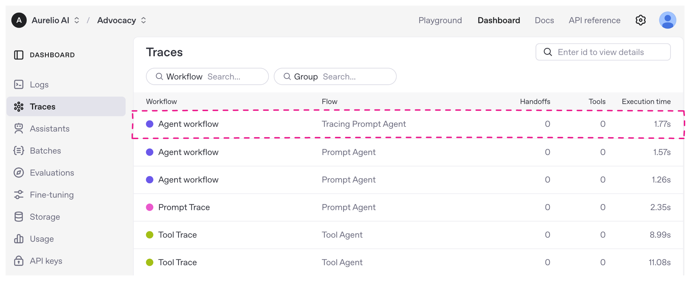
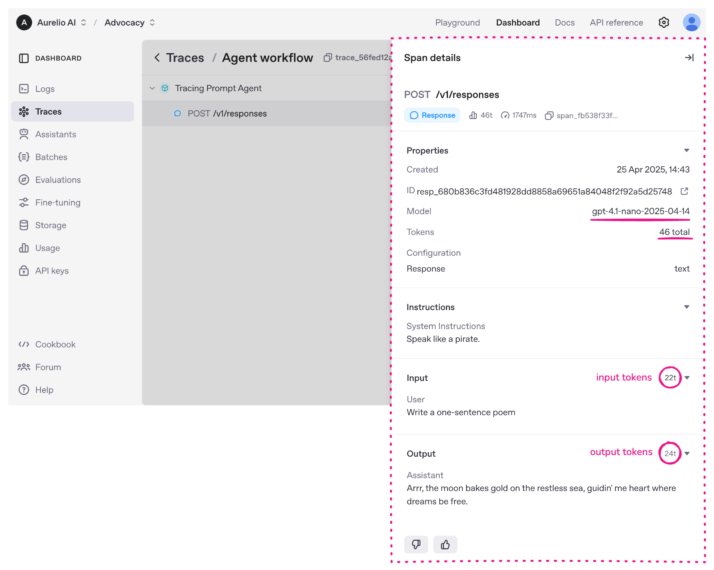
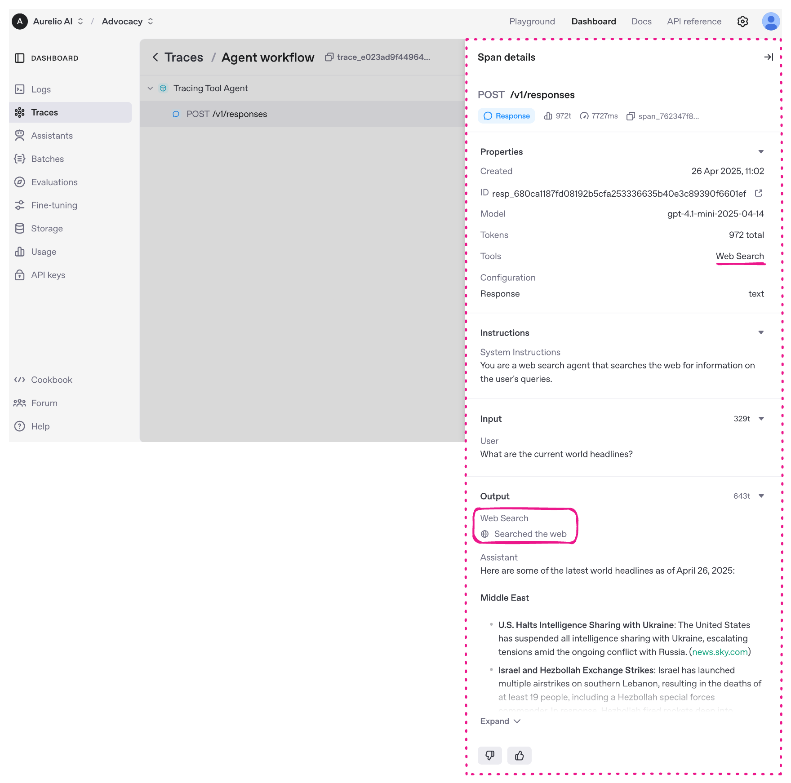
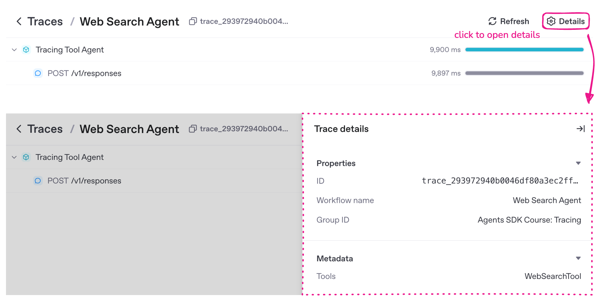
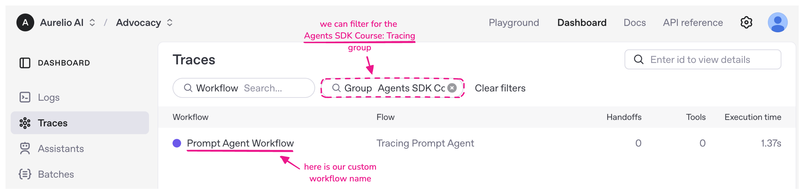
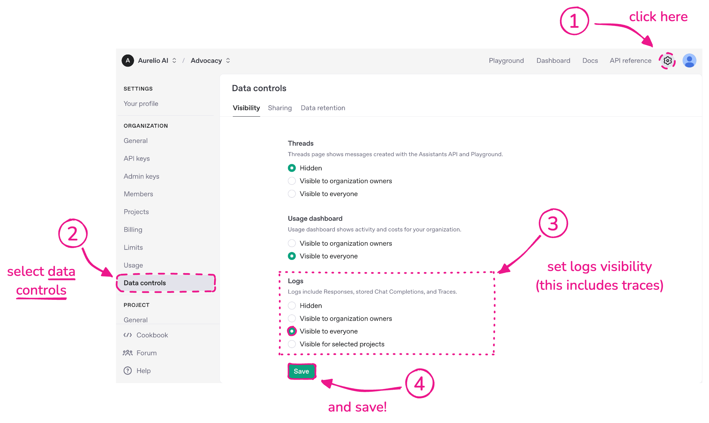

# OpenAI Agents SDK — Traces Dashboard

> **One-liner:** The zero-config, first-party tracing console bundled free with the Agents SDK —
> not a product anyone chose, but the *default* many developers see first, and the reason
> `agent_span` / `handoff_span` / `guardrail_span` vocabulary is becoming the lingua franca that
> Langfuse, Phoenix, Braintrust, Datadog and others all ingest and re-render.

**Market position:** A first-party framework console, not a standalone product. It ships inside
`openai-agents-python` / `openai-agents-js`, requires zero setup beyond having an `OPENAI_API_KEY`,
and is free. There is no separate signup, no separate pricing page, no separate SDK to install —
tracing turns on the moment you `import agents`. That "already on" default is exactly what shapes
user expectations Maple has to meet: any developer arriving at Maple from the OpenAI SDK has
already seen agent/handoff/guardrail spans rendered as a tree, for free, with no instrumentation
work. Maple's ingest story needs to be at least that frictionless for this audience.

**How core is agent tracing to the product?** It *is* the product — there is no other product.
The OpenAI Platform's "Traces dashboard" exists specifically to visualize Agents SDK (and, per
the newer docs, Agent Builder) runs. It sits in the platform's left nav under **Logs → Traces**,
next to Assistants, Batches, Evaluations and Fine-tuning — a first-class nav item, not a buried
settings page. But it is thin by design: OpenAI's own docs point developers at the SDK's
`add_trace_processor()` / `set_trace_processors()` extension points to get real depth (evals,
cost rollups, session analytics) from third parties. OpenAI builds the taxonomy and the pipe;
the ecosystem builds the UI depth.

---

## Trial & access

| | |
|---|---|
| **Free tier** | Yes, tracing itself costs nothing — it's included with any OpenAI Platform account. |
| **Credit card required?** | Not to view the dashboard or use the SDK's built-in tracing with a real API key issued on signup; a card is only required once you want to make paid API calls beyond the initial free/trial credit. Signing up for an OpenAI Platform account itself does not gate on a card. |
| **Registration URL** | https://platform.openai.com/signup (account) → https://platform.openai.com/traces (dashboard) |
| **Signup fields** | Email (or Google/Microsoft/Apple SSO), phone number verification, organization name. Standard OpenAI Platform onboarding — no tracing-specific fields. |
| **Does tracing cost anything?** | No separate SKU or metering. It piggybacks on your existing API usage; the docs explicitly note you can point `set_tracing_export_api_key()` at a key so tracing works even when you're calling **non-OpenAI models** through the SDK — "enable free tracing... without needing to disable tracing." |
| **Data retention** | Not documented with a specific number of days on the OpenAI side (unlike Datadog's explicit 15-day APM / 30-day span retention tables). Community sources report retention aligned with the platform's general Logs retention window. Treat as undocumented/opaque — a real gap vs. competitors who publish retention tables. |
| **How to disable tracing** | Three levers, in order of scope: (1) env var `OPENAI_AGENTS_DISABLE_TRACING=1` (global), (2) `set_tracing_disabled(True)` in code (global), (3) `RunConfig.tracing_disabled=True` (per run). Also: **tracing is unavailable entirely** for organizations under a Zero Data Retention (ZDR) policy. |
| **Visibility / access control** | Dashboard is **hidden from everyone but the org owner by default**. To let other members see it, an org owner must go to Settings → Data controls → Visibility and set **Logs** (which the UI explicitly says "include Responses, stored Chat Completions, and Traces") to `Visible to organization owners` / `Visible to everyone` / `Visible for selected projects` (default `Hidden`). This is a real screenshot finding, not documented prose — see Screenshot 6. |
| **Sensitive data capture** | `generation_span()` and `function_span()` capture full inputs/outputs by default (`RunConfig.trace_include_sensitive_data`, default `True`). Toggle off globally via env var `OPENAI_AGENTS_TRACE_INCLUDE_SENSITIVE_DATA=false` — relevant if Maple pitches itself as the safer default for PII-heavy traces. |

---

## Sources

| # | Source | Type | Why it's useful / what to extract |
|---|---|---|---|
| 1 | [Tracing — OpenAI Agents SDK docs](https://openai.github.io/openai-agents-python/tracing/) | Official docs | The canonical data-model description: `workflow_name`, `trace_id` (`trace_<32_alphanumeric>`), `group_id`, `metadata`, `disabled`; span fields `started_at`/`ended_at`/`trace_id`/`parent_id`/`span_data`. Also documents the three tracing-disable levers, ZDR incompatibility, and lists **every** external trace-processor integration (30+ vendors) by name. |
| 2 | [`span_data.py` source](https://github.com/openai/openai-agents-python/blob/main/src/agents/tracing/span_data.py) | SDK source (ground truth) | **The exact class per span type** and its `export()` payload shape — not paraphrased docs. This is where the taxonomy in this file comes from, verbatim. |
| 3 | [`create.py` source](https://github.com/openai/openai-agents-python/blob/main/src/agents/tracing/create.py) | SDK source | The public factory functions (`agent_span()`, `handoff_span()`, `guardrail_span()`, etc.) — confirms exact function signatures, defaults, and docstrings a Maple SDK-parity layer would need to match if it wants to be a drop-in `add_trace_processor()` target. |
| 4 | [`processor_interface.py`](https://github.com/openai/openai-agents-python/blob/main/src/agents/tracing/processor_interface.py) + [`processors.py`](https://github.com/openai/openai-agents-python/blob/main/src/agents/tracing/processors.py) | SDK source | **The exact extension point Maple would implement to become a destination.** `TracingProcessor` ABC (`on_trace_start/end`, `on_span_start/end`, `shutdown`, `force_flush`) and `TracingExporter` ABC (`export(items)`). Also reveals OpenAI's own backend contract: POST to `https://api.openai.com/v1/traces/ingest`, 100,000-byte field truncation, and — critically — **the backend silently strips `usage` from every span except `type=="generation"`**, meaning OpenAI's own ingest API is narrower than the SDK's data model. |
| 5 | [Tracing with Agents SDK — Aurelio AI](https://www.aurelio.ai/learn/agents-sdk-tracing) | Third-party tutorial with real screenshots | **The only source found with actual platform.openai.com/traces screenshots** (annotated but genuine — same left-nav, same "Org / Project" selector as the real Platform UI). Shows trace list, span detail panel, group-ID filtering, and the Data Controls visibility toggle. |
| 6 | [`docs/tracing.md` (repo)](https://github.com/openai/openai-agents-python/blob/main/docs/tracing.md) | Official docs (source) | Confirms default span nesting (`task_span` wraps the whole run, `turn_span` wraps each model turn, both can be disabled via `RunConfig(tracing={"include_task_and_turn_spans": False})` for a "more compact hierarchy"), the `BatchTraceProcessor`/`BackendSpanExporter` pipeline description, and `flush_traces()` for synchronous delivery in serverless/worker contexts. |
| 7 | [Integrations and observability](https://developers.openai.com/api/docs/guides/agents/integrations-observability) | Official docs | Positions traces as step one of a "debug → eval → improve" loop; states the dashboard is reached via **Logs → Traces**, and that it now shows traces from both SDK-based apps and visual Agent Builder workflows "during the transition window" — confirms this is becoming the unified surface, not just an SDK side-effect. |
| 8 | [Trace grading guide](https://developers.openai.com/api/docs/guides/trace-grading) | Official docs | Documents a "Grade all" flow: select a workflow → inspect a trace → attach a grader with test criteria (model, date range, tool calls) → batch-run it as an eval. This is the dashboard's only visible extension beyond raw viewing — worth knowing even though we couldn't get a screenshot of it. |

---

## Screenshots

All screenshots below are the **real OpenAI Platform UI** (confirmed by the "Org / Project"
selector top-left and the `Playground · Dashboard · Docs · API reference` nav, which matches
platform.openai.com chrome) — sourced from Aurelio AI's tutorial, which overlays pink annotation
arrows/circles on genuine screen captures. No OpenAI-produced marketing screenshots of the
dashboard could be found; coverage here is thinner than a commercial product's write-up would be,
and that thinness is itself a finding (see Market position).

### 1. Trace list


- Columns are exactly: **Workflow** (with a colored dot per workflow, e.g. purple for "Agent
  workflow", pink for "Prompt Trace", green for "Tool Trace") · **Flow** (the specific named run,
  e.g. "Tracing Prompt Agent") · **Handoffs** (count) · **Tools** (count) · **Execution time**.
  Handoffs and Tools as columns confirms they're first-class counted dimensions, not just span
  kinds buried in a tree.
- Two search boxes above the table: **Workflow** search and **Group** search — `group_id` is a
  first-class filter, not just a payload field.
- A separate global **"Enter id to view details"** box top-right for jumping straight to a known
  trace/span ID.
- Left nav for context: Dashboard, Logs, **Traces**, Assistants, Batches, Evaluations,
  Fine-tuning, Storage, Usage, API keys — Traces sits as a peer to Evaluations, not nested under it.

### 2. Span detail panel — a generation span


- Trace tree on the left (here just `Tracing Prompt Agent` → `POST /v1/responses`); clicking a
  span opens a right-side **"Span details"** panel.
- Panel header: HTTP-style label (`POST /v1/responses`), a type pill (`Response`), then inline
  stat chips: **token count** (`46t`), **duration** (`1747ms`), **span id** (truncated,
  copyable).
- **Properties** (collapsible): Created timestamp, response ID (linked out), **Model**
  (`gpt-4.1-nano-2025-04-14`), **Tokens** (`46 total`), Configuration → Response type (`text`).
- **Instructions** (collapsible): renders the agent's system prompt verbatim (`"Speak like a
  pirate."`) — this is prompt-level data surfaced at the span, not just the trace.
- **Input** / **Output** are separate collapsible sections, each with their own token-count
  badge (`22t` in, `24t` out) and role-labeled turns (`User:` / `Assistant:`).
- Thumbs up/down at the bottom of the panel — inline human feedback capture on a single span,
  with no visible destination (likely feeds evals, but undocumented from the UI alone).

### 3. Span detail panel — a tool-call turn


- Same panel shape as #2, but **Properties → Tools** now shows `Web Search`, and the **Output**
  section renders a distinct sub-block: a `Web Search` chip with a globe icon and "Searched the
  web" caption, followed by the assistant's final text — i.e., **tool invocation and tool result
  are rendered as a typed sub-item inside the Output section of the generation span**, not as a
  separate sibling span in this built-in-tool case (contrast with `function_span`, which *is* its
  own span for user-defined tools). This is a real distinction worth copying carefully: hosted
  tools (web search, code interpreter) live inside the generation; user function calls get their
  own span.

### 4. Trace-level metadata & group ID


- Clicking the **"Details"** gear icon (top-right of a trace, next to "Refresh") opens a
  **"Trace details"** panel distinct from span details — **Properties**: trace `ID`
  (`trace_...`), **Workflow name**, **Group ID** (here: `"Agents SDK Course: Tracing"`, i.e. a
  free-text label, not a UUID — confirms `group_id` is meant to be a human-chosen conversation/
  session label, e.g. a chat thread ID, exactly as the docs describe).
  **Metadata** section separately lists arbitrary key/values (here `Tools: WebSearchTool`).
- Confirms trace-level metadata and group_id are visually separated from span-level Properties —
  two distinct schemas, two distinct panels.

### 5. Filtering by group


- The **Group** search box (see Screenshot 1) is a real filter chip once applied — shown here as
  `Group: "Agents SDK Co..."` with an `×` to clear, next to a **"Clear filters"** link. Confirms
  `group_id` filtering is a supported, first-class query, i.e. Maple's session/conversation
  grouping equivalent should be filterable the same way, not just displayed.
- Also shows a **custom workflow name** (`"Prompt Agent Workflow"`) actually rendering in the
  Workflow column — proving `trace(workflow_name=...)` free text flows straight into the list's
  primary label.

### 6. Access control — Data controls → Logs visibility


- Settings → **Data controls** → **Visibility** tab (siblings: **Sharing**, **Data retention** —
  a "Data retention" tab exists in-product even though we couldn't confirm a specific day count).
- Three independently configurable rows: **Threads** (Assistants API / Playground messages),
  **Usage dashboard**, **Logs** — and the UI explicitly states *"Logs include Responses, stored
  Chat Completions, and **Traces**"*, i.e. traces are bucketed with raw request/response logs
  for privacy purposes, not treated as a separate, more shareable telemetry category.
- Each row has the same four-state radio pattern: `Hidden` / `Visible to organization owners` /
  `Visible to everyone` / `Visible for selected projects` (Logs only). Default for Logs is
  `Hidden` — confirming the docs claim that traces are invisible to non-owners until an
  owner opts in.

---

## Feature anatomy (spec-ready notes)

### Data model

- **Trace**: `workflow_name` (free text, becomes the list's primary label — e.g. "Code
  generation", "Customer service agent"), `trace_id` (format `trace_<32_alphanumeric>`,
  auto-generated if omitted), `group_id` (optional, **free-text**, links multiple traces from the
  same conversation/process — e.g. a chat thread ID; this is their session-equivalent and it is
  literally just a string you set, not a managed session entity), `metadata` (arbitrary dict),
  `disabled` (bool, trace not recorded if true).
- **Span**: `started_at`, `ended_at`, `trace_id` (parent trace), `parent_id` (parent span, if
  nested — enables arbitrary-depth trees, not just trace→span), `span_data` (the polymorphic
  payload described below).
- Multi-turn/multi-run grouping is achieved two ways: (a) wrap several `Runner.run()` calls in a
  single outer `with trace("Joke workflow"):` context so they become one trace with multiple
  `task_span`/`turn_span` children, or (b) pass the same `group_id` to *separate* traces so they
  stay distinct traces but are linkable/filterable together (the mechanism shown in Screenshot 5).
  **There is no third first-class "session" entity** — `group_id` on `Trace` is the entire session
  story, exactly a string tag, no separate session object with its own lifecycle. This is the gap
  Datadog's docs also call out.

### Complete span taxonomy (exact names, from `span_data.py`)

Every span type is a `SpanData` subclass with `.type` (string discriminator) and `.export()`
(the wire payload). All are children of a `Trace` or another `Span`, nested via `parent_id`.

| `type` string | Class | Fields captured | Notes |
|---|---|---|---|
| `agent` | `AgentSpanData` | `name`, `handoffs` (list[str] of agent names this agent **could** hand off to), `tools` (list[str] of tool names **available** to it), `output_type`, `metadata` | Wraps each agent activation. `handoffs`/`tools` are the *declared* capability set, independent of whether they were used — the same "manifest" idea Datadog's Agent Manifest panel builds on. |
| `generation` | `GenerationSpanData` | `input` (sequence of message dicts), `output` (sequence of message dicts), `model`, `model_config` (hyperparameters), `usage` | One LLM call. Explicitly the richest span — this is what Screenshot 2/3 render. Docs note: use `response_span` instead if you only need a response ID, not full content. |
| `function` | `FunctionSpanData` | `name`, `input` (str), `output` (Any, stringified), `mcp_data` (dict, present for MCP tool calls) | One user-defined tool/function call. `mcp_data` is a dedicated field — MCP tool calls are distinguishable from regular function calls at the schema level. |
| `handoff` | `HandoffSpanData` | `from_agent`, `to_agent` | Minimal — just source/destination agent names, no reason/confidence/payload. A thinner model than Maple likely wants; worth enriching. |
| `guardrail` | `GuardrailSpanData` | `name`, `triggered` (bool) | Also minimal — pass/fail plus a name, no severity, no explanation field, no which-input-triggered-it. Another place to out-spec OpenAI. |
| `response` | `ResponseSpanData` | `response` (full OpenAI `Response` object, but only `response.id` + `usage` are exported), `input` (kept on the Python object but the docstring notes **"not used by the OpenAI trace processors, but is useful for other tracing processor implementations"**) | A deliberately lightweight sibling of `generation` — reference-only, for when you don't want to duplicate full content. The `input` field existing purely for *other* processors' benefit is a direct signal OpenAI expects third parties to want more than OpenAI's own backend keeps. |
| `custom` | `CustomSpanData` | `name`, `data` (arbitrary dict) | The escape hatch for user-defined span types. |
| `task` | `TaskSpanData` | `name`, `usage`, `metadata` | Wraps one top-level `Runner.run()`/`run_sync()`/`run_streamed()` invocation. Exported with `type: "custom"` and `name: "task"` under the hood (see Implementation quirk below) — **not actually its own top-level `type` on the wire**, despite having a dedicated Python class. |
| `turn` | `TurnSpanData` | `turn` (int), `agent_name`, `usage`, `metadata` | Wraps one agent-loop turn (one LLM round-trip within an agent run). Same wire quirk as `task`: exported as `type: "custom", name: "turn"`. |
| `transcription` | `TranscriptionSpanData` | `input` (base64 PCM string), `input_format` (default `"pcm"`), `output`, `model`, `model_config` | Speech-to-text. |
| `speech` | `SpeechSpanData` | `input`, `output` (base64 PCM), `output_format` (default `"pcm"`), `model`, `model_config`, `first_content_at` (timestamp — time-to-first-audio-byte, a latency metric specific to streaming TTS) | Text-to-speech. |
| `speech_group` | `SpeechGroupSpanData` | `input` | Parent container for related audio spans in a voice pipeline. |
| `mcp_tools` | `MCPListToolsSpanData` | `server`, `result` (list[str] of tool names returned) | Captures an MCP server's `list_tools()` call — a discovery event, not a tool invocation. |

**Implementation quirk worth knowing precisely:** `TaskSpanData` and `TurnSpanData` both report
`type` as `"task"`/`"turn"` from their Python class, but their `.export()` method wraps that in
`{"type": "custom", "name": "task"|"turn", "data": {...}}` before it hits the wire — i.e. **on the
actual ingest payload, task and turn spans are indistinguishable from user `custom_span()` calls
except by a `data.sdk_span_type` field inside the custom payload.** If Maple wants to recognize
these automatically from raw ingested JSON (rather than requiring the SDK), it has to unwrap
`custom` spans and check `data.sdk_span_type` — the outer `type` field alone is insufficient. Also
worth noting: `RunConfig(tracing={"include_task_and_turn_spans": False})` lets a user disable both
for a "more compact hierarchy," implying OpenAI itself considers task/turn spans noisy scaffolding
rather than essential signal — agent/generation/function/guardrail/handoff/custom always remain.

**Default nesting produced by the SDK** (from `docs/tracing.md`): the entire `Runner.run()` call
→ wrapped in `trace()` → each invocation wrapped in `task_span()` → each model turn wrapped in
`turn_span()` → each agent activation wrapped in `agent_span()` → LLM calls in `generation_span()`,
tool calls in `function_span()`, guardrails in `guardrail_span()`, handoffs in `handoff_span()`.
So a typical single-agent, single-tool-call run is five levels deep:
`trace → task_span → turn_span → agent_span → {generation_span, function_span}`.

### Tracing processor extension architecture (the part that matters most for Maple)

Three-layer pipeline, all in `src/agents/tracing/`:

1. **`TraceProvider`** (global singleton) — creates traces/spans, owns the list of processors.
2. **`TracingProcessor`** (ABC, `processor_interface.py`) — the interface any destination
   implements:
   ```python
   class TracingProcessor(abc.ABC):
       def on_trace_start(self, trace: Trace) -> None: ...
       def on_trace_end(self, trace: Trace) -> None: ...
       def on_span_start(self, span: Span[Any]) -> None: ...
       def on_span_end(self, span: Span[Any]) -> None: ...
       def shutdown(self) -> None: ...
       def force_flush(self) -> None: ...
   ```
   Docstring explicitly requires: **thread-safe, non-blocking, must swallow its own errors** —
   a misbehaving processor must never break agent execution. This is the exact contract a Maple
   `MapleTracingProcessor` would implement to become an `add_trace_processor()` target.
3. **`TracingExporter`** (ABC) — the lower-level batch-export interface:
   `export(items: list[Trace | Span[Any]]) -> None`. OpenAI's own `BackendSpanExporter`
   implements this, POSTing batches to `https://api.openai.com/v1/traces/ingest`.
4. **`BatchTraceProcessor`** — the default `TracingProcessor` OpenAI installs; queues
   traces/spans, flushes on a timer or when the queue's size trigger is hit, and does a final
   flush on process exit. For long-running workers (Celery/RQ/Dramatiq/FastAPI background
   tasks), the docs recommend explicitly calling `flush_traces()` after the trace context exits
   to guarantee delivery before the worker returns.

Two public swap points:
- `add_trace_processor(processor)` — **additive**: your processor runs alongside OpenAI's
  default backend export. This is how every third-party integration in the ecosystem list
  works today (Langfuse, Phoenix, Braintrust, Datadog, LangSmith, Comet Opik, MLflow, W&B Weave,
  PostHog, Portkey, Galileo, HoneyHive, PromptLayer, and ~20 more).
- `set_trace_processors([...])` — **replacing**: opts out of OpenAI's backend entirely unless
  you re-add a processor that does the export yourself.

**Ingest-side behavior worth matching or beating** (from `BackendSpanExporter` source):
OpenAI's own backend truncates any `input`/`output` field over **100,000 bytes**, appending
`"... [truncated]"`, and — more surprising — **strips the `usage` field from every span whose
`type` is not exactly `"generation"`** before sending. So even `response_span`, `function_span`,
and custom spans lose usage data at OpenAI's own ingest boundary even though the SDK captures it
on `TaskSpanData`/`TurnSpanData`. A Maple-native `TracingProcessor` wouldn't have this
restriction — a concrete example of where being a *better* destination than OpenAI's own is easy.

**Cross-model tracing:** `set_tracing_export_api_key()` lets you route trace export to OpenAI's
dashboard using an OpenAI key even when the actual model calls go to a third-party provider via
`AnyLLMModel` — i.e. OpenAI explicitly wants to be the tracing backend of record even for
non-OpenAI-model agents. Direct evidence developers already treat "which dashboard shows my
agent trace" as separable from "which model served the call" — exactly the wedge Maple needs.

### What the dashboard actually shows (and where it's weak)

**Strengths, concretely:**
- Zero setup — traces appear the moment you import the SDK, no dashboard-side configuration.
- Group/workflow filtering built into the list view (Screenshots 1, 5).
- Per-span token counts and per-turn Input/Output rendering with role labels (Screenshot 2).
- Distinguishes hosted-tool results (rendered inline in a generation span's Output, Screenshot 3)
  from user-function results (separate `function_span`).
- Trace-level metadata and group_id surfaced in a dedicated panel, separate from span
  properties (Screenshot 4).
- Sane, documented privacy model: Logs (incl. Traces) hidden from non-owners by default, with a
  simple four-state visibility control (Screenshot 6).

**Weaknesses, concretely — the gaps Maple should target:**
- **No graph/flow view.** Every source, including the annotated screenshots, shows a flat
  indented tree in the left rail — no DAG, no fan-out/fan-in visualization for parallel tool
  calls or multi-agent handoff chains. Datadog's Execution Flow graph (see
  `datadog-llm-observability.md`) is a direct answer to this gap.
  `handoff_span` and `guardrail_span` exist as first-class *data*, but nothing in the UI renders
  them differently from any other row in the tree — no distinct icon/color scheme was visible
  in any screenshot found (contrast Datadog's fixed icon+color-per-kind legend).
- **`handoff` and `guardrail` span payloads are thin.** `HandoffSpanData` is just
  `from_agent`/`to_agent` — no reason, no confidence, no data passed. `GuardrailSpanData` is
  just `name`/`triggered` — no explanation, no severity, no which-field-failed. Both are ripe
  for Maple to out-spec if Maple wants richer native fields while still accepting the OpenAI
  shape as an ingest format.
- **No cost rollup anywhere observed.** Token counts appear per-span (Screenshot 2/3) but no
  aggregate cost-per-trace, cost-by-model, or cost-over-time was found in any screenshot or doc —
  a stark contrast to Datadog's stat-bar cost chip.
- **No documented data retention window.** Competitors publish explicit day counts; OpenAI's UI
  has a "Data retention" tab (Screenshot 6 sibling) but no number could be confirmed from any
  source here — worth treating as a real, citable gap when positioning Maple.
- **Sessions are not a managed entity** — `group_id` is a free-text tag on `Trace`, not a
  first-class object with its own timeline/rollup view. If Maple ships true multi-turn session
  rollups (duration, cost, turn count across a `group_id`), that is a genuine step up, not
  parity.
- **Task/turn spans are wire-indistinguishable from user custom spans** (see Implementation
  quirk above) — any consumer of raw OpenAI-format export JSON has to know to unwrap
  `data.sdk_span_type` to recover the "real" type. Native Maple ingestion of this format needs
  to special-case it; a naive "render span type as `custom` unless X" implementation would
  misclassify every task/turn span.

---

## Ideas worth stealing for Maple

1. **The span taxonomy itself, verbatim.** `agent_span` / `generation_span` / `function_span` /
   `handoff_span` / `guardrail_span` / `response_span` / `custom_span` (+ audio/MCP variants) is
   becoming a de facto vocabulary because this is where a huge fraction of agent developers
   start. Maple should recognize and natively render these exact `span_data.type` values (and
   their OTel `gen_ai.*`-attribute equivalents) rather than inventing parallel names.
2. **`TracingProcessor`/`TracingExporter` as the integration contract to target.** Building a
   `MapleTracingProcessor` that developers add via `add_trace_processor()` (additive, i.e. it
   coexists with OpenAI's own dashboard — zero-risk trial) is the single highest-leverage,
   lowest-friction acquisition channel available: no OTel setup required, just one line of
   Python/TS. Match the four-method contract (`on_trace_start/end`, `on_span_start/end`, plus
   `shutdown`/`force_flush`) exactly so existing community tutorials transfer almost verbatim.
3. **Fix the two thin span types on ingest, not just on render.** Since `handoff_span` and
   `guardrail_span` payloads are minimal by spec, Maple's ingest layer could enrich them (e.g.
   infer a handoff "reason" from the surrounding generation span's tool-call arguments, or
   surface which guardrail *input field* triggered) — a value-add that doesn't require asking
   users to change their instrumentation.
4. **`group_id` as a first-class filter, promoted to a real session entity.** OpenAI stops at a
   filterable string tag (Screenshot 5); Maple already has the primitives to go further — a
   session view with rollup duration/cost/turn-count is a genuine upgrade over the incumbent
   default, not just parity.
5. **Distinguish hosted-tool-result-inside-generation vs. user-function-as-sibling-span** (Screenshot
   3) as a rendering rule: Maple's tree/graph should visually differentiate a `generation_span`
   with an inline tool-result sub-block from a full sibling `function_span`, matching how the SDK
   itself already models the distinction.
6. **Publish a real retention policy and a visible retention control**, unlike OpenAI's
   apparently-undocumented-in-the-open one — an easy, concrete trust-building differentiator to
   call out explicitly in Maple's own docs.
7. **`flush_traces()`-equivalent for serverless/worker exit paths.** Cheap to add, solves a real
   documented pain point (batch processor not flushing before a Lambda/worker exits).

## What to skip / deprioritize

- The **flat indented tree with no graph view** is not something to copy — it's the gap. Maple
  already has (or should build, per Datadog's Execution Flow) a graph renderer; don't regress to
  OpenAI's baseline.
- The **`task_span`/`turn_span` wire-format quirk** (silently downgraded to `custom` on export)
  is an implementation wart to route around when parsing OpenAI-format traces, not a pattern to
  imitate in Maple's own schema.
- **Trace grading / "Grade all"** (Source 8) is a genuine feature but pulls toward building a
  full managed-eval product surface — same call as Datadog's evaluations: valuable, but not
  required to ship agent tracing, and a later phase.
- Don't over-invest in matching the **visual chrome** (OpenAI Platform's generic settings-page
  look) — nothing here suggests OpenAI has invested design effort in this surface beyond
  functional parity; it is not a design bar worth chasing.

## Screenshot sources

All six screenshots are byte-identical to the images embedded in a single third-party tutorial —
verified by downloading each remote file and comparing size to the local asset (exact match on
all six). As the doc's Screenshots section already notes, these are genuine platform.openai.com
captures (matching nav chrome and "Org / Project" selector) with pink annotation overlays added by
the tutorial author, **not** OpenAI-produced marketing screenshots.

| File | Found on | Direct image URL |
|---|---|---|
| `traces-custom-trace.png` | [Tracing with Agents SDK — Aurelio AI](https://www.aurelio.ai/learn/agents-sdk-tracing) (third-party tutorial, real OpenAI Platform screenshots) | `https://www.aurelio.ai/images/posts/agents-sdk-tracing/traces-custom-trace.png` |
| `traces-data-control.png` | [Tracing with Agents SDK — Aurelio AI](https://www.aurelio.ai/learn/agents-sdk-tracing) (third-party tutorial, real OpenAI Platform screenshots) | `https://www.aurelio.ai/images/posts/agents-sdk-tracing/traces-data-control.png` |
| `traces-default-tools-trace-span.png` | [Tracing with Agents SDK — Aurelio AI](https://www.aurelio.ai/learn/agents-sdk-tracing) (third-party tutorial, real OpenAI Platform screenshots) | `https://www.aurelio.ai/images/posts/agents-sdk-tracing/traces-default-tools-trace-span.png` |
| `traces-default-trace-span.png` | [Tracing with Agents SDK — Aurelio AI](https://www.aurelio.ai/learn/agents-sdk-tracing) (third-party tutorial, real OpenAI Platform screenshots) | `https://www.aurelio.ai/images/posts/agents-sdk-tracing/traces-default-trace-span.png` |
| `traces-default-trace.png` | [Tracing with Agents SDK — Aurelio AI](https://www.aurelio.ai/learn/agents-sdk-tracing) (third-party tutorial, real OpenAI Platform screenshots) | `https://www.aurelio.ai/images/posts/agents-sdk-tracing/traces-default-trace.png` |
| `traces-metadata.png` | [Tracing with Agents SDK — Aurelio AI](https://www.aurelio.ai/learn/agents-sdk-tracing) (third-party tutorial, real OpenAI Platform screenshots) | `https://www.aurelio.ai/images/posts/agents-sdk-tracing/traces-metadata.png` |

---

*Researched 2026-08-05. Screenshots pulled from OpenAI's public docs and cookbook for internal
competitive research; do not redistribute.*
