# Pydantic Logfire — AI & Agent Observability

> **One-liner:** An OpenTelemetry-native observability platform, built by the Pydantic/Pydantic AI
> team, that puts LLM and agent spans in the *exact same trace* as your DB queries, HTTP calls, and
> business logic — and queries all of it with plain SQL instead of a proprietary DSL. Philosophically
> the closest match to Maple's own bet in this entire competitive set.

**Market position:** Pydantic is the company behind `pydantic` (the validation library nearly every
Python AI stack depends on — FastAPI, LangChain, Instructor, OpenAI's SDK) and Pydantic AI, its own
agent framework. Logfire is their monetization layer: an observability product that inherits massive
distribution because Python devs already trust the Pydantic name and, if they use Pydantic AI,
Logfire is the *recommended* default observability backend, one function call away
(`logfire.instrument_pydantic_ai()`). Funding: Pydantic raised a $12.5M seed in 2023 (Sequoia) to
build Logfire; it is VC-backed but small relative to Datadog. They position explicitly against two
different competitor classes:
- **vs Datadog / traditional APM:** "first-class AI and general observability" in one product,
  without needing a second SKU or separate mental model for AI.
- **vs LangSmith / Langfuse / LLM-native tools:** those give you "LLM-layer tracing — prompt
  management, evaluation, model behavior" but "when your agent calls a tool that queries a database
  or hits an API, AI-only tools see the tool call and the result, not what happened in between."
  Logfire's counter is structural, not a feature checkbox: it's built on OpenTelemetry from day one,
  so *any* OTLP-emitting library — FastAPI, SQLAlchemy, httpx, boto3, Pydantic AI, raw `gen_ai.*`
  spans from any other SDK — lands in the same trace store automatically.

**How core is agent tracing to the product?** As core as it gets — Logfire *is* an AI observability
company that happens to also do general APM, the mirror image of Datadog's "APM company doing AI."
Their own tagline is "AI observability platform for production LLM and agent systems." But
structurally, agent tracing is not a separate product surface: there's no distinct "Agent
Observability" SKU, dashboard, or data model. An agent run is just a trace; a tool call is just a
span. The specialization shows up in the *rendering layer* (LLM Panels, token/cost badges, message
role formatting) sitting on top of one universal trace store — the same architecture bet Maple has
made with ClickHouse/OTel spans as the single substrate.

---

## Trial & access

| | |
|---|---|
| **Free tier** | Yes — **Personal plan, 10 million logs/spans/metrics per month**, permanently free, 30-day retention, 1 admin + 2 guest seats. Ingestion pauses (not billed) once you hit the cap. |
| **Free trial** | No separate time-boxed trial — the free Personal tier itself is the trial; paid tiers are opt-in upgrades, not a countdown. |
| **Credit card required?** | **No** for the free Personal tier ("no credit card required to sign up"). Card required to start Team/Growth. |
| **Registration URL** | https://logfire.pydantic.dev (redirects to a region host, e.g. `logfire-us.pydantic.dev`) |
| **Signup fields** | Not fully inspectable (SPA login screen); docs describe `logfire auth` / `uvx logfire auth` opening a browser OAuth flow for CLI-first onboarding — signup itself is web-based org/project creation. |
| **Paid entry price** | **Team: $49/mo** (5 seats included, +$25/seat to 12 max) · **Growth: $249/mo** (unlimited seats, up to 90-day retention) · **Enterprise:** custom/invoiced. All paid tiers include $20/mo of telemetry credit (~10M records); overage is **$2 per additional million records**. |
| **Self-hosting story** | **SDKs are open source (Apache-2.0-ish, on GitHub); the server + UI are closed source.** Self-hosting is an *Enterprise-only* contract line, not a downloadable Docker image — deploys on Kubernetes + PostgreSQL + object storage, same feature set as cloud. Also offers a "Dedicated" single-tenant GCP option between multi-tenant Cloud and full self-host. |
| **Gotcha** | Because server/UI are closed-source, "self-hosted" here means "Pydantic runs it inside your infra under a paid contract," not community self-hosting like Langfuse/Phoenix. The generous OSS-feeling free tier (10M/mo, no CC) is the real self-serve path, not self-hosting. |

---

## Sources

| # | Source | Type | Why it's useful / what to extract |
|---|---|---|---|
| 1 | [Pydantic Logfire homepage](https://pydantic.dev/logfire) | Marketing | Headline positioning ("Monitor your entire AI application stack, not just the LLM calls"), the explicit LLM-only-tools-vs-Logfire contrast table, pricing snapshot, "52,000+ AI teams" claim. |
| 2 | [AI & LLM Observability doc](https://pydantic.dev/docs/logfire/get-started/ai-observability/) | Docs | **The full-stack argument, verbatim, with a worked failure scenario**: an agent recommends an item with impossible delivery timing — is it a prompt/model failure (constraint never passed to the tool) or a system failure (constraint reached the tool but the inventory service returned stale data)? "Both failures look like a bad answer to the user. They need different fixes. Logfire keeps the agent's decisions and the work they triggered in the same trace." This is the single best articulation of the philosophy Maple should be arguing too. |
| 3 | [SQL reference](https://pydantic.dev/docs/logfire/reference/sql/) | Docs | **The exact schema.** Query engine is **Apache DataFusion**, syntax targets Postgres compatibility. Two tables: `records` (every span/log — logs are zero-duration spans) and `metrics` (pre-aggregated numerics). Full column list extracted below in Feature Anatomy — directly comparable to Maple's ClickHouse DSL / `run_sql`. |
| 4 | [Debugging & Monitoring with Logfire (Pydantic AI docs)](https://pydantic.dev/docs/ai/integrations/logfire/) | Docs | **Pydantic AI's exact instrumentation contract.** `logfire.instrument_pydantic_ai()` / `Agent.instrument_all()` one-liners; confirms OTel GenAI semconv v1.37 by default; lists the exact `gen_ai.*` attribute keys emitted (below). This is the "how do you light up the UI" answer for any framework, including Maple's own future SDK. |
| 5 | [LLM Panels doc](https://pydantic.dev/docs/logfire/observe/llm-panels/) | Docs | Describes the span-detail rendering layer specifically built for LLM/agent spans: message-role formatting, tool-call argument/return rendering, file/blob previews, token+cost badges with an aggregated-vs-direct (`Σ`) distinction. Explicitly supports Pydantic AI, OpenAI, Google GenAI, LangChain, LiteLLM, Anthropic, and **Claude Agent SDK** out of the box. |
| 6 | [Dashboards doc](https://pydantic.dev/docs/logfire/guides/web-ui/dashboards/) | Docs | Confirms dashboards are **entirely SQL-powered** (`Dashboard > Panel Groups > Panels > Charts`), `$resolution` time-bucket variable, `$variable_name` params, 5 chart types, standard vs custom dashboards, "download dashboard as code." |
| 7 | [Live View doc](https://pydantic.dev/docs/logfire/guides/web-ui/live/) | Docs | Describes the trace-tree "Live View" as the product's home screen: SQL-in-search-box with a **natural-language-to-SQL** assist ("Ask in Language → Get SQL"), timeline histogram, visibility filters (level/service/scope/tags). |
| 8 | [github.com/pydantic/logfire](https://github.com/pydantic/logfire) | Repo | README confirms "an opinionated wrapper around OpenTelemetry," full OTel signal support (traces/metrics/logs), and gives the canonical FastAPI trace screenshot. Good source for verifying OSS boundary (SDK only). |
| 9 | [Pricing](https://pydantic.dev/pricing) | Marketing | Exact tier pricing, seat counts, retention windows, self-host/dedicated deployment options, nonprofit/startup discount program. |

---

## Screenshots

### 1. Live View — the default landing screen
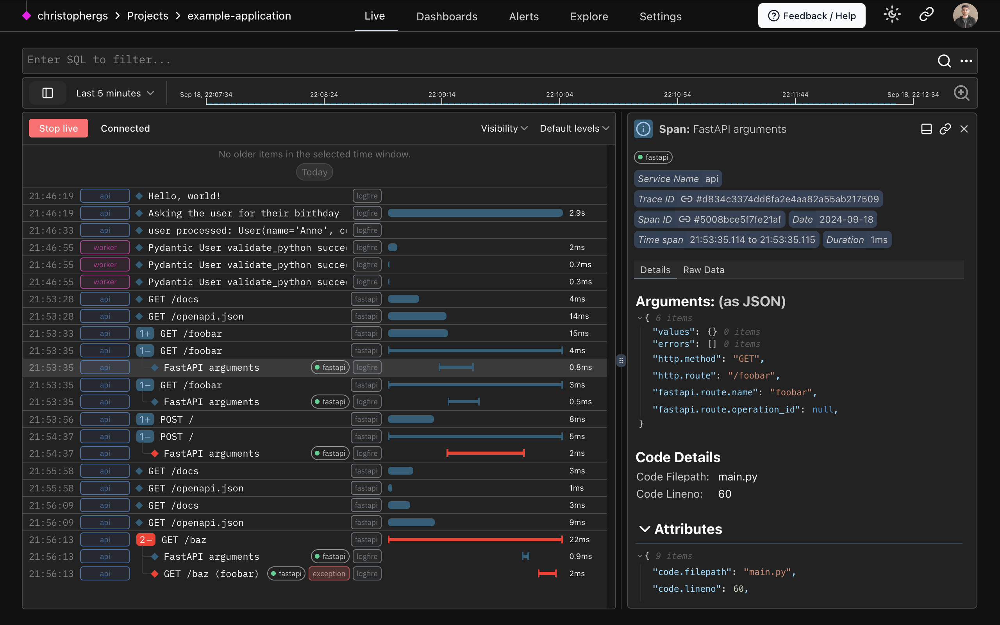

- Top nav is flat: `Live | Dashboards | Alerts | Explore | Settings` — no separate "AI" or "Agents"
  tab. Agent traces live in the same list as everything else.
- **The search bar *is* a SQL WHERE-clause box** (`Enter SQL to filter...`) — not a facet picker
  bolted on top of a query language, the query language *is* the UI.
- Row types interleave freely: plain log lines (`Hello, world!`), Pydantic validation spans
  (`Pydantic User validate_python succee...`), and HTTP spans (`GET /foobar`) all in one
  chronological stream, color-coded by service (`api` blue, `worker` pink).
- Selecting a span opens a **right-side detail panel** with `Details` / `Raw Data` tabs, a
  `Trace ID` / `Span ID` pair rendered as clickable pills, and `Arguments: (as JSON)` — the
  function-call arguments that produced the span, not just its OTel attributes.
- Duration bars are inline in the row, not a separate column — red bars mark errors/exceptions
  directly in the waterfall (see the `GET /baz (foobar)` row with an `exception` tag).

### 2. Full-stack framing — one trace, LLM embeddings + chat completion + FastAPI
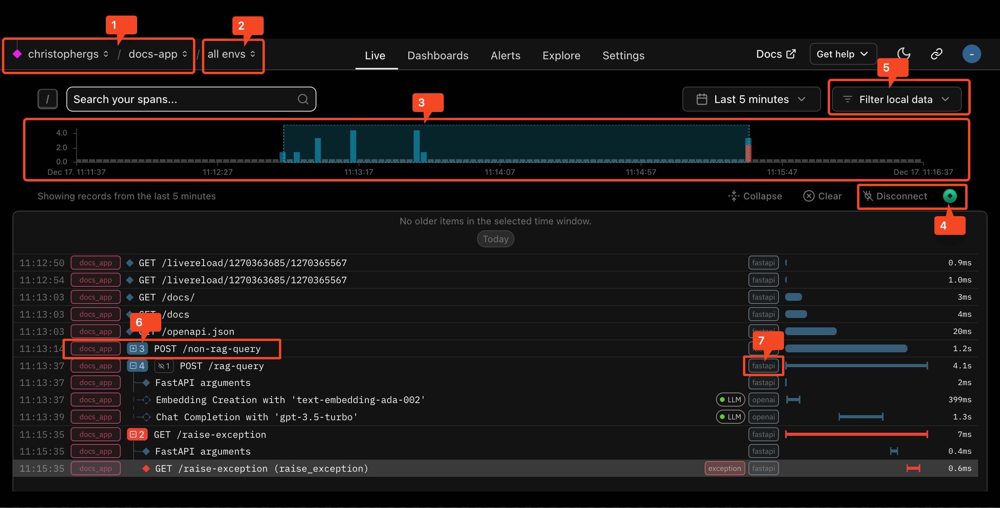

**This is the single most important screenshot for Maple's purposes.** The trace tree for
`POST /rag-query` contains, as direct sibling/child spans in one tree:
- `FastAPI arguments` (framework span)
- `Embedding Creation with 'text-embedding-ada-002'` — tagged with a green **`LLM`** kind badge and
  `openai` scope chip
- `Chat Completion with 'gpt-3.5-turbo'` — same `LLM` badge, same `openai` chip

All three are indented under the same parent HTTP span, at the same visual depth as any other
child span (no separate "AI" lane, no visual demotion). The only differentiator is the small green
`LLM` pill next to the span name — a **span-kind tag, not a different view**. This directly proves
the "agent view as a lens over generic OTel spans" architecture Maple is betting on.

### 3. Exception drill-down with full attribute panel
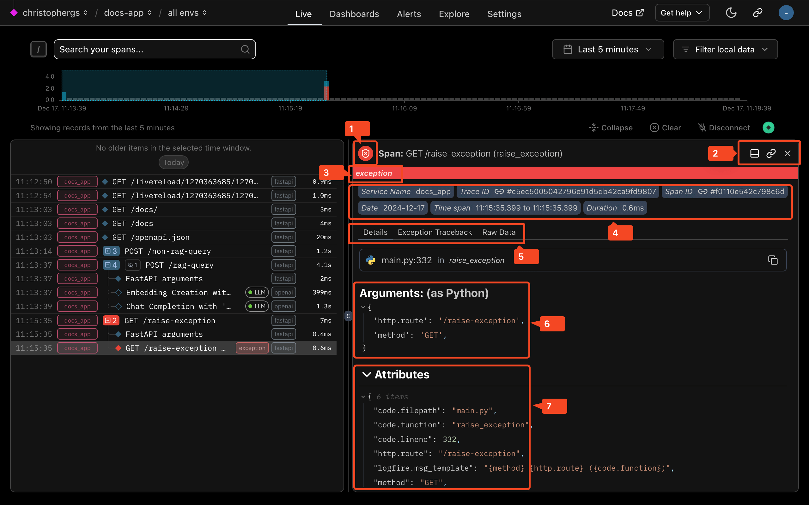

- Detail panel tabs: `Details | Exception Traceback | Raw Data` — traceback is a first-class tab,
  not buried in attributes.
- `Arguments: (as Python)` renders the original function call signature (`http.route`, `method`) —
  Logfire captures *call arguments*, a level above raw OTel attributes, because their Python SDK
  instruments at the function/decorator level.
- `Attributes` section shows raw OTel keys verbatim, including `logfire.msg_template` — the
  structured-logging template string that produced the human-readable `message` column (used for
  low-cardinality grouping in SQL, e.g. `GROUP BY message`).

### 4. Full-stack agent trace — game API → DB call → agent → Anthropic, with cost popover
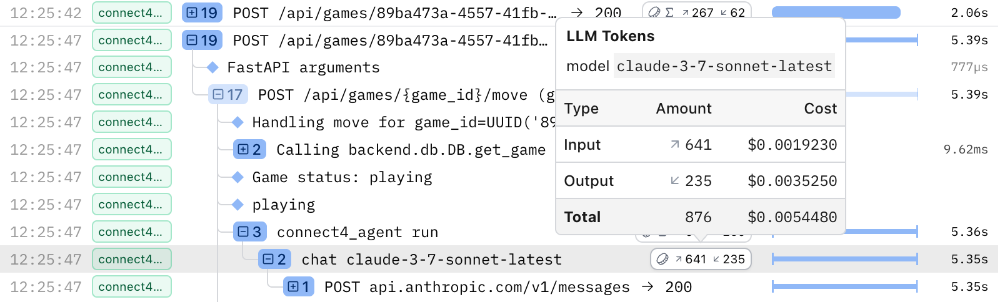

Another concrete full-stack example, this time an agent embedded inside a real application flow:
`POST /api/games/{game_id}/move` → `Handling move for game_id=...` → `Calling backend.db.DB.get_game`
→ `Game status: playing` → `connect4_agent run` → `chat claude-3-7-sonnet-latest` →
`POST api.anthropic.com/v1/messages`. Hovering the token badge on the `chat` span opens an
**`LLM Tokens` popover**: model name, Input/Output/Total token counts each paired with a **USD cost
column**, computed inline without leaving the trace. The DB call and the LLM call are two spans in
the same waterfall — you'd see a slow `get_game` query and a slow Claude call in the same place.

### 5. Pydantic AI agent run — nested tool calls + Generation tab
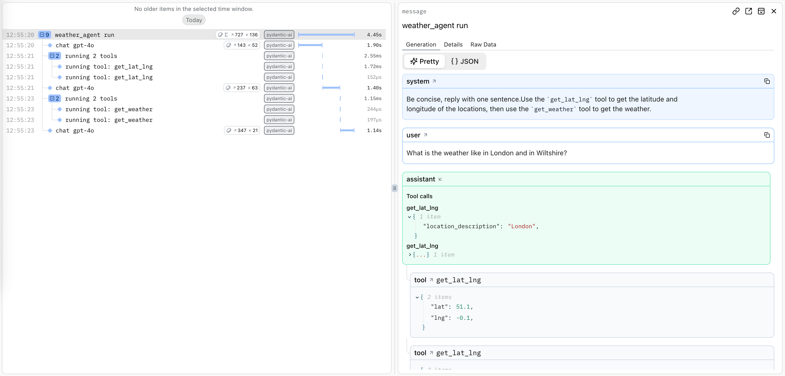

- Span tree for one agent run: `weather_agent run` → `chat gpt-4o` → `running 2 tools` →
  `running tool: get_lat_lng` (×2, parallel tool calls) → `chat gpt-4o` → `running 2 tools` →
  `running tool: get_weather` (×2) → final `chat gpt-4o`. **Tool fan-out is a real nested span**,
  not a synthetic edge — `running 2 tools` is itself a span wrapping its children.
  - Every span shows a small **token badge** (`↗143 ↙52` = input/output tokens) inline in the tree,
    no need to open the detail panel just to see cost-relevant numbers.
- Detail panel has `Generation | Details | Raw Data` tabs. `Generation` renders the conversation as
  chat bubbles: blue `system`, blue `user`, green `assistant` (with **`Tool calls`** rendered inline
  as a labeled sub-block showing the function name + JSON args), and gray `tool` result bubbles.
  This is a purpose-built chat renderer, not a JSON dump.

### 6. Tool call with extended thinking rendered inline
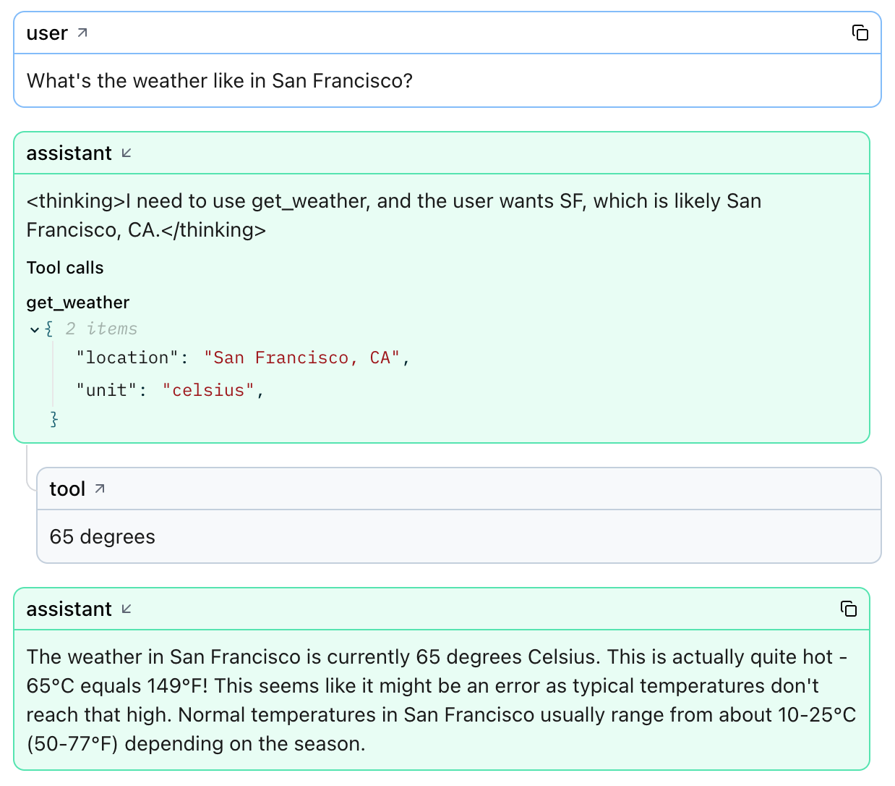

- Model "thinking"/reasoning content (`<thinking>I need to use get_weather...</thinking>`) renders
  inside the assistant bubble, ahead of the `Tool calls` block — reasoning, tool call, and tool
  result all visually sequenced in the order the model actually produced them.
- Tool arguments render as syntax-highlighted JSON (`"location": "San Francisco, CA"`); the tool's
  return value renders as a plain-text `tool` bubble below it (`65 degrees`), then the assistant's
  final answer as a normal green bubble — the whole reasoning chain reads top-to-bottom like a
  conversation transcript.

### 7. OTel-native ingestion — raw HTTP capture nested under the model span
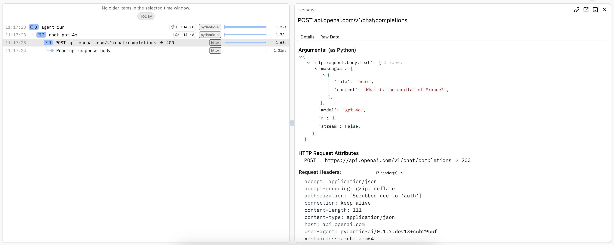

- With `logfire.instrument_httpx(capture_all=True)` added alongside Pydantic AI instrumentation,
  the **raw outbound HTTP call becomes a fourth nesting level**: `agent run` → `chat gpt-4o` →
  `POST api.openai.com/v1/chat/completions → 200` → `Reading response body`.
- The HTTP span's detail panel shows `Arguments: (as Python)` with the **literal request body**
  (`messages`, `model`, `n`, `stream`), then `HTTP Request Attributes` and 17 raw request headers,
  with `authorization: [Scrubbed due to 'auth']` — **automatic secret redaction on well-known
  sensitive headers**, applied even at this raw-capture depth.
- Proof of the OTel-native claim in the most literal sense: turning on a generic OTel instrumentor
  for a *transport library* (httpx) automatically nests inside an *agent framework's* spans (Pydantic
  AI) with zero glue code, because both just emit vanilla OTel spans into the same trace context.

### 8. SQL Workbench — querying the `records` table directly
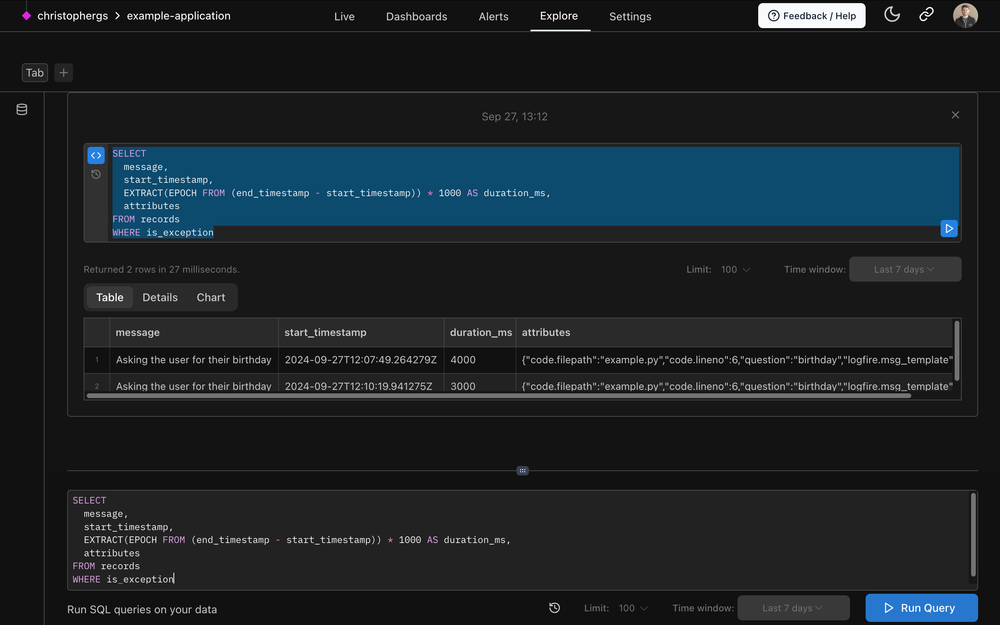

- Full Postgres-flavored SQL against `records`:
  ```sql
  SELECT message, start_timestamp,
         EXTRACT(EPOCH FROM (end_timestamp - start_timestamp)) * 1000 AS duration_ms,
         attributes
  FROM records
  WHERE is_exception
  ```
- Result view has **`Table | Details | Chart`** tabs — the same query can render as a raw table or
  be immediately turned into a chart, no separate charting tool.
- `attributes` is a JSON column queried with normal SQL (`->`, `->>` per the docs) — span attributes
  (including `gen_ai.*` keys) are just JSON, queryable without a schema migration per attribute.
- Editor has autocomplete, a run button, adjustable `Limit` and `Time window` controls outside the
  query itself (so paging/time-boxing doesn't require rewriting the SQL).

### 9. SQL against the `metrics` table
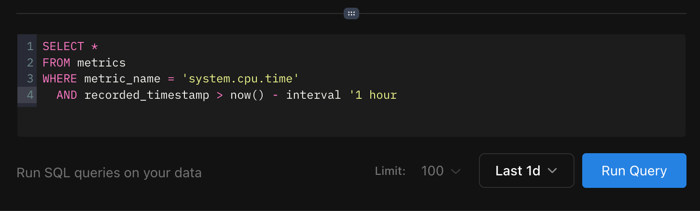

`SELECT * FROM metrics WHERE metric_name = 'system.cpu.time' AND recorded_timestamp > now() -
interval '1 hour'` — confirms metrics are a **separate pre-aggregated table** from `records`
(spans/logs), queried with the same SQL dialect. Host/infra metrics and agent spans are two tables
in one queryable database, not two products.

### 10. Dashboards — standard templates vs custom
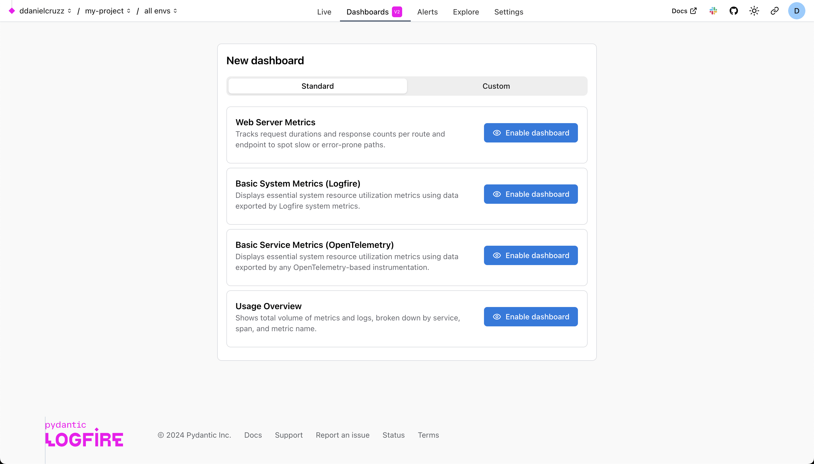

- `Standard` (Pydantic-maintained, non-editable, one-click `Enable dashboard`) vs `Custom`
  (fully editable, SQL-defined panels) as two explicit top-level tabs.
- Note `Basic Service Metrics (OpenTelemetry)` as its own standard template, distinct from the
  Logfire-SDK-specific one — they explicitly support "any OTel-based instrumentation," not just
  their own SDK, even for out-of-the-box dashboards.

### 11. Dashboard-as-code
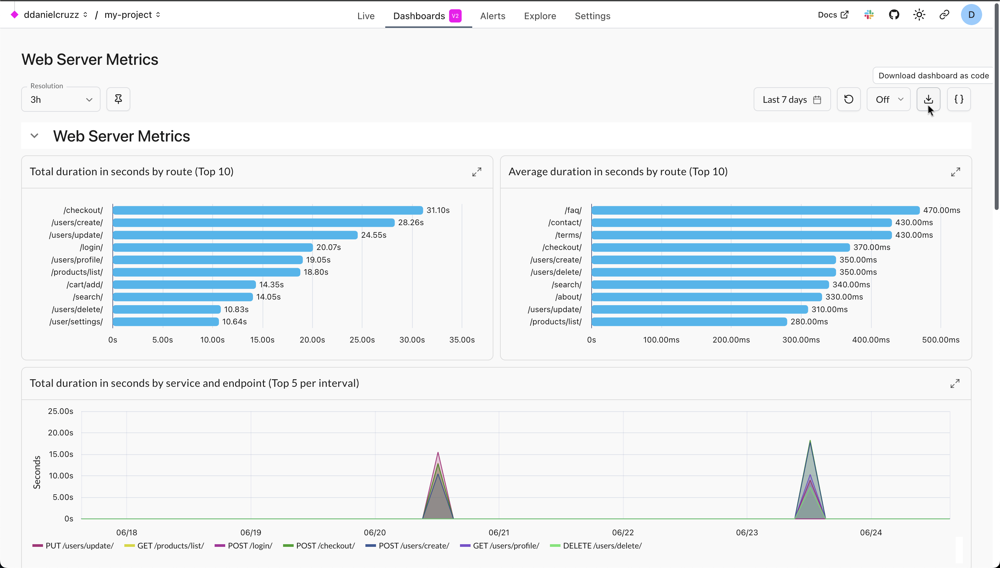

- Charts: `Total duration in seconds by route (Top 10)`, `Average duration in seconds by route (Top
  10)`, `Total duration in seconds by service and endpoint (Top 5 per interval)` (a layered
  area/line chart with a route-color legend).
- Toolbar: `Resolution` selector (bucket width, e.g. `3h`), `Last 7 days` range, an `Off` refresh
  toggle, and a **`{}` "download dashboard as code"** icon — dashboards round-trip to a text/JSON
  representation you can check into version control, not just a DB row.

---

## Feature anatomy (spec-ready notes)

**Data model.** No separate "agent" entity — everything is a `record` (span or zero-duration log)
in one table, plus a parallel `metrics` table for numeric time series. Span "kind" (`LLM`, plain
`span`, `log`, `span_event`, `pending_span`) is a column value, not a different storage path. Agent
identity, tool name, model name all live in JSON `attributes` — queryable via `->`/`->>` but not
separately indexed columns, meaning ad hoc high-cardinality attribute filters rely on DataFusion's
JSON-path performance rather than dedicated indexes.

**`records` table — key columns** (from the SQL reference): `span_name`, `message`,
`attributes` (JSON), `tags` (string[]), `level`, `trace_id` (32-hex), `span_id` (16-hex),
`parent_span_id`, `start_timestamp`, `end_timestamp`, `duration`, `is_exception`,
`exception_type`/`exception_message`/`exception_stacktrace`, `otel_resource_attributes` (JSON),
`service_name`/`service_version`/`service_instance_id`, `deployment_environment`,
`http_response_status_code`, `url_full`, `http_method`, `http_route`, `otel_scope_name`/`_version`,
`kind`, `log_body`, `otel_events`, `otel_links`, `otel_status_code`. `records` is itself a filtered
view over `records_all` (which also carries in-flight/pending spans) — a pattern worth copying if
Maple ever wants to show "still running" spans in a live query.

**Query engine.** Apache DataFusion, Postgres-flavored syntax (not literally Postgres). Directly
comparable to Maple's ClickHouse DSL + `run_sql` MCP capability — Logfire's bet is "give people SQL
they already know" rather than a typed builder DSL; Maple currently does both (a typed `CH.*`
builder for product code, raw SQL exposed to agents/MCP). Logfire exposes raw SQL to *end users* in
the primary product UI, not just to an agent — that's the more aggressive version of the bet.

**Pydantic AI instrumentation.** One-line opt-in: `logfire.configure()` +
`logfire.instrument_pydantic_ai()` (or `Agent.instrument_all()` for a global default). Built on OTel
GenAI semantic conventions, **v1.37 by default** (configurable). Confirmed attribute keys:
`gen_ai.provider.name` (current) / `gen_ai.system` (legacy alias), `gen_ai.operation.name`,
`gen_ai.request.model`, `gen_ai.response.model`, `gen_ai.usage.input_tokens` /
`gen_ai.usage.output_tokens` (per model-request span), `gen_ai.aggregated_usage.*` (on the
agent-run span, to avoid double-counting when summing descendant usage), `gen_ai.tool.name`,
`gen_ai.tool.call.arguments`, `gen_ai.tool.definitions` (the full declared tool schema, emitted
even for unused tools), `gen_ai.input.messages` / `gen_ai.output.messages`,
`gen_ai.system_instructions`. Pydantic-specific extras: `pydantic_ai.all_messages` (full message
history on the agent-run span). There's an active migration (tracked in
`pydantic/logfire#1586`) toward span names of the shape `{gen_ai.operation.name}
{gen_ai.request.model}` (e.g. eventually `invoke_agent gpt-4o`) to reduce span-name cardinality
while keeping the model in the name — worth watching as the "canonical" GenAI semconv naming
convention settles industry-wide.

**LLM Panels (rendering layer).** A dedicated detail-panel renderer that activates whenever a span
carries recognized `gen_ai.*`/message attributes — independent of which SDK produced them (native
support listed for Pydantic AI, OpenAI, Google GenAI, LangChain, LiteLLM, Anthropic, and the Claude
Agent SDK). Renders: ordered system/user/assistant/tool message bubbles, tool call args + return
value, inline file/blob previews, and a token+cost badge distinguishing **direct** usage (this span
alone) from **aggregated** (`Σ` prefix — this span plus descendants), which is exactly the
double-counting problem any agent-run rollup has to solve.

**Views, in order of the funnel.**
1. Live View — SQL-filtered, real-time trace/log stream, the default landing page (no separate
   "agents" home)
2. Explore / SQL Workbench — ad hoc SQL over `records`/`metrics`, table/details/chart result modes
3. Dashboards — SQL-defined panels, standard templates or fully custom, downloadable as code
4. Alerts — not deeply explored here, but sits alongside SQL/dashboards in the same nav
5. MCP server — Logfire itself exposes an MCP server so coding assistants (Claude, Cursor) can query
   production telemetry from inside the editor — the same "give the agent a query tool" pattern
   Maple's own MCP surface (`run_sql`, `search_traces`, etc.) already implements.

---

## Ideas worth stealing for Maple

1. **The full-stack argument, framed as a debugging scenario, not a feature list.** "Same trace,
   two different root causes that look identical to the user" (source #2) is a much stronger sales
   pitch than "we support OTel." Maple should write and use an equivalent worked example.
2. **SQL as the primary query surface, not just an agent/MCP escape hatch.** Logfire puts a SQL
   editor with autocomplete directly in the product nav (`Explore`) and even the *search bar on the
   Live View* is a raw SQL WHERE clause. Maple has the pieces (`CH.*` DSL, `run_sql`) — the open
   question is whether end users, not just agents, should get a first-class SQL surface too.
   Natural-language-to-SQL as a search-bar affordance (source #7) is a small, high-leverage add.
3. **Direct-vs-aggregated cost/token badges (`Σ` prefix).** A one-glyph solution to "is this the
   cost of just this span, or this span and everything under it" — cheap to copy, solves a real
   ambiguity in any agent-run rollup.
4. **Tool call rendering that includes the full declared tool schema (`gen_ai.tool.definitions`),
   not just the tools actually called.** Same insight as Datadog's Agent Manifest, but sourced
   directly from the semconv attribute rather than a bespoke schema — cheaper to implement if Maple
   ingests standard OTel GenAI spans.
5. **Dashboard-as-code / downloadable dashboard definitions.** Version-controllable observability
   config is a durable feature almost nobody in this space highlights as a headline; Logfire treats
   it as table stakes.
6. **`records` as a queryable superset that includes exception traceback as a first-class detail-panel
   tab**, not a JSON field you have to find. Worth checking Maple's own span detail panel for parity.
7. **Automatic secret redaction on raw-capture spans** (`authorization: [Scrubbed due to 'auth']`)
   applied even when a user explicitly opts into "capture everything" (`capture_all=True`) — the
   redaction survives the opt-in, which is the right default.
8. **Standard dashboard templates split by ingestion source** (`Basic System Metrics (Logfire)` vs
   `Basic Service Metrics (OpenTelemetry)`) — an explicit acknowledgment that "vendor SDK" and
   "vanilla OTel" users get equally first-class out-of-the-box dashboards, which reinforces the
   OTel-native claim in the product itself, not just the marketing copy.

## What to skip / deprioritize

- **Closed-source server/UI behind a paid self-host contract** is a distribution weakness, not a
  strength — Maple shouldn't copy this; it's the thing OSS-friendly competitors (Langfuse, Phoenix)
  beat Logfire on, and it contradicts the "OTel-native, no lock-in" pitch at the deployment layer
  even though the SDK layer is genuinely open.
- **No distinct agent-graph / execution-flow visualization.** Unlike Datadog's Execution Flow graph,
  Logfire renders agent runs purely as an indented span tree + chat-bubble panel. That's a real gap
  versus Datadog for branching/parallel/multi-agent handoff visualization — don't take Logfire's
  approach as a ceiling for what Maple's agent view should do, only as the floor (tree + SQL are
  necessary, not sufficient).
- **No sessions/multi-turn-conversation concept surfaced in what we reviewed** — each trace is the
  top unit, similar to Datadog's gap. If Maple wants session rollups, look to Phoenix/Weave/Laminar
  instead, not Logfire.
- **The MCP-server-for-coding-assistants angle** is interesting but adjacent — it's a distribution
  channel for the SQL surface, not a new visualization idea, and Maple already has an equivalent
  surface.

## Screenshot sources

Verified by downloading each candidate remote image and byte-comparing it against the local file —
all eleven are exact size matches.

| File | Found on | Direct image URL |
|---|---|---|
| `dashboards-as-code.png` | [Dashboards — Pydantic Logfire Docs](https://pydantic.dev/docs/logfire/guides/web-ui/dashboards/) | `https://pydantic.dev/docs/logfire/images/guide/browser-download-dashboard-as-code.png` |
| `dashboards-standard-list.png` | [Dashboards — Pydantic Logfire Docs](https://pydantic.dev/docs/logfire/guides/web-ui/dashboards/) | `https://pydantic.dev/docs/logfire/images/guide/browser-standard-dashboards-list.png` |
| `live-view-collapsed-annotated.png` | [Live View — Pydantic Logfire Docs](https://pydantic.dev/docs/logfire/guides/web-ui/live/) | `https://pydantic.dev/docs/logfire/images/guide/live-view-collapsed-annotated.png` |
| `live-view-details-panel.png` | [Live View — Pydantic Logfire Docs](https://pydantic.dev/docs/logfire/guides/web-ui/live/) | `https://pydantic.dev/docs/logfire/images/guide/live-view-details-panel-open-annotated.png` |
| `llm-panels-token-cost-popover.png` | [LLM Panels — Pydantic Logfire Docs](https://pydantic.dev/docs/logfire/observe/llm-panels/) | `https://pydantic.dev/docs/logfire/images/llm-panels/connect-4-claude-usage-pop-over.png` |
| `llm-panels-tool-weather.png` | [LLM Panels — Pydantic Logfire Docs](https://pydantic.dev/docs/logfire/observe/llm-panels/) | `https://pydantic.dev/docs/logfire/images/llm-panels/llm-panel-with-tool-weather.png` |
| `pydantic-ai-httpx.png` | [Debugging & Monitoring with Pydantic Logfire](https://pydantic.dev/docs/ai/integrations/logfire/) | `https://pydantic.dev/docs/ai/img/logfire-with-httpx.png` |
| `pydantic-ai-weather-agent.png` | [Debugging & Monitoring with Pydantic Logfire](https://pydantic.dev/docs/ai/integrations/logfire/) | `https://pydantic.dev/docs/ai/img/logfire-weather-agent.png` |
| `readme-fastapi-trace.png` | [GitHub - pydantic/logfire](https://github.com/pydantic/logfire) | `https://pydantic.dev/docs/logfire/images/index/logfire-screenshot-fastapi-200.png` |
| `sql-workbench-full.png` | [SQL Workbench — Pydantic Logfire Docs](https://pydantic.dev/docs/logfire/guides/web-ui/explore/) | `https://pydantic.dev/docs/logfire/images/guide/browser-explore-full.png` |
| `sql-workbench-run-query.png` | [SQL Workbench — Pydantic Logfire Docs](https://pydantic.dev/docs/logfire/guides/web-ui/explore/) | `https://pydantic.dev/docs/logfire/images/guide/browser-explore-run-query.png` |

---

*Researched 2026-08-05. Screenshots pulled from Pydantic's public docs and blog for internal
competitive research; do not redistribute.*
