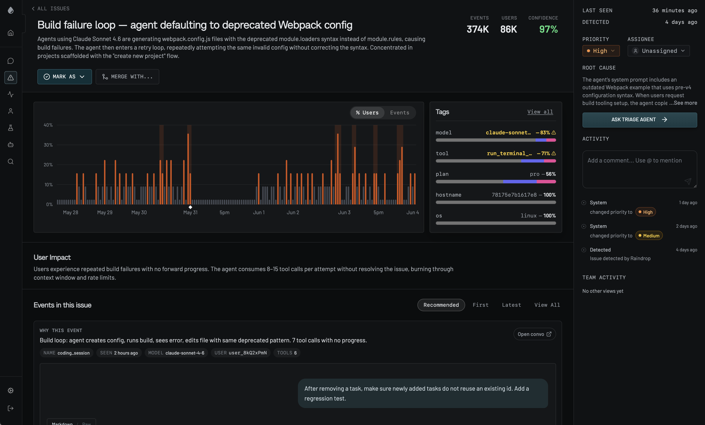
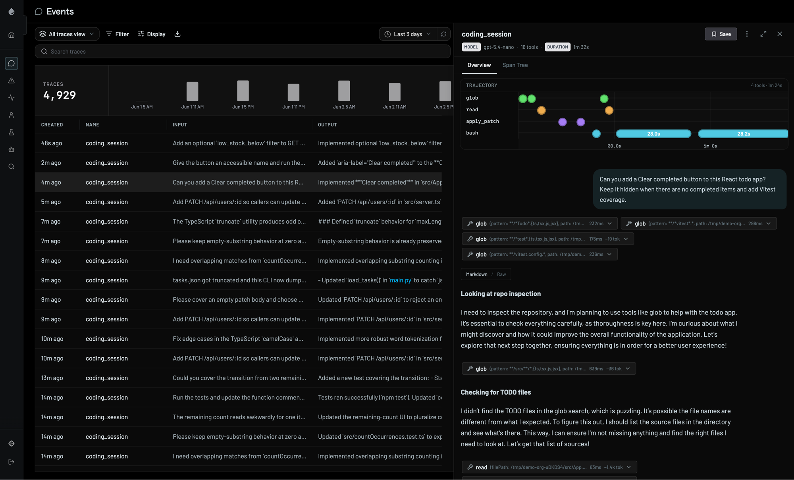
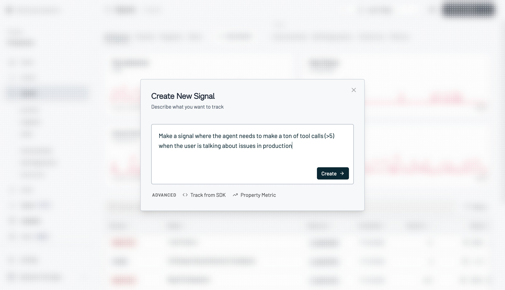
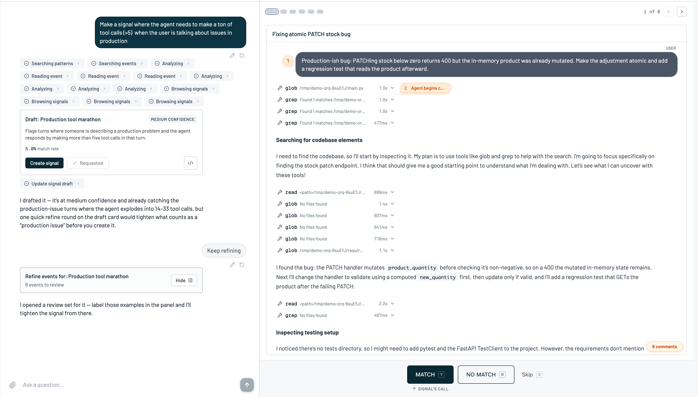
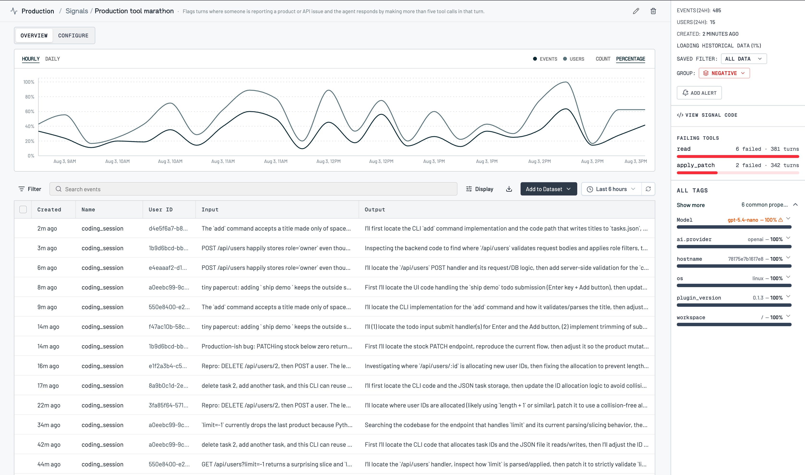
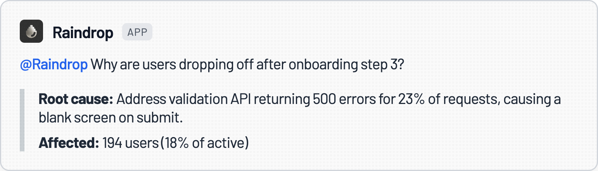
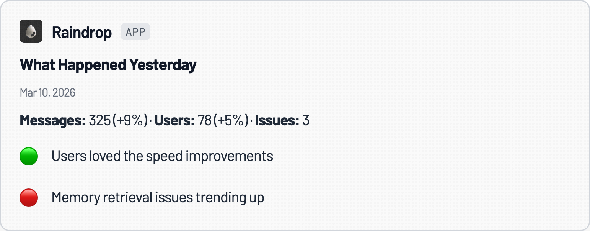
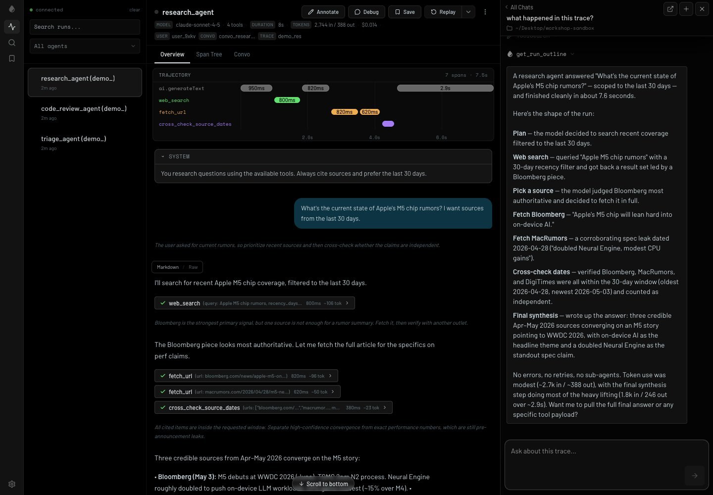
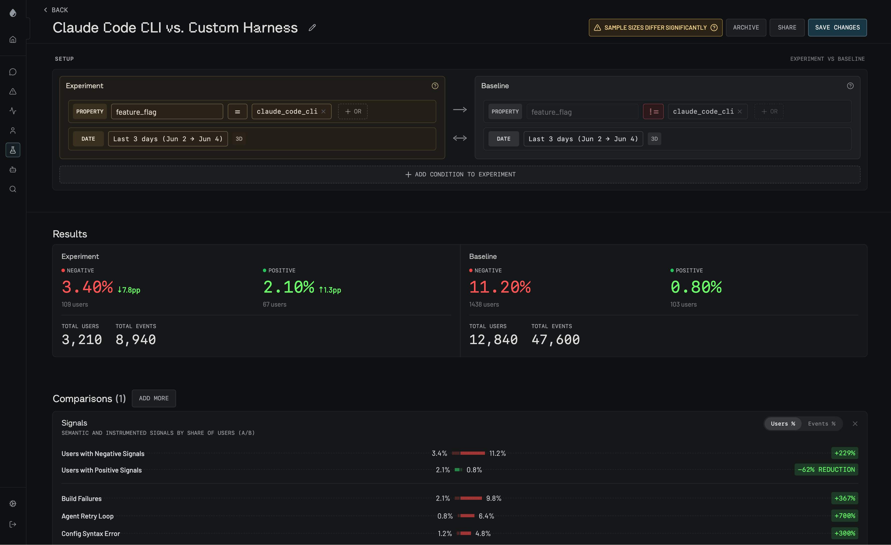
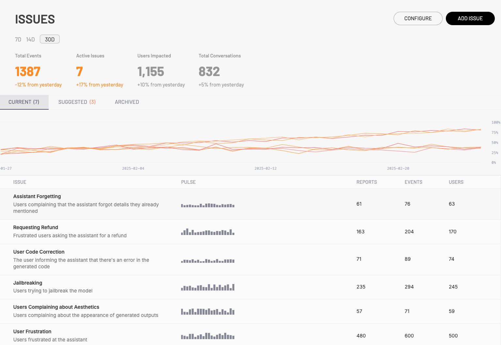

# Raindrop — AI Agent Monitoring & Issue Discovery

> **One-liner:** "Sentry for AI agents" — a YC-backed, Tinybird-powered startup betting that the hard
> problem isn't rendering a trace, it's **finding the failures that never throw an error**: silent
> tool breakage, user frustration, forgetting, task abandonment — surfaced automatically as *Issues*
> and pushed into Slack before a human goes looking.

**Market position:** Founded 2023 by **Zubin Koticha** (CEO), **Alexis Gauba**, and **Ben Hylak**
(ex-Apple, 4 years on the Human Interface Design team) — Koticha and Gauba are second-time founders
whose previous company was acquired by Coinbase. YC **Winter 2024** batch, ~9 people, San Francisco.
Raised a **$15M seed in December 2025** led by **Lightspeed Venture Partners**, with Figma Ventures,
Vercel Ventures, and a long list of operator-angels (Replit's Amjad Masad and Michele Catasta,
Cognition's Walden Yan, Framer's Koen Bok and Jorn van Dijk, Speak's Andrew Hsu, Notion's Akshay
Kothari) plus YC. Customers include Speak (15M-user language-learning app), Clay, Framer, AngelList,
Tolan, Avoca, Vercel, Browserbase, and "Fortune 100" logos left unnamed. Claims **billions of traces
processed per month**, SOC 2 Type II compliance, and a beta self-hosted deployment option.

Positioning is explicitly **against** Braintrust, LangSmith, and Arize — a quoted Fortune 100 "Head
of AI" says: *"Most tooling targets the first era of LLMs: call/response, deterministic evals,
testing edge cases. Raindrop is building for the next era, proactively finding issues and driving
automatic improvement loops."* The pitch is not "we have a better trace viewer," it's "you shouldn't
have to look at traces to find your bugs."

---

## How core is agent tracing to the product?

**Peripheral by design — tracing is the substrate, not the pitch.** Raindrop absolutely has a trace
viewer (span tree, trajectory timeline, per-tool-call input/output, replay) and it is well built —
see the Events screenshot below. But it is presented as plumbing: "Log every agent run" is step one
of a four-step homepage narrative that ends at "Silent issues, surfaced" and "@Raindrop for
everything." The company's own docs describe traces mainly as the evidence attached to an Issue or
Stumble, not as a primary navigation surface. There is no equivalent of Datadog's three-tab
Span-List/Execution-Flow/Flame-Graph investment, and no dedicated multi-agent DAG/graph renderer akin
to what Datadog or LangGraph-native tools ship — the trajectory view is a simple horizontal timeline
of tool-call bars (see screenshot 2), not a branching graph.

The actual product bet is **issue discovery**: turning a flood of production conversations into a
short, prioritized, root-caused list of *Issues*, largely without a human ever opening a trace. Four
pillars are marketed as co-equal on the homepage — Signals, Issues, Triage Agent, Experiments — and
three of the four gate behind the **Pro plan ($399/mo)**, not the entry tier. That gating is the
clearest signal of where the company thinks the value is: Issue Detection, Custom Signals, and the
Triage Agent are Pro-only; the Startup tier ($59/mo) gets tracing, search, and default signals only.

---

## Trial & access

| | |
|---|---|
| **Free tier** | No standing free tier — **14-day free trial** on the Startup plan only |
| **Free trial** | 14 days; Startup plan includes 1,000 free events/mo, then $0.004/event |
| **Credit card required?** | **Not for account creation.** Signup (`app.raindrop.ai/signup`) asks only for Google OAuth or email + password — no payment field on that screen. (Not verified past that first step, since account creation is out of scope for this research pass.) |
| **Registration URL** | https://app.raindrop.ai/signup (linked from every "Get started" / "Start free trial" CTA on raindrop.ai) |
| **Signup fields** | "Sign up with Google" **or** email + password. No company name, team size, or use-case survey on the first screen. |
| **Paid entry point** | **Startup: $59/mo**, 1,000 events included then $0.004/event. **Pro: $399/mo** (labeled "Most Popular"), $0.003/event to 1M then $0.002/event — required for Triage Agent, Issue Detection, Custom Signals, Experiments, Semantic Search. **Enterprise**: custom (SSO/SAML, audit logs, Snowflake/BigQuery export, edge-PII redaction, SLA). |
| **Self-serve to the feature?** | **Yes for tracing/signals/search (Startup tier)** — pure self-serve, credit-card-optional trial, SDK install. **Issue Detection and the Triage Agent (the actual headline product) require upgrading to Pro** — still self-serve via the pricing page's "Get started" button, no sales call forced, but "Book a demo" is offered in parallel for anyone who wants one. Not a demo-only / sales-gated product like some seed-stage tools. |
| **Event unit definition** (their billing primitive) | "1 event = user message + agent response (including tool calls, sub-agents, etc) — or 'run' of a background agent." Coarser than Datadog's per-span billing; a whole multi-tool-call turn is one billable unit. |
| **Gotcha** | The three most-differentiated features (Issues, Triage Agent, Custom Signals) are invisible until Pro — a Startup-tier trial will *not* show the thing Raindrop is actually famous for. |

---

## Sources

| # | Source | Type | Why it's useful / what to extract |
|---|---|---|---|
| 1 | [How Raindrop became the Sentry of AI: Scaling to petabytes with Tinybird](https://www.tinybird.co/customer-stories/raindrop) | Customer story (Tinybird) | **The architecture read.** Raindrop's first Postgres implementation broke on the first customer with millions of daily events; migrated to Tinybird and got **100–1000x** faster query performance, went from POC to production in **one week**, and estimates Tinybird saved them from hiring **2–3 dedicated ClickHouse engineers**. Now serves **100M+ requests/day**. Names the specific Tinybird primitives they lean on: Pipes (query/API layer separation), Branches (zero-copy dev environments), Playgrounds (SQL iteration), `WITH FILL`/`STEP` (time-series chart bucketing), and full-text search at scale — all directly comparable to what Maple's `@maple/query-engine` already does on the same warehouse. |
| 2 | [Signals docs](https://www.raindrop.ai/docs/platform/signals) | Docs | The full signal taxonomy and the **classifier-drafting workflow**: describe in plain English → Raindrop drafts a classifier → runs it on a sample of real events → you label matches in a refine panel → it re-drafts at higher confidence → you create the live signal. This is the mechanism behind "Deep Search" too. |
| 3 | [Issues docs](https://www.raindrop.ai/docs/platform/issues) | Docs | Issue lifecycle: severity (critical/high/medium/low), status (unresolved/resolved/ignored), event+user counts, trend chart, merge/reactivate. Distinguishes **Issues** (distribution-level pattern detection) from **Stumbles** (individual flagged conversations) — the two-tier model Maple's error-issue grouping should be compared against. |
| 4 | [Deep Search launch (YC)](https://www.ycombinator.com/launches/Nn7-raindrop-deep-search) | Launch post | The technical claim: Deep Search trains **bespoke few-shot classifiers** on the fly — "materialized views for natural language" is the founders' own phrase. Search finds candidates via semantic/embedding match, then an LLM reranks/classifies each candidate, and the resulting classifier keeps running against all future production data as a live metric. |
| 5 | [Triage Agent docs](https://www.raindrop.ai/docs/platform/triage-agent) | Docs | Multi-surface investigation agent (Slack `@Raindrop`, web chat, MCP for Claude Code/Cursor/Codex). Ships **Agent Briefs** (natural-language scheduled investigations, e.g. "every Monday at 9am, summarize the biggest issues enterprise customers had") and **Custom Monitors** (threshold alerts on any signal). The MCP path lets a coding agent pull live production issues and open a PR — the literal "self-healing agent" loop. |
| 6 | [Self-Diagnostics docs](https://www.raindrop.ai/docs/platform/self-diagnostics) | Docs | The most novel signal type: the agent is given a tool to **report its own failures** (`missing_context`, `repeatedly_broken_tool`, `capability_gap`, `complete_task_failure`), and self-reports land as `signal_type: "agent"`, separate from classifier- and SDK-sourced signals. One line to enable: `selfDiagnostics: { enabled: true }` in the `wrap()` call. |
| 7 | [TypeScript SDK docs](https://www.raindrop.ai/docs/sdk/typescript) | Docs | **Instrumentation model, precisely.** Proprietary `begin()` → `setProperty()`/`trackTool()` → `finish()` interaction lifecycle, plus a one-line `raindrop.wrap(ai, {...})` auto-instrumentation for the Vercel AI SDK and 20+ named framework integrations (LangChain, CrewAI, OpenAI Agents, Claude Agent SDK, Google ADK, Temporal, etc). **Not OTel-native** — ships its own tracer, but exposes `useExternalOtel: true` as an escape hatch to bring your own OTel `NodeSDK` and let Raindrop attach a span processor. Confirms Raindrop chose a proprietary wrap-based SDK over `gen_ai.*` OTel semconv, the opposite choice from Datadog. |
| 8 | [Homepage](https://www.raindrop.ai/) | Marketing (rendered) | Full, current pricing table (Startup $59, Pro $399, Enterprise custom, event-based overage), the four-pillar pitch, customer quotes (Speak, Replit, Vercel), and confirmation that `app.raindrop.ai/signup` is the self-serve entry point for every tier. |
| 9 | [Speak case study](https://www.raindrop.ai/case-studies/speak/) | Case study | Real usage color from Andrew Hsu (CTO, Speak, 15M users): a daily Slack "incident report" channel is now "a standard part of our process"; direct quote: *"it was frankly a little bit shocking the extent to which people were using and talking with the tutor in these super unexpected ways."* Confirms Issue-detection-to-Slack is the actual day-to-day workflow, not the trace UI. |

---

## Screenshots

### 1. Issue detail — the core screen

- Header stat bar: **Events 374K · Users 86K · Confidence 97%** — confidence is a first-class,
  always-visible number, not buried in a tooltip.
- **Pulse chart** toggles between `% Users` / `Events`, with a shaded band highlighting spike
  windows — visually distinct from a generic time series because the shading marks *when the
  distribution shifted*, which is the actual detection signal.
- **Tags panel** with automatic correlation: `model: claude-sonnet… -83% ⚠`, `tool: run_terminal… -71% ⚠`,
  `plan: pro -56%` — each tag shows a bar comparing its share inside the issue vs. baseline, with a
  warning glyph when a dimension is statistically over-represented. This *is* Raindrop's version of a
  faceted breakdown, but computed as an anomaly ranking rather than a static filter list.
- **Root Cause** is a written paragraph, not a code diff — LLM-generated narrative explaining *why*
  ("the agent's system prompt includes an outdated Webpack example…").
- **"Ask Triage Agent"** button sits directly in the issue's action rail — one click from "here's a
  bug" to "let an agent investigate further," no context switch to a chat surface.
- Right rail: Priority (dropdown: High/Medium/Low), Assignee, and a plain activity log ("System
  changed priority to High," "Detected by Raindrop") — this is a lightweight issue-tracker, not just
  an alert.
- **"Events in this issue"** section has `Recommended / First / Latest / View All` tabs and a
  **"Why this event"** callout per example explaining what made this specific conversation
  representative of the issue (`"Build loop: agent creates config, runs build, sees error, edits
  file with same deprecated pattern. 7 tool calls with no progress."`) — an LLM caption per
  supporting example, not just a raw transcript dump.

### 2. Events / trace view with trajectory panel

- Left: a flat **events/traces list** (4,929 traces for the query), columns `Created / Name / Input /
  Output` — rows are literally the first line of the conversation, same "transcript as row" pattern
  Datadog uses.
- Right detail panel tabs: `Overview` / `Span Tree` (only two — much shallower than Datadog's
  three-view system).
- **Trajectory strip**: tool names (`glob`, `read`, `apply_patch`, `bash`) as swim-lanes, with
  colored dots/bars placed on a shared time axis and duration labels on the wide bars (`23.0s`,
  `28.2s`) — a compact Gantt-style view, not a hierarchical flame graph. No parent/child nesting is
  drawn; it's a flat timeline per tool name.
- Below the trajectory: a **chat-style rendering of the run** — user message bubble, then inline
  **tool-call chips** (`glob {pattern: "**/*Todo*.{tsx,jsx}", path:...} 232ms`) collapsed into the
  narrative text, expandable with a chevron. Reads like a transcript with tool calls as inline
  footnotes rather than a separate span list.
- Header stat chips: `MODEL gpt-5.4-nano · 16 tools · DURATION 1m 32s` — model and tool count
  promoted next to the trace title, same instinct as Datadog's stat bar but far terser.

### 3. Signal creation — describe in plain English

- A **single free-text box**: *"Make a signal where the agent needs to make a ton of tool calls (>5)
  when the user is talking about issues in production."* No dropdowns, no regex, no example-pair
  upload required to start.
- Escape hatches surfaced but de-emphasized under an "ADVANCED" label: `Track from SDK` (explicit
  instrumentation) and `Property Metric` (numeric threshold on an existing field) — the semantic
  classifier is the default path, explicit/structured tracking is the fallback.

### 4. Signal drafting and refine loop — "materialized views for natural language"

The single best screenshot for understanding how detection actually works.

- Left: a **chat log of agent actions** — `Searching patterns → Searching events → Analyzing →
  Reading event ×3 → Analyzing ×3 → Browsing signals ×2` — the classifier-drafting process is shown
  as a visible, steppable agent trace, not a black box.
- A **Draft card** appears mid-conversation: `Draft: "Production tool marathon"` at **Medium
  Confidence**, **5.0% match rate**, with `Create signal` / `Requested` / `</> ` (view code) actions
  right there — you can inspect the generated classifier's underlying code.
- The agent's own narration is blunt about limitations: *"I drafted it — it's at medium confidence
  and already catching the production-issue turns where the agent explodes into 14–33 tool calls,
  but one quick refine round on the draft card would tighten what counts as a 'production issue'
  before you create it."*
- Right panel: a **labeling queue** (`1 of 6`, prev/next) showing one real matched conversation at a
  time, with the specific tool calls and reasoning that triggered the match, and three actions:
  **Match (Y) / No Match (N) / Skip (S)** with keyboard shortcuts. This is a human-in-the-loop
  active-learning UI bolted directly onto issue triage — every refine action retrains the classifier.

### 5. Live signal — rate chart + failing-tool breakdown

- Toggle between `Hourly`/`Daily` and `Events`/`Users`/`Count`/`Percentage` on the same chart — two
  independent axes of granularity control, not just a date-range picker.
- **`GROUP: NEGATIVE`** dropdown — signals carry a valence (positive/negative/neutral) that can be
  used as a grouping/filter dimension across the whole platform.
- **Failing Tools panel**: `read — 6 failed · 381 turns`, `apply_patch — 2 failed · 342 turns`, each
  with a small red proportion bar. Tool-level failure attribution lives directly on the signal, not
  just on individual traces.
- **All Tags** section reuses the same "dimension — percentage" bar pattern seen on the Issue page
  (`Model: gpt-5.4-nano — 100% ⚠`, `ai.provider: openai — 100%`) — one shared component for
  "what's correlated with this behavior," reused across Issues and Signals.
- A `View Signal Code` link and `Add Alert` button sit in the header — every signal is dual-purpose:
  a metric to chart and a trigger to alert on.

### 6. Triage Agent in Slack

- `@Raindrop Why are users dropping off after onboarding step 3?` gets a direct, structured answer:
  **Root cause:** address-validation API returning 500s for 23% of requests, causing a blank screen
  on submit. **Affected:** 194 users (18% of active). Two-line answer, no dashboard visit required —
  this is the whole pitch compressed into one Slack message.

### 7. Triage Agent — scheduled daily digest

- A compact daily card: `Messages: 325 (+9%) · Users: 78 (+5%) · Issues: 3`, followed by a green
  bullet ("Users loved the speed improvements") and a red bullet ("Memory retrieval issues trending
  up"). Positive and negative trend call-outs are peer bullets in the same digest — wins get equal
  billing with regressions, not just an error feed.

### 8. Workshop — open-source local debugger

- A **local-first** trace viewer (`raindrop.sh/install`, open source, 958+ GitHub stars) that mirrors
  agent runs from your own machine in real time — separate from the hosted dashboard.
- Left rail lists live-connected agent runs (`research_agent`, `code_review_agent`, `triage_agent`)
  grouped by recency; center shows the same trajectory-strip + chat-transcript pattern as the hosted
  Events view (screenshot 2) — same visual language reused locally as remotely.
- Right panel is a **chat interface scoped to "this trace"** ("Ask about this trace…") that answers
  "what happened in this trace?" with a structured, step-by-step narration (Plan → Web search → Pick
  a source → Fetch → Cross-check → Final synthesis) including token counts and per-step timing —
  effectively an LLM-generated trace summary on demand, locally, before anything ships to prod.

### 9. Experiments — production A/B comparison

- Experiments compare **cohorts of already-logged production data** — explicitly *not* a replay/rerun
  system: "Experiment: `feature_flag = claude_code_cli`" vs. "Baseline: `feature_flag !=
  claude_code_cli`," both over the same date range.
- Results show **Negative/Positive signal rates side by side** with percentage-point deltas
  (`3.40% ↓7.8pp` vs `11.20%`) and user/event counts per cohort, plus a **"Sample sizes differ
  significantly"** warning banner — a built-in statistical-validity guardrail most teams would build
  themselves.
- **Signals comparison table** at the bottom breaks the aggregate delta down by named signal
  (`Build Failures +367%`, `Agent Retry Loop +700%`, `Config Syntax Error +300%`) — turns a single
  A/B result into a root-cause-ranked list automatically.

### 10. Issues overview dashboard

*(Sourced from Tinybird's customer-story blog post, embedded there as a Raindrop product screenshot.)*

- Top stat row: `Total Events 1387 (-12%) · Active Issues 7 (+17%) · Users Impacted 1,155 (+10%) ·
  Total Conversations 832 (+5%)` — all four deltas shown against yesterday, always.
- Multi-line **pulse chart** overlaying every active issue's trend on one 30-day chart.
- Table columns: `Issue / Pulse (sparkline) / Reports / Events / Users` — issue names read as English
  sentences (`"Assistant Forgetting" — "Users complaining that the assistant forgot details they
  already mentioned"`), each with its own inline sparkline. `Current (7) / Suggested (3) / Archived`
  tabs — **Suggested** issues are AI-proposed candidates awaiting human confirmation before they
  become tracked Issues, a distinct pre-issue triage stage.

---

## Feature anatomy (spec-ready notes)

**Data model.** Primitive unit = **event** (a user turn, agent turn, or tool call), grouped into
**conversations**. Billing unit is coarser still: one *event* for pricing = a whole user-message +
agent-response round trip including all its tool calls/sub-agents, or one background-agent run. No
explicit "trace" or "span" vocabulary in the public docs — the mental model is closer to "chat
transcript with attachments" than "distributed trace." **Traces/trajectories** are the visualization
of one conversation's tool calls on a timeline, not a separately named entity with its own schema.

**Signals** (behavioral classifiers, not spans): default set is Forgetting, Task Failure, User
Frustration, Refusals, Jailbreaking, NSFW, User Praise — each has valence (positive/negative/neutral).
Custom signals are **LLM-drafted from a natural-language description**, refined via a human
match/no-match labeling loop, then run continuously as a lightweight classifier over all new events.
Three sourcing paths: (1) semantic/classifier-inferred, (2) explicit SDK calls (`trackSignal`,
thumbs up/down, regenerate), (3) **self-diagnostics** — the agent's own tool-reported failures.

**Issues** = distribution-level pattern detection over Signals/Stumbles: "a failure mode spreading
across users, a new breakage pattern, a regression after a deploy." Each has severity, status
(unresolved/resolved/ignored/merged), a written root-cause paragraph, tag-correlation breakdown, and
a curated set of representative example events. **Stumbles** are the individual-conversation-level
counterpart — one flagged interaction (e.g. "Logic Error," "Hallucination") rather than an aggregate
pattern; a "Similar" panel bridges the two.

**Deep Search**: natural-language query → semantic/embedding search for candidate events → LLM
reranks/classifies each candidate as match/no-match → optionally promote the search into a **live
tracked Signal** that keeps running against all future production data. Framed by the founders as
"materialized views for natural language" and "bespoke few-shot classifiers... bootstrapping weaker
systems from stronger systems."

**Instrumentation.** Proprietary TS/Python/Go/Java/Rust SDKs plus a browser SDK and raw HTTP API.
Core lifecycle: `raindrop.begin()` → `setProperty()`/`trackTool()`/`withSpan()` → `finish()`, or the
one-line `raindrop.trackAi()` single-shot call. Auto-instrumentation via `raindrop.wrap(ai, {...})`
for 20+ named frameworks (Vercel AI SDK, LangChain, CrewAI, OpenAI Agents SDK, Claude Agent SDK,
Google ADK, Temporal, DSPy, Mastra, Strands, etc.) — each gets its own doc page under
`/docs/integrations/*`. **Not built on OTel by default** — ships its own tracer — but
`useExternalOtel: true` lets a team bring its own OTel `NodeSDK` and have Raindrop attach a span
processor, i.e. OTel interop is a supported escape hatch, not the primary path (the inverse of
Maple's and Datadog's OTel-first posture).

**Triage Agent.** One agent, three surfaces: Slack (`@Raindrop` mention, threaded), web chat, and MCP
(so Claude Code/Cursor/Codex can query it directly). Supports **Agent Briefs** — recurring scheduled
investigations defined in natural language ("every Monday at 9am, summarize the biggest issues
enterprise customers had last week") — and **Custom Monitors** (threshold alerts on any signal). The
MCP path is the literal "self-healing agent" loop: a coding agent reads live production issues,
inspects failing examples, edits code, runs tests, and opens a PR grounded in real failure evidence.

**Experiments.** Cohort comparison over *already-logged* production data (no replay/re-run). Split
cohorts by any dimension — model, tool, feature flag, custom property, language, keyword — and get an
automatic signal-by-signal delta table plus a sample-size-validity warning.

---

## The Tinybird architecture read

Maple's warehouse is the same stack (ClickHouse/Tinybird), so this is close to reading a peer
engineering post-mortem rather than competitive research:

- **Migration trigger.** Raindrop's original backend was **Postgres**, and it broke on day one of
  onboarding their **first** customer sending millions of events/day — not a scaling problem that
  crept up, an immediate wall.
- **Result**: **100–1000x** faster query performance after moving to Tinybird, and **one week** from
  starting the migration to that first customer being in production on the new stack.
- **Team-cost framing**: Tinybird's own story quotes Raindrop estimating the managed platform saved
  them from hiring **2–3 dedicated ClickHouse engineers** — i.e., they explicitly did not want to own
  cluster ops, replication, or query-plan tuning in-house, and treated that as a real headcount
  trade, not just a vague "it's easier" claim.
- **Scale today**: **100M+ requests/day**, "billions of traces processed per month" per the
  homepage.
- **Primitives named as load-bearing**: Tinybird **Pipes** (the query/API separation layer — directly
  analogous to Maple's `CH.compile()` + `WarehouseQueryService.compiledQuery()` boundary), **Branches**
  (zero-copy dev/staging environments off production data — worth comparing to how Maple's
  `tinybird:dev`/`:build`/`:deploy` flow and PR-preview Tinybird branches work), **Playgrounds** (ad hoc
  SQL iteration UI), and `WITH FILL`/`STEP` for filling gaps in time-series chart output (relevant to
  any of Maple's bucketed chart queries that need zero-filled buckets rather than sparse rows).
- **What's notably absent from the public writeup**: no schema DDL, no materialized-view definitions,
  no ingestion-pipeline diagram, no cost figures, and no discussion of the semantic-classifier
  workload (Signals/Deep Search) running *against* ClickHouse — that's presumably a separate
  embedding/LLM-inference layer sitting in front of or beside the warehouse, not something Tinybird
  itself does. The customer story is a marketing case study, not an engineering deep-dive; it confirms
  the *decision* (Postgres → Tinybird, and why) far better than it documents the *implementation*.
- **Takeaway for Maple**: the Raindrop story is the strongest available proof point that "don't build
  your own ClickHouse ops team, let Tinybird's Pipes/Branches carry the ingestion-to-query path" holds
  up at real scale (100M+ req/day) for a company with a comparably lean team — useful ammunition if
  Maple ever has to justify staying on Tinybird versus self-hosting ClickHouse as usage grows.

---

## Ideas worth stealing for Maple

1. **Issue root-cause as a written paragraph, not just a stack trace.** Raindrop's Issue page reads
   like a human wrote the postmortem — "the agent's system prompt includes an outdated Webpack
   example…". Maple's error-issue model already groups occurrences; adding an LLM-generated
   root-cause narrative (with a "See more" expander, as Raindrop does) is a small, high-leverage
   addition on top of existing grouping.
2. **Tag-correlation bars with an over-representation flag**, reused identically on both the Issue
   page and the Signal page (`model: claude-sonnet… -83% ⚠`). One shared component, two surfaces —
   cheap to build once existing facets (service, env, model) are in place, and it directly answers
   "what's different about the traces in this bucket vs. everywhere else," which today requires
   manual facet comparison.
3. **Self-diagnostics: give the agent a tool to report its own failure.** This is the most genuinely
   novel idea in the whole product — `missing_context` / `repeatedly_broken_tool` / `capability_gap`
   / `complete_task_failure` as agent-reported signals, distinct from externally-inferred ones. For
   agentic journeys specifically (where Maple controls or can recommend instrumentation), this is a
   very cheap SDK addition with outsized debugging value: the agent tells you why it's stuck instead
   of you inferring it from a transcript.
4. **Natural-language classifier creation with a human-in-the-loop refine step** (describe → draft →
   label Match/No Match/Skip on real events → re-draft → promote to a live tracked metric). This is
   the single most "wow" screenshot in Raindrop's product (screenshot 4) and maps directly onto how
   Maple could let users define custom issue-detection rules without writing ClickHouse queries by
   hand — "materialized views for natural language" is a good design target.
5. **Suggested Issues as a pre-confirmation queue** (screenshot 10's `Suggested (3)` tab) — AI
   proposes candidate issues, a human promotes or dismisses, rather than auto-creating issues
   silently. Reduces false-positive noise while still surfacing weak signals.
6. **Scheduled natural-language "Agent Briefs"** ("every Monday at 9am, summarize the biggest issues
   enterprise customers had") — a cron-triggered LLM query over the warehouse, delivered to Slack.
   Cheap to build on top of an existing Triage/MCP-style agent and existing alert-delivery
   infrastructure.
7. **Billing/attach point of the agent to a coding tool via MCP**, closing trace → root cause → PR in
   one loop. Directly relevant if Maple positions agentic-journey tracing as feeding fixes back into
   the originating repo (Maple already has `search_source_code`/`propose_fix`-shaped MCP tools —
   Raindrop's Triage Agent + MCP is validation that customers want exactly this loop).
8. **Positive signals get equal visual billing with negative ones** in the daily digest (screenshot
   7) — "Users loved the speed improvements" sits next to "Memory retrieval issues trending up" as a
   peer bullet, not an afterthought. Worth carrying into any Maple digest/summary surface so it
   doesn't read as purely an error feed.
9. **Event-unit billing coarser than spans** (one billed "event" = a whole turn including all its
   tool calls) is a pricing-model data point, not a UI idea, but worth noting if Maple ever prices an
   agent-tracing add-on.

## What to skip / deprioritize

- **The trajectory/trace UI itself is not best-in-class** — a flat per-tool-name timeline with no
  parent/child nesting or branching-graph renderer (contrast with Datadog's Execution Flow graph).
  Don't use Raindrop as the reference for *how to draw a multi-agent DAG* — it doesn't really have
  one. Its strength is entirely in the layer above the trace.
- **Proprietary SDK / non-OTel-first ingestion.** Maple is committed to OTel; Raindrop's `wrap()`
  pattern with an OTel-interop escape hatch is the opposite bet and not something to copy
  wholesale — though the *breadth* of named framework integrations (20+ `/docs/integrations/*` pages)
  is worth noting as a documentation/marketing surface-area target, independent of the underlying
  transport.
- **Experiments/A/B testing** is a large, separate feature surface gated at Pro; interesting but not
  required to ship agent-issue-discovery, and lower priority than the Signals/Issues mechanics above.
- **Workshop (local OSS debugger)** is a nice community/adoption play (958+ GitHub stars) but is a
  distinct product with a distinct distribution motion (open-source CLI installer) — a later-phase
  idea, not part of the core hosted product spec.

---

## Screenshot sources

| File | Found on | Direct image URL |
|---|---|---|
| `feature-flags.png` | [Raindrop \| AI Agent Monitoring & Observability](https://www.raindrop.ai/) | `https://www.raindrop.ai/assets/product-feature-flags.png` |
| `issue-detail.png` | [Raindrop \| AI Agent Monitoring & Observability](https://www.raindrop.ai/) | `https://www.raindrop.ai/assets/raindrop-issue-detail.png` |
| `product-events-trace.png` | [Raindrop \| AI Agent Monitoring & Observability](https://www.raindrop.ai/) | `https://www.raindrop.ai/assets/product-events.png` |
| `signals-1-describe.png` | [Signals - Raindrop](https://www.raindrop.ai/docs/platform/signals) | `https://mintcdn.com/dawn-a6c57108/MnNtpC8wsdk5L8ms/images/signals/signals1.png?fit=max&auto=format&n=MnNtpC8wsdk5L8ms&q=85&s=47d32e739700468ac31c8562a830301f` |
| `signals-3-refine.png` | [Signals - Raindrop](https://www.raindrop.ai/docs/platform/signals) | `https://mintcdn.com/dawn-a6c57108/MnNtpC8wsdk5L8ms/images/signals/signals3.png?fit=max&auto=format&n=MnNtpC8wsdk5L8ms&q=85&s=b64aa8c33e1c657837dd94703743f1c9` |
| `signals-6-live.png` | [Signals - Raindrop](https://www.raindrop.ai/docs/platform/signals) | `https://mintcdn.com/dawn-a6c57108/MnNtpC8wsdk5L8ms/images/signals/signals6.png?fit=max&auto=format&n=MnNtpC8wsdk5L8ms&q=85&s=3b9b6897edec28c6b219251f3d2c5917` |
| `tinybird-dashboard.png` | [How Raindrop became the Sentry of AI: Scaling to petabytes with Tinybird](https://www.tinybird.co/customer-stories/raindrop) | `https://tinybird.co/api/blog/images/posts/2025-04-24-raindrop/raindrop-1.png` |
| `triage-agent-slack.png` | [Triage Agent - Raindrop](https://www.raindrop.ai/docs/platform/triage-agent) | `https://mintcdn.com/dawn-a6c57108/DjzV-6REThjdJeDp/images/triage-agent/ai-triage-agent.png?fit=max&auto=format&n=DjzV-6REThjdJeDp&q=85&s=b0de1e5aadfbf82713cca95b7a649003` |
| `triage-daily-digest.png` | [Triage Agent - Raindrop](https://www.raindrop.ai/docs/platform/triage-agent) | `https://mintcdn.com/dawn-a6c57108/DjzV-6REThjdJeDp/images/triage-agent/daily-digests.png?fit=max&auto=format&n=DjzV-6REThjdJeDp&q=85&s=acf57b32dc414e8207af4db80167a390` |
| `workshop-debugger.png` | [Workshop - Raindrop](https://www.raindrop.ai/docs/workshop/overview/) | `https://mintcdn.com/dawn-a6c57108/FBDbIlvMgyUlMwOw/images/workshop/workshop-chat-debugging.png?fit=max&auto=format&n=FBDbIlvMgyUlMwOw&q=85&s=02bbd3964fdd05821170d2185b2480d1` |

All ten files were confirmed by an exact MD5 checksum match against the freshly re-downloaded
source image (not just filename/position matching). Three of them (`feature-flags.png`,
`issue-detail.png`, `product-events-trace.png`) turned out to come from Raindrop's own marketing
homepage rather than a docs page — the Sources table's docs links describe the same underlying
features but weren't the actual asset origin for these three. `tinybird-dashboard.png` is the
special case flagged in the task brief: sourced from the Tinybird customer-story blog post, not
Raindrop's own site.

---

*Researched 2026-08-05. Screenshots pulled from Raindrop's public docs and blog for internal
competitive research; do not redistribute.*
