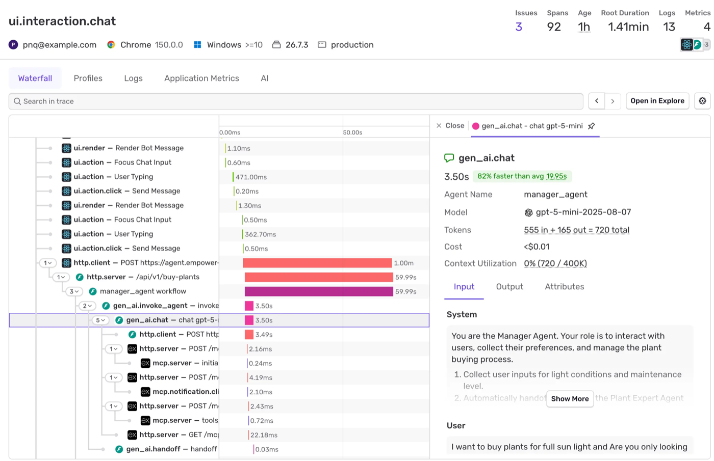
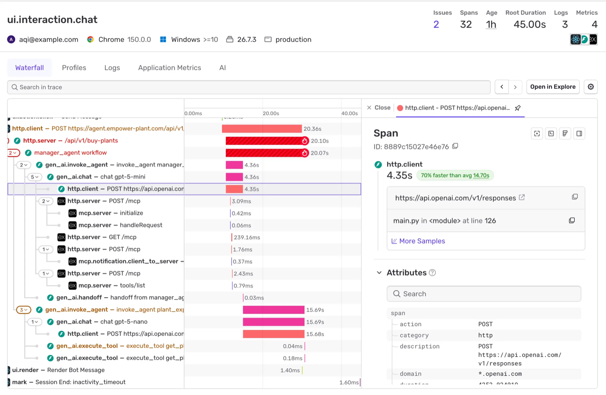
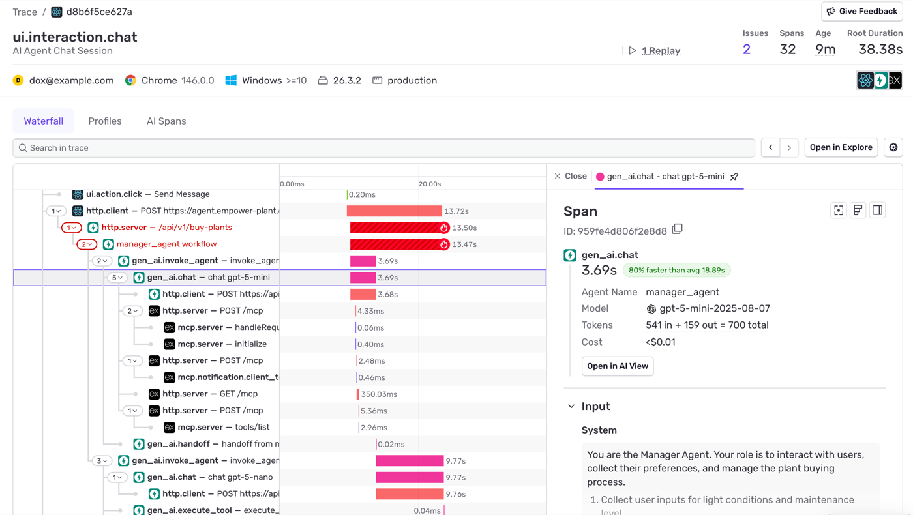
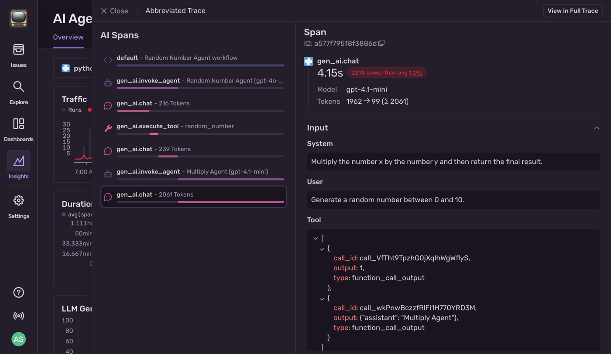
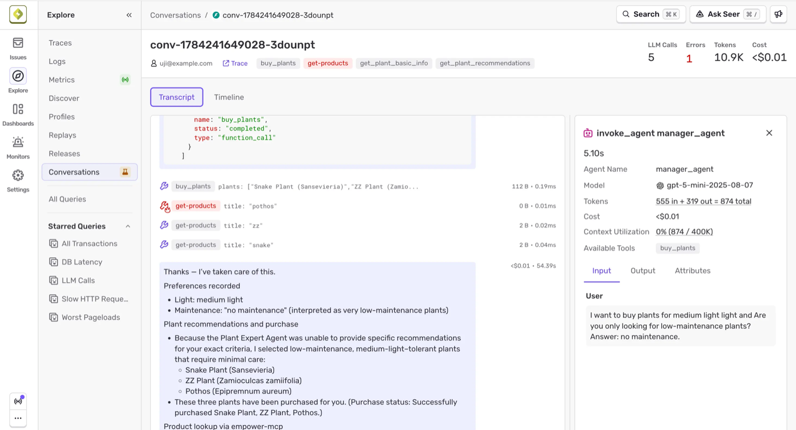
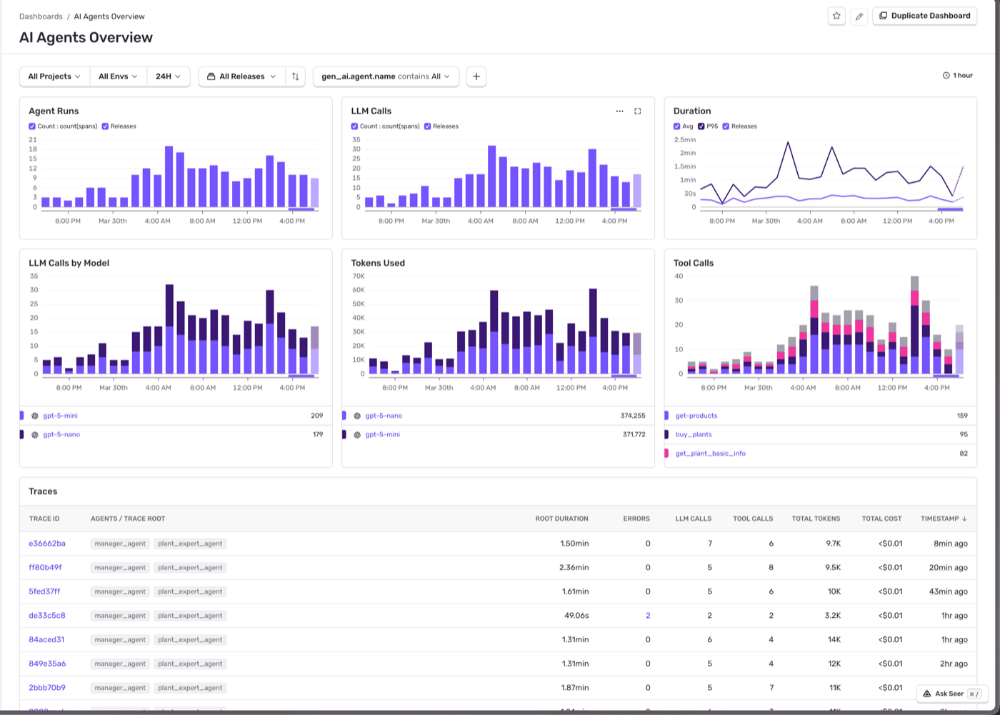
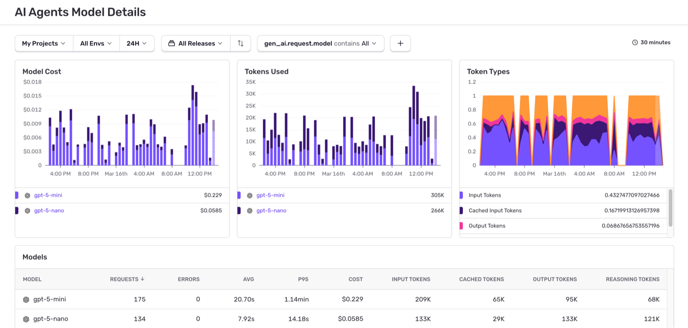
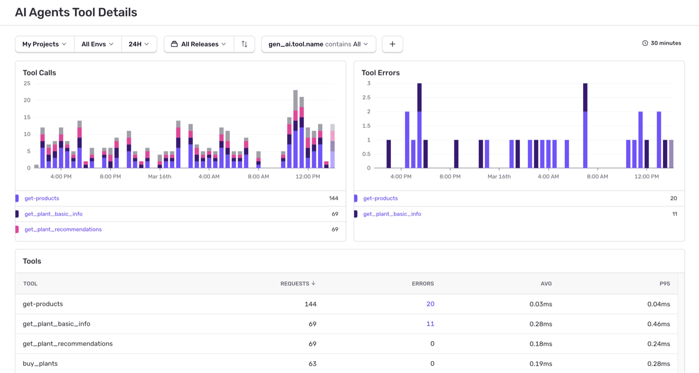
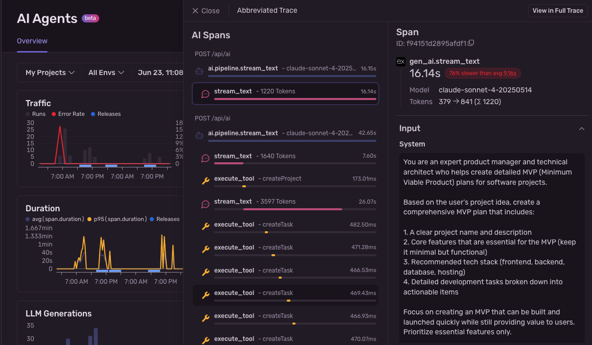

# Sentry — AI Agent Monitoring

> **One-liner:** The developer-first errors-and-tracing incumbent (OSS heritage, ~100K+ orgs)
> that bolted agent tracing onto its existing trace pipeline as a **filtered view of the same
> waterfall** — the cleanest existence proof that "agent view as a lens over generic OTel spans"
> is a shippable, cheap feature, not a separate product.

**Market position:** Sentry owns the "install one SDK, get errors + performance + now AI" developer
funnel — 4M+ downloads/week across SDKs, deep OSS goodwill (self-hostable, `getsentry/sentry` on
GitHub), and a self-serve motion with no sales call required at any tier. It is not an AI-native
startup like Langfuse/Braintrust and not a full observability suite like Datadog — it's an APM/error
tool that already had the trace store, the issue-grouping engine, and the install base, and is now
pointing all three at `gen_ai.*` spans. That is a smaller, scrappier version of Datadog's bet, and
arguably a more relevant analog for Maple: Sentry's whole company is span- and issue-centric, same
as Maple's.

**How core is agent tracing to the product?** This is the sharpest example in the whole competitive
set of "agent view as a lens over an existing trace product." There is **no separate agent
ingestion pipeline, no separate span schema, and no separate trace store.** `gen_ai.*` spans are
ordinary OTel spans that happen to carry `gen_ai.*` attributes; they live in the same trace as
`http.server`, `db.query`, and `ui.click` spans; they trigger the same Issues pipeline as any other
exception. The entire "AI Agent Monitoring" product is: (1) a semantic-convention-aware span
schema, (2) three purpose-built dashboards that query those attributes, (3) a **span-op filter over
the existing trace waterfall** that hides everything without a `gen_ai.*` op, and (4) a
transcript-style reader (Conversations) built from the same spans. Nothing here required a new
backend — it required a filter, three dashboards, and a reader view. That is close to the minimum
viable version of what Maple is scoping, which makes Sentry the most directly copyable reference in
this research set, more so even than Datadog (which built a bespoke DAG-graph renderer Sentry does
not have).

---

## Trial & access

| | |
|---|---|
| **Free tier** | Yes — **Developer plan, $0/forever**, one user, 5K errors, 5GB logs, **5M spans/month**, 50 replays. Agent tracing is a checked feature on this tier — confirmed from the pricing page's plan-comparison table (see Sources #7): "Agent tracing" ✓ on Developer, Team, Business, *and* Enterprise. |
| **Free trial** | 14 days, "unlimited volume, every feature unlocked" on signup; auto-downgrades to the free Developer plan afterward — no forced upgrade, no card charged. |
| **Credit card required?** | **No** — signup form asks only for name, organization, email, password, and data-residency region (US or EU). |
| **Registration URL** | https://sentry.io/signup/ |
| **Signup fields** | Name, organization, email, password, US/EU data storage toggle. |
| **Paid entry point** | Team plan **$26/mo** billed annually; Business **$80/mo** billed annually; Enterprise custom. |
| **Self-serve to the feature?** | Yes — install the SDK (`Sentry.init`), it auto-detects installed AI frameworks (OpenAI, Anthropic, Google GenAI, LangChain, LangGraph, Pydantic AI, OpenAI Agents SDK, Vercel AI SDK) and instruments them, or emit `gen_ai.*`-tagged OTLP directly. No sales call at any tier. |
| **Self-hosting** | Yes — `getsentry/self-hosted` is the OSS distribution. **Gotcha:** self-hosted instances may not ingest standalone `gen_ai.*` envelope items (added in SDK ≥10.61.0 to dodge transaction payload-size limits); self-hosted users are told to set `streamGenAiSpans: false` to fall back to bundling AI spans inside the transaction. Conversations (the transcript reader) explicitly **requires** the standalone envelope path, so it's an open question whether Conversations works cleanly on older self-hosted deployments. |
| **Other gotchas** | OTel compatibility has one real gap: OTel GenAI semconv stores prompt/response content in **Span Events**, which Sentry doesn't support as a first-class concept — Sentry instead lifts that data onto span **attributes** as a stringified list. Anything emitting pure OTel Span Events for `gen_ai.*` content needs adaptation to land correctly. Sentry targets semconv **v1.36.0** specifically, not "latest." |

---

## Sources

| # | Source | Type | Why it's useful / what to extract |
|---|---|---|---|
| 1 | [Agent Tracing product page](https://sentry.io/product/tracing/ai-agent/) | Marketing | The explicit pricing claim ("available on every Sentry plan, including the free Developer plan") and 4 hero screenshots showing the waterfall + span detail panel, Conversations, Overview dashboard, and Tool Details dashboard side by side. |
| 2 | [AI Agents Module spec](https://develop.sentry.dev/sdk/telemetry/traces/modules/ai-agents/) | Internal SDK spec (public) | **The exact wire format.** Verbatim span-op naming rules for `gen_ai.invoke_agent`, `gen_ai.{operation}` (e.g. `gen_ai.chat`), `gen_ai.execute_tool` — required vs. recommended attributes, span-name templates, message-format conventions (`{role, parts}`). This is the schema Maple would need to replicate to filter a waterfall the same way. |
| 3 | [AI agent observability: developer's guide](https://blog.sentry.io/ai-agent-observability-developers-guide-to-agent-monitoring/) | Product blog | Full walkthrough of the three dashboards (Overview / Model Details / Tool Details) plus the detailed trace view, with real screenshots at native resolution. Confirms dashboards are queryable by `gen_ai.agent.name`, `gen_ai.request.model`, `gen_ai.tool.name`. |
| 4 | [AI Agent Monitoring — Open Beta changelog](https://sentry.io/changelog/ai-agent-monitoring--open-beta/) (June 26, 2025) | Changelog | The **original launch post** and its screenshot is the earliest documented version of the "AI Spans" abbreviated-trace panel — useful to see how the feature evolved (older `ai.pipeline.stream_text` op naming vs. today's `gen_ai.*` semconv-aligned ops). States the feature explicitly: "a simplified trace view displaying only AI-relevant spans." |
| 5 | [Sentry's updated agent monitoring](https://blog.sentry.io/sentrys-updated-agent-monitoring/) | Product blog | Latest (semconv-aligned) version of the AI Spans panel screenshot — clean icon system (workflow / agent / chat / tool), collapsible JSON tool-call rendering with syntax highlighting. Confirms "automatically groups similar failures across runs" as the error-dedup pitch, and names concrete failure examples: prompt KeyErrors, model timeouts, malformed JSON output, tool timeouts, silent (never-executed) model calls. |
| 6 | [Debugging multi-agent AI: failure in the space between agents](https://blog.sentry.io/debugging-multi-agent-ai-when-the-failure-is-in-the-space-between-agents/) | Engineering blog | Real worked example of `gen_ai.handoff` spans in a waterfall (`gen_ai.handoff "from Triage Agent to Billing Agent"` → `gen_ai.invoke_agent "Billing Agent"`), and the argument that handoff/merge-point bugs don't trip error monitoring at all — they only show up by reading tool outputs span-by-span. Directly useful for scoping what Maple's issue-linking should (and shouldn't) try to catch automatically. |
| 7 | [Pricing](https://sentry.io/pricing/) | Pricing page | Verified plan-comparison table: "Agent tracing" ✓ on all four tiers (Developer/Team/Business/Enterprise); Developer plan quota (5K errors, 5GB logs, 5M spans, $0). |
| 8 | [AI Agents Dashboards docs](https://docs.sentry.io/ai/monitoring/agents/dashboards/) | Docs | Names all six Overview-dashboard widgets and the Models/Tools dashboards' widgets and table columns verbatim; confirms clicking a trace row opens **Trace Explorer with the "AI Spans" tab pre-selected**, with a **"View in Full Trace"** escape hatch back to the full waterfall. |
| 9 | [Signup](https://sentry.io/signup/) | Signup page | Confirms no credit card field, 14-day full-feature trial, auto-downgrade behavior. |

---

## Screenshots

### 1. Hero waterfall — agent spans inline with app spans, span detail panel

- Trace header stat row: **Issues 3 · Spans 92 · Age 1h · Root Duration 1.41min · Logs 13 · Metrics
  4** — issue count sits in the *same* stat bar as span/log/metric counts, not a separate panel.
- Tab bar on the trace: **Waterfall | Profiles | Logs | Application Metrics | AI** — the AI-only
  view is a **sibling tab**, not a toggle switch or filter checkbox layered on the waterfall.
- The waterfall itself interleaves `ui.render`, `ui.action.click`, `http.client`, `http.server`,
  and `gen_ai.*` spans in one tree — no visual separation until you open the `AI` tab.
- Selected span `gen_ai.chat – chat gpt-5-mini`: detail panel shows **Agent Name, Model (with
  provider glyph), Tokens (`555 in + 165 out = 720 total`), Cost (`<$0.01`), Context Utilization
  (`0% (720 / 400K)`)** as a fixed stat block above three tabs: **Input | Output | Attributes**.
- Input tab renders the prompt as **role-labeled sections** (`System`, `User`) in plain readable
  text, not raw JSON — with a **"Show More"** truncation control on long system prompts.
- A green **"82% faster than avg 19.95s"** badge sits next to the duration — per-span-name baseline
  comparison, computed automatically.

### 2. Full trace — `gen_ai.*` spans nested under `http.client`/`mcp.server` spans

- Exact real span-op names visible in one tree: `manager_agent workflow` → `gen_ai.invoke_agent —
  invoke_agent manager_...` → `gen_ai.chat — chat gpt-5-mini` → `http.client — POST
  api.openai.com...` → `http.server — POST /mcp` → `mcp.server — initialize` / `mcp.server —
  tools/list`, then a sibling `gen_ai.handoff — handoff from manager_ag...` → second
  `gen_ai.invoke_agent — invoke_agent plant_exp...` → `gen_ai.chat — chat gpt-5-nano` →
  `gen_ai.execute_tool — execute_tool get_pl...` (×2).
- **Failed spans render with a red fill + a flame/fire glyph** (`http.server /api/v1/buy-plants`
  and `manager_agent workflow` both shown in solid red) — status color is applied at the bar level,
  not just an icon.
- Non-AI span selected (`http.client → api.openai.com/v1/responses`) still gets a rich detail
  panel: exact URL, source file:line (`main.py:126`), a searchable **Attributes** key/value list
  (`span.action`, `span.category`, `span.description`, `span.domain`...) — the point being the
  *same* detail-panel chrome renders both AI and non-AI spans; there's no separate UI shell for
  `gen_ai.*`.
- Trace-level MCP protocol calls (`mcp.server — initialize`, `tools/list`) are captured as ordinary
  `http.server` spans distinguishable only by name — Sentry does not appear to special-case MCP
  transport spans the way it special-cases `gen_ai.*` ops.

### 3. The AI-only trace view — as a literal tab named "AI Spans"

**This directly answers the highest-priority question: how is the toggle implemented.**

- Tab bar: **Waterfall | Profiles | AI Spans** — confirms tab-based switching (not a filter chip on
  the waterfall itself, not a URL param toggle visible in the UI, not a checkbox).
- Every span detail panel (even when viewed from the Waterfall tab) carries an **"Open in AI
  View"** button — so you can jump from a specific `gen_ai.chat` span straight into the filtered
  view scoped to that span, not just from the tab bar at the top.
- The trace header keeps the same stat row (Issues, Spans, Age, Root Duration) regardless of which
  tab is active — switching tabs changes the body, not the chrome.

### 4. AI Spans panel internals — icon system, abbreviated tree, JSON tool-call rendering

**The single most load-bearing screenshot for the filter-rule and attribute-rendering questions.**

- Panel is headed **"AI Spans"** with a secondary label **"Abbreviated Trace"**, a **"View in Full
  Trace"** button top-right, and a **Close (×)** — confirms the AI view is explicitly framed as an
  *abridged* version of one underlying trace, always one click from the full waterfall.
- **Filter rule, inferred directly from the row set:** every row shown has a `gen_ai.*` span op —
  `default` (a generic workflow/root span, shown with a `<>` glyph), `gen_ai.invoke_agent` (🤖
  glyph), `gen_ai.chat` (💬 glyph), `gen_ai.execute_tool` (🔧 glyph). Plain `http.client`,
  `http.server`, `mcp.server`, `ui.*` spans from the same trace (visible in screenshot #2 on this
  same underlying data) are **absent** — confirming the filter is **span-op-prefix based**
  (`gen_ai.*`), not "attribute presence" in any looser sense, and non-AI spans are dropped from the
  tree entirely rather than collapsed-and-badged.
- **Nesting is flattened, not preserved as a tree.** The panel is effectively a flat, chronological
  list of `gen_ai.*` rows — `gen_ai.invoke_agent` (Random Number Agent) sits *above* its own
  `gen_ai.chat` and `gen_ai.execute_tool` children with no visible indentation or connector lines
  distinguishing parent from child; only row order communicates sequence. Structure is recovered by
  icon + label reading, not by graph layout. This is a materially simpler treatment than Datadog's
  Execution Flow graph — cheaper to build, less expressive for branching/parallel agents.
  **What happens to a hidden span's non-AI children is unclear from this screenshot** — the example
  trace has no non-AI span nested *below* a `gen_ai.*` span, so whether e.g. an `http.client` call
  made *by* a tool call is silently dropped or "absorbed" into the parent tool-call duration is not
  demonstrated in Sentry's own marketing material. Worth testing directly if replicating.
- Each row has an inline **duration sparkline/bar** and a token count in the label
  (`gen_ai.chat - 2061 Tokens`) — token count is promoted into the row label itself, not hidden in
  a side panel.
- **Tool-call attribute rendering (the #2 priority question), answered concretely:** the selected
  `gen_ai.chat` span's **Input → Tool** section renders the tool-call payload as **syntax-highlighted,
  indented, collapsible JSON** (`[ { call_id: ..., output: ..., type: function_call_output }, {...} ]`)
  with a chevron to collapse the whole array — this is the "reworked" treatment for large JSON blobs
  the brief called out: it's a code-block renderer with collapse affordance, not raw stringified text
  dumped inline, and not a custom key/value table either.
- A red **"221% slower than avg 1.29s"** badge on the selected span — same per-span-name baseline
  comparison pattern as screenshot #1, now flagging an outlier in red instead of green.

### 5. Conversations — chat-transcript replay built from the same spans

- Lives under the **Explore** nav next to Traces/Logs/Metrics/Discover — a first-class sibling
  view, not buried inside trace detail. Labeled with a "beta" bell icon in the nav.
- Conversation identified by an ID (`conv-1784241649028-3dounpt`), header stats: **LLM Calls 5 ·
  Errors 1 (red) · Tokens 10.9K · Cost <$0.01** — same stat vocabulary as the trace header, applied
  to a conversation instead of a trace.
- Below the header: a **user identity chip** (`uji@example.com`), a **"Trace" link** back to the
  originating trace, and **tool-name tag chips** (`buy_plants`, `get-products` [tinted red — this
  tool errored], `get_plant_basic_info`, `get_plant_recommendations`) — errored tools are flagged
  at the tag-chip level before you open anything.
- **Transcript | Timeline** toggle — two renderings of the same conversation (message-thread view
  vs. presumably a time-ordered/waterfall-style view).
- Transcript shows tool calls as **collapsed key:value chips** inline in the message flow
  (`buy_plants  plants: ["Snake Plant...", ...]  112 B · 0.19ms`) with per-call size and duration,
  plus the model's final natural-language answer rendered as a normal chat bubble.
- Clicking a tool-call chip opens the same span-detail side panel pattern as the trace view
  (`invoke_agent manager_agent`, Agent Name/Model/Tokens/Cost/Context Utilization, **Available
  Tools: `buy_plants`** chip, Input/Output/Attributes tabs) — Conversations is a different reading
  surface over identical span data, reusing the same detail-panel component as the waterfall.

### 6. AI Agents Overview dashboard

- Six time-series widgets: **Agent Runs, LLM Calls, Duration (Avg + P95), LLM Calls by Model,
  Tokens Used, Tool Calls** — each stacked/colored by model or tool name with a legend + running
  total underneath.
- Global filter bar: **All Projects · All Envs · 24H · All Releases**, plus a **facet-style search
  chip `gen_ai.agent.name contains All`** — dashboard filtering is literally querying the same
  `gen_ai.*` attributes the spans carry, with a `+` to add more attribute filters.
- **Traces table** at the bottom: `TRACE ID | AGENTS / TRACE ROOT | ROOT DURATION | ERRORS | LLM
  CALLS | TOOL CALLS | TOTAL TOKENS | TOTAL COST | TIMESTAMP` — the "Agents" column lists every
  agent name that appeared in that trace as chips (`manager_agent`, `plant_expert_agent`), so you
  can scan for handoff patterns without opening a trace.
- Rows with errors show the **error count in red and clickable** directly in the table.

### 7. AI Agents Model Details dashboard

- Filter chip here is `gen_ai.request.model contains All` — same dashboard shell, different facet.
- **Token Types** widget is a stacked area chart split into **Input / Cached Input / Output** —
  cache-hit visibility promoted to its own chart, not just a table column.
- Models table columns: `MODEL | REQUESTS | ERRORS | AVG | P95 | COST | INPUT TOKENS | CACHED
  TOKENS | OUTPUT TOKENS | REASONING TOKENS` — **reasoning tokens get their own column**, separate
  from output tokens (relevant for o-series/extended-thinking models).

### 8. AI Agents Tool Details dashboard

- Filter chip `gen_ai.tool.name contains All`. Two charts: **Tool Calls** and **Tool Errors**, both
  stacked by tool name with matching colors across the two charts for visual correlation.
- Tools table: `TOOL | REQUESTS | ERRORS | AVG | P95` — error counts are **blue, clickable links**
  straight into the underlying issues for that tool.

### 9. Original open-beta version (June 2025) — for comparison

- Historical reference: at launch the AI Spans panel used **`ai.pipeline.stream_text`** and bare
  `execute_tool` op names (Vercel AI SDK-specific instrumentation), predating the `gen_ai.*`
  semconv-aligned naming shown in screenshots #2–#4. Confirms Sentry **migrated its own span-naming
  scheme onto the OTel GenAI semconv after initial launch** — worth knowing if Maple picks span-op
  conventions early, since Sentry had to do a breaking rename once the ecosystem standard firmed up.
- Same "Abbreviated Trace" / "AI Spans" / "View in Full Trace" chrome existed from day one — the
  tab-based toggle predates the semconv migration by roughly a year.

---

## Feature anatomy (spec-ready notes)

**Data model.** No separate agent/session entity — a `gen_ai.*` span is an OTel span with
`gen_ai.operation.name` set. Three span shapes matter:

- `gen_ai.invoke_agent` — op is literally `"gen_ai.invoke_agent"`; name template
  `"invoke_agent {gen_ai.agent.name}"`; required attr `gen_ai.operation.name = "invoke_agent"`;
  recommended `gen_ai.agent.name`, `gen_ai.pipeline.name`.
- AI client span — op is `"gen_ai.{operation.name}"` (so `gen_ai.chat`, `gen_ai.embeddings`,
  `gen_ai.generate_content`, `gen_ai.text_completion`); name template
  `"{operation.name} {gen_ai.request.model}"` (e.g. `"chat o3-mini"`); required
  `gen_ai.provider.name`, `gen_ai.request.model`, `gen_ai.response.model`; optional
  `gen_ai.input.messages` / `gen_ai.output.messages` (stringified JSON, `{role, parts}` shape,
  roles `user|assistant|tool|system`), `gen_ai.system_instructions`, `gen_ai.tool.definitions`,
  `gen_ai.usage.{input,output,total}_tokens`, `gen_ai.usage.cache_read.input_tokens`,
  `gen_ai.usage.reasoning.output_tokens`.
- `gen_ai.execute_tool` — name template `"execute_tool {gen_ai.tool.name}"`; attrs
  `gen_ai.tool.name`, `gen_ai.tool.description`, `gen_ai.tool.type`,
  `gen_ai.tool.call.arguments`, `gen_ai.tool.call.result`.
- `gen_ai.handoff` — observed in real traces (`"handoff from manager_agent"`) though not in the
  formal spec doc; used between sibling `gen_ai.invoke_agent` spans for multi-agent transfer.

**Ingestion.** Native SDK auto-instrumentation for OpenAI, Anthropic, Google GenAI, LangChain,
LangGraph, Pydantic AI, OpenAI Agents SDK, Vercel AI SDK (both Python and Node) — or raw OTLP
targeting semconv v1.36.0. One real gap: OTel Span Events (where semconv puts prompt/response
content) aren't a first-class Sentry concept, so that content gets lifted onto span attributes
instead — a pure OTel Collector pipeline needs to account for this. Since SDK 10.61.0, `gen_ai.*`
spans ship as **standalone envelope items** rather than bundled into the parent transaction, to
avoid transaction payload-size limits blowing out on large prompts — this is *why* Conversations
works (it needs to fetch large input/output independent of the transaction payload), and it's the
detail that breaks self-hosted deployments that haven't updated their ingest path.

**Views, in order of the funnel.**
1. Three dashboards (Overview / Model Details / Tool Details) — each filterable by a `gen_ai.*`
   attribute chip, each with a bottom-of-page data table.
2. Trace row in the Overview dashboard's Traces table → opens **Trace Explorer with the "AI Spans"
   tab pre-selected** (an abbreviated, flattened, `gen_ai.*`-only span list).
3. **"View in Full Trace"** from the AI Spans panel → full waterfall, all span kinds, unfiltered.
4. **"AI" / "AI Spans" tab** sits permanently in the trace's own tab bar (alongside Waterfall,
   Profiles, Logs, Application Metrics) — reachable directly from a trace, not only from the
   dashboard.
5. **Conversations** (Explore nav) — an orthogonal reading surface: groups spans by
   `gen_ai.conversation.id` into a chat transcript, independent of which trace they landed in.

**Error linking.** Loose coupling, not a dedicated data model. A failing `gen_ai.*` span raises a
normal Sentry exception/issue the same way any span error would; the trace header's `Issues N` stat
counts them alongside non-AI errors; per-tool and per-model dashboard tables surface error counts as
clickable links into those issues. Sentry's own marketing names five real failure categories
(prompt-construction KeyErrors, model timeouts, malformed/unexpected JSON output, tool
failures/timeouts, silent/never-executed model calls) and pitches "automatically groups similar
failures across runs" as noise reduction — but the mechanism is ordinary issue-fingerprinting, not
an agent-aware classifier. Sentry's own engineering blog is candid that **multi-agent
information-cascade bugs (a weak result silently degrading through several handoffs) don't trip
error monitoring at all** — those are only found by reading tool outputs span-by-span in the
waterfall, which is an honest limitation worth noting rather than a solved problem to copy.

---

## Ideas worth stealing for Maple

1. **The AI-only view as a tab on the existing trace, not a separate page or mode.** `Waterfall |
   Profiles | Logs | Application Metrics | AI` — cheapest possible integration point, and it keeps
   the trace's stat-bar chrome (Issues/Spans/Duration) constant across tabs. Maple's waterfall
   could grow an "Agent" tab the same way with near-zero new UI shell.
2. **The filter rule is dead simple: span-op prefix (`gen_ai.*`), not attribute-sniffing.** A
   cheap, unambiguous rule to implement and to document for users instrumenting their own agents.
3. **Reciprocal navigation: "Open in AI View" from any span in the full waterfall, "View in Full
   Trace" from the abbreviated view.** Two-way door between the filtered and full view, always one
   click, from either direction — not just a top-level toggle.
4. **Tool-call/prompt JSON gets a real code-block renderer with collapse**, not string-dumped
   attribute text. Directly solves the "large JSON blobs wreck the waterfall" problem the brief
   flagged — cheap to build (one component), big legibility win.
5. **Token count promoted into the row label itself** (`gen_ai.chat - 2061 Tokens`), not just in a
   side panel — scanability without opening anything.
6. **Per-span-name baseline comparison badges** ("82% faster than avg 19.95s" / "221% slower than
   avg 1.29s") shown inline on the span detail header — turns a duration number into an anomaly
   signal for free.
7. **`Available Tools` chip list on the agent-invocation span detail** (even if minimal compared to
   Datadog's full Agent Manifest) — cheap version of "what could this agent have called."
8. **Conversations as an orthogonal reading surface keyed by `gen_ai.conversation.id`**, reusing the
   exact same span-detail component as the trace view — a session/multi-turn layer Maple doesn't
   currently have, built by grouping rather than a new backend concept.
9. **Dashboard facet chips are literally the `gen_ai.*` attribute names** (`gen_ai.agent.name
   contains All`, `gen_ai.tool.name contains All`, `gen_ai.request.model contains All`) — the
   dashboards don't invent a taxonomy, they expose the schema directly as filters. Low-effort,
   self-documenting.
10. **Being explicit that agent tracing ships on the free tier.** A credible growth lever if Maple
    wants agent tracing to be a wedge feature rather than a paywalled add-on.

## What to skip / deprioritize

- **The flattened (non-tree) abbreviated view.** It reads fine for Sentry's simple two-agent demo
  traces but loses parent/child structure entirely — no indentation, no connectors. For anything
  with real branching or parallel tool calls this will be materially worse than Datadog's
  Execution Flow graph. If Maple builds a filtered view, keep the tree structure; don't flatten to
  a list just because Sentry did.
- **The undocumented behavior for non-AI spans nested below a `gen_ai.*` span.** Sentry's own
  marketing doesn't demonstrate this case, meaning it's either rare in practice or a rough edge they
  haven't polished — not something to reverse-engineer and copy blind.
- **Issue-linking is genuinely thin here** — it's "an error span is an error," not an agent-aware
  failure taxonomy, despite marketing copy that gestures at one (timeout vs. bad-tool-output vs.
  context-overflow vs. refusal vs. hallucination is *named* in prose but not implemented as
  distinct issue types anywhere observed). Don't treat their copy as a spec for a feature that
  exists — Datadog's guardrail pass/fail glyphs are the closer model if Maple wants real
  differentiation here.
- **The self-hosted `streamGenAiSpans` gotcha** is a Sentry-specific migration artifact (payload
  size limits from bundling large prompts into transactions) — not a design pattern worth adopting,
  just a reminder to plan for large-payload spans from day one rather than retrofitting an
  envelope-splitting mechanism later.

---

## Screenshot sources

| File | Found on | Direct image URL |
|---|---|---|
| `01-hero-waterfall-ai-span-detail.png` | [Agent Tracing: See Every Step of Your AI Agent Run](https://sentry.io/product/tracing/ai-agent/) | `https://sentry.io/_astro/ai-agent-hero.Lm8hivk2.webp` |
| `02-waterfall-agent-and-app-spans.png` | [Agent Tracing: See Every Step of Your AI Agent Run](https://sentry.io/product/tracing/ai-agent/) | `https://sentry.io/_astro/ai-agent-story-1.AuCk5RuH.webp` |
| `03-waterfall-ai-spans-tab.png` | [AI agent observability: The developer's guide to agent tracing](https://blog.sentry.io/ai-agent-observability-developers-guide-to-agent-monitoring/) | `https://blog.sentry.io/_astro/agent-detailed-trace-view.B6oo1WUT.png` |
| `04-ai-spans-abbreviated-trace.png` | [Introducing Sentry's Updated Agent Tracing](https://blog.sentry.io/sentrys-updated-agent-monitoring/) | `https://blog.sentry.io/_astro/inline-1.qY6sgjoR.png` |
| `05-conversations-transcript-view.png` | [Agent Tracing: See Every Step of Your AI Agent Run](https://sentry.io/product/tracing/ai-agent/) | `https://sentry.io/_astro/ai-agent-story-2.DN58GTUy.webp` |
| `06-ai-agents-overview-dashboard.png` | [AI agent observability: The developer's guide to agent tracing](https://blog.sentry.io/ai-agent-observability-developers-guide-to-agent-monitoring/) | `https://blog.sentry.io/_astro/overview.BG07xo6J.png` |
| `07-ai-agents-model-details-dashboard.png` | [AI agent observability: The developer's guide to agent tracing](https://blog.sentry.io/ai-agent-observability-developers-guide-to-agent-monitoring/) | `https://blog.sentry.io/_astro/agent-models-dash.Cc3hveVZ.png` |
| `08-ai-agents-tool-details-dashboard.png` | [AI agent observability: The developer's guide to agent tracing](https://blog.sentry.io/ai-agent-observability-developers-guide-to-agent-monitoring/) | `https://blog.sentry.io/_astro/agent-tools-dash.CWOkqNtc.png` |
| `09-open-beta-2025-ai-spans-changelog.png` | [AI Agent Monitoring — Open Beta](https://sentry.io/changelog/ai-agent-monitoring--open-beta/) | `https://cslswue7zohm4cat.public.blob.vercel-storage.com/nCgBSts-Screenshot%202025-06-25%20at%209.59.02%E2%80%AFPM.png` |

Sentry serves these images through a resizing proxy (Vercel image optimization), so `Content-Length`
doesn't match byte-for-byte between the local PNGs and the source webp/png assets. All 9 files were
instead confirmed by downloading each candidate and visually diffing it pixel-for-pixel against the
local screenshot (identical trace IDs, token counts, chart data, and UI chrome in every match).

---

*Researched 2026-08-05. Screenshots pulled from Sentry's public docs and blog for internal
competitive research; do not redistribute.*
