# W&B Weave — Observability for Production Agents

> **One-liner:** The ML-experiment-tracking incumbent's LLM/agent product, now owned by GPU-cloud
> vendor CoreWeave, distinguished by an explicit **Agent → Conversation → Turn → LLM call → Tool
> call → Sub-agent** data model shipped natively on top of OpenTelemetry GenAI semantic
> conventions — the most fully-worked-out "sessions as first-class" story of any competitor
> researched so far.

**Market position:** CoreWeave completed its **$1.7B acquisition of Weights & Biases on May 5,
2025** (announced March 2025), folding W&B into a GPU-cloud/AI-infrastructure company rather than
an observability incumbent — every doc and marketing page now carries a small "by CoreWeave"
lockup under the W&B logo. That changes Weave's trajectory versus Datadog: instead of bolting
agent tracing onto an existing $3B APM business, W&B is pairing it with compute (CoreWeave
Sandboxes, W&B Inference token pricing now sit in the same pricing table as Weave tracing).
Distribution advantage: **1,400+ organizations** already use W&B for ML experiment tracking
(Models/Runs/Sweeps/Artifacts) — Weave is a sibling product inside the same team/project
namespace, so any org already paying for W&B model tracking can turn on Weave with zero new
procurement. Notably for Maple: **self-managed Weave's backend is ClickHouse** (Altinity
Kubernetes Operator for ClickHouse + a pre-configured S3 bucket) — the same warehouse technology
Maple runs on.

**How core is agent tracing to the product?** As core as it gets — Weave says it was **"rebuilt
from the ground up"** in a July 28, 2026 announcement specifically for agent observability, and
closes with the line *"Agents are the new application development paradigm. Weave is the
observability platform for agents."* Concretely, the product now carries **two overlapping
multi-turn primitives**: an older, simpler **Threads** feature (`weave.thread()`, grouped `Trace`
objects, lives inside the general Traces product) and a new, dedicated top-level **Agents** nav
item (`Dashboard` / `Agents` / `Conversations` / `Spans` / `Signals` tabs) with its own SDK classes
(`Conversation`, `Turn`, `LLM`, `Tool`, `SubAgent`) and its own OTel ingestion endpoint. Shipping a
second, richer generation of the same idea six months after the first is a strong signal of how
central this is to the roadmap.

---

## Trial & access

| | |
|---|---|
| **Free tier** | Yes — `$0/mo`, permanent. Includes AI app tracing/evals/scorers, 5 GB storage/mo, **1 GB Weave data ingestion/mo**, up to 5 model seats. Additional ingestion is not billed on Free (you simply hit the cap). |
| **Free trial** | Pro plan: **30-day free trial**, self-serve. |
| **Credit card required?** | **No** for the Free tier — signup is Auth0-hosted (`wandb.auth0.com`), offers Apple/GitHub/Google/Microsoft SSO or email+password, no payment step observed anywhere in the flow. **Yes** to start the Pro 30-day trial — W&B's own pricing FAQ describes it as available "through self-serve credit-card checkout," i.e. card-on-file up front, not a card-free trial. |
| **Registration URL** | https://wandb.ai/login?signup=true (redirects to the Auth0 widget) |
| **Signup fields** | Email + password, or one-click SSO (Apple / GitHub / Google / Microsoft). No company/job-title gate like Datadog's business-email requirement. |
| **Paid entry point** | Pro from **$60/mo** (billed monthly or annually), meters storage GB, Weave data ingestion ($0.10/MB beyond 1.5 GB/mo), and W&B Inference tokens. Enterprise is custom (SSO, HIPAA, SOC 2, single-tenant, customer-managed encryption keys). |
| **Self-serve to the feature?** | Yes — `weave.init("team/project")` + an API key, or point an existing OTel pipeline at a dedicated OTLP endpoint. No sales call needed for Free or Pro. |
| **Self-hosting story** | Three tiers: **Multi-tenant Cloud** (default, GCP), **Dedicated Cloud** (AWS/GCP/Azure, single-tenant ClickHouse Cloud cluster in your region, IP allowlisting), **Self-Managed** (you run it — requires the Altinity Kubernetes Operator for ClickHouse, a pre-provisioned S3 bucket, and a Weave-enabled W&B Platform license). |
| **Gotchas** | Weave ingestion is billed **per MB**, not per span — token-heavy agent traces (full message bodies, tool args/results) can burn the 1 GB/mo free cap fast. The plan-comparison grid explicitly marks **"Custom Roles"** and **"Bring your own bucket" as "Not available with Weave"** even where the rest of the W&B platform supports them. |

---

## Sources

| # | Source | Type | Why it's useful / what to extract |
|---|---|---|---|
| 1 | [Trace your agents](https://docs.wandb.ai/weave/guides/tracking/trace-agents) | Docs | **The data model, verbatim.** A table mapping every concept to its SDK class and OTel span type: Agent (no span, grouped by `agent_name`), Conversation (`Conversation` class, no span — turns grouped by `conversation_id`), Turn (`Turn` class, `invoke_agent` span, root of its own trace), LLM call (`LLM` class, `chat` span), Tool call (`Tool` class, `execute_tool` span), Sub-agent call (`SubAgent` class, **also an `invoke_agent` span**, nested). Key architectural fact: **a conversation groups turns by a shared `conversation_id` attribute, not by parent span** — each turn is the root of its own independent OTel trace, explicitly to support distributed/parallel execution without server-side aggregation. |
| 2 | [Send OpenTelemetry spans to the Agents view](https://docs.wandb.ai/weave/guides/tracking/trace-agents-otel) | Docs | **Proves the model works over plain OTel, no Weave SDK.** Separate dedicated endpoint `POST /agents/otel/v1/traces` (protobuf only). Three `gen_ai.operation.name` values do all the work: `invoke_agent` → rendered as a Turn, `chat` → LLM call within a turn, `execute_tool` → tool call. `gen_ai.conversation.id` groups turns into a conversation; `gen_ai.agent.name` groups conversations under a named agent card. Full runnable Python example included. |
| 3 | [Send OpenTelemetry Traces to Weave](https://docs.wandb.ai/weave/guides/tracking/otel) | Docs | The *other*, older OTel endpoint (`/otel/v1/traces`, feeds Traces+Threads, not Agents). The attribute-mapping table is the real prize: Weave normalizes attributes from **nine different instrumentation conventions** — OTel GenAI (`gen_ai.*`), OpenInference (`input.value`/`output.value`/`llm.*`), Vercel AI SDK (`ai.prompt`/`ai.model.*`), MLflow (`mlflow.spanInputs`), Traceloop/OpenLLMetry, Google Vertex AI Agent (`gcp.vertex.agent.*`), OpenLit, Logfire/Pydantic AI (`gen_ai.input.messages`), and Langfuse (`langfuse.startTime`) — into one internal schema, applied in priority order so frameworks can coexist in the same trace. Also documents plain-OTel thread grouping via `wandb.thread_id` / `wandb.is_turn` span attributes (no SDK required). Limitation called out explicitly: OTel tool calls don't render in the Chat view, only as raw JSON. |
| 4 | [View agent activity](https://docs.wandb.ai/weave/guides/tracking/view-agent-activity) | Docs | **The UI mechanics, tab by tab.** Agents view = `Dashboard` / `Agents` / `Conversations` / `Spans` / `Signals`. Documents the exact **Events timeline color code**: Purple=User message, Green=Assistant message, Blue=Tool call, **Sienna=Sub-agent invocation**, **Magenta=Agent handoff**, Gray=Context compaction, Red=any error — sub-agent delegation and handoffs are literally color-coded as distinct event types. Also documents the Conversations table columns (`Spans` column renders a color-coded strip preview of the whole conversation), the Spans-tab waterfall ("Show trace tree" toggle switches it to a hierarchical tree), and that a single conversation can contain **multiple traces** when sub-agent delegation is involved. |
| 5 | [Navigate the Weave Trace view](https://docs.wandb.ai/weave/guides/tracking/trace-tree) | Docs | The classic (non-agent) trace UI. Four alternate renderings of one trace tree — **Traces (default) / Code composition / Flame graph / Graph view** — plus six op-detail tabs: **Call / Code / Feedback / Scores / Summary / Use**. The **Code** tab shows "the code that was used when the call was made" (not just I/O); **Use** gives copy-paste snippets to re-fetch the call and attach feedback via API. Four navigation scrubbers below the tree: Timeline, Peers (same op type), Siblings (same parent), Stack — plus a fifth, Path, that only appears in code-composition view. |
| 6 | [Trace threads](https://docs.wandb.ai/weave/guides/tracking/threads) | Docs | The older, simpler multi-turn primitive: `Thread → Turn → Call`, created with `weave.thread()` / `weave.thread("explicit_id")`. Only top-level `@weave.op` calls inside a thread context count as turns; nested calls roll up underneath and don't pollute thread-level stats. Chat pane only renders messages from calls that are (a) not further nested and (b) from a supported auto-patched SDK (`openai.ChatCompletion.create`, `anthropic.Anthropic.completion`) — everything else shows an empty message section for that turn. |
| 7 | [Monitor your agents with signals](https://docs.wandb.ai/weave/guides/tracking/view-agent-signals) | Docs | The automatic-detection layer behind the Signals tab. Two categories — **Tags** (label-only, e.g. `user-frustration`, `nsfw`) and **Ratings** (0.0–1.0 score) — each with four ready-made presets: Tags = User Frustration, Malicious Intent (Jailbreaking), NSFW, Low Quality Response; Ratings = User Satisfaction, User Good Intent, Safe-for-Work, Response Quality. Custom signals are LLM-judge prompts with template variables (`{input_messages}`, `{output_messages}`, `{agent_name}`) scored by a configurable inference model, with per-signal filters and a sample rate for high-traffic agents. |
| 8 | [New in W&B Weave: Observability and continuous improvement for production agents](https://wandb.ai/wandb_fc/product-announcements-fc/reports/New-in-W-B-Weave-Observability-and-continuous-improvement-for-production-agents--VmlldzoxNzAzMTcxNg) | Blog / product announcement | The thesis statement, verbatim: *"Agent tracing is no longer just code tracing... You need first-class semantics: sessions, turns, steps, tools, sub-agents. Generic observability tools don't speak this language."* Also: *"Offline evals are dead. Long live online evals"* — the argued rationale for building Signals (production-traffic pattern detection) as a first-class feature rather than leaning on pre-built eval datasets. |
| 9 | [W&B Weave marketing page](https://wandb.ai/site/weave/) | Marketing | Source of the exact "sessions, turns, steps, tools, and sub-agents as first-class concepts" line the product is built around. Also positions the adjacent surfaces: Playground (test prompts/models against production traces), Guardrails (pre-built safety/quality scorers: toxicity, bias, PII, hallucination, coherence, fluency), Leaderboards (aggregate evals across models), and an MCP-server-driven "coding agents read production data and auto-iterate" loop. |
| 10 | [Explore Weights & Biases pricing plans](https://wandb.ai/site/pricing/) | Marketing / pricing | Full plan comparison grid used for the trial table above — the source for storage/ingestion metering, the Pro-trial card-required language, and the "Not available with Weave" caveats on Custom Roles / BYOB. |

---

## Screenshots

### 1. Trace view — three-panel layout with six op-detail tabs
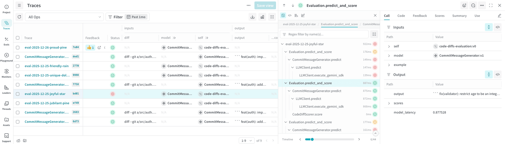

- **Left panel**: paginated trace list with columns `Trace`, `Feedback` (thumbs-up counts), `Status`
  (colored dot per op), plus dynamic columns pulled from call attributes (`diff`, `model`, `self`,
  `output`) — the columns are literally the op's own input/output keys, not a fixed schema.
- **Center panel**: the trace tree. Each row shows the op name, duration in ms, and a colored
  status glyph (green check / red X / yellow clock for in-flight).
- **Right panel**: six tabs on the selected op — **`Call` (active) | `Code` | `Feedback` | `Scores`
  | `Summary` | `Use`**. The `Call` tab splits cleanly into an `Inputs` table (`self`, `model`,
  `example`, each expandable) and an `Output` table, with a raw-JSON toggle (`</>`) on both.
- Note `model_latency: 0.877528` surfaced as a distinct output field — latency is treated as
  model-reported data, not just span duration.

### 2. Scrubber panel — four synchronized navigation dials
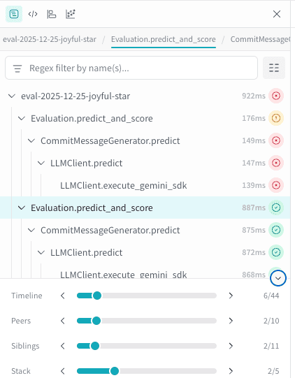

- Four sliders under the trace tree, each showing a fraction (`6/44`, `2/10`, `2/11`, `2/5`):
  **Timeline** (chronological order of every event in the trace), **Peers** (jump to the next call
  of the *same op*, e.g. next `LLMClient.predict`), **Siblings** (next call under the *same
  parent*), **Stack** (walk up/down the call stack). A fifth, **Path**, appears only in code
  composition view and iterates calls sharing the same code path.
- This is a genuinely novel navigation idea — four different "next" buttons for four different
  notions of adjacency, instead of one linear scrollbar.

### 3. Code composition view — nested boxes, not a waterfall
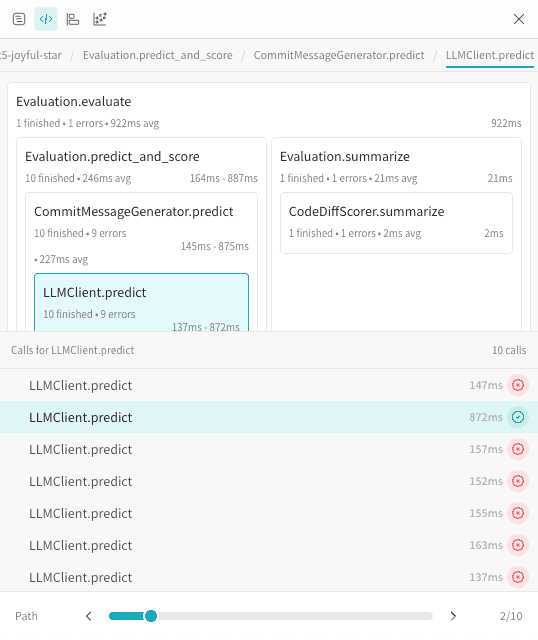

- Breadcrumb at top (`...5-joyful-star / Evaluation.predict_and_score / .../ LLMClient.predict`).
- Ops render as **nested rectangular boxes** sized by call-count, not by duration — e.g.
  `Evaluation.predict_and_score` shows `10 finished • 1 errors • 246ms avg` directly on the box.
  This is a call-graph-by-code-structure view, distinct from a time-proportional flame chart.
- Selecting a leaf op (`LLMClient.predict`, highlighted) opens a **"Calls for LLMClient.predict"**
  list below — every one of the 10 invocations of that exact op across the whole trace, each
  clickable, with its own duration and pass/fail glyph.

### 4. Flame graph view
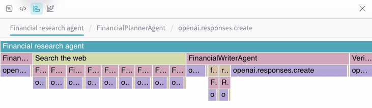

- A genuine horizontal icicle/flame chart: `Financial research agent` spans the full width at the
  top; the row below splits into `Search the web` / `FinancialWriterAgent` / `Veri...` sized by
  wall-clock share; a third row subdivides further into individual `openai.responses.create` calls.
  This is the one view sized by actual duration rather than call structure.

### 5. Graph view — parent/child node graph
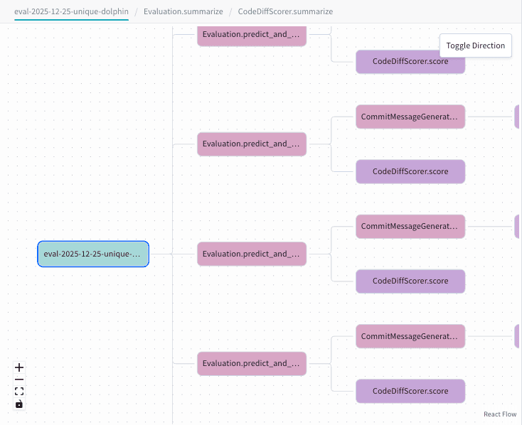

- Left-to-right node graph (React Flow), colored rounded-rectangle nodes per op
  (`Evaluation.predict_and_...`, `CommitMessageGenerat...`, `CodeDiffScorer.score`), connected by
  right-angle edges. A **"Toggle Direction"** control flips it to top-to-bottom. Zoom/pan and
  fit-to-screen controls bottom-left. This is the pure structure view — no timing information at
  all, purely "what calls what."

### 6. Threads — list view
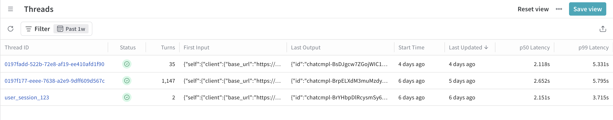

- The *older*, simpler multi-turn primitive (separate from the Agents view below). Columns:
  `Thread ID`, `Status`, `Turns`, `First Input`, `Last Output`, `Start Time`, `Last Updated`,
  **`p50 Latency`**, **`p99 Latency`** — latency percentiles are computed per-thread and shown as
  first-class list columns, not buried in a detail panel.

### 7. Threads — detail drawer with synced chat pane
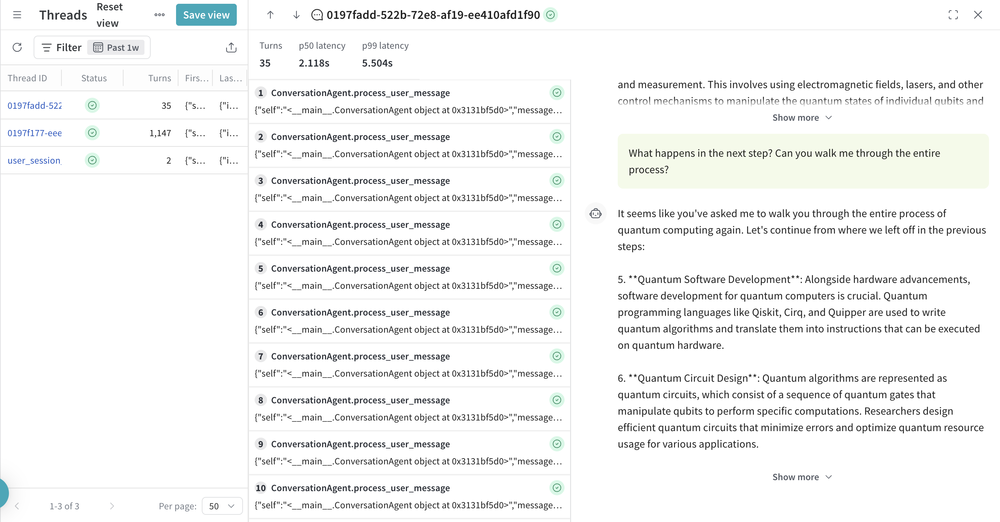

- Three-panel layout again: thread list (left) → numbered turn list (center, each row is one
  top-level op like `ConversationAgent.process_user_message`) → **chat-style transcript** (right)
  rendered from the underlying LLM call messages. Clicking turn 31 in the center list scrolls the
  right pane to that exact exchange — turn list and chat transcript are two synchronized views of
  the same 35-turn thread, not two separate features.

### 8. Agents — Dashboard tab (project-wide daily health check)
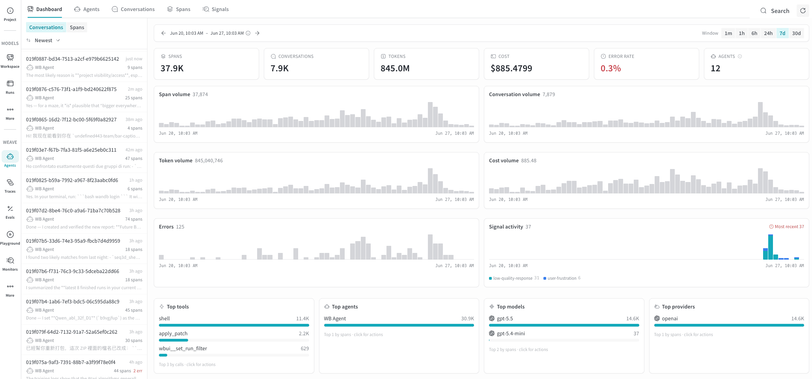

- Nav bar: **`Dashboard` | `Agents` | `Conversations` | `Spans` | `Signals`** — the new dedicated
  top-level surface, sibling to Traces/Threads.
- Six summary cards above the fold for the selected window: `Spans 37.9K`, `Conversations 7.9K`,
  `Tokens 845.0M`, `Cost $885.4799`, `Error rate 0.3%`, `Agents 12` — cost and error rate sit next
  to raw volume, not on a separate cost dashboard.
- Time-series row: Span volume, Conversation volume, Token volume, Cost volume, Errors, and
  **Signal activity** (stacked by signal name, e.g. `low-quality-response 31`, `user-frustration
  6`) — signals get their own trend chart alongside the operational metrics.
- Bottom row: **Top tools / Top agents / Top models / Top providers**, each a ranked bar list
  ("Top 1 by spans · click for actions") — every bar is an actionable filter, not just a stat.
- Left rail lists recent conversations with a live preview of the last message and a span count.

### 9. Agents — fleet grid (compare agents at a glance)
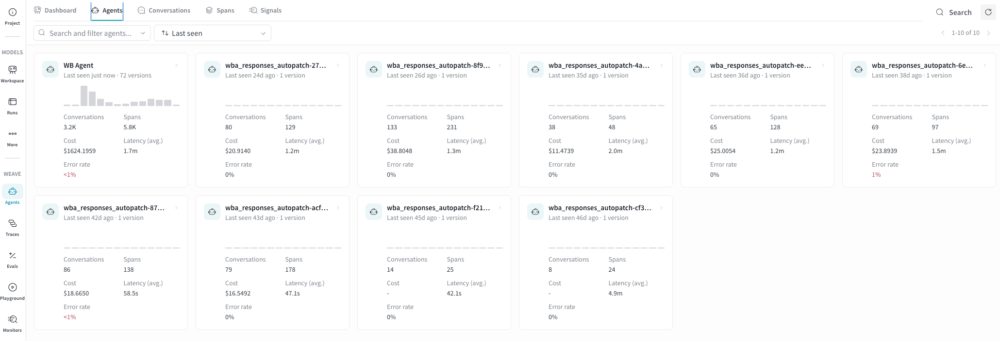

- One card per distinct `agent_name`, sortable by Last seen / Most invocations / Most input tokens
  / Most errors. Each card: a small activity-histogram sparkline, `Conversations`, `Spans`, `Cost`,
  `Latency (avg.)`, and `Error rate` (turns red above 0%). The card grid format is Weave's answer
  to Datadog's separate "AI Agents Console" fleet product — here it's inline, one click from the
  dashboard, not a distinct paid surface.

### 10. Agents — Conversation detail (Turns + Events + Scores + Meta summary)
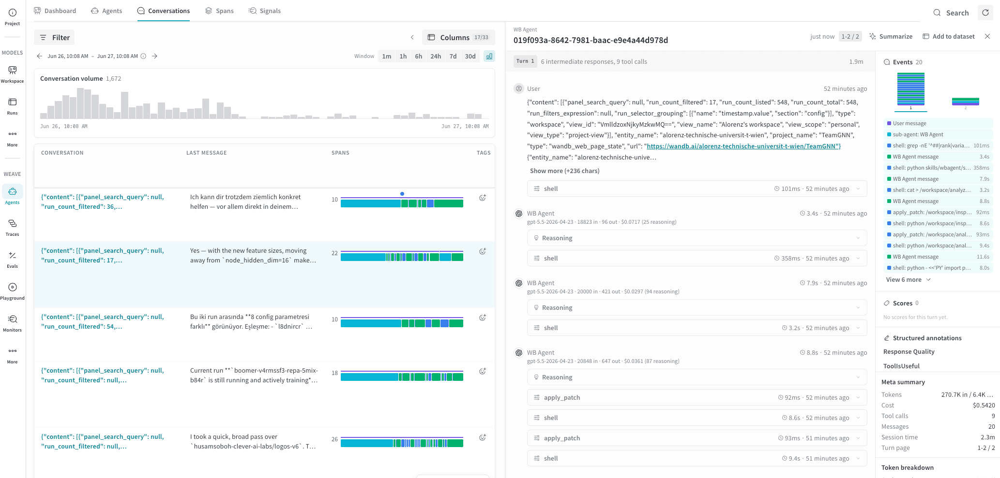

- Center panel: numbered turns (`Turn 1`, metadata `6 intermediate responses, 9 tool calls`,
  `1.9m` wall-clock), each expandable into User/Assistant/tool-call blocks. Assistant blocks show
  model + token counts + cost inline (`gpt-5.5-2026-04-23 · 18823 in · 96 out · $0.0717 (25
  reasoning)`) and a collapsible **`Reasoning`** section for extended-thinking models. Tool calls
  (`shell`, `apply_patch`) show duration and expand to Args/Result.
- Right rail, top to bottom: **`Events`** — a compact colored-square grid (the color legend from
  source #4: purple/green/blue/sienna/magenta/gray/red) giving an at-a-glance shape of the whole
  conversation before reading any text; **`Scores`** (empty state: "No scores for this turn yet" —
  scores are turn-scoped, not conversation-scoped); **`Structured annotations`** with named rubrics
  (`Response Quality`, `ToolIsUseful`); **`Meta summary`** (Tokens, Cost, Tool calls, Messages,
  **Session time**, Turn page `1-2/2`); **`Token breakdown`** (cache read/write, reasoning tokens).

### 11. Agents — Span detail waterfall with Chat / Overview / Raw tabs
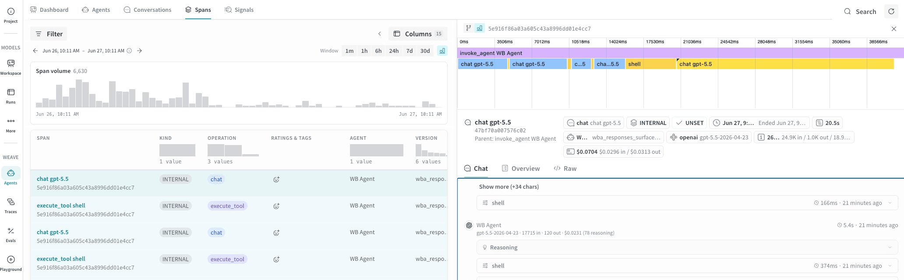

- Top: a **waterfall timeline** with millisecond ruler (`0ms` to `38566ms`) — the root
  `invoke_agent` bar (purple) spans full width, child `chat`/`execute_tool` bars (blue/yellow)
  stacked below at their real start offsets and durations. Overlapping bars mean concurrent
  execution; this is Weave's equivalent of Datadog's flame graph but purpose-built for the
  Agents view and toggleable to a hierarchical tree via a "Show trace tree" icon.
- Selected-span header packs everything above the fold: op badge (`chat chat gpt-5.5`), OTel
  `Kind` (`INTERNAL`), status (`UNSET`), timestamps, **duration (`20.5s`)**, model chip
  (`gpt-5.5-2026-04-23`), and a cost/token summary (`$0.0704 · $0.0296 in / $0.0313 out · 24.9K
  in/1.0K out/18.9...`) all as small pill badges in one row.
- Three tabs below: **`Chat`** (rendered conversation), **`Overview`**, **`</> Raw`** (raw span
  JSON) — the `Raw` tab is the escape hatch when Weave's semantic-convention parsing doesn't
  recognize a custom framework's attributes.

### 12. Signals-in-context — scored turns/conversations as a filterable table
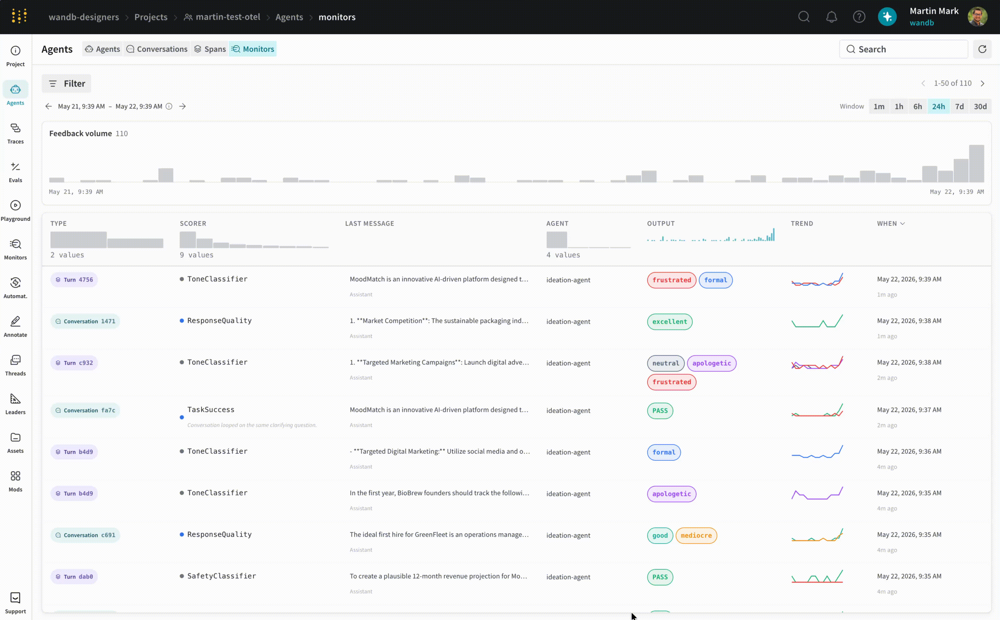

- Rows mix granularities: `Turn 4756`, `Conversation 1471`, `Turn c932` — the same table serves
  both turn-level and conversation-level scorer output.
- `SCORER` column shows which named signal produced the row (`ToneClassifier`, `ResponseQuality`,
  `TaskSuccess`, `SafetyClassifier`); `OUTPUT` renders the result as colored badges (`frustrated`
  red, `excellent`/`PASS` green, `formal`/`neutral` blue/gray, `mediocre` orange) — tags and
  pass/fail ratings share one visual language.
- One row carries a free-text automatic annotation under the last message: *"Conversation looped
  on the same clarifying question"* — evidence Weave's signals can emit qualitative explanations,
  not just a label.
- `TREND` column: a per-row sparkline of that signal's recent history. Time-window buttons
  (`1m/1h/6h/24h/7d/30d`) and a `Feedback volume` histogram sit above the table, identical
  chrome to the Dashboard tab — one consistent time-windowing pattern reused across every tab.

---

## Feature anatomy (spec-ready notes)

**Data model — two generations, both live simultaneously.**

*Generation 1, "Threads"* (general-purpose, sits inside the Traces product):
`Thread` (has a `thread_id`, contains turns) → `Turn` (a top-level `@weave.op` call, "displayed in
the UI as individual rows in a thread view") → `Call` (any `@weave.op` execution; nested calls
don't count toward thread stats). Created via `weave.thread()` context manager, or over plain OTel
via `wandb.thread_id` / `wandb.is_turn` span attributes.

*Generation 2, "Agents"* (dedicated top-level product surface, shipped July 2026):
`Agent` (no span — a virtual grouping by the `agent_name` attribute, top of the hierarchy) →
`Conversation` (SDK class `Conversation`, no span — turns grouped by shared `conversation_id`) →
`Turn` (SDK class `Turn`, OTel span `invoke_agent`, **root of its own independent trace**) → `LLM`
call (SDK class `LLM`, span `chat`) → `Tool` call (SDK class `Tool`, span `execute_tool`) →
`SubAgent` call (SDK class `SubAgent`, **also an `invoke_agent` span**, nested — "typically when
one agent delegates to another"). The critical design choice: **conversations group turns by
attribute, not by parent span** — every turn is the root of its own OTel trace, explicitly to
support distributed tracing and parallel execution without a server-side aggregation step. A
single conversation can therefore span multiple independent traces once sub-agent delegation is
involved.

**Ingestion paths.** Four, cleanly separated by purpose:
1. `weave.op` SDK decorator → classic Traces/Threads product.
2. Generic OTLP → `POST /otel/v1/traces` → feeds Traces + Threads. Attributes normalized from nine
   frameworks (OTel GenAI, OpenInference, Vercel AI SDK, MLflow, Traceloop, Vertex AI Agent,
   OpenLit, Logfire/Pydantic AI, Langfuse) via a priority-ordered mapping table.
3. Weave Agents SDK (`start_conversation`/`start_turn`/`start_llm`/`start_tool`/`start_subagent`)
   → Agents view.
4. GenAI-semconv OTLP → **`POST /agents/otel/v1/traces`** (a *different* endpoint from #2) → also
   feeds the Agents view, driven purely by `gen_ai.operation.name` values (`invoke_agent` / `chat`
   / `execute_tool`) plus `gen_ai.conversation.id` / `gen_ai.agent.name` — no Weave SDK required.

**View funnel, aggregate → span.**
1. Agents Dashboard — project-wide cards + time series + signal trend + top tools/agents/models.
2. Agents fleet grid — one card per agent, sortable by recency/volume/errors, drill into an agent.
3. Conversations table — one row per conversation, `Spans` column carries an inline color-coded
   event-sequence preview strip.
4. Conversation detail — Turns (chat-style) + Events (color-coded timeline) + Scores +
   Structured annotations + Meta summary + Token breakdown + Participants.
5. Spans table — every individual span (`chat`/`execute_tool`/`invoke_agent`) as its own row,
   grouped into trace groups on click; a single conversation may contain several trace groups.
6. Span detail — waterfall timeline (toggleable to hierarchical tree) + Chat/Overview/Raw tabs.
7. Signals tab — scored turns as a filterable, taggable table, same chrome as the Dashboard.

Separately, the classic Traces product has its own funnel: Trace list → Trace tree (4 alternate
renderings: default / code-composition / flame graph / graph) → op detail (6 tabs: Call / Code /
Feedback / Scores / Summary / Use).

**Derived signals.** Two built-in tag presets (User Frustration, Malicious Intent/Jailbreaking,
NSFW, Low Quality Response) and four rating presets (User Satisfaction, User Good Intent,
Safe-for-Work, Response Quality), all LLM-judge-scored with templated prompts
(`{input_messages}`, `{output_messages}`, `{system_instructions}`, `{agent_name}`), configurable
inference model, per-signal filters, and a sample rate knob for high-traffic agents. Explicitly
framed as **online eval replacing offline eval** — "the behavior space is too wide to construct
eval datasets that cover it."

---

## Ideas worth stealing for Maple

1. **The Agent/Conversation/Turn/LLM/Tool/SubAgent table itself.** A single doc page maps every
   concept to an SDK class *and* an OTel span type *and* a rendering rule
   (`gen_ai.operation.name=invoke_agent` → "a turn"). This is the exact artifact Maple needs to
   spec its own multi-turn layer, and it's reusable almost verbatim.
2. **Grouping turns by attribute (`conversation_id`), not by parent span.** Lets each turn be an
   independent, distributedly-traced root span — no server-side stitching required, no single
   point of failure for the "what conversation is this" answer. Directly applicable if Maple wants
   agent turns to survive network partitions / async fan-out.
3. **A dedicated, separate OTel endpoint for the agent view** (`/agents/otel/v1/traces`), keyed off
   three `gen_ai.operation.name` values. Cheap to implement, and it means zero-code adoption for
   any harness that already emits OTel GenAI spans — no proprietary SDK required for the headline
   feature.
4. **The Events color-coded timeline** with **Sub-agent invocation** and **Agent handoff** as their
   own distinct colors (sienna / magenta), separate from plain tool calls (blue). Nobody else
   researched so far color-codes *handoffs* as their own category.
5. **Four synchronized scrubbers** (Timeline / Peers / Siblings / Stack) instead of one linear
   scrollbar — "jump to the next call of this same op" and "jump to the next sibling" are both
   real debugging moves that a single timeline slider can't express.
6. **Multiple attribute-mapping conventions normalized in priority order**, documented as a single
   public table (nine frameworks). This is the trust-building move: publish exactly which
   `gen_ai.*` / `openinference.*` / vendor-specific keys map to what, so users can self-diagnose
   before filing a support ticket.
7. **Per-conversation `p50`/`p99` latency as list columns**, not buried in a chart.
8. **The `Code` tab on an op** — showing the actual source that produced the call, not just its
   input/output. Cheap if spans already carry a code-location attribute.
9. **Sample-rate knob per signal**, scoped to a filter — lets teams run LLM-judge scoring cheaply
   at production volume instead of choosing between "score everything" and "score nothing."

## What to skip / deprioritize

- **Running two overlapping multi-turn primitives at once** (Threads *and* Agents) is confusing
  even for W&B's own docs, which have to keep clarifying which endpoint feeds which view. Maple
  should ship one model, well, rather than layer a second generation on top later.
- **Playground / Guardrails / Leaderboards** are a large adjacent evaluation-and-safety product
  surface (LLM-as-judge scorers, prompt experimentation UI, model comparison boards) — not
  required to ship agent tracing, and a substantial build on its own.
- **The `Code` tab's dependency on source-mapping** — only pays off once instrumentation reliably
  attaches code location, which is a non-trivial ask for arbitrary OTel producers.
- **Nine-framework attribute normalization** is worth having a *few* of (OTel GenAI + OpenInference
  cover most real traffic); chasing all nine from day one is not a good first milestone.

---

## Screenshot sources

| File | Found on | Direct image URL |
|---|---|---|
| `agent-view-agent.png` | [View agent activity](https://docs.wandb.ai/weave/guides/tracking/view-agent-activity) | `https://mintcdn.com/wb-21fd5541/e9uGjdE5LLGr1nTZ/weave/guides/tracking/imgs/agent-view-agent.png?fit=max&auto=format&n=e9uGjdE5LLGr1nTZ&q=85&s=47f80ed4ae4fabcb83626d0968cd9c3d` |
| `agent-view-conversation-detail.png` | [View agent activity](https://docs.wandb.ai/weave/guides/tracking/view-agent-activity) | `https://mintcdn.com/wb-21fd5541/e9uGjdE5LLGr1nTZ/weave/guides/tracking/imgs/agent-view-conversation-detail.png?fit=max&auto=format&n=e9uGjdE5LLGr1nTZ&q=85&s=3e053884c3dbe8743ba5f0a2462b04fc` |
| `agent-view-dashboard.png` | [View agent activity](https://docs.wandb.ai/weave/guides/tracking/view-agent-activity) | `https://mintcdn.com/wb-21fd5541/e9uGjdE5LLGr1nTZ/weave/guides/tracking/imgs/agent-view-dashboard.png?fit=max&auto=format&n=e9uGjdE5LLGr1nTZ&q=85&s=62fbbd188551cdceddf851ee7069668f` |
| `agent-view-spans-detail.png` | [View agent activity](https://docs.wandb.ai/weave/guides/tracking/view-agent-activity) | `https://mintcdn.com/wb-21fd5541/e9uGjdE5LLGr1nTZ/weave/guides/tracking/imgs/agent-view-spans-detail.png?fit=max&auto=format&n=e9uGjdE5LLGr1nTZ&q=85&s=8db0351af05200b67669480a170f8ca2` |
| `agents-conversations-spans-monitors.png` | [Monitor your agents with signals](https://docs.wandb.ai/weave/guides/tracking/view-agent-signals) | `https://mintcdn.com/wb-21fd5541/e9uGjdE5LLGr1nTZ/weave/guides/tracking/imgs/agent-view-signals.png?fit=max&auto=format&n=e9uGjdE5LLGr1nTZ&q=85&s=f1f43bff22b5b05f95e88f6539eb7662` |
| `threads-drawer.png` | [Trace threads](https://docs.wandb.ai/weave/guides/tracking/threads) | `https://mintcdn.com/wb-21fd5541/2zcI9AceqachbiPB/weave/guides/tracking/imgs/threads-drawer.png?fit=max&auto=format&n=2zcI9AceqachbiPB&q=85&s=d875680442c632ebfce73f4b9333561a` |
| `threads-list.png` | [Trace threads](https://docs.wandb.ai/weave/guides/tracking/threads) | `https://mintcdn.com/wb-21fd5541/2zcI9AceqachbiPB/weave/guides/tracking/imgs/threads-list.png?fit=max&auto=format&n=2zcI9AceqachbiPB&q=85&s=0ef4b4e148ee909480ead81ee42cc956` |
| `trace-tree-code-view.png` | [Navigate the Weave Trace view](https://docs.wandb.ai/weave/guides/tracking/trace-tree) | `https://mintcdn.com/wb-21fd5541/M79FAxH2Aq0Q8-x2/weave/guides/tracking/imgs/trace-tree-code-view.png?fit=max&auto=format&n=M79FAxH2Aq0Q8-x2&q=85&s=997c9e06ae7a1307edc6dfbb02fb5af1` |
| `trace-tree-flame-view.png` | [Navigate the Weave Trace view](https://docs.wandb.ai/weave/guides/tracking/trace-tree) | `https://mintcdn.com/wb-21fd5541/M79FAxH2Aq0Q8-x2/weave/guides/tracking/imgs/trace-tree-flame-view.png?fit=max&auto=format&n=M79FAxH2Aq0Q8-x2&q=85&s=aff5f74a187351f58c81935df329d17c` |
| `trace-tree-full.png` | [Navigate the Weave Trace view](https://docs.wandb.ai/weave/guides/tracking/trace-tree) | `https://mintcdn.com/wb-21fd5541/M79FAxH2Aq0Q8-x2/weave/guides/tracking/imgs/trace-tree-full.png?fit=max&auto=format&n=M79FAxH2Aq0Q8-x2&q=85&s=054e9d8cb21d9f9e86337cf002483ea7` |
| `trace-tree-graph-view.png` | [Navigate the Weave Trace view](https://docs.wandb.ai/weave/guides/tracking/trace-tree) | `https://mintcdn.com/wb-21fd5541/M79FAxH2Aq0Q8-x2/weave/guides/tracking/imgs/trace-tree-graph-view.png?fit=max&auto=format&n=M79FAxH2Aq0Q8-x2&q=85&s=c690665493ec4cccf90e1d3c1bd77183` |
| `trace-tree-scrubbers.png` | [Navigate the Weave Trace view](https://docs.wandb.ai/weave/guides/tracking/trace-tree) | `https://mintcdn.com/wb-21fd5541/M79FAxH2Aq0Q8-x2/weave/guides/tracking/imgs/trace-tree-scrubbers.png?fit=max&auto=format&n=M79FAxH2Aq0Q8-x2&q=85&s=0fb6a2843b18d120ec3ea8087c163126` |

---

*Researched 2026-08-05. Screenshots pulled from W&B Weave's public docs and blog for internal
competitive research; do not redistribute.*
